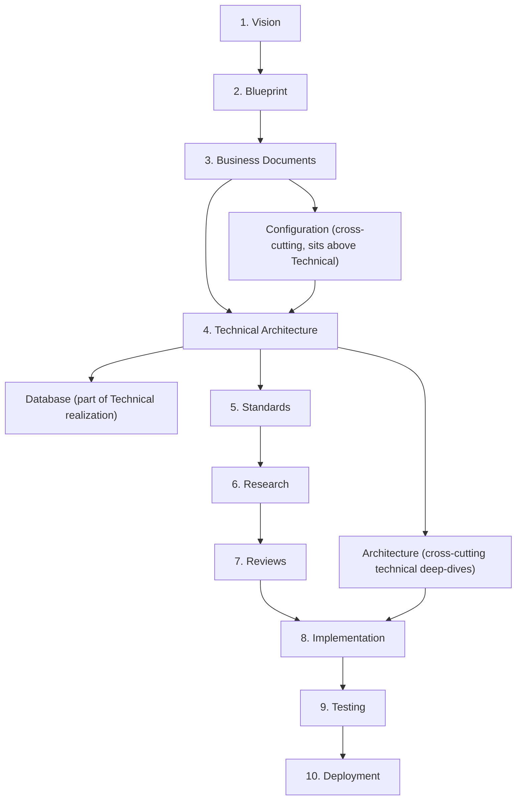
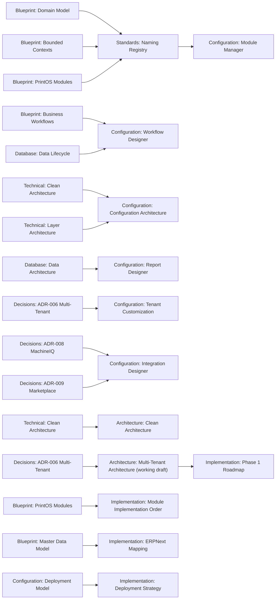

# Documentation Map

Version:
1.4

Status:
Draft

Owner:
PrintHub Architecture Team

Last Updated:
2026-07-26

---

# Purpose

This document is the navigation map for the entire PrintHub/PrintOS documentation set: what exists, where it lives, and how the categories relate to and depend on one another. It is the starting point for any contributor (human or AI) trying to locate or place a document.

---

# Scope

Covers every documentation category under `docs/`, the hierarchy governing them (per `Documentation_Workflow.md` Section 3), and a cross-reference map between categories. Does not restate the content of any individual document — see `Documentation_Status.md` for maturity/completion tracking, and each category's own Master Index for its internal contents.

---

# Documentation Hierarchy

Per `Documentation_Workflow.md` Section 3, documentation layers are strictly ordered — a lower layer may not contradict a higher one:

Configuration Studio documentation (`docs/configuration/`) is a cross-cutting layer: it depends on Business (which module/workflow concepts it exposes as configurable) and Technical (the Clean Architecture layering it must respect), and it is depended upon by nothing above it. It does not replace or duplicate Technical or Database documentation — see [configuration/01_Configuration_Architecture.md](configuration/01_Configuration_Architecture.md) for the explicit boundary.

Architecture documentation (`docs/architecture/`) is likewise cross-cutting: it elaborates Technical Architecture into system-wide deep-dives (Clean Architecture rationale, DDD application, multi-tenancy, extensibility, eventing, security, performance, deployment, integration) without introducing new binding decisions of its own — see [architecture/00_Architecture_Index.md](architecture/00_Architecture_Index.md). Three of its documents (Multi-Tenant, Deployment, Integration Architecture) are explicitly marked working drafts pending reconciliation with paths reserved in `docs/blueprint/` by ADR-010.

Implementation documentation (`docs/implementation/`) is strictly downstream: it sequences and plans delivery of everything above it, and must never redefine architecture, business rules, or naming — see [implementation/00_Implementation_Index.md](implementation/00_Implementation_Index.md). Two key implementation-architecture artifacts: [implementation/Module_Dependency_Matrix.md](implementation/Module_Dependency_Matrix.md) (Draft, Version 0.3) defines business, implementation, ERPNext, configuration, plugin, Architecture Review, transitive, convergent, and optional dependencies across PrintHub modules — a conditional implementation-architecture reference, not a roadmap or implementation schedule; and [implementation/Architecture_Freeze.md](implementation/Architecture_Freeze.md) (Approval, Version 1.0) is the effective Layered Architecture Freeze, defining the frozen conceptual baseline, conditional references, excluded AR-gated layers, governance gaps, Development Roadmap boundary, implementation-authorization boundary, and Full Freeze exit criteria — it is effective only within its declared layered scope, it is not a Full Architecture Freeze, it is not Published, and it does not authorize implementation.

Roadmap documentation (`docs/roadmap/`) owns the governed Development Roadmap — [roadmap/01_Development_Roadmap.md](roadmap/01_Development_Roadmap.md) (Draft, Version 0.1), the governed bridge between the effective Layered Architecture Freeze and future execution planning. It defines dependency-tiered capability workstreams, Architecture Review gates, readiness classifications, traceability requirements, and deferred boundaries. It is non-temporal; it does not reuse Product Roadmap or legacy technical phase numbering; it does not authorize implementation; and it does not replace the Product Roadmap, Implementation Plan, Sprint Plan, or Release Checklist. It treats [implementation/01_Phase_1_Roadmap.md](implementation/01_Phase_1_Roadmap.md) and [implementation/02_Module_Implementation_Order.md](implementation/02_Module_Implementation_Order.md) as unreconciled conditional legacy inputs. The category relationship is deliberate: `docs/roadmap/` owns the governed Development Roadmap, while `docs/implementation/` retains the technical implementation-order, execution-plan, milestone, sprint, and release artifacts; the Development Roadmap feeds future execution planning but is not itself an execution plan. The `00_` Roadmap index slot remains reserved — no index is created until the folder holds multiple governed roadmap artifacts.

---

# Category Index

| Category | Path | Master Index | Governs |
|---|---|---|---|
| Blueprint | `docs/blueprint/` | [00_Master_Index.md](blueprint/00_Master_Index.md) | Vision, domain model, bounded contexts, business workflows, product roadmap |
| Business | `docs/business/` | [00_Master_Index.md](business/00_Master_Index.md) | Business glossary, rules, roles, lifecycle, KPIs |
| Technical | `docs/technical/` | [00_Master_Index.md](technical/00_Master_Index.md) | Clean Architecture, layering, dependency rules, project structure, request lifecycle, error handling, extensibility |
| Database | `docs/database/` | [00_Master_Index.md](database/00_Master_Index.md) | Data architecture, DocType strategy, master data, entity relationships, naming, data lifecycle |
| Configuration | `docs/configuration/` | [00_Master_Index.md](configuration/00_Master_Index.md) | Configuration Studio: module manager, workflow/approval/form/dashboard/automation/notification/role/report/integration designers, feature flags, tenant customization, templates, deployment |
| Architecture | `docs/architecture/` | [00_Architecture_Index.md](architecture/00_Architecture_Index.md) | System/Clean/DDD architecture deep-dives, multi-tenancy, extensibility, eventing, security, performance, deployment, integration (3 documents are working drafts pending reconciliation with reserved Blueprint paths — see ADR-010) |
| Implementation | `docs/implementation/` | [00_Implementation_Index.md](implementation/00_Implementation_Index.md) | Delivery planning: roadmap, module build order, ERPNext mapping, customization/migration/testing/deployment strategy, go-live readiness. Downstream-only — never redefines architecture, business rules, or naming |
| Standards | `docs/standards/` | [README.md](standards/README.md) | Naming, coding, testing, git, API, database, security, documentation conventions |
| Decisions | `docs/decisions/` | [00_ADR_Index.md](decisions/00_ADR_Index.md) | Architecture Decision Records (binding, discrete decisions) |
| Research | `docs/research/` | — | Investigation/comparison ahead of decisions (not binding) |
| Reviews | `docs/reviews/` | — | Recorded evaluation of documents/implementations |
| Milestones | `docs/milestones/` | — | Completion records for project milestones |
| Templates | `docs/templates/` | — | Reusable document structures per category |
| Roadmap | `docs/roadmap/` | — (`00_` index slot reserved) | Governed Development Roadmap: [roadmap/01_Development_Roadmap.md](roadmap/01_Development_Roadmap.md) (Draft, Version 0.1) — dependency-tiered capability workstreams, Architecture Review gates, readiness classifications, traceability, and deferred boundaries; non-temporal and non-authorizing |
| API, Changelog, Prompts, Sprints, UI | `docs/api/`, `docs/changelog/`, `docs/prompts/`, `docs/sprints/`, `docs/ui/` | — | Reserved, not yet populated (see `Documentation_Status.md`, Remaining Gaps) |

---

# Cross-Reference Map

High-traffic dependency edges between categories (illustrative, not exhaustive — see each document's own Related Documents section for the authoritative list):

---

# Architecture Coverage

| Layer | Status |
|---|---|
| Business/Domain architecture | Covered — Blueprint (22 documents) + Business (23 documents) |
| Technical/Clean Architecture | Covered — Technical (10 documents) |
| Database/data architecture | Covered — Database (7 documents) |
| Configuration/no-code layer | Covered — Configuration (16 documents) |
| Cross-cutting architecture deep-dives | Covered — Architecture (11 documents); 3 (Multi-Tenant, Deployment, Integration) are explicit working drafts pending reconciliation with reserved Blueprint paths |
| Implementation/delivery planning | Partially covered — Implementation (9 of 16 documents populated: 00–08; 09–15 remain Placeholder) |
| Engineering standards | Covered — Standards (20 documents) |
| Binding decisions | Covered — Decisions (15 documents: 14 ADRs + index) |
| Multi-tenant SaaS architecture | **Gap** — reserved at `docs/blueprint/25_MultiTenant_Architecture.md`, not yet written (see ADR-006) |
| MachineIQ detailed architecture | **Gap** — deferred per ADR-008 |
| Marketplace detailed architecture | **Gap** — deferred per ADR-009, Phase 5 |
| API contracts | **Gap** — `docs/api/` reserved, empty |
| UI/UX design documentation | **Gap** — `docs/ui/` reserved, empty |
| Roadmap detail beyond Blueprint summary | Covered (Draft) — [roadmap/01_Development_Roadmap.md](roadmap/01_Development_Roadmap.md) (Draft, Version 0.1), the governed Development Roadmap; non-temporal, does not authorize implementation (Product Roadmap strategic summary remains at `Blueprint 03_Product_Roadmap.md`) |

---

# Future Considerations

- Once a formal `docs/business/Business_Glossary.md` is created (currently an Open Question in `Naming_Registry.md`), this map must be updated to reflect it as the authoritative business vocabulary source ahead of the Naming Registry.
- As Freelancer, Supplier, Service Engineer, and Marketplace phases are scoped, new category entries (or new documents within existing categories) will need to be added here.

---

# Open Questions

- Should `docs/api/`, `docs/sprints/`, and `docs/ui/` be populated now or intentionally deferred until their owning phase begins? (`docs/roadmap/` is now activated with the Draft Development Roadmap.)

---

# Related Documents

- [Documentation_Status.md](Documentation_Status.md)
- [Documentation_Workflow.md](Documentation_Workflow.md)
- [blueprint/00_Master_Index.md](blueprint/00_Master_Index.md)
- [business/00_Master_Index.md](business/00_Master_Index.md)
- [technical/00_Master_Index.md](technical/00_Master_Index.md)
- [database/00_Master_Index.md](database/00_Master_Index.md)
- [configuration/00_Master_Index.md](configuration/00_Master_Index.md)
- [architecture/00_Architecture_Index.md](architecture/00_Architecture_Index.md)
- [implementation/00_Implementation_Index.md](implementation/00_Implementation_Index.md)
- [standards/Naming_Registry.md](standards/Naming_Registry.md)
- [decisions/00_ADR_Index.md](decisions/00_ADR_Index.md)

---

# Revision History

| Version | Date | Author | Changes |
|---|---|---|---|
| 1.0 | 2026-07-23 | Configuration Studio Review | Initial version. Populated this previously-empty index with the full documentation hierarchy, category index, cross-reference map, and architecture coverage table, following the Configuration Studio documentation review. |
| 1.1 | 2026-07-23 | Architecture & Implementation Registration | Registered the `docs/architecture/` category (11 documents; 3 working drafts pending reconciliation with ADR-010-reserved Blueprint paths) and the `docs/implementation/` category (16 documents; 9 populated, 7 Placeholder), which had been created but not yet indexed here. Added both to the Documentation Hierarchy diagram, Category Index, Cross-Reference Map, and Architecture Coverage table. |
| 1.2 | 2026-07-26 | Freeze Registration | Added navigation references in the Implementation category narrative for the Module Dependency Matrix (Draft, Version 0.3) and the Draft Layered Architecture Freeze proposal (Draft, Version 0.1). Navigation update only; no lifecycle status or architecture decision changed. Note: the header Version field was left at 1.0 (preserved) — it already lagged this Revision History (latest entry 1.1) before this change; this pre-existing header/Revision-History discrepancy is flagged for the later documentation status-alignment task and is not corrected here. |
| 1.3 | 2026-07-26 | Freeze Activation Synchronization | Synchronized the Architecture Freeze navigation reference to Approval, Version 1.0, and effective layered scope, reflecting formal Project Owner approval; the reference states it is not a Full Architecture Freeze, not Published, and does not authorize implementation. No other navigation entry changed. Header Version reconciled to 1.3 (previously lagged this Revision History, which had already reached 1.2). |
| 1.4 | 2026-07-26 | Development Roadmap Registration | Registered the Draft PrintHub Development Roadmap (`roadmap/01_Development_Roadmap.md`, Draft, Version 0.1) and activated the previously reserved Roadmap category: added a Roadmap narrative to the Documentation Hierarchy, split Roadmap out of the reserved-categories row into its own active Category Index entry, and updated the Architecture Coverage table from "Gap — reserved, empty" to "Covered (Draft)". Recorded the roadmap-governance-versus-implementation-execution distinction (`docs/roadmap/` owns the governed roadmap; `docs/implementation/` retains execution artifacts) and that the `00_` index slot remains reserved. Navigation update only: no lifecycle promotion and no implementation authorization; the Development Roadmap remains Draft. Header Version incremented to 1.4. |

---

# Documentation Quality Checklist

- [ ] Technically accurate
- [ ] Business terminology verified
- [ ] Cross-references updated
- [ ] Mermaid diagrams validated
- [ ] No implementation code included
- [ ] Future roadmap considered
- [ ] Reviewed by Project Owner
