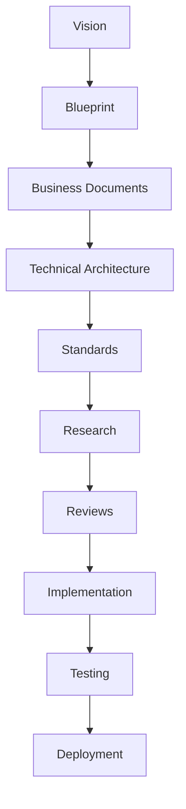
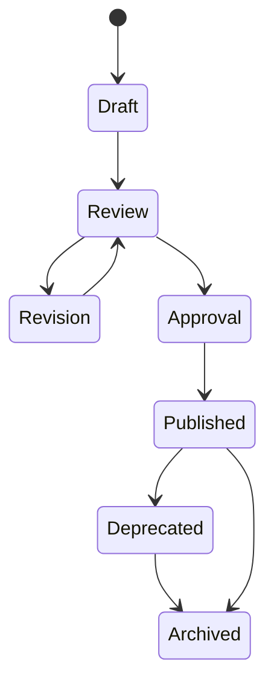
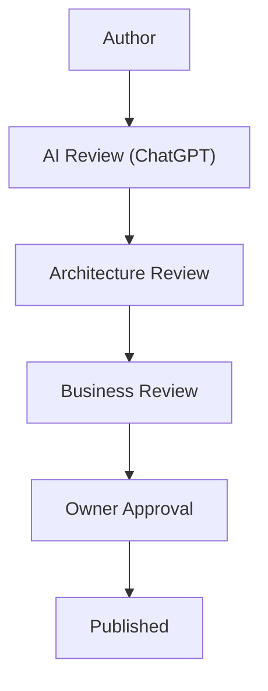

# Documentation Workflow

Status:
Draft

Version:
1.0

Owner:
Project Architecture

Last Updated:
2026-07-22

---

# 1. Purpose

PrintHub is a multi-year enterprise platform, built by a mixed team of a human Project Owner and AI collaborators (ChatGPT and Claude) working across many sessions, over an extended timeline. In this kind of team, memory does not persist by default — a new session, a new contributor, or a new AI model has no access to the reasoning behind a past decision unless that reasoning was written down. Documentation-First exists to solve exactly this problem: it makes architectural intent durable, explicit, and independent of any single person's or any single AI session's memory.

A Code-First approach — where architecture is inferred from implementation — works adequately for small, short-lived projects with a stable, continuous team. It breaks down for PrintHub for several specific reasons. First, the team is not continuous: Claude sessions do not retain context between conversations, and even a human Project Owner cannot be expected to recall the rationale behind a decision made months or years earlier. Second, the system is being built on top of ERPNext, a large third-party framework; decisions about where PrintOS logic ends and ERPNext begins must be explicit, or the boundary erodes over time through many small, individually reasonable-looking shortcuts. Third, PrintHub's roadmap spans five phases and multiple future user groups (Freelancers, Suppliers, Service Engineers, Marketplace buyers); decisions made in Phase 1 must remain legible to whoever designs Phase 3, years later.

The long-term benefits of Documentation-First for a project of this shape are:

- **Institutional memory that outlives any single contributor.** Whether the next person to touch a module is the original author, a new hire, or a fresh AI session, the Blueprint and Standards give them the same starting point.
- **Reviewable architecture before expensive implementation.** Mistakes are far cheaper to catch in a document than in a merged pull request against a live ERP system.
- **Consistent vocabulary across a large, multi-domain system.** With CRM, Estimation, Production, Inventory, Accounts, and more all interacting, a shared, documented vocabulary prevents the same word meaning different things in different modules.
- **Upgrade safety.** Because ERPNext core is never modified, the rationale for every extension point used in `printos_core` needs to be recorded so that future ERPNext upgrades can be evaluated against documented intent, not guessed at.
- **Governability.** As the team and the codebase grow, documentation becomes the mechanism by which the Project Owner retains oversight of architecture without personally reviewing every line of code.

This Documentation Workflow document exists to make the Documentation-First principle operational: it defines who writes what, in what order, how it is reviewed and approved, and how it stays current for as long as PrintHub exists.

---

# 2. Documentation Philosophy

PrintHub's documentation practice rests on a small number of non-negotiable sequencing rules. Each rule below exists to prevent a specific, observed failure mode in software projects that skip it.

- **Documentation before development.** No development work begins until the relevant documentation exists. This prevents "documentation debt" from accumulating, where code ships first and documentation is promised "later" and never arrives.
- **Architecture before implementation.** The architectural shape of a feature (which bounded context it belongs to, what entities it touches, how it fits Clean Architecture layering) is decided and written down before any implementation-level design (DocTypes, APIs, code structure) begins.
- **Business before technology.** The business need and business rules are documented before the technical solution is chosen. This keeps technology choices in service of business intent, rather than the reverse.
- **Review before approval.** No document is approved without at least one review pass. A document that has not been reviewed is not yet a reliable reference, no matter how confident its author is.
- **Approval before coding.** Implementation against a Draft or Under Review document is not permitted. Only a Published document is a safe basis for code.
- **Every major decision must be documented.** A "major decision" is any choice that would be expensive to reverse, that affects more than one bounded context, or that a future contributor would reasonably need to understand before extending the area it touches.
- **No undocumented feature may be implemented.** If a feature cannot be traced back to an entry in the Blueprint, Business documentation, or an Architecture Decision Record, it is not ready to be built.

These rules apply uniformly regardless of whether the author is the Project Owner, ChatGPT, or Claude. The rules are process guarantees, not suggestions, and are treated with the same seriousness as the Git Safety Protocol and other operational rules defined in `CLAUDE.md` and `PROJECT_RULES.md`.

---

# 3. Documentation Hierarchy

Documentation in PrintHub follows a strict hierarchy: each layer depends on and is constrained by the layers above it. A lower layer may not contradict a higher layer; if it appears to need to, the higher layer must be revisited and updated first.

| Order | Layer | Role |
|---|---|---|
| 1 | Vision | Why PrintHub/PrintOS exists; the long-term destination |
| 2 | Blueprint | The architectural translation of the Vision into domains, contexts, and system design |
| 3 | Business Documents | Detailed business requirements, rules, and workflows within the Blueprint's scope |
| 4 | Technical Architecture | How the business documents are technically realized, within ERPNext/`printos_core` constraints |
| 5 | Standards | The concrete, repeatable engineering conventions that technical architecture must follow |
| 6 | Research | Investigation and evaluation that informs upcoming decisions, not yet binding |
| 7 | Reviews | Recorded evaluation of documents or implementations against the layers above |
| 8 | Implementation | Actual code written in `printos_core`, governed by everything above it |
| 9 | Testing | Verification that Implementation satisfies Business Documents and Standards |
| 10 | Deployment | Releasing verified Implementation into environments, per governance in Standards |

A change originating at any layer must be checked against the layers above it before proceeding downward. For example, a Standards change that would require a Technical Architecture change must not be made unilaterally; the Technical Architecture document is updated first, and the Standard follows. This ordering is what keeps the hierarchy from silently inverting over time.

---

# 4. Documentation Categories

The following categories together comprise the full documentation set. Each has a distinct purpose, ownership, audience, and expected cadence of change.

| Category | Purpose | Owner | Audience | Update Frequency |
|---|---|---|---|---|
| Blueprint | Defines vision, business requirements, roadmap, and system/domain architecture | Project Architecture | All contributors, human and AI | Low — updated when architecture changes |
| Business | Captures detailed business rules, requirements, and workflow specifications | Project Owner / Business Architecture | Product, business stakeholders, implementers | Medium — updated as business scope evolves |
| Technical | Describes how business intent is technically realized within ERPNext/`printos_core` | Project Architecture | Implementers (Claude), reviewers (ChatGPT) | Medium — updated per feature/module design |
| API | Describes API contracts, conventions, and versioning at a design level | Project Architecture | Implementers, integration partners (future) | Medium — updated per API change |
| Database | Describes data architecture and master data model at a business level | Project Architecture | Implementers, data stewards | Low to Medium |
| Standards | Defines repeatable engineering conventions (naming, coding, testing, git, etc.) | Project Architecture | All contributors | Low — updated when a convention changes project-wide |
| Research | Records investigation, comparisons, and evaluation ahead of a decision | Any contributor conducting the research | Decision-makers, future reference | As needed, ad hoc |
| Reviews | Records the outcome of a review pass against a document or implementation | Reviewer (ChatGPT, Architecture, or Owner) | Author, future auditors | Per review event |
| Prompts | Records significant AI prompts/instructions that shaped a deliverable | Project Owner | Future contributors seeking rationale | As needed, ad hoc |
| Meeting Notes | Records decisions and context from discussions | Project Owner | All contributors | Per meeting/discussion |
| Milestones | Records completion of significant project milestones | Project Owner | Stakeholders, future contributors | Per milestone |
| Roadmap | Describes phased delivery plan over time | Project Architecture | Stakeholders, all contributors | Low — updated per phase transition |
| Decisions | Records Architecture Decision Records (ADRs) for discrete, binding choices | Project Architecture | All contributors | As needed, per decision |
| Templates | Provides reusable document structures for each category | Project Architecture | Document authors | Low — updated when a template itself changes |

Categories with a "Low" update frequency are expected to be stable once written; frequent changes to a Low-frequency category are themselves a signal worth reviewing, since they may indicate the category boundary or the underlying decision was unclear.

---

# 5. Document Lifecycle

Every document in the PrintHub documentation set passes through the same set of lifecycle stages, regardless of category. A document's current stage is recorded in its `Status` field.

- **Draft** — Actively being written; not yet reliable as a reference; implementation must not depend on it.
- **Review** — Complete enough for evaluation; undergoing one or more review passes (see Section 7).
- **Revision** — Sent back to the author after review with required changes; returns to Review once addressed.
- **Approval** — All required reviews passed; awaiting final Owner sign-off.
- **Published** — Approved and in force; the authoritative version; implementation may rely on it.
- **Deprecated** — Superseded by a newer document or decision, but retained for historical reference and traceability.
- **Archived** — Removed from active reference entirely; retained only for audit/history.

A document may only move forward one stage at a time; stages cannot be skipped (for example, a Draft cannot become Published without passing through Review and Approval). A Published document that needs substantive change re-enters the lifecycle as a new version in Draft, rather than being edited in place as if it had never been approved — this preserves the integrity of what was actually reviewed and approved at each version.

---

# 6. AI Collaboration Workflow

PrintHub's documentation and implementation are produced through a defined division of labor between the Project Owner and two AI collaborators, ChatGPT and Claude, supplemented by ERPNext's official documentation and other official sources as reference material.

- **Project Owner** — Sets business direction, makes final approval decisions, resolves Open Questions that require business judgment, and holds ultimate authority over what gets built. No document reaches Published status without Owner approval.
- **ChatGPT** — Acts as Enterprise Architect, Solution Architect, Product Manager, and Code Reviewer (per `CHATGPT.md`). ChatGPT designs: it proposes architecture, challenges weak design decisions, and reviews Claude's output for architectural soundness, maintainability, and alignment with the Blueprint.
- **Claude** — Acts as the implementer within this workflow: it writes documentation content following approved structure and direction, and later implements code against Published documentation. Claude follows the Plan → Verify → Execute → Review workflow from `CLAUDE.md` for every task.
- **ERPNext Documentation / Official Sources** — Serve as the authoritative reference for framework behavior, extension mechanisms, and upgrade constraints. Neither AI collaborator should contradict official ERPNext documentation without flagging the discrepancy explicitly for Owner attention.

The responsibilities are summarized as a fixed sequence:

- ChatGPT designs.
- Claude writes.
- ChatGPT reviews.
- Human approves.
- Claude implements.

This sequence is not optional shorthand — it is the enforced order of operations. Claude does not implement against its own unreviewed design, and ChatGPT's review does not substitute for the Project Owner's approval. Each role checks a different failure mode: ChatGPT's design step catches architectural weakness before writing begins; ChatGPT's review step catches drift between what was designed and what was written; and Owner approval is the final human checkpoint that no automated review can replace, particularly for decisions with business or legal weight.

---

# 7. Review Process

Every document proceeds through one or more of the following review lenses before it can be approved. Not every document requires every lens — a Standards document, for instance, is unlikely to need a Business Review — but the applicable lenses must be explicitly considered, not silently skipped.

- **Technical Review** — Confirms the document is technically sound and implementable within ERPNext/`printos_core` constraints.
- **Business Review** — Confirms the document accurately reflects business need, rules, and priorities.
- **Architecture Review** — Confirms alignment with the Blueprint's domain model, bounded contexts, and system architecture; confirms no ERPNext core modification is implied.
- **Naming Review** — Confirms terminology matches the Business Glossary and Naming Registry, and that naming conventions from `docs/standards/Naming_Standards.md` are followed.
- **Consistency Review** — Confirms the document does not duplicate or contradict information already stated elsewhere in the documentation set.
- **Security Review** — Confirms no secrets, credentials, or sensitive data appear in the document, and that any described process aligns with `docs/standards/Security_Standards.md`.
- **Standards Review** — Confirms the document itself follows the correct template and formatting conventions for its category.
- **Cross-reference Review** — Confirms all Related Documents links are valid, bidirectional where appropriate, and that no orphaned references remain.

A document cannot move from Review to Approval until every applicable review lens has been explicitly passed. Reviewers record their findings using the Reviews category (see Section 4), so that the review itself becomes part of the durable record.

---

# 8. Version Control

Documentation versioning exists to make it possible to know, at any point in time, exactly which version of a document was authoritative and what changed since the last version.

- **Version Numbers** — Each document carries a version number in its header, following the same MAJOR.MINOR convention described in `docs/standards/Versioning.md`, adapted for documents: MAJOR for a change that alters the document's core intent or would invalidate implementation built against a prior version; MINOR for additive clarification or expansion that does not change prior meaning.
- **Revision History** — Every document maintains a Revision History table recording each version, its date, its author, and a summary of what changed. This table is updated at the same time as the content change, never retroactively.
- **Breaking Changes** — A documentation change that would invalidate an existing implementation, contradict a previously Published decision, or reverse a business rule is a breaking change, requires a MAJOR version increment, and must go through the full Review and Approval cycle before publication.
- **Minor Updates** — Clarifications, added examples, or non-contradictory expansions are minor updates, incrementing the MINOR version, and still require review appropriate to the category before publication.
- **Major Updates** — Substantive rewrites of scope, structure, or intent are treated as a new MAJOR version and follow the full lifecycle from Draft.
- **Deprecation** — When a document is superseded, its Status is set to Deprecated, and it must state which document supersedes it. Deprecated documents remain in place; they are not deleted.
- **Archive Policy** — A Deprecated document moves to Archived only once nothing active still references it. Archived documents are retained indefinitely for audit and historical traceability, consistent with the project's stance against destructive, irreversible actions.

---

# 9. Cross Referencing Rules

Cross-referencing is what turns a set of individual documents into a coherent, navigable system rather than a flat pile of files.

- **Related Documents** — Every document includes a Related Documents section listing the other documents it depends on or is depended on by. This is not optional decoration; it is how a reader discovers the full context of a decision.
- **Dependencies** — Where a document's content is only valid given an assumption established elsewhere (for example, a Technical Architecture document assuming a Blueprint decision), that dependency must be named explicitly, not left implicit.
- **Referenced Standards** — Any document describing implementation-relevant conventions must cite the specific Standards document it relies on, rather than restating the convention inline, to avoid the convention drifting out of sync in two places.
- **Referenced Decisions** — Where a document's content follows from a specific Architecture Decision Record, that ADR must be cited by name (e.g., ADR-002-PrintOS-Core), so the decision's rationale is one click away.
- **Referenced Research** — Where a decision was informed by prior research, the Research document should be cited so future readers can see the evaluation that led to the decision, not just its outcome.
- **Link Maintenance** — When a document is renamed, deprecated, or archived, every document that references it must be checked and updated as part of the same change. A broken cross-reference is treated as a documentation defect, not a low-priority cleanup item, and is caught by the Cross-reference Review lens (Section 7).

---

# 10. Documentation Quality Checklist

The following checklist applies to every document before it can proceed from Review to Approval.

- [ ] Purpose is clearly defined
- [ ] Scope is clearly defined, including what is explicitly excluded
- [ ] No information is duplicated from another document (referenced instead)
- [ ] Terminology matches the approved Business Glossary
- [ ] Naming follows the Naming Registry and `standards/Naming_Standards.md`
- [ ] Mermaid diagrams are used wherever they materially improve understanding
- [ ] Relevant Standards documents are referenced, not restated
- [ ] Relevant Decisions (ADRs) are referenced where applicable
- [ ] No conflicting information exists elsewhere in the documentation set
- [ ] Grammar and formatting have been checked
- [ ] Document has been reviewed under all applicable review lenses (Section 7)
- [ ] Document has received explicit Owner approval
- [ ] Revision History table is complete and current
- [ ] Related Documents section is complete and links resolve correctly
- [ ] Document contains no implementation code or code-level detail, unless its category explicitly requires it

---

# 11. Documentation Approval Workflow

Approval follows a fixed sequence. A document cannot skip a stage, and a rejection at any stage returns the document to Revision (Section 5) rather than allowing a workaround.

- **Author** — Drafts the document (typically Claude, per Section 6), following the applicable template.
- **AI Review** — ChatGPT reviews the draft for architectural soundness, consistency, and completeness before it proceeds further.
- **Architecture Review** — Confirms the document's alignment with the Blueprint's domain model and system architecture (Section 7).
- **Business Review** — Confirms the document accurately reflects business intent, where applicable to its category.
- **Owner Approval** — The Project Owner gives final sign-off; this step cannot be delegated to either AI collaborator.
- **Published** — The document becomes the authoritative reference and enters normal Version Control (Section 8) for any future change.

---

# 12. Future Improvements

The following capabilities are anticipated as the documentation set grows, but are not required for the current phase of the project:

- **Documentation Portal** — A browsable, searchable interface over the full documentation set, rather than navigating raw Markdown files.
- **Automatic Link Validation** — Tooling to detect broken or orphaned cross-references automatically, rather than relying solely on manual Cross-reference Review.
- **ADR Integration** — Tighter linkage between Decisions (ADRs) and the specific Blueprint/Technical documents they affect, potentially via automated indexing.
- **Diagram Validation** — Automated checking that Mermaid diagrams render correctly and stay consistent with the prose they illustrate.
- **Knowledge Base** — A curated, question-oriented layer on top of the formal documentation set, aimed at faster onboarding.
- **Documentation Search** — Full-text search across all categories, to reduce reliance on manually maintained indexes.
- **AI-assisted Review** — Expanding the AI Review stage (Section 11) with more systematic, checklist-driven automated review passes, while preserving mandatory human Owner approval.

---

# 13. Open Questions

- Should a formal Business Glossary be established as a standalone document, given this Documentation Workflow assumes its existence in Section 10 and Section 14 (Naming Registry already exists at `docs/standards/Naming_Registry.md`)?
- What is the minimum review turnaround time expected for each review lens (Section 7), given the project currently operates without a dedicated review team?
- Should Research and Meeting Notes categories have their own lifecycle (Section 5), or are they exempt as inherently point-in-time records?

---

# 14. Related Documents

- `docs/standards/Documentation_Standards.md`
- `docs/standards/Naming_Standards.md`
- `docs/standards/Naming_Registry.md`
- `docs/blueprint/00_Master_Index.md`
- `docs/blueprint/01_Project_Vision.md`
- `docs/blueprint/02_Business_Requirements.md`
- `docs/blueprint/04_System_Architecture.md`
- `docs/blueprint/07_Technology_Stack.md`

---

# 15. Revision History

| Version | Date | Author | Changes |
|---|---|---|---|
| 1.0 | 2026-07-22 | Initial | Initial Version |

---

# 16. Quality Checklist

- [ ] Purpose clearly explains Documentation-First rationale
- [ ] Documentation Philosophy rules are stated unambiguously
- [ ] Documentation Hierarchy diagram is accurate and complete
- [ ] All Documentation Categories are described with Purpose, Owner, Audience, and Update Frequency
- [ ] Document Lifecycle stages and diagram are complete
- [ ] AI Collaboration Workflow responsibilities are stated clearly
- [ ] Review Process lenses are fully enumerated
- [ ] Version Control rules cover breaking, minor, and major changes
- [ ] Cross-Referencing Rules are actionable
- [ ] Documentation Quality Checklist is comprehensive
- [ ] Documentation Approval Workflow diagram matches the described sequence
- [ ] Future Improvements are clearly speculative, not commitments
- [ ] Open Questions are genuine and unresolved
- [ ] Related Documents links are valid
- [ ] No application code or implementation detail included
- [ ] Reviewed by Project Owner
