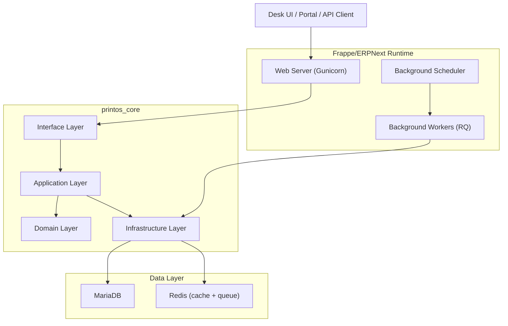

# 01 — System Architecture

Version:
1.0

Status:
Draft

Owner:
PrintHub Architecture Team

Last Updated:
2026-07-23

---

# Purpose

Describe the end-to-end technical system architecture of PrintOS: the runtime components, how they relate, and how a request or background process moves through the whole system — not just within one layer or module.

---

# Scope

Covers the full technical topology (Frappe/ERPNext runtime, `printos_core`, database, cache/queue, future services) and how they interact. Does not cover business/domain architecture (see `docs/blueprint/04_System_Architecture.md`, the business-level companion to this document) or per-layer detail (see `docs/technical/03_Layer_Architecture.md`).

---

# Background

`docs/blueprint/04_System_Architecture.md` establishes the business-facing system architecture. This document exists because implementers also need a single technical picture of the running system — processes, data stores, and background workers — that the Blueprint intentionally leaves at a higher level.

---

# Main Content

## System Components

## Component Responsibilities

| Component | Responsibility |
|---|---|
| Web Server | Serves Desk UI, portal pages, and REST/RPC API requests |
| Background Scheduler | Triggers time-based jobs (e.g. reminders, scheduled reports) |
| Background Workers | Executes asynchronous jobs (notifications, integrations, bulk operations) off the request path |
| MariaDB | System of record for all DocType data |
| Redis | Cache, session store, and background job queue backing |
| `printos_core` | All PrintOS-specific business logic, layered per [../technical/03_Layer_Architecture.md](../technical/03_Layer_Architecture.md) |

## Request Path (Summary)

Full detail lives in [../technical/07_Request_Lifecycle.md](../technical/07_Request_Lifecycle.md); at the system level, every request enters through the Web Server, is routed to an Interface-layer entry point, and flows through Application → Domain → Infrastructure before a response returns.

## Future Services

Future phases introduce services outside the core Frappe runtime: MachineIQ (analytical service, [ADR-008](../decisions/ADR-008-MachineIQ.md)) and Marketplace (public-facing service, [ADR-009](../decisions/ADR-009-Marketplace.md)). Both are designed to integrate via the Integration Designer/adapter pattern (see [../configuration/11_Integration_Designer.md](../configuration/11_Integration_Designer.md)) rather than embedding directly into `printos_core`'s request path.

---

# Architecture Notes

This document intentionally stays at the component/topology level. Layer-internal design (Domain/Application/Infrastructure/Interface responsibilities) is governed by [../technical/03_Layer_Architecture.md](../technical/03_Layer_Architecture.md) and must not be restated here to avoid drift between two descriptions of the same rule.

---

# Future Considerations

- As MachineIQ and Marketplace move from Future to active phases, this diagram should be extended with their runtime topology once their own architecture documents exist.
- Multi-tenant topology (single process serving multiple Companies vs. isolated instances per tenant) is deferred to [04_MultiTenant_Architecture.md](04_MultiTenant_Architecture.md).

---

# Open Questions

- At what point does background job volume justify a dedicated worker pool per module (e.g. separate queues for notifications vs. integrations), and should that be decided now or reactively?

---

# Related Documents

- [../blueprint/04_System_Architecture.md](../blueprint/04_System_Architecture.md)
- [../technical/03_Layer_Architecture.md](../technical/03_Layer_Architecture.md)
- [../technical/07_Request_Lifecycle.md](../technical/07_Request_Lifecycle.md)
- [04_MultiTenant_Architecture.md](04_MultiTenant_Architecture.md)
- [10_Integration_Architecture.md](10_Integration_Architecture.md)

---

# Revision History

| Version | Date | Author | Changes |
|---|---|---|---|
| 1.0 | 2026-07-23 | Initial | Initial Version |

---

# Documentation Quality Checklist

- [ ] Technically accurate
- [ ] Business terminology verified
- [ ] Cross-references updated
- [ ] Mermaid diagrams validated
- [ ] No implementation code included
- [ ] Future roadmap considered
- [ ] Reviewed by Project Owner
