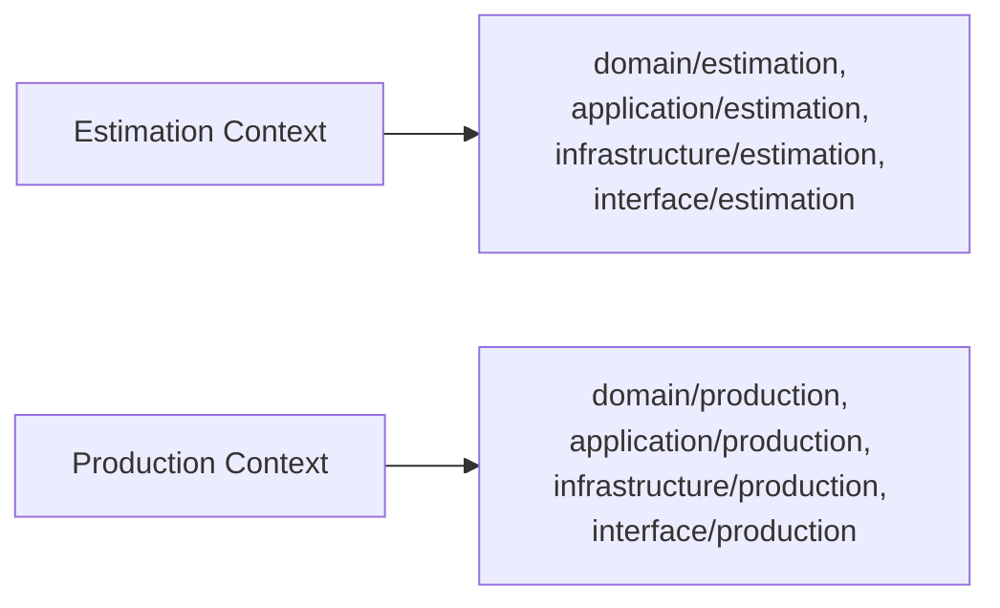

# 03 — DDD Architecture

Version:
1.0

Status:
Draft

Owner:
PrintHub Architecture Team

Last Updated:
2026-07-23

---

# Purpose

Describe how Domain-Driven Design is applied structurally within `printos_core` — how bounded contexts map to modules and code layout, how aggregates and entities are organized, and how ubiquitous language is enforced in code — complementing the business-level domain model already published in the Blueprint.

---

# Scope

Covers the structural/technical application of DDD (aggregate boundaries, module-to-context mapping, code-level ubiquitous language enforcement). Does not redefine the domain model, entities, or bounded context responsibilities themselves — those remain authoritative in [../blueprint/05_Domain_Model.md](../blueprint/05_Domain_Model.md) and [../blueprint/06_Bounded_Contexts.md](../blueprint/06_Bounded_Contexts.md).

---

# Background

The Blueprint defines DDD at the business level: domains, bounded contexts, entities, and business rules. This document exists because turning that into code raises structural questions the Blueprint deliberately leaves open — for example, exactly how a Bounded Context maps onto `printos_core/domain/<module>/`, or where an aggregate's consistency boundary sits within a Job Card's related child records.

---

# Main Content

## Bounded Context → Module Mapping

Each Bounded Context in [../blueprint/06_Bounded_Contexts.md](../blueprint/06_Bounded_Contexts.md) maps to exactly one module directory across all four Clean Architecture layers, per [../technical/05_Project_Structure.md](../technical/05_Project_Structure.md):

A module must not span two Bounded Contexts, and a Bounded Context must not be split across two module directories — this 1:1 mapping is what keeps the Blueprint's context map and the codebase's module layout in permanent sync.

## Aggregates

An Aggregate is the DDD unit of consistency: a cluster of entities/value objects that must be kept transactionally consistent, accessed only through its root. In PrintOS terms, illustrative aggregate roots include Sales Order (with its line items), Job Card (with its material allocations and quality checkpoints), and Quotation (with its line items). Aggregate boundaries are a Domain-layer concern and must be decided before Infrastructure-layer DocType child-table design, not the reverse — child-table structure follows the aggregate boundary, not vice versa.

## Ubiquitous Language Enforcement

Code-level naming (classes, methods, variables referring to business concepts) must use terms exactly as they appear in [../standards/Naming_Registry.md](../standards/Naming_Registry.md). A service or use case introducing a new business term locally (e.g. a variable called `client` where the Registry says `Customer`) is a Naming Review defect, not a stylistic choice.

## Anti-Corruption Layer

Where `printos_core` must interact with ERPNext's own vocabulary (e.g. ERPNext's `Item` vs PrintOS's `Material`), the Infrastructure-layer adapter acts as an anti-corruption layer: it translates between ERPNext's model and PrintOS's domain language, so ERPNext's terms never leak into the Domain layer. This directly addresses the open "Item vs Material" conflict tracked in `Naming_Registry.md` Section 27, item 10.

---

# Architecture Notes

This 1:1 Bounded-Context-to-module mapping is a deliberate simplification for Phase 1. If a context later needs to be split (e.g. Machine Scheduling growing complex enough to warrant separation from Production), that is itself a Bounded Context change and must be proposed in `docs/blueprint/06_Bounded_Contexts.md` first, per the Documentation Hierarchy in `docs/Documentation_Workflow.md` Section 3 — never introduced silently at the code level.

---

# Future Considerations

- As Freelancer, Supplier, and Service Engineer contexts are introduced (Phases 2–4), each should receive its own module following the same 1:1 mapping rule described here.
- MachineIQ, being a future consumer of Production/Reporting data rather than an owner of its own aggregates in Phase 1, may warrant a distinct architectural pattern (e.g. read-only projection) rather than a standard aggregate-owning module — to be resolved when its Blueprint document is written.

---

# Open Questions

- Should aggregate boundaries be documented per-module here, or is that level of detail better placed in each module's own design notes once implementation begins?

---

# Related Documents

- [../blueprint/05_Domain_Model.md](../blueprint/05_Domain_Model.md)
- [../blueprint/06_Bounded_Contexts.md](../blueprint/06_Bounded_Contexts.md)
- [../technical/05_Project_Structure.md](../technical/05_Project_Structure.md)
- [../standards/Naming_Registry.md](../standards/Naming_Registry.md)
- [02_Clean_Architecture.md](02_Clean_Architecture.md)

---

# Revision History

| Version | Date | Author | Changes |
|---|---|---|---|
| 1.0 | 2026-07-23 | Initial | Initial Version |

---

# Documentation Quality Checklist

- [ ] Technically accurate
- [ ] Business terminology verified
- [ ] Cross-references updated
- [ ] Mermaid diagrams validated
- [ ] No implementation code included
- [ ] Future roadmap considered
- [ ] Reviewed by Project Owner
