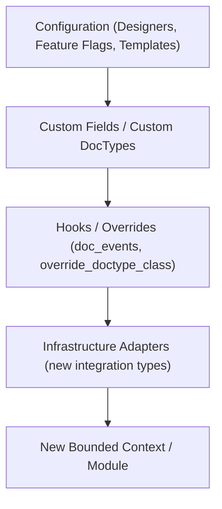

# 05 — Extensibility Architecture

Version:
1.0

Status:
Draft

Owner:
PrintHub Architecture Team

Last Updated:
2026-07-23

---

# Purpose

Describe the architectural mechanisms that let PrintOS be extended — by the PrintHub team, and eventually by third parties — without modifying ERPNext core or destabilizing upgrades, consolidating the extension model already introduced in `docs/technical/09_Extensibility_Model.md` with a system-wide, plugin-oriented view.

---

# Scope

Covers extension points at the system level: Frappe/ERPNext extension mechanisms, the Configuration Studio's designer-level extensibility, and the future Plugin/Feature Pack model. Does not restate `docs/technical/09_Extensibility_Model.md`'s DocType/hook-level detail, which remains authoritative.

---

# Background

`docs/technical/09_Extensibility_Model.md` establishes the rule "ERPNext core is never modified" and the mechanisms (Custom DocTypes, Custom Fields, hooks, overrides) used to extend it. This document exists to describe the layer above that: how those mechanisms compose into a coherent extensibility story that also supports future Plugins, Feature Packs, and Industry Templates without redesign.

---

# Main Content

## Extension Points, Ordered by Blast Radius

Each level down this list requires progressively more architectural review before use — a Configuration change (Level A) is the lowest-risk extension point and requires no Architecture Review; introducing a new Bounded Context (Level E) is a Level 2/3 Naming Registry decision (`Naming_Registry.md` Section 3) and must go through Architecture Review and, where cross-cutting, an ADR.

## Future Plugin Model

A "Plugin" or "Feature Pack" (industry-specific bundle of modules, configuration templates, and DocTypes) is expected to be composed entirely from the extension points already defined above — a Feature Pack is not a new extension mechanism, it is a packaged combination of Custom DocTypes, Configuration Templates ([../configuration/14_Template_Library.md](../configuration/14_Template_Library.md)), and Feature Flags ([../configuration/12_Feature_Flags.md](../configuration/12_Feature_Flags.md)).

## Upgrade Safety

Every extension point above preserves ERPNext upgrade compatibility because none of them touch ERPNext core files. An ERPNext version upgrade requires re-validating Infrastructure-layer adapters (Level C/D) at most; Domain and Application layers, being ERPNext-independent, are unaffected.

---

# Architecture Notes

Any proposed extension mechanism not already covered by this ladder (e.g. a hypothetical runtime code-injection plugin API) is out of scope for PrintOS and would itself require a new ADR before being considered, given the direct conflict it would create with `PROJECT_RULES.md` Rule 1 ("Never modify ERPNext core") and Rule 23 ("Always preserve upgrade compatibility").

---

# Future Considerations

- The Plugin/Feature Pack model described here should be validated against a real Industry Template (e.g. a "Signage Print Shop" pack) once [../configuration/14_Template_Library.md](../configuration/14_Template_Library.md) has its first real template, to confirm no new extension point is actually needed.

---

# Open Questions

- Should third-party (non-PrintHub-authored) plugins be a supported concept at all, or is "Plugin" scoped to mean PrintHub-authored Feature Packs only?

---

# Related Documents

- [../technical/09_Extensibility_Model.md](../technical/09_Extensibility_Model.md)
- [../configuration/12_Feature_Flags.md](../configuration/12_Feature_Flags.md)
- [../configuration/14_Template_Library.md](../configuration/14_Template_Library.md)
- [02_Clean_Architecture.md](02_Clean_Architecture.md)

---

# Revision History

| Version | Date | Author | Changes |
|---|---|---|---|
| 1.0 | 2026-07-23 | Initial | Initial Version |

---

# Documentation Quality Checklist

- [ ] Technically accurate
- [ ] Business terminology verified
- [ ] Cross-references updated
- [ ] Mermaid diagrams validated
- [ ] No implementation code included
- [ ] Future roadmap considered
- [ ] Reviewed by Project Owner
