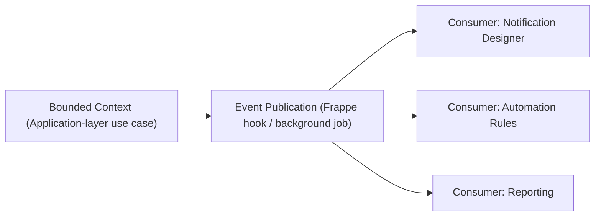

# 06 — Event Architecture

Version:
1.0

Status:
Draft

Owner:
PrintHub Architecture Team

Last Updated:
2026-07-23

---

# Purpose

Describe how domain-significant events are published and consumed across PrintOS's bounded contexts, so cross-context reactions (e.g. Production reacting to an approved Quotation) happen through explicit, traceable events rather than tight coupling or hidden side effects.

---

# Scope

Covers event publication/consumption architecture at the system level. Does not define event naming conventions (see `docs/standards/Event_Standards.md` and `docs/standards/Naming_Registry.md` Section 16, where the event-naming casing conflict remains an open Pending ADR item) or automation-rule configuration (see [../configuration/07_Automation_Rules.md](../configuration/07_Automation_Rules.md)).

---

# Background

[../blueprint/06_Bounded_Contexts.md](../blueprint/06_Bounded_Contexts.md) establishes that contexts communicate through well-defined inputs/outputs rather than shared internal state. Events are one concrete mechanism for that: a business-significant fact (e.g. "Job Completed") is published once and any interested context reacts independently, instead of the publishing context reaching directly into consumers.

---

# Main Content

## Event Flow

Events are published by the Application layer at the point a use case completes a business-significant state change — never by the Interface layer directly, and never as a side effect buried inside a Domain-layer calculation.

## Illustrative Events

Business meaning only; casing/format pending the ADR referenced in `Event_Standards.md` conflict tracking (see Naming Registry Section 16/27 item 1):

| Business Event | Publishing Context | Illustrative Consumers |
|---|---|---|
| Quotation Created | Estimation | Sales, Notification Designer |
| Order Confirmed | Sales | Production, Accounts |
| Job Started / Job Completed | Production | Reporting, Notification Designer |
| Inventory Reserved | Inventory | Procurement (replenishment signal) |
| Machine Stopped | Production (Machine Scheduling) | Notification Designer, future MachineIQ |

## Consumption Boundaries

- A consumer never assumes delivery order across different event types.
- A consumer failure (e.g. a Notification Designer rule erroring) must not roll back or block the publishing use case's own transaction — event consumption is decoupled from the publishing transaction's success.
- Automation Rules ([../configuration/07_Automation_Rules.md](../configuration/07_Automation_Rules.md)) are one configured form of event consumption; they must not bypass Workflow/Approval gates when reacting to an event.

---

# Architecture Notes

This document describes the architectural shape of eventing; it does not mandate a specific message-bus technology. Phase 1 implementation is expected to use Frappe's existing hook/background-job mechanisms rather than introducing a new message broker, consistent with avoiding unnecessary infrastructure per `PROJECT_RULES.md`.

---

# Future Considerations

- MachineIQ is a natural future consumer of Production/Machine events (per [../blueprint/06_Bounded_Contexts.md](../blueprint/06_Bounded_Contexts.md)'s MachineIQ context definition) and should be addable as a consumer without changing how events are published.
- If event volume or cross-service consumption (e.g. a separate MachineIQ service) eventually requires a dedicated message broker, that is an infrastructure decision requiring its own ADR — not assumed here.

---

# Open Questions

- Should the event-naming casing conflict (`Naming_Registry.md` Section 16/27 item 1) be resolved before or independently of this document being finalized?
- Should failed event consumption be retried automatically, and if so, how many times before requiring manual intervention?

---

# Related Documents

- [../blueprint/06_Bounded_Contexts.md](../blueprint/06_Bounded_Contexts.md)
- `docs/standards/Event_Standards.md`
- [../standards/Naming_Registry.md](../standards/Naming_Registry.md)
- [../configuration/07_Automation_Rules.md](../configuration/07_Automation_Rules.md)
- [../configuration/08_Notification_Designer.md](../configuration/08_Notification_Designer.md)

---

# Revision History

| Version | Date | Author | Changes |
|---|---|---|---|
| 1.0 | 2026-07-23 | Initial | Initial Version |

---

# Documentation Quality Checklist

- [ ] Technically accurate
- [ ] Business terminology verified
- [ ] Cross-references updated
- [ ] Mermaid diagrams validated
- [ ] No implementation code included
- [ ] Future roadmap considered
- [ ] Reviewed by Project Owner
