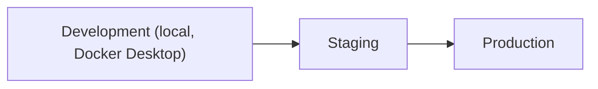

# 09 — Deployment Architecture (Working Draft)

Version:
0.1

Status:
Draft

Owner:
PrintHub Architecture Team

Last Updated:
2026-07-23

---

# Scope Note

`docs/blueprint/24_Deployment_Architecture.md` is the path formally **reserved** for PrintOS's authoritative Deployment Architecture document, per [ADR-010-Blueprint-Numbering-Strategy](../decisions/ADR-010-Blueprint-Numbering-Strategy.md). That document does not yet exist. This document is a **working draft** occupying that gap and must be reconciled with (merged into, or explicitly superseded by) `24_Deployment_Architecture.md` once that document is written.

---

# Purpose

Describe how PrintOS is deployed across environments and, eventually, infrastructure topology — capturing current thinking ahead of the formal Blueprint document.

---

# Scope

Covers environment progression, release mechanics, and infrastructure components at the architecture level. Does not restate the Configuration Studio's own configuration-promotion mechanics (see [../configuration/15_Deployment_Model.md](../configuration/15_Deployment_Model.md), which governs *configuration* deployment specifically) or detailed release procedure (see `docs/standards/Release_Process.md`).

---

# Background

`CHATGPT.md` lists the technology stack (ERPNext v16/Frappe, MariaDB, Redis, Docker, future FastAPI/ClickHouse/Cloudflare) but does not describe how these compose into deployed environments. This document exists to capture that until the reserved Blueprint document is written.

---

# Main Content

## Environments

Per `docs/Documentation_Workflow.md` Section 3 and [../configuration/15_Deployment_Model.md](../configuration/15_Deployment_Model.md), PrintOS uses a Development → Staging → Production progression. Each `Environment` (per `Naming_Registry.md` Section 8) is a named deployment context; each `Instance` is a single running deployment for one or more Companies.

## Infrastructure Components (Current Stack)

| Component | Role | Source |
|---|---|---|
| Docker | Local development containerization | `CHATGPT.md` Technology Stack |
| ERPNext v16 / Frappe | Application runtime | `CHATGPT.md`, [ADR-001](../decisions/ADR-001-ERPNext-Framework.md) |
| MariaDB | Primary datastore | `CHATGPT.md` |
| Redis | Cache/queue | `CHATGPT.md`, [01_System_Architecture.md](01_System_Architecture.md) |
| Cloudflare (future) | CDN/edge, likely for Marketplace/portal traffic | `CHATGPT.md` Technology Stack (Future) |
| FastAPI (future) | Likely candidate for future standalone services (e.g. MachineIQ) outside the Frappe request path | `CHATGPT.md` Technology Stack (Future) |
| ClickHouse (future) | Likely candidate for analytical/MachineIQ workloads, per [08_Performance_Architecture.md](08_Performance_Architecture.md)'s note on a separate analytical data path | `CHATGPT.md` Technology Stack (Future) |

## Release Mechanics

Configuration changes move through environments as versioned fixtures (see [../configuration/15_Deployment_Model.md](../configuration/15_Deployment_Model.md)); code changes follow `docs/standards/Git_Workflow.md` and `Branching_Strategy.md`. This document does not introduce a separate release mechanism — it only situates configuration and code releases within the same environment progression.

---

# Architecture Notes

Nothing in this working draft should be read as committing to a specific hosting provider, container orchestration platform, or CI/CD tool beyond what `CHATGPT.md` already lists — infrastructure provider selection is out of scope here and belongs in the eventual `docs/blueprint/24_Deployment_Architecture.md`.

---

# Future Considerations

- Multi-tenant deployment topology (shared instance vs. per-tenant instance) depends directly on the outcome of [04_MultiTenant_Architecture.md](04_MultiTenant_Architecture.md) and should not be finalized independently of it.
- Tenant provisioning and tenant backup/export-import (explicitly called out as required capabilities in the Configuration Studio review) belong in the eventual authoritative deployment document, once multi-tenancy is resolved.

---

# Open Questions

- Should FastAPI/ClickHouse be introduced only when MachineIQ is scoped, or evaluated earlier as part of general Reporting/Analytics performance work ([08_Performance_Architecture.md](08_Performance_Architecture.md))?

---

# Related Documents

- [../configuration/15_Deployment_Model.md](../configuration/15_Deployment_Model.md)
- `docs/standards/Release_Process.md`
- `docs/standards/Branching_Strategy.md`
- [04_MultiTenant_Architecture.md](04_MultiTenant_Architecture.md)
- `docs/blueprint/24_Deployment_Architecture.md` (reserved, not yet written)

---

# Revision History

| Version | Date | Author | Changes |
|---|---|---|---|
| 0.1 | 2026-07-23 | Initial | Initial working draft, pending reconciliation with the reserved `docs/blueprint/24_Deployment_Architecture.md`. |

---

# Documentation Quality Checklist

- [ ] Technically accurate
- [ ] Business terminology verified
- [ ] Cross-references updated
- [ ] Mermaid diagrams validated
- [ ] No implementation code included
- [ ] Future roadmap considered
- [ ] Reviewed by Project Owner
