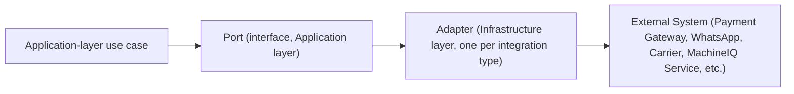

# 10 — Integration Architecture (Working Draft)

Version:
0.1

Status:
Draft

Owner:
PrintHub Architecture Team

Last Updated:
2026-07-23

---

# Scope Note

`docs/blueprint/22_Integration_Architecture.md` is the path formally **reserved** for PrintOS's authoritative Integration Architecture document, per [ADR-010-Blueprint-Numbering-Strategy](../decisions/ADR-010-Blueprint-Numbering-Strategy.md). That document does not yet exist. This document is a **working draft** occupying that gap and must be reconciled with (merged into, or explicitly superseded by) `22_Integration_Architecture.md` once that document is written.

---

# Purpose

Describe the architectural pattern PrintOS uses for all external system integrations, elevating the adapter-based approach already established in [../configuration/11_Integration_Designer.md](../configuration/11_Integration_Designer.md) to a system-wide architectural statement.

---

# Scope

Covers the general integration pattern (adapter model, credential handling, failure handling) applicable to every external system PrintOS connects to. Does not restate the Integration Designer's configuration-record data model, which remains authoritative in [../configuration/11_Integration_Designer.md](../configuration/11_Integration_Designer.md).

---

# Background

PrintOS's roadmap anticipates numerous integrations over time: payment gateways, WhatsApp, shipping carriers, prepress/design tools, accounting exports, and eventually MachineIQ and Marketplace as internal-but-external services. Without a single architectural pattern, each integration risks being built ad hoc. This document states the one pattern all of them must follow.

---

# Main Content

## The Adapter Pattern

- The Application layer depends only on a Port (interface); it never imports a specific integration library directly.
- Exactly one Infrastructure-layer Adapter implements each Port per integration type, per [../configuration/11_Integration_Designer.md](../configuration/11_Integration_Designer.md)'s rule that the Integration Designer configures *instances* of an adapter, never generates new adapter code per installation.
- This is the same Ports-and-Adapters structure already established for Clean Architecture generally ([02_Clean_Architecture.md](02_Clean_Architecture.md)) — Integration Architecture is that pattern applied specifically to outbound/inbound external calls.

## Credential Handling

Credentials are never embedded in configuration; they are referenced via Frappe's encrypted password fields or environment variables, per [../configuration/11_Integration_Designer.md](../configuration/11_Integration_Designer.md) and [07_Security_Architecture.md](07_Security_Architecture.md).

## Failure Handling

Outbound integration calls must handle failure gracefully (timeouts, retries/backoff where appropriate) and log failures per [../technical/08_Error_Handling.md](../technical/08_Error_Handling.md), rather than allowing a third-party outage to cascade into the requesting use case's own failure without a clear boundary.

## Integration Categories

| Category | Examples | Illustrative Port |
|---|---|---|
| Payment | Payment Gateway (Naming Registry Section 9) | `PaymentGatewayPort` |
| Messaging | WhatsApp Channel | `MessagingChannelPort` |
| Logistics | Shipping carriers (Dispatch context) | `CarrierPort` |
| Analytical (future) | MachineIQ Service | `MachineIntegrationService` (see `Naming_Registry.md` Section 14) |
| Marketplace (future) | Marketplace Service | `MarketplaceIntegrationPort` |

---

# Architecture Notes

This pattern is deliberately the same Ports-and-Adapters shape used throughout `printos_core`'s Clean Architecture — Integration Architecture does not introduce a second, parallel architectural style for external calls.

---

# Future Considerations

- MachineIQ and Marketplace, once scoped, are expected to be consumed through this same adapter pattern rather than requiring special-cased integration code, consistent with [ADR-008](../decisions/ADR-008-MachineIQ.md) and [ADR-009](../decisions/ADR-009-Marketplace.md).

---

# Open Questions

- Should a standard retry/backoff policy be mandated centrally (e.g. in a shared Infrastructure utility) rather than left to each adapter to implement independently?

---

# Related Documents

- [../configuration/11_Integration_Designer.md](../configuration/11_Integration_Designer.md)
- [02_Clean_Architecture.md](02_Clean_Architecture.md)
- [07_Security_Architecture.md](07_Security_Architecture.md)
- [../technical/08_Error_Handling.md](../technical/08_Error_Handling.md)
- `docs/blueprint/22_Integration_Architecture.md` (reserved, not yet written)

---

# Revision History

| Version | Date | Author | Changes |
|---|---|---|---|
| 0.1 | 2026-07-23 | Initial | Initial working draft, pending reconciliation with the reserved `docs/blueprint/22_Integration_Architecture.md`. |

---

# Documentation Quality Checklist

- [ ] Technically accurate
- [ ] Business terminology verified
- [ ] Cross-references updated
- [ ] Mermaid diagrams validated
- [ ] No implementation code included
- [ ] Future roadmap considered
- [ ] Reviewed by Project Owner
