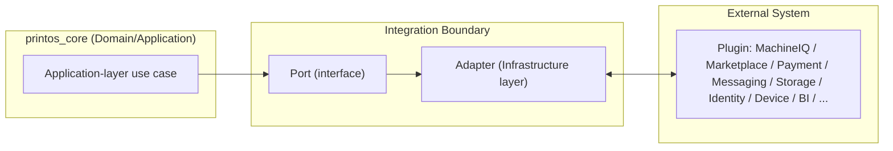

# Plugin Architecture

Version:
0.2

Status:
Draft

Owner:
PrintHub Architecture Team

Last Updated:
2026-09-19

---

## Executive Summary

This document defines the single architectural standard every external integration in PrintHub must follow — not a catalog of current integrations, but the blueprint that makes MachineIQ, Marketplace, payment gateways, messaging channels, and every future external capability behave consistently, remain independently replaceable, and never compromise ERPNext core immutability or `printos_core`'s Clean Architecture boundaries. It builds directly on the Ports & Adapters pattern already established in [10_Integration_Architecture.md](10_Integration_Architecture.md) and the Plugin classification already assigned in [ERPNext_Fit_Analysis.md](ERPNext_Fit_Analysis.md) Section 6 and [ERPNext_Gap_Analysis.md](ERPNext_Gap_Analysis.md); it does not reclassify anything already decided there, and it does not resolve any Architecture Review Register item it touches.

---

## Architectural Principles

- **External systems stay outside the domain model.** No Aggregate Root, Child Entity, or Value Object in [Canonical_Domain_Model.md](Canonical_Domain_Model.md) may represent an external system's own data structure directly — external data is translated at the boundary, never imported as-is into Domain/Application layers.
- **Ports & Adapters, uniformly.** Every plugin category below is consumed through an Application-layer Port (an interface) implemented by exactly one Infrastructure-layer Adapter per plugin instance, per [10_Integration_Architecture.md](10_Integration_Architecture.md) — no exceptions, no category-specific mechanism.
- **No direct coupling between ERPNext and external services.** An Adapter may read from or write to ERPNext-mapped DocTypes (per [../database/ERPNext_DocType_Mapping.md](../database/ERPNext_DocType_Mapping.md)) through the same Repository/Application-layer access every other `printos_core` component uses — it never calls an external service directly from a Frappe hook or client script.
- **Enable/disable through configuration, not code.** Every plugin is toggled via Feature Flag and/or Integration Definition ([Configuration_Studio_Architecture.md](../configuration/Configuration_Studio_Architecture.md)), never a code deployment.
- **Tenant-specific configuration.** Each plugin instance's configuration (credentials, endpoint, mapping) is scoped per installation via the same Tenant Override mechanism as every other configuration artifact — subject to [Architecture Review Register](../decisions/Architecture_Review_Register.md) **AR-002**'s still-open Tenant/Company definition, referenced and not resolved here.
- **New plugins require no existing code change.** Adding a new plugin category or instance means adding a new Adapter behind an existing or newly-defined Port and a new Integration Definition record — never editing an existing Adapter or Domain/Application class to accommodate it.
- **Business rules stay inside PrintHub.** An Adapter translates and transports; it never makes a business decision (e.g., an approval, a pricing calculation, a workflow transition) — those remain in `printos_core`'s Domain/Application layers, consistent with [ADR-002-PrintOS-Core](../decisions/ADR-002-PrintOS-Core.md).

---

## Plugin Categories

### Core Platform

#### MachineIQ

- **Purpose:** Apply machine intelligence to production and business data for optimization and predictive insight.
- **Business Responsibility:** Analytical/predictive capability over Machine, Job Card, and Reporting data — explicitly outside ERPNext's or `printos_core`'s own scope as a generic ERP.
- **Bounded Context Ownership:** MachineIQ Context *(Future)*, per [Canonical_Domain_Model.md](Canonical_Domain_Model.md); consumes data from the Production Context (Machine, Job Card) and Configuration Studio's Reporting-adjacent artifacts.
- **Integration Boundary:** Outbound — Machine/Job Card/production data exported to MachineIQ. Inbound — Machine Event, Sensor, Telemetry Reading, Counter Reading, Maintenance Alert, Machine Status data and derived insights returned.
- **Ports:** An outbound `MachineIntegrationService` port (per [../standards/Naming_Registry.md](../standards/Naming_Registry.md) Section 14) for sending production/machine data; an inbound port for receiving Machine Events/Insights.
- **Adapters:** One Infrastructure-layer adapter implementing both directions of the MachineIQ Service Model, per [../database/ERPNext_DocType_Mapping.md](../database/ERPNext_DocType_Mapping.md) (External Plugin).
- **Configuration Requirements:** An Integration Definition instance per installation; Feature Flag gating MachineIQ availability entirely, since it remains Future-scoped.
- **Security Considerations:** Production data leaving the installation boundary requires explicit consent/configuration; credentials via Frappe encrypted fields, never embedded.
- **Failure Handling:** MachineIQ unavailability must never block core Production Context operations (Job Card execution continues without MachineIQ input) — pure degrade-gracefully behavior.
- **Lifecycle:** Install (register Adapter) → Configure (Integration Definition, credentials) → Enable (Feature Flag) → Upgrade (new Adapter version, backward-compatible port) → Disable (Feature Flag off, no data loss) → Remove (Integration Definition archived, historical Machine Event data retained per [../database/06_Data_Lifecycle.md](../database/06_Data_Lifecycle.md)).
- **Reference:** Full scope deferred per [ADR-008-MachineIQ](../decisions/ADR-008-MachineIQ.md); not resolved here.

#### Marketplace

- **Purpose:** Connect public buyers (G1) directly with print shops as active platform participants.
- **Business Responsibility:** Buyer-facing discovery and order origination, routed into CRM/Sales.
- **Bounded Context Ownership:** Marketplace Context *(Future)*, per [Canonical_Domain_Model.md](Canonical_Domain_Model.md); Marketplace Listing/Order route into CRM and Sales Contexts.
- **Integration Boundary:** Outbound — Product Template/catalog data published as Marketplace Listing. Inbound — Marketplace Order data received and translated into a Lead/Enquiry or Sales Order.
- **Ports:** An outbound catalog-publishing port; an inbound order-ingestion port.
- **Adapters:** One Infrastructure-layer adapter implementing the Marketplace Service Model, per [../database/ERPNext_DocType_Mapping.md](../database/ERPNext_DocType_Mapping.md) (External Plugin).
- **Configuration Requirements:** Integration Definition per installation; Feature Flag gating Marketplace participation, since full scope is deferred to Phase 5.
- **Security Considerations:** Public-facing surface introduces untrusted input; all inbound Marketplace Order data is validated at the Adapter boundary before ever reaching Domain/Application logic.
- **Failure Handling:** Marketplace unavailability must not block core CRM/Sales operations for direct (non-Marketplace) customers.
- **Lifecycle:** Same pattern as MachineIQ above.
- **Reference:** Deferred to Phase 5 per [ADR-009-Marketplace](../decisions/ADR-009-Marketplace.md); not resolved here.

#### AI Assistant

- **Purpose:** Not yet defined in any Approved Blueprint document.
- **Business Responsibility:** Not assessable pending scoping.
- **Bounded Context Ownership:** None — "AI Assistant" is registered as Proposed only (Naming Registry Section 40) and has no Approved Bounded Context, per [Canonical_Domain_Model.md](Canonical_Domain_Model.md). AR-003 is Resolved; this registration grants no architecture, provider, model, or plugin-design decision.
- **Integration Boundary:** Not assessable.
- **Ports / Adapters:** Not assessable — this document does not invent a port or adapter for an unscoped capability.
- **Configuration Requirements:** Not assessable.
- **Security Considerations:** Not assessable.
- **Failure Handling:** Not assessable.
- **Lifecycle:** Not assessable.
- **Reference:** Included here only because it was named in this task's required category list. Its name is registered as Proposed and AR-003 is Resolved, but the capability remains excluded pending separate future governance for its architecture, Approved Bounded Context, provider, model, plugin design, and implementation authorization. If and when scoped, it would follow the identical Ports & Adapters pattern as every other Core Platform plugin — no special-casing is anticipated.

---

### Communication

*(Email, SMS, WhatsApp, Push Notifications — architecturally identical; documented as one pattern with per-channel notes.)*

- **Purpose:** Deliver operational notifications (approval requests, status updates, alerts) to Customers and staff across multiple channels.
- **Business Responsibility:** Message delivery only — content and trigger logic remain in `printos_core`'s Notification Designer ([08_Notification_Designer.md](../configuration/08_Notification_Designer.md)).
- **Bounded Context Ownership:** No dedicated Bounded Context; consumed by Configuration Studio's Notification Template artifact on behalf of every other Context that triggers a notification.
- **Integration Boundary:** Outbound only — a rendered message (recipient, content, channel) crosses the boundary; no inbound business data returns except delivery status/receipts.
- **Ports:** One outbound `MessagingChannelPort` per channel type (Email, SMS, WhatsApp, Push), each with an identical shape (send message, receive delivery status).
- **Adapters:** One Adapter per channel provider (e.g., a specific WhatsApp Business API provider, a specific SMS gateway); Email may use Frappe's native SMTP capability as a Native/Extended mechanism rather than requiring a Plugin Adapter at all, per [Configuration_Studio_Architecture.md](../configuration/Configuration_Studio_Architecture.md)'s Notification Designer section — this is the one Communication sub-category where ERPNext native capability already suffices for Phase 1.
- **Configuration Requirements:** Integration Definition per channel/provider; Feature Flag gating channel availability per installation (e.g., "SMS only for installations with that add-on enabled," per [12_Feature_Flags.md](../configuration/12_Feature_Flags.md)).
- **Security Considerations:** Provider credentials via encrypted fields; message content escaped by default (XSS prevention, per [07_Security_Architecture.md](07_Security_Architecture.md)); no customer PII logged in plaintext delivery-status records beyond what the provider itself requires.
- **Failure Handling:** Delivery failure must not block the triggering business transaction (an Invoice is still issued even if its notification fails to send); failed sends are retried with backoff and logged for operator visibility.
- **Lifecycle:** Install (register channel Adapter) → Configure (provider credentials, Integration Definition) → Enable (Feature Flag) → Upgrade (provider API version change, Adapter-internal) → Disable → Remove.

---

### Commerce

*(Payment Providers, Shipping Providers, Tax Services — related but distinct integration boundaries; documented together with per-type distinctions.)*

- **Purpose:** Process customer payments, obtain shipping rates/tracking, and (where beyond ERPNext's native capability) compute jurisdiction-specific tax.
- **Business Responsibility:**
  - *Payment Providers* — process payment against an Invoice, returning confirmation to be recorded as a Payment.
  - *Shipping Providers* — obtain rates/tracking for a Dispatch Record.
  - *Tax Services* — supplement ERPNext's native GST/tax capability only where it is insufficient (e.g., cross-border tax); not required for Phase 1 GST per [ERPNext_Fit_Analysis.md](ERPNext_Fit_Analysis.md) Section 3 (Accounts).
- **Bounded Context Ownership:** Payment Providers consumed by the Accounts Context (Payment, Invoice); Shipping Providers consumed by the Dispatch Context (Dispatch Record); Tax Services consumed by the Accounts/GST Contexts.
- **Integration Boundary:** Payment — outbound payment request, inbound confirmation/failure. Shipping — outbound rate/label request, inbound rate/tracking data. Tax — outbound transaction detail, inbound computed tax.
- **Ports:** `PaymentGatewayPort`, `CarrierPort` (per [10_Integration_Architecture.md](10_Integration_Architecture.md)), and a `TaxServicePort` (new port name, consistent with the existing pattern, not a new architectural mechanism).
- **Adapters:** One Adapter per specific provider within each type; Payment records the outcome via native ERPNext Payment Entry (per [../database/ERPNext_DocType_Mapping.md](../database/ERPNext_DocType_Mapping.md)), the Adapter itself performs the external call only.
- **Configuration Requirements:** Integration Definition per provider instance; multiple concurrent providers of the same type (e.g., two payment gateways) are supported as separate Integration Definition records, selected per transaction by Application-layer logic, not by the Adapter itself.
- **Security Considerations:** Payment credentials are the highest-sensitivity secret class in the platform — encrypted storage mandatory, no logging of raw payment instrument data, PCI-relevant scope kept entirely within the provider's own hosted flow wherever possible rather than PrintHub handling raw card data.
- **Failure Handling:** Payment failures surface immediately to the initiating transaction (a failed payment must not silently record as successful); Shipping/Tax failures degrade to manual fallback (e.g., a manually entered shipping cost) rather than blocking Dispatch/Invoice creation entirely.
- **Lifecycle:** Same Install→Configure→Enable→Upgrade→Disable→Remove pattern; Removal of a Payment Provider must be blocked while any Invoice still references an in-flight transaction against it.

---

### Storage

*(Cloud Object Storage, Document Repositories — both Future per [ERPNext_Gap_Analysis.md](ERPNext_Gap_Analysis.md), documented together.)*

- **Purpose:** Store Artwork/Proof files, and potentially other documents, at a scale or with capabilities beyond Frappe's native file attachment mechanism.
- **Business Responsibility:** Durable file storage and retrieval only — no business logic.
- **Bounded Context Ownership:** Consumed by the Artwork Context (Artwork, Artwork Revision, Proof).
- **Integration Boundary:** Outbound — file upload. Inbound — file retrieval, and optionally storage-provider metadata (checksum, version).
- **Ports:** An outbound/inbound `FileStoragePort` abstracting file put/get/delete operations.
- **Adapters:** One Adapter per storage provider (e.g., a specific cloud object storage service or document repository system).
- **Configuration Requirements:** Integration Definition per provider; Feature Flag gating whether external storage is used at all, since Frappe's native File mechanism remains sufficient for Phase 1 scale per [10_Integration_Architecture.md](10_Integration_Architecture.md).
- **Security Considerations:** Access credentials scoped to least privilege (write-only where retrieval isn't needed by that component); files containing customer Artwork are access-controlled identically to the Artwork record referencing them, never independently more permissive.
- **Failure Handling:** Storage failure on upload must block the triggering Artwork submission (a lost file is a data-integrity risk, not something to silently degrade past); retrieval failure degrades to a clear error rather than a silent empty result.
- **Lifecycle:** Standard pattern; Removal requires a data-migration step (moving existing files back to native storage or another provider) before the Integration Definition can be archived.

---

### Identity

*(SSO, OAuth, Directory Services — not currently required, since ERPNext's native authentication suffices for Phase 1; documented for architectural completeness.)*

- **Purpose:** Allow authentication/authorization to be delegated to an external Identity Provider.
- **Business Responsibility:** Authentication and identity federation only — Role/Permission decisions remain governed by [09_Role_Permission_Designer.md](../configuration/09_Role_Permission_Designer.md), never delegated to the external provider.
- **Bounded Context Ownership:** Consumed by the Administration Context (User/Role management, per [Canonical_Domain_Model.md](Canonical_Domain_Model.md)).
- **Integration Boundary:** Outbound — authentication request/redirect. Inbound — identity assertion (user identity, group/role claims for mapping, not authority).
- **Ports:** An `IdentityProviderPort` for authentication delegation.
- **Adapters:** One Adapter per SSO/OAuth/Directory provider, translating provider-specific protocols (SAML, OAuth2, LDAP) into the same internal port contract.
- **Configuration Requirements:** Integration Definition per provider; this remains entirely unused/disabled by default, since ERPNext's native authentication is the current Native classification (no gap identified for Phase 1).
- **Security Considerations:** Highest-sensitivity category alongside Payment — provider claims are mapped to internal Roles by explicit, reviewed configuration, never auto-trusted; session handling remains governed by Frappe's native session mechanism regardless of the external identity source.
- **Failure Handling:** Identity Provider unavailability must have a defined fallback (e.g., native ERPNext login remains available) rather than a total lockout, unless explicitly configured otherwise for compliance reasons.
- **Lifecycle:** Standard pattern; Enable requires explicit administrator action given its security sensitivity, never a default-on state.

---

### Industrial

*(Machine Controllers, Barcode Devices, Label Printers, IoT Sensors — physical/production-floor integrations, documented together.)*

- **Purpose:** Connect physical production-floor devices to PrintOS for data capture (barcode scans, sensor telemetry) and output (labels, machine control signals).
- **Business Responsibility:** Physical device communication only; any resulting business action (e.g., a Job Card status update triggered by a barcode scan) is performed by an Application-layer use case the Adapter calls, never by the Adapter itself.
- **Bounded Context Ownership:** Machine Controllers and IoT Sensors consumed by the MachineIQ Context *(Future)*; Barcode Devices and Label Printers consumed by the Production Context (Job Card) and Dispatch Context (Dispatch Record).
- **Integration Boundary:** Outbound — label print jobs, machine control signals (if applicable). Inbound — barcode scan events, sensor telemetry.
- **Ports:** A `DevicePort` per device class (barcode scanning, label printing, machine control, sensor ingestion) — kept separate rather than one generic "device" port, since their data shapes differ materially.
- **Adapters:** One Adapter per specific device/protocol (e.g., a specific label printer driver, a specific barcode scanner integration, a specific PLC protocol for Machine Controllers).
- **Configuration Requirements:** Integration Definition per device or device class per installation; device-level configuration (e.g., which printer is the default for a given Warehouse) may additionally use Tenant Override.
- **Security Considerations:** Physical device network segmentation is an infrastructure concern outside this document's scope, but credential/connection-string handling for any networked device follows the same encrypted-storage rule as every other Integration Definition.
- **Failure Handling:** A disconnected label printer or barcode scanner must degrade to manual entry, never block Job Card progression entirely; Machine Controller/IoT Sensor data loss is logged but does not halt production (consistent with MachineIQ's degrade-gracefully principle above).
- **Lifecycle:** Standard pattern; device-specific Adapters are expected to proliferate over time as new hardware is supported — this is the category most directly exercising the "new plugins require no existing code change" principle, since each new device model is a new Adapter behind the same `DevicePort`.

---

### Analytics

*(BI Platforms, Reporting Services — Future, external to the native Report/Dashboard Designer capability.)*

- **Purpose:** Allow PrintOS data to be consumed by external Business Intelligence tools or reporting services beyond the native Report/Dashboard Designer.
- **Business Responsibility:** Data export/streaming only — no analytical logic belongs inside `printos_core`; predictive/advanced analytics is MachineIQ's domain (Core Platform above), not this category's.
- **Bounded Context Ownership:** Consumed by the Reporting Context and Configuration Studio Context (Report Definition, Dashboard Definition), per [Canonical_Domain_Model.md](Canonical_Domain_Model.md) — noting that document's already-flagged, unresolved overlap between those two Contexts' ownership of Report/Dashboard Definition, referenced here without re-litigating it.
- **Integration Boundary:** Outbound only — data extract/stream sent to the external BI/reporting platform; no inbound business data.
- **Ports:** An outbound `AnalyticsExportPort`.
- **Adapters:** One Adapter per BI/reporting platform.
- **Configuration Requirements:** Integration Definition per platform; Feature Flag gating export availability, since this remains Future/optional relative to the native Report Designer, which is sufficient for Phase 1.
- **Security Considerations:** Data leaving the installation boundary for external analytics requires the same explicit-consent posture as MachineIQ's data export; export scope should be field-level configurable, not a blanket database dump.
- **Failure Handling:** Export failures are logged and retried; they never block the underlying transactional operations the exported data derives from.
- **Lifecycle:** Standard pattern.

---

### Future

Any plugin category not enumerated above follows this identical architecture without modification: an Application-layer Port, one Infrastructure-layer Adapter per instance, an Integration Definition configuration record, Feature Flag-gated enablement, encrypted credential storage, degrade-gracefully failure handling, and the standard Install→Configure→Enable→Upgrade→Disable→Remove lifecycle. Introducing a genuinely new plugin *category* (as opposed to a new instance within an existing category) requires only defining its Port shape and Bounded Context consumer — it does not require revisiting this document's principles, Plugin Registry, Configuration Integration, Security Model, or Observability sections, each of which is deliberately category-agnostic.

---

## Integration Boundaries

Every plugin category above shares one boundary shape, regardless of direction or data type:

Data crossing this boundary is always translated at the Adapter — an external system's native data shape never appears inside a Port's contract, and a `printos_core` Domain/Application object never appears inside an external system's own API call directly. This is the anti-corruption-layer principle already established in [03_DDD_Architecture.md](03_DDD_Architecture.md), applied uniformly to every plugin category rather than restated per category.

---

## Ports and Adapters

| Plugin Category | Representative Port(s) | Adapter Cardinality |
|---|---|---|
| MachineIQ | `MachineIntegrationService` (outbound + inbound) | One Adapter |
| Marketplace | Catalog-publishing port, order-ingestion port | One Adapter |
| AI Assistant | Not assessable — see Core Platform above | Not assessable |
| Communication | `MessagingChannelPort` (per channel) | One Adapter per channel provider |
| Payment | `PaymentGatewayPort` | One Adapter per provider |
| Shipping | `CarrierPort` | One Adapter per carrier |
| Tax Services | `TaxServicePort` | One Adapter per provider |
| Storage | `FileStoragePort` | One Adapter per provider |
| Identity | `IdentityProviderPort` | One Adapter per provider |
| Industrial | `DevicePort` (per device class) | One Adapter per device/protocol |
| Analytics | `AnalyticsExportPort` | One Adapter per platform |

**Rule, stated once and applying to every row above:** A Port is defined once per capability shape and never per provider; a new provider within an existing category is always a new Adapter behind the existing Port, never a Port change. This is what makes plugins "independently replaceable" — swapping a payment gateway means swapping one Adapter, with zero change to any Application-layer use case that calls `PaymentGatewayPort`.

---

## Plugin Registry

A Plugin Registry is required to track every Integration Definition instance across all categories above. Its responsibilities, at the architecture level only (no implementation detail):

- **Discovery:** Surface which plugin categories and provider Adapters are available for configuration within a given installation.
- **Registration:** Record that a specific Adapter has been installed and is available for an Integration Definition to reference.
- **Version Compatibility:** Track which Adapter version is compatible with the current `printos_core` Port version it implements, preventing an incompatible Adapter from being enabled.
- **Dependency Declaration:** Record any dependency a plugin has on another plugin or on a specific Configuration Studio artifact (e.g., a Notification Template referencing a Communication channel Adapter).
- **Enable/Disable State:** Track, per installation, whether a registered plugin is currently active — this state is what Feature Flag/Integration Definition configuration ultimately drives.
- **Health Status:** Track the last-known operational status of each active plugin instance (reachable/unreachable, last successful call), feeding the Observability section below.

The Plugin Registry does not itself make business decisions or hold business data — it is a meta-level record of *what plugins exist and their operational state*, distinct from the Integration Definition records that hold each instance's actual configuration.

---

## Configuration Integration

Every plugin integrates with Configuration Studio identically, per [Configuration_Studio_Architecture.md](../configuration/Configuration_Studio_Architecture.md):

- **Configuration Artifacts:** Every plugin instance is represented by an Integration Definition (Extended ERPNext, per [../database/ERPNext_DocType_Mapping.md](../database/ERPNext_DocType_Mapping.md)); availability is additionally gated by a Feature Flag where the plugin category itself is optional/Future.
- **Versioning:** Integration Definition follows the standard Configuration Studio lifecycle (Draft → Validating → Review → Approved → Published → Deprecated/RolledBack → Archived); credential references version independently of endpoint/mapping configuration, per [Configuration_Studio_Architecture.md](../configuration/Configuration_Studio_Architecture.md)'s Integration Designer section.
- **Import/Export:** Integration Definition configuration (excluding secrets, which are never exported in plaintext) is portable via Frappe fixture export/import across environments, identical to every other Configuration Studio artifact.
- **Validation:** Missing Object Detection confirms the referenced Adapter type is registered in the Plugin Registry; Reference Validation confirms the credential reference resolves to a valid encrypted field/environment variable, never a plain value; Dependency Validation confirms any plugin-to-plugin dependency (e.g., a Communication channel referenced by a Notification Template) is satisfiable.
- **Tenant Overrides:** Per-installation plugin configuration (which provider, which credentials, whether enabled at all) is expressed through Tenant Override exactly as any other configuration value, subject to the same AR-002 caveat already stated in [Configuration_Studio_Architecture.md](../configuration/Configuration_Studio_Architecture.md).

---

## Security Model

- **Credential Management:** Every plugin credential (API key, OAuth secret, connection string) is stored via Frappe's native encrypted password fields or environment variables, per [07_Security_Architecture.md](07_Security_Architecture.md) — never as a plain configuration field value, regardless of plugin category.
- **Secret Storage:** Secrets are referenced by Integration Definition, never embedded in it; rotating a secret does not require a new Integration Definition version, only a credential-reference update.
- **Audit Logging:** Every plugin invocation (outbound call, inbound receipt) is logged with enough context (which Integration Definition, which triggering use case, timestamp, outcome) to reconstruct what happened, consistent with [Configuration_Studio_Architecture.md](../configuration/Configuration_Studio_Architecture.md)'s Audit Model applied to runtime plugin activity, not just configuration changes.
- **Tenant Isolation:** No installation's plugin credentials, Integration Definitions, or plugin-generated data are visible to or reachable by another installation — architecturally identical to Configuration Studio's tenant isolation guarantee, and equally subject to AR-002's still-open resolution without this document deciding it.
- **Least Privilege:** Each Adapter requests only the scope/permission it needs from the external provider (e.g., a Shipping Provider Adapter never requests payment-processing scope); this is a configuration-time and Adapter-design-time discipline, not a runtime enforcement mechanism this document specifies further.

---

## Observability

- **Logging:** Every Adapter logs outbound requests and inbound responses (excluding secret values) at a level sufficient for failure diagnosis, per [08_Error_Handling.md](../technical/08_Error_Handling.md)'s boundary-logging principle applied to external calls specifically.
- **Metrics:** Plugin Registry Health Status (above) is the minimum required metric per plugin instance — reachable/unreachable and last-successful-call timestamp; richer metrics (latency, error rate) are an implementation-time enhancement, not an architectural requirement this document mandates further.
- **Health Checks:** Each Adapter is expected to expose a lightweight reachability check the Plugin Registry can poll or be notified by, feeding Health Status.
- **Error Reporting:** A plugin failure surfaces to the triggering Application-layer use case as a typed error (per [08_Error_Handling.md](../technical/08_Error_Handling.md)'s Infrastructure-exception-wrapped-as-Application-exception rule) — never a raw external-provider error propagating unmodified into Domain/Application code.
- **Audit Trails:** Combines with the Security Model's Audit Logging requirement above — observability and security audit are the same underlying log, not two separate mechanisms.

---

## Risks

| Risk | Description | Mitigation Referenced |
|---|---|---|
| Direct ERPNext-to-external coupling | An Adapter (or worse, a hook/client script) calls an external service directly, bypassing the Port. | Architectural Principles' "no direct coupling" rule; Integration Boundary diagram |
| Business logic leaking into an Adapter | A Payment Adapter decides whether a discount applies, or a Shipping Adapter decides delivery method eligibility. | "Business rules stay inside PrintHub" principle |
| Plugin failure cascading into core operations | MachineIQ, Marketplace, or Communication outage blocks Job Card, Sales Order, or Invoice processing. | Degrade-gracefully failure handling, stated per category and generalized here |
| Secret leakage | Credentials logged in plaintext, embedded in configuration, or exported in a fixture. | Security Model's Credential Management and Secret Storage rules |
| Tenant credential/data cross-contamination | One installation's plugin data becomes visible to another. | Tenant Isolation, subject to AR-002 |
| Port proliferation defeating replaceability | A new provider is implemented by changing an existing Port rather than adding a new Adapter, coupling `printos_core` to one specific provider's shape. | Ports and Adapters' stated rule: Port per capability shape, Adapter per provider |
| Unbounded plugin category growth without governance | New plugin categories added without following this document's pattern, creating inconsistent integration styles. | "Future" section's explicit statement that all new categories follow the same architecture without modification |

---

## Validation

- ✓ **Every plugin category has a defined boundary.** All eight categories (Core Platform's three sub-entries, Communication, Commerce, Storage, Identity, Industrial, Analytics) have an explicit Integration Boundary field.
- ✓ **Every plugin category identifies its bounded context.** Each category's Bounded Context Ownership field names the consuming Context from [Canonical_Domain_Model.md](Canonical_Domain_Model.md); AI Assistant explicitly has none, consistent with its Proposed-only registration and unresolved architecture.
- ✓ **Configuration Studio integration is documented.** See Configuration Integration, mapping every plugin to Integration Definition, Feature Flag, and the standard Configuration Studio lifecycle.
- ✓ **Tenant isolation is addressed.** See Security Model's Tenant Isolation clause and each category's Configuration Requirements referencing Tenant Override.
- ✓ **Ports & Adapters principles are consistently applied.** See Ports and Adapters table — every category maps to exactly one Port shape and a per-provider Adapter cardinality, with no category-specific exception.
- ✓ **No ERPNext core modification is required.** No category's Adapter, Port, or configuration requirement touches ERPNext core files; all ERPNext interaction occurs through the same Repository/Application-layer access as the rest of `printos_core`, per [../database/ERPNext_DocType_Mapping.md](../database/ERPNext_DocType_Mapping.md).
- ✓ **Open Architecture Review items are referenced where applicable.** AR-002 (Tenant/Company) is referenced in Architectural Principles, Configuration Integration, and Security Model — Resolved. AR-003 (AI Assistant naming) is referenced in Core Platform — Resolved (AI Assistant registered Proposed only; no architecture, Bounded Context, provider, or model decision made or implied by either resolution).

---

# Related Documents

- [10_Integration_Architecture.md](10_Integration_Architecture.md)
- [05_Extensibility_Architecture.md](05_Extensibility_Architecture.md)
- [07_Security_Architecture.md](07_Security_Architecture.md)
- [03_DDD_Architecture.md](03_DDD_Architecture.md)
- [Canonical_Domain_Model.md](Canonical_Domain_Model.md)
- [ERPNext_Fit_Analysis.md](ERPNext_Fit_Analysis.md)
- [ERPNext_Gap_Analysis.md](ERPNext_Gap_Analysis.md)
- [../database/ERPNext_DocType_Mapping.md](../database/ERPNext_DocType_Mapping.md)
- [../configuration/Configuration_Studio_Architecture.md](../configuration/Configuration_Studio_Architecture.md)
- [../configuration/11_Integration_Designer.md](../configuration/11_Integration_Designer.md)
- [../decisions/Architecture_Review_Register.md](../decisions/Architecture_Review_Register.md)
- [../decisions/ADR-008-MachineIQ.md](../decisions/ADR-008-MachineIQ.md)
- [../decisions/ADR-009-Marketplace.md](../decisions/ADR-009-Marketplace.md)

---

# Revision History

| Version | Date | Author | Changes |
|---|---|---|---|
| 0.1 | 2026-07-25 | Initial | Initial Plugin Architecture. Defined the uniform Ports & Adapters standard applied to eight plugin category groups (Core Platform: MachineIQ, Marketplace, AI Assistant; Communication; Commerce; Storage; Identity; Industrial; Analytics; Future), each with Purpose, Business Responsibility, Bounded Context Ownership, Integration Boundary, Ports, Adapters, Configuration Requirements, Security Considerations, Failure Handling, and Lifecycle. Defined Plugin Registry responsibilities, Configuration Studio integration, Security Model, and Observability expectations, all category-agnostic. AR-002 and AR-003 referenced without resolution. |
| 0.2 | 2026-09-19 | AR-003 Disposition Synchronization | Corrected four active statements that described "AI Assistant" as unregistered and AR-003 as unresolved: the AI Assistant Bounded Context Ownership field, its Reference bullet, the Documentation Quality Checklist's Bounded Context item, and the Open Architecture Review Items checklist item. AI Assistant is registered as Proposed only (Naming Registry Section 40); it has no Approved Bounded Context, and no architecture, provider, model, or plugin-design decision is made or implied. No Port, Adapter, provider, model, lifecycle, or Bounded Context was defined by this synchronization. No plugin category's Purpose, Business Responsibility, Ports, Adapters, Configuration Requirements, Security Considerations, or Lifecycle content was changed. No implementation authorized. |

---

# Documentation Quality Checklist

- [ ] Technically accurate
- [ ] Business terminology verified against Naming Registry
- [ ] Cross-references updated
- [ ] Mermaid diagrams validated
- [ ] No implementation code, APIs, DocTypes, or database tables included
- [ ] No Blueprint/ADR terminology invented, renamed, or superseded
- [ ] No Architecture Review Register item resolved
- [ ] Consistent with Canonical Domain Model and ERPNext DocType Mapping
- [ ] Reviewed by Project Owner
