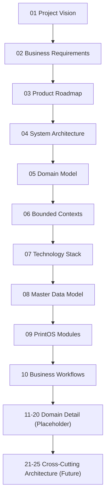

# Blueprint Master Index

Version:
2.1

Status:
Draft

Owner:
PrintHub Architecture Team

Last Updated:
2026-07-22

---

# Purpose

This document is the entry point and navigation hub for the PrintHub Blueprint. It exists so that any contributor — human or AI — can locate the authoritative documentation for a given topic without ambiguity, and so the overall documentation structure is visible at a glance. This is the single authoritative navigation document for `docs/blueprint/`.

---

# Scope

This document covers:

- The list of all Blueprint documents and their current status.
- The numbering convention used for Blueprint documents, and the authority governing it.
- The Documentation-First philosophy governing how the Blueprint is maintained.

This document does not cover the content of individual topics; it only indexes and summarizes them.

---

# Background

PrintHub is a long-term enterprise SaaS platform for the printing, digital printing, signage, packaging, gifting, LED display, and visual communication industries. Its first product, PrintOS, is an ERP built on ERPNext (Frappe Framework). Because the platform is intended to evolve over many years and multiple phases, a stable, versioned documentation structure is required so that architectural intent is never lost or implicit in code alone.

This index was found to be significantly out of date during a Documentation Consistency Review (2026-07-22): it still listed 05/06 as reserved placeholders after they had been published, omitted documents 08–20 entirely, and referenced obsolete future filenames. This version (2.0) corrects those issues and reflects the actual state of `docs/blueprint/` at time of writing.

---

# Main Content

## Document Status Legend

| Status | Meaning |
|---|---|
| Published | Content is complete and in force; safe to build against. |
| In Progress | Actively being written; not yet safe to build against. |
| Placeholder | File exists but is empty; reserved for planned content. |
| Future | Not yet created; number reserved by an ADR or this index. |

## Document Index

| # | Document | Purpose | Status |
|---|---|---|---|
| — | [README.md](README.md) | One-page orientation to the Blueprint | Published |
| 00 | 00_Master_Index.md | This document — navigation and index | Published |
| 01 | [01_Project_Vision.md](01_Project_Vision.md) | Vision, mission, business/product goals, target industries | Published |
| 02 | [02_Business_Requirements.md](02_Business_Requirements.md) | Functional/non-functional requirements, scope, target users | Published |
| 03 | [03_Product_Roadmap.md](03_Product_Roadmap.md) | Phased roadmap from PrintOS ERP through Marketplace | Published |
| 04 | [04_System_Architecture.md](04_System_Architecture.md) | System architecture, ERPNext/PrintOS separation, DDD/Clean Architecture | Published |
| 05 | [05_Domain_Model.md](05_Domain_Model.md) | Core/Supporting/Generic domains, business entities, relationships | Published |
| 06 | [06_Bounded_Contexts.md](06_Bounded_Contexts.md) | Bounded context definitions and context map | Published |
| 07 | [07_Technology_Stack.md](07_Technology_Stack.md) | Current and future technology stack with rationale | Published |
| 08 | [08_Master_Data_Model.md](08_Master_Data_Model.md) | Master data entities and relationships | Published |
| 09 | [09_PrintOS_Modules.md](09_PrintOS_Modules.md) | Business module catalog | Published |
| 10 | [10_Business_Workflows.md](10_Business_Workflows.md) | Major end-to-end business workflows | Published |
| 11 | 11_Print_Industry_Model.md | Print industry-specific domain detail | Placeholder |
| 12 | 12_PrintOS_Product_Catalog.md | Product/catalog structure | Placeholder |
| 13 | 13_Pricing_Engine.md | Pricing engine design | Placeholder |
| 14 | 14_Quotation_Engine.md | Quotation engine design | Placeholder |
| 15 | 15_Production_Management.md | Production management detail | Placeholder |
| 16 | 16_Print_Machine_Model.md | Machine/press modeling | Placeholder |
| 17 | 17_Inventory_Model.md | Inventory model detail | Placeholder |
| 18 | 18_Artwork_Management.md | Artwork management detail | Placeholder |
| 19 | 19_Job_Card_Model.md | Job Card model detail | Placeholder |
| 20 | 20_Dashboard_Architecture.md | Dashboard/reporting architecture | Placeholder |
| 21 | 21_Data_Architecture.md | Business data domains, lifecycle, governance, retention | Future (reserved by [ADR-010](../decisions/ADR-010-Blueprint-Numbering-Strategy.md)) |
| 22 | 22_Integration_Architecture.md | ERPNext, MachineIQ, WhatsApp, Payment Gateway, event-driven integration | Future (reserved by [ADR-010](../decisions/ADR-010-Blueprint-Numbering-Strategy.md)) |
| 23 | 23_Security_Architecture.md | AuthN/AuthZ, tenant isolation, encryption, compliance | Future (reserved by [ADR-010](../decisions/ADR-010-Blueprint-Numbering-Strategy.md)) |
| 24 | 24_Deployment_Architecture.md | Environments, Docker, CI/CD, monitoring | Future (reserved by [ADR-010](../decisions/ADR-010-Blueprint-Numbering-Strategy.md)) |
| 25 | 25_MultiTenant_Architecture.md | Single/multi/hybrid tenancy, tenant registry, scaling strategy | Future (reserved by [ADR-010](../decisions/ADR-010-Blueprint-Numbering-Strategy.md)) |

Numbers 21–25 are reserved specifically by [ADR-010-Blueprint-Numbering-Strategy.md](../decisions/ADR-010-Blueprint-Numbering-Strategy.md), which also documents why they are not placed at 11–15 (those numbers were already claimed by the 11–20 scaffold before the reservation was reconciled).

## Document Hierarchy

## Roadmap Alignment

Blueprint numbering tracks depth of detail, not delivery phase. `docs/blueprint/03_Product_Roadmap.md` defines the five delivery phases (PrintOS ERP → Freelancer Portal → Supplier Portal → Service Engineers → Marketplace); Blueprint documents 00–25 apply primarily to Phase 1 architecture, with later phases expected to add their own numbered documents (26+) as they are scoped, per the Numbering Convention below.

## Numbering Convention

Documents are numbered in the order a new reader should generally consume them. Numbers are not reused, and an occupied number is never reassigned to a different topic. When a new document is needed, it is inserted at the next available number, or a number explicitly reserved by an ADR (see [ADR-010](../decisions/ADR-010-Blueprint-Numbering-Strategy.md)) is filled in. Any future reservation of a not-yet-created number must be recorded in this index and, for any reservation spanning multiple documents, in an ADR — never assumed informally in a single citing document.

---

# Architecture Notes

The Blueprint structure itself follows a modular, low-coupling design: each document owns one concern (vision, requirements, roadmap, architecture, technology, domain detail) so that updates to one area do not require rewriting others. This mirrors the Modular Design and Separation of Concerns principles applied to the PrintOS codebase.

This index is now the single authoritative source for Blueprint numbering status. Any document that needs to cite a future Blueprint document must match the number recorded here (and, for the 21–25 range, in ADR-010); a citation that disagrees with this index is a documentation defect and should be corrected here first, then propagated.

---

# Future Considerations

- Documents 11–20 are currently Placeholder; as each is written, this index should be updated to move it from Placeholder to In Progress and then Published.
- Documents 21–25 are Future per ADR-010; as each is scoped and drafted, this index should be updated accordingly, and the reserving ADR referenced in its Revision History.
- As Roadmap Phases 2–5 (`03_Product_Roadmap.md`) are formally scoped, this index should gain new sections/entries for phase-specific Blueprint documents (26+), following the Numbering Convention.

---

# Open Questions

- What is the intended content boundary between the 05/06/08/09/10 architecture set and the 11–20 domain-detail set (e.g., how does `19_Job_Card_Model.md` relate to the Job Card entity already defined in `05_Domain_Model.md`)? This should be resolved before 11–20 are written, to avoid duplicating or contradicting already-Published content.
- Should a changelog document separate from `DECISIONS.md` be introduced as the Blueprint grows past 25 documents?

---

# Related Documents

All documents listed in the Document Index above. This is the root of the Blueprint's cross-reference graph.

- `docs/decisions/ADR-010-Blueprint-Numbering-Strategy.md`
- `docs/standards/Naming_Registry.md`
- `docs/Documentation_Workflow.md`
- `docs/business/00_Master_Index.md`

---

# Revision History

| Version | Date | Author | Changes |
|----------|------|--------|---------|
|1.0|2026-07-18|Initial|Initial Version|
|2.0|2026-07-22|Documentation Consistency Fix|Corrected outdated Phase A content: marked 05/06/08/09/10 as Published (previously shown as Reserved/omitted); added 11–20 as Placeholder; added 21–25 as Future per ADR-010; removed obsolete "06 Data Integration Architecture" future reference and obsolete Open Questions about 05/06 scope; added Document Status Legend, Document Hierarchy diagram, and Roadmap Alignment section|
|2.1|2026-07-26|Owner-Verification Status Reconciliation|Status corrected from Published to Draft. The previous Published header was removed because formal Project Owner approval had not occurred (explicit Project Owner declaration, 2026-07-26); the document returns to its supported pre-publication Draft lifecycle status. This correction affects only this index document — no indexed Blueprint document changed status, and no index content or navigation entry changed.|

---

# Documentation Quality Checklist

- [x] Technically accurate as of 2026-07-22
- [x] Business terminology verified
- [x] Cross-references updated
- [x] Mermaid diagrams validated
- [x] No implementation code included
- [x] Future roadmap considered
- [ ] Reviewed by Project Owner
