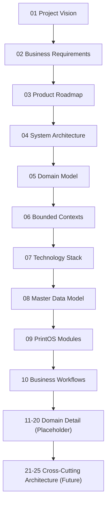

# Blueprint Master Index

Version:
2.15

Status:
Draft

Owner:
PrintHub Architecture Team

Last Updated:
2026-09-26

---

# Purpose

This document is the entry point and navigation hub for the PrintHub Blueprint. It exists so that any contributor — human or AI — can locate the authoritative documentation for a given topic without ambiguity, and so the overall documentation structure is visible at a glance. This is the single authoritative navigation document for `docs/blueprint/`.

---

# Scope

This document covers:

- The list of all Blueprint documents and their current status.
- The numbering convention used for Blueprint documents, and the authority governing it.
- The Documentation-First philosophy governing how the Blueprint is maintained.

This document does not cover the content of individual topics; it only indexes and summarizes them.

---

# Background

PrintHub is a long-term enterprise SaaS platform for the printing, digital printing, signage, packaging, gifting, LED display, and visual communication industries. Its first product, PrintOS, is an ERP built on ERPNext (Frappe Framework). Because the platform is intended to evolve over many years and multiple phases, a stable, versioned documentation structure is required so that architectural intent is never lost or implicit in code alone.

This index was found to be significantly out of date during a Documentation Consistency Review (2026-07-22): it still listed 05/06 as reserved placeholders after they had been published, omitted documents 08–20 entirely, and referenced obsolete future filenames. This version (2.0) corrects those issues and reflects the actual state of `docs/blueprint/` at time of writing.

---

# Main Content

## Document Status Legend

| Status | Meaning |
|---|---|
| Published | Content is complete and in force; safe to build against. |
| In Progress | Actively being written; not yet safe to build against. |
| Placeholder | File exists but is empty; reserved for planned content. |
| Future | Not yet created; number reserved by an ADR or this index. |

## Document Index

| # | Document | Purpose | Status |
|---|---|---|---|
| — | [README.md](README.md) | One-page orientation to the Blueprint | Draft |
| 00 | 00_Master_Index.md | This document — navigation and index | Draft |
| 01 | [01_Project_Vision.md](01_Project_Vision.md) | Vision, mission, business/product goals, target industries | Draft |
| 02 | [02_Business_Requirements.md](02_Business_Requirements.md) | Functional/non-functional requirements, scope, target users | Draft |
| 03 | [03_Product_Roadmap.md](03_Product_Roadmap.md) | Phased roadmap from PrintOS ERP through Marketplace | Draft |
| 04 | [04_System_Architecture.md](04_System_Architecture.md) | System architecture, ERPNext/PrintOS separation, DDD/Clean Architecture | Draft |
| 05 | [05_Domain_Model.md](05_Domain_Model.md) | Core/Supporting/Generic domains, business entities, relationships | Draft |
| 06 | [06_Bounded_Contexts.md](06_Bounded_Contexts.md) | Bounded context definitions and context map | Draft |
| 07 | [07_Technology_Stack.md](07_Technology_Stack.md) | Current and future technology stack with rationale | Draft |
| 08 | [08_Master_Data_Model.md](08_Master_Data_Model.md) | Master data entities and relationships | Draft |
| 09 | [09_PrintOS_Modules.md](09_PrintOS_Modules.md) | Business module catalog | Draft |
| 10 | [10_Business_Workflows.md](10_Business_Workflows.md) | Major end-to-end business workflows | Draft |
| 11 | 11_Print_Industry_Model.md | Print industry-specific domain detail | Placeholder |
| 12 | 12_PrintOS_Product_Catalog.md | Product/catalog structure | Placeholder |
| 13 | 13_Pricing_Engine.md | Pricing engine design | Placeholder |
| 14 | [14_Quotation_Engine.md](14_Quotation_Engine.md) | Quotation engine design — AR-005 Resolved (Option B, 2026-09-26): Custom Cost Estimate and pricing logic feed ERPNext's native Quotation through a governed handoff | Draft (Version 0.1) |
| 15 | 15_Production_Management.md | Production management detail | Placeholder |
| 16 | [16_Print_Machine_Model.md](16_Print_Machine_Model.md) | Machine/press modeling — AR-004 Resolved (Option C, 2026-09-20): Machine and Machine Profile are Custom PrintOS DocTypes | Draft (Version 0.1) |
| 17 | [17_Inventory_Model.md](17_Inventory_Model.md) | Inventory model detail — AR-006 Resolved (Option C, 2026-09-26; ADR-016): Material is a Custom PrintOS master linked to native Item; Substrate is a specialization of Material; Product Template is its own Custom PrintOS artifact, independent of Material and Item | Draft (Version 0.1) |
| 18 | 18_Artwork_Management.md | Artwork management detail | Approval (Version 1.6), 2026-09-13 — promoted **in place, at the same version number**, since Version 1.6 remained uncommitted (`ART-M4-LCV-F1` corrected; briefly, and erroneously, recorded as "Version 1.7" on the mistaken premise that Version 1.6 was already committed) — promotes to Approval the seventeen-rule Model 4 package (Sections 2.1/2.2) and its five-finding correction, with no content change from the prior Draft state of Version 1.6, per explicit Project Owner decision (Option A of the Model 4 Lifecycle Decision Brief, exceptions none), following a completed independent two-lens review (Architecture Review: Accepted with non-blocking corrections; Business Review: Accepted with non-blocking corrections; Documentation Governance: Passed with non-blocking corrections) with all five corrections (`ART-M4-17-ARCH-F1`, `ART-M4-17-ARCH-F2`, `ART-M4-17-ARCH-F3`, `ART-M4-17-BIZ-F1`, `ART-M4-17-CDC-F1`) independently verified Closed. Approval, Version 1.3 is the immediately prior approved baseline (Project Owner Document Lifecycle Approval granted 2026-08-19 at Version 1.1, carried forward through a bounded reference-only correction and a bounded naming-status synchronization, both on 2026-08-22); prior historical baselines Approval, Version 1.2, Approval, Version 1.1, and Approval, Version 1.0. This approval grants no Publication, implementation, source-inspection, environment, or runtime-validation authorization, and does not itself accept, complete, or advance the separate, still-pending Architecture Review or Business Review of the six technical names. |
| 19 | 19_Job_Card_Model.md | Job Card model detail | Placeholder |
| 20 | 20_Dashboard_Architecture.md | Dashboard/reporting architecture | Placeholder |
| 21 | 21_Data_Architecture.md | Business data domains, lifecycle, governance, retention | Future (reserved by [ADR-010](../decisions/ADR-010-Blueprint-Numbering-Strategy.md)) |
| 22 | 22_Integration_Architecture.md | ERPNext, MachineIQ, WhatsApp, Payment Gateway, event-driven integration | Future (reserved by [ADR-010](../decisions/ADR-010-Blueprint-Numbering-Strategy.md)) |
| 23 | 23_Security_Architecture.md | AuthN/AuthZ, tenant isolation, encryption, compliance | Future (reserved by [ADR-010](../decisions/ADR-010-Blueprint-Numbering-Strategy.md)) |
| 24 | 24_Deployment_Architecture.md | Environments, Docker, CI/CD, monitoring | Future (reserved by [ADR-010](../decisions/ADR-010-Blueprint-Numbering-Strategy.md)) |
| 25 | [25_MultiTenant_Architecture.md](25_MultiTenant_Architecture.md) | One isolated Frappe site and operational database per Tenant; Tenant/Company distinction; isolation, backup, upgrade, and service-tier principles — selected via AR-002 Option A and [ADR-015](../decisions/ADR-015-Tenant-Company-Multi-Tenancy-Model.md) | Approval, Version 1.1 (not Published) |

Numbers 21–25 are reserved specifically by [ADR-010-Blueprint-Numbering-Strategy.md](../decisions/ADR-010-Blueprint-Numbering-Strategy.md), which also documents why they are not placed at 11–15 (those numbers were already claimed by the 11–20 scaffold before the reservation was reconciled). Number 25 is no longer a placeholder reservation — `25_MultiTenant_Architecture.md` now exists at Approval, Version 1.0, per AR-002 Option A and Accepted ADR-015. The separate, pre-existing working draft `docs/architecture/04_MultiTenant_Architecture.md` (outside this Blueprint numbering scheme) has **not** been reconciled, superseded, or retired by this registration; its own Scope Note already anticipates reconciliation with this reserved document, and that reconciliation remains a **separate, later controlled task**.

## Document Hierarchy

## Roadmap Alignment

Blueprint numbering tracks depth of detail, not delivery phase. `docs/blueprint/03_Product_Roadmap.md` defines the five delivery phases (PrintOS ERP → Freelancer Portal → Supplier Portal → Service Engineers → Marketplace); Blueprint documents 00–25 apply primarily to Phase 1 architecture, with later phases expected to add their own numbered documents (26+) as they are scoped, per the Numbering Convention below.

## Numbering Convention

Documents are numbered in the order a new reader should generally consume them. Numbers are not reused, and an occupied number is never reassigned to a different topic. When a new document is needed, it is inserted at the next available number, or a number explicitly reserved by an ADR (see [ADR-010](../decisions/ADR-010-Blueprint-Numbering-Strategy.md)) is filled in. Any future reservation of a not-yet-created number must be recorded in this index and, for any reservation spanning multiple documents, in an ADR — never assumed informally in a single citing document.

---

# Architecture Notes

The Blueprint structure itself follows a modular, low-coupling design: each document owns one concern (vision, requirements, roadmap, architecture, technology, domain detail) so that updates to one area do not require rewriting others. This mirrors the Modular Design and Separation of Concerns principles applied to the PrintOS codebase.

This index is now the single authoritative source for Blueprint numbering status. Any document that needs to cite a future Blueprint document must match the number recorded here (and, for the 21–25 range, in ADR-010); a citation that disagrees with this index is a documentation defect and should be corrected here first, then propagated.

---

# Future Considerations

- Documents 11–20 are currently Placeholder; as each is written, this index should be updated to move it from Placeholder to In Progress and then Published.
- Documents 21–25 are Future per ADR-010; as each is scoped and drafted, this index should be updated accordingly, and the reserving ADR referenced in its Revision History.
- As Roadmap Phases 2–5 (`03_Product_Roadmap.md`) are formally scoped, this index should gain new sections/entries for phase-specific Blueprint documents (26+), following the Numbering Convention.

---

# Open Questions

- What is the intended content boundary between the 05/06/08/09/10 architecture set and the 11–20 domain-detail set (e.g., how does `19_Job_Card_Model.md` relate to the Job Card entity already defined in `05_Domain_Model.md`)? This should be resolved before 11–20 are written, to avoid duplicating or contradicting already-Published content.
- Should a changelog document separate from `DECISIONS.md` be introduced as the Blueprint grows past 25 documents?

---

# Related Documents

All documents listed in the Document Index above. This is the root of the Blueprint's cross-reference graph.

- `docs/decisions/ADR-010-Blueprint-Numbering-Strategy.md`
- `docs/standards/Naming_Registry.md`
- `docs/Documentation_Workflow.md`
- `docs/business/00_Master_Index.md`

---

# Revision History

| Version | Date | Author | Changes |
|----------|------|--------|---------|
|1.0|2026-07-18|Initial|Initial Version|
|2.0|2026-07-22|Documentation Consistency Fix|Corrected outdated Phase A content: marked 05/06/08/09/10 as Published (previously shown as Reserved/omitted); added 11–20 as Placeholder; added 21–25 as Future per ADR-010; removed obsolete "06 Data Integration Architecture" future reference and obsolete Open Questions about 05/06 scope; added Document Status Legend, Document Hierarchy diagram, and Roadmap Alignment section|
|2.1|2026-07-26|Owner-Verification Status Reconciliation|Status corrected from Published to Draft. The previous Published header was removed because formal Project Owner approval had not occurred (explicit Project Owner declaration, 2026-07-26); the document returns to its supported pre-publication Draft lifecycle status. This correction affects only this index document — no indexed Blueprint document changed status, and no index content or navigation entry changed.|
|2.2|2026-07-26|Status-Reporting Reconciliation|Reconciled the internal Document Index table's Status cells against authoritative source-document headers. Corrected 12 stale "Published" labels (README, 00, and 01–10) to "Draft" to match each source document's actual header Status; the 11–20 Placeholder and 21–25 Future rows were already accurate and unchanged. No referenced document changed lifecycle status; no filenames, links, descriptions, ordering, or numbering changed. The index itself remains Draft.|
|2.3|2026-07-28|Blueprint 25 Registration|Registered `25_MultiTenant_Architecture.md` as an active, linked document: Status changed from "Future (reserved by ADR-010)" to "Approval, Version 1.0 (not Published)," reflecting its selection via AR-002 Option A and Accepted ADR-015. Updated the Purpose cell to summarize the governed content (site/database-per-Tenant isolation, Tenant/Company distinction, backup/upgrade/service-tier principles). Added a note clarifying that the separate, pre-existing working draft `docs/architecture/04_MultiTenant_Architecture.md` is not reconciled, superseded, or retired by this registration and remains a separate, later controlled task. No other numbered entry (00–24) changed. The index itself remains Draft; no implementation authorized.|
|2.15|2026-09-26|AR-006 Resolved — Blueprint 17 Population|Populated the existing, previously empty Placeholder entry 17 (`17_Inventory_Model.md`) — no new file was created. Updated entry 17's Status column from "Placeholder" to "Draft (Version 0.1)" and its Purpose cell to record that AR-006 (Item vs. Material/Product Template Mapping) is Resolved via Project Owner selection of Option C on 2026-09-26, formalized in `../decisions/ADR-016-Item-Material-Product-Template-Mapping.md`: Material is a Custom PrintOS master linked to native Item; Substrate is a specialization of Material; Product Template is its own Custom PrintOS artifact, independent of Material and Item. This index entry does not itself grant Publication, implementation authorization, or any other authority, and does not define any DocType schema, field, hook, or implementation detail. No other numbered entry (00–16, 18–25) changed. The index itself remains Draft.|
|2.14|2026-09-26|AR-005 Resolved — Blueprint 14 Population|Populated the existing, previously empty Placeholder entry 14 (`14_Quotation_Engine.md`) — no new file was created. Updated entry 14's Status column from "Placeholder" to "Draft (Version 0.1)" and its Purpose cell to record that AR-005 (Quotation Strategy) is Resolved via Project Owner selection of Option B on 2026-09-26: Custom Cost Estimate and pricing logic feed ERPNext's native customer-facing Quotation through a governed handoff, per `../decisions/Architecture_Review_Register.md`, Version 0.7. Handoff mechanics, fields, Custom Fields, child-table structure, triggers, validations, and Quotation Line's target treatment remain deferred to a separate downstream DocType-design task. AR-010 remains Open and should be resolved before detailed Cost Estimate cost-breakdown design, to avoid later rework — it is not treated as mandatory, resolved, a new module-level blocker, or a condition on this decision. This index entry does not itself grant Publication, implementation authorization, or any other authority, and does not define any DocType schema, field, hook, or implementation detail. No other numbered entry (00–13, 15–25) changed. The index itself remains Draft.|
|2.13|2026-09-20|AR-004 Resolved — Blueprint 16 Population|Populated the existing, previously empty Placeholder entry 16 (`16_Print_Machine_Model.md`) — no new file was created. Updated entry 16's Status column from "Placeholder" to "Draft (Version 0.1)" and its Purpose cell to record that AR-004 (Machine Domain Ownership) is Resolved via Project Owner selection of Option C on 2026-09-20: Machine and Machine Profile are both Custom PrintOS DocTypes, per `../decisions/Architecture_Review_Register.md`, Version 0.6. This index entry does not itself grant Publication, implementation authorization, or any other authority, and does not define any DocType schema, field, hook, or implementation detail. No other numbered entry (00–15, 17–25) changed. The index itself remains Draft.|
|2.12|2026-09-19|Blueprint 25 Post-MT-R2 Designated-Authority Synchronization|Updated entry 25's Status column from Approval, Version 1.0 to Approval, Version 1.1, matching Blueprint 25's corrected current version following MT-R2. The ordinary-narrative citation in the numbering-reservation paragraph (line 86) remains deferred to a separately authorized bulk migration to a versionless reference. No other entry (00–24) changed.|
|2.11|2026-09-13|Project Owner Lifecycle Decision — Seventeen-Rule Package (Option A); `ART-M4-LCV-F1` Versioning Correction|Updated entry 18's current-state cell from **"Draft (Version 1.6), prior approved baseline Approval (Version 1.3)..."** to **"Approval (Version 1.6)..., prior approved baseline Approval (Version 1.3)..."**. Per explicit Project Owner decision dated 2026-09-13 — Option A of the Model 4 Lifecycle Decision Brief, exceptions none: accepted the completed Architecture Review disposition of Accepted with non-blocking corrections, the completed Business Review disposition of Accepted with non-blocking corrections, and the Documentation Governance disposition of Passed with non-blocking corrections, with all five corrections (`ART-M4-17-ARCH-F1`, `ART-M4-17-ARCH-F2`, `ART-M4-17-ARCH-F3`, `ART-M4-17-BIZ-F1`, `ART-M4-17-CDC-F1`) independently verified **Closed** — `18_Artwork_Management.md` is promoted from **Draft, Version 1.6** to **Approval, Version 1.6**, **in place, at the same version number**, since Version 1.6 remained uncommitted (2026-09-13; no content change accompanies this promotion). **Approval, Version 1.3 is the immediately prior approved baseline.** `implementation/JobCard_TierA_System_Design.md` was likewise promoted from Draft, Version 1.10 to Approval, Version 1.10, in place, in the same decision, but that document has no entry in this index (Blueprint-scoped only), consistent with the precedent set at Versions 2.4, 2.8, 2.9, and 2.10. **`ART-M4-LCV-F1` (Blocking, corrected 2026-09-13, pending independent closure verification).** Both promotions above were first, briefly, recorded under erroneous new version numbers — "Version 1.7" for Artwork, "Version 1.11" for Job Card — on the mistaken premise that Versions 1.6/1.10 were already committed; independent verification established neither had been committed (last commit `8e03727` holds Artwork at Draft, Version 1.5, Job Card at Draft, Version 1.9), and each document's own precedent (Artwork Version 1.1, Job Card Version 1.5) required same-version in-place promotion instead. Per Project Owner decision dated 2026-09-13 (Option A of the `ART-M4-LCV-F1` resolution, exceptions none), the erroneous version rows were withdrawn and consolidated before any commit; this index entry itself was corrected to cite Approval (Version 1.6), not Version 1.7. `ART-M4-LCV-F1` is a local lifecycle-verification finding label, not an Architecture Review Register identifier; it is corrected, pending separate independent closure verification, and is not Closed by this entry. `database/Artwork_Authority_DocType_Specification.md` and `database/JobCard_TierA_DocType_Specification.md` are retained as **Draft, not safe for coding**; all six technical names are retained **Under Review**, none Approved, `ART-RVR-C08` still incomplete; `standards/Naming_Registry.md`, `reviews/Artwork_Runtime_Validation_Readiness_Register.md`, and `Documentation_Status.md` are retained as Draft, synchronized only to record this decision. Workflow Section 8 confirms **MINOR** as the correct increment; no earlier approved or Draft version is affected. **This index entry does not itself grant Publication, implementation authorization, source-inspection authorization, environment authorization, production authorization, or runtime-validation authorization; it closes no runtime or production gate, does not resolve `AR-003`, and does not achieve Full Architecture Freeze.** This acceptance and promotion do **not** accept, complete, or advance the separate, still-pending Architecture Review or Business Review of the six technical names, and do not resolve, advance, or close any of the twelve findings from that distinct naming review (`ART-NAR-F1`–`F5`, `ART-NBR-F1`–`F5`, `ART-TLV-F1`–`F2`). **Index scope unchanged:** this index covers `docs/blueprint/` only. **No other entry was modified in substance, no document was Published, and no implementation authorized.**|
|2.10|2026-09-12|Four-Finding Correction to the Seventeen-Rule Package (Project Owner Decision, Option A)|Updated entry 18's current-state cell from **"Draft (Version 1.5)..."** to **"Draft (Version 1.6)..."**. Per explicit Project Owner decision dated 2026-09-12 — Option A of the Project Owner Decision Brief following the independent two-lens review, exceptions none — `18_Artwork_Management.md` records a four-finding correction (`ART-M4-17-ARCH-F1`, `ART-M4-17-ARCH-F2`, `ART-M4-17-ARCH-F3`, `ART-M4-17-BIZ-F1`) to Section 2.2 Rules 2, 9, 16. Because this is **new normative content that has received no Architecture Review and no Business Review**, the document **remains at Draft, Version 1.6** under `../Documentation_Workflow.md` Sections 5 and 7 — the same governed treatment previously applied at Versions 1.1, 1.4, and 1.5. Workflow Section 8 confirms **MINOR** as the correct increment; none of the seventeen adopted selections is reversed. **Approval, Version 1.3 remains the last fully reviewed and Owner-approved version.** Targeted Architecture Review and Business Review of Sections 2.1/2.2 remain **Pending**; all four findings are corrected pending separate independent closure verification and are not Closed by this entry. **Index scope unchanged:** this index covers `docs/blueprint/` only; `docs/implementation/JobCard_TierA_System_Design.md` has no entry here and none was created, consistent with the precedent set at Versions 2.4, 2.8, and 2.9. **No other entry was modified in substance, no document was promoted, and no document reached Published.**|
|2.9|2026-09-12|Model 4 Seventeen-Rule Definition Adoption (Project Owner Decision — Adopt All Seventeen)|Updated entry 18's current-state cell from **"Draft (Version 1.4)..."** to **"Draft (Version 1.5)..."**. Per explicit Project Owner decision dated 2026-09-12 — "Adopt all seventeen recommended selections exactly as listed in the verified Model 4 ratification sheet. Exceptions: None." — `18_Artwork_Management.md` records the adopted seventeen-rule Model 4 policy at its new Section 2.2. Because that is **new normative content that has received no Architecture Review and no Business Review**, the document **remains at Draft, Version 1.5** under `../Documentation_Workflow.md` Sections 5 and 7 — the same governed treatment previously applied at Versions 1.1 (2026-08-13) and 1.4 (2026-09-12). Workflow Section 8 confirms **MINOR** as the correct increment. **Approval, Version 1.3 remains the last fully reviewed and Owner-approved version**, and every rule it contained is preserved unchanged; no earlier approved or Draft version is represented as having adopted these seventeen rules. Targeted Architecture Review and Business Review of Sections 2.1/2.2 remain **Pending**. **Index scope unchanged:** this index covers `docs/blueprint/` only; `docs/implementation/JobCard_TierA_System_Design.md` has no entry here and none was created, consistent with the precedent set at Versions 2.4 and 2.8. **No other entry was modified in substance, no document was promoted, and no document reached Published.**|
|2.8|2026-09-12|Model 4 Lifecycle Synchronization (Project Owner Decision A4, B2, C2)|Updated entry 18's current-state cell from **"Approval (Version 1.3)"** to **"Draft (Version 1.4), prior approved baseline Approval (Version 1.3)"**. Per explicit Project Owner decision dated 2026-09-12, `18_Artwork_Management.md` records the adopted **Model 4** Artwork-applicability design direction at its new Section 2.1. Because that is **new normative content that has received no Architecture Review and no Business Review**, the document **returns to Draft at Version 1.4** under `../Documentation_Workflow.md` Section 5 (Approval means "All required reviews passed; awaiting final Owner sign-off") and Section 7 (Approval unreachable until every applicable lens has explicitly passed) — the same governed treatment previously applied to that document at Version 1.1 (2026-08-13). Workflow Section 8 confirms **MINOR** as the correct increment for an additive, non-contradictory expansion. **Approval, Version 1.3 remains the last fully reviewed and Owner-approved version**, and every rule it contained is preserved unchanged; no earlier approved version contained Model 4. Targeted Architecture Review and Business Review of Section 2.1 are **Pending**. **Index scope unchanged:** this index covers `docs/blueprint/` only; `docs/implementation/JobCard_TierA_System_Design.md` has no entry here and none was created, consistent with the precedent set at Version 2.4. **No other entry was modified in substance, no document was promoted, and no document reached Published.**|
|2.7|2026-08-22|Naming-Status Synchronization|Updated entry 18's current-state cell to **"Approval (Version 1.3)... prior historical baselines Approval, Version 1.2, Approval, Version 1.1, and Approval, Version 1.0"**, reflecting the governing System Design's bounded naming-status synchronization on 2026-08-22, per explicit Project Owner decision recording six technical DocType names (`PrintHub Artwork`, `PrintHub Artwork Revision`, `PrintHub Customer Approval Evidence`, `PrintHub Production Artwork Set`, `PrintHub Production Artwork Set Item`, `PrintHub Job Card`) at Naming Registry **Proposed** status (`../standards/Naming_Registry.md` Section 13a). This is a bounded, non-contradictory reference-only update per `../Documentation_Workflow.md` Section 8. **This index entry does not itself grant Publication, implementation authorization, name Approval, or any other authority**, does not resolve or modify `AR-003`, and does not select or approve any technical name or module path. No other numbered entry (00–17, 19–25) changed. The index itself remains Draft; no implementation authorized.|
|2.6|2026-08-22|AR-003 Scope Misattribution Correction|Updated entry 18's current-state cell to **"Approval (Version 1.2)... prior historical baselines Approval, Version 1.1 and Approval, Version 1.0"**, reflecting the governing System Design's bounded reference-only correction on 2026-08-22, which corrected three current-state statements that had incorrectly attributed Artwork/Job Card technical-name registration and `printos_core` module-path selection to `AR-003` (whose own recorded scope is unrelated). This is a bounded, non-contradictory reference-only update per `../Documentation_Workflow.md` Section 8, consistent with this index's own Version 2.4/2.5 precedent. **This index entry does not itself grant Publication, implementation authorization, or any other authority**, does not resolve or modify `AR-003`, and does not select or approve any technical name or module path. No other numbered entry (00–17, 19–25) changed. The index itself remains Draft; no implementation authorized.|
|2.5|2026-08-19|Project Owner Lifecycle Approval Synchronization|Corrected entry 18 (`18_Artwork_Management.md`) from "Draft (Version 1.1)" to **"Approval (Version 1.1), Project Owner Document Lifecycle Approval granted 2026-08-19; prior historical baseline Approval, Version 1.0"**, reflecting the Project Owner's explicit lifecycle approval of that document on **2026-08-19** following completed Architecture Review, Business Review, Documentation Governance verification, and independent verification with all six local Artwork findings Closed. This is a bounded, non-contradictory current-state clarification per `../Documentation_Workflow.md` Section 8, consistent with this index's own Version 2.4 precedent. **This index entry does not itself grant Publication, implementation authorization, or any other authority** — it records the referenced document's own lifecycle status only. No other numbered entry (00–17, 19–25) changed. The index itself remains Draft; no implementation authorized.|
|2.4|2026-08-13|Stale Status Correction|Corrected entry 18 (`18_Artwork_Management.md`) from the stale "Placeholder" label — never reconciled after that document was populated and promoted to Approval, Version 1.0 on 2026-07-31 — to its actual current lifecycle position: **Draft (Version 1.1), last reviewed and Owner-approved baseline Approval, Version 1.0**. An intermediate form of this entry (2026-08-08) recorded "Approval (Version 1.1)"; that was corrected on 2026-08-13 because the Version 1.1 addition (that document's Section 7.2) is new normative content lacking Architecture Review and Business Review and therefore cannot carry Approval status under `../Documentation_Workflow.md` Sections 5 and 7. No other numbered entry (00–17, 19–25) changed. The index itself remains Draft; no implementation authorized.|

---

# Documentation Quality Checklist

- [x] Technically accurate as of 2026-07-22
- [x] Business terminology verified
- [x] Cross-references updated
- [x] Mermaid diagrams validated
- [x] No implementation code included
- [x] Future roadmap considered
- [ ] Reviewed by Project Owner
