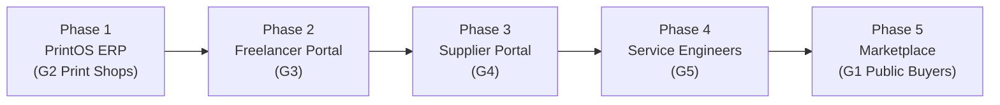

# Product Roadmap

Version:
1.0

Status:
Draft

Owner:
PrintHub Architecture Team

Last Updated:
2026-07-18

---

# Purpose

This document describes the phased delivery plan for PrintHub, from the initial PrintOS ERP product through to the full multi-sided Marketplace ecosystem.

---

# Scope

This document covers the sequence and intent of Phases 1 through 5. It does not cover detailed sprint planning or delivery dates, which are operational concerns outside the Blueprint.

---

# Background

PrintHub is designed to grow from a single-tenant ERP product into a connected ecosystem serving multiple user groups (G1–G5). Sequencing matters: each phase builds on the architectural foundation of the previous one, and marketplace functionality is deliberately deferred until the ERP core is proven.

---

# Main Content

## Phase Overview

| Phase | Name | Primary User Group | Focus |
|---|---|---|---|
| 1 | PrintOS ERP | G2 — Print Shops | Core ERP functionality for print shop operations |
| 2 | Freelancer Portal | G3 — Freelancers | Freelancer engagement and workflow integration |
| 3 | Supplier Portal | G4 — Suppliers | Supplier-facing procurement and collaboration |
| 4 | Service Engineers | G5 — Service Engineers | Field service and equipment maintenance workflows |
| 5 | Marketplace | G1 — Public Buyers | Public-facing marketplace connecting buyers to print shops |

## Roadmap Diagram

## Phase Timeline (Conceptual)

```mermaid
gantt
    title PrintHub Phased Roadmap (Conceptual Sequence, Not Scheduled)
    dateFormat  X
    axisFormat %s
    section Platform
    Phase 1 - PrintOS ERP           :p1, 0, 1
    Phase 2 - Freelancer Portal     :p2, after p1, 1
    Phase 3 - Supplier Portal       :p3, after p2, 1
    Phase 4 - Service Engineers     :p4, after p3, 1
    Phase 5 - Marketplace           :p5, after p4, 1
```

Note: The Gantt diagram represents relative sequencing only. No calendar dates are committed in this document.

## Phase Descriptions

**Phase 1 — PrintOS ERP.** Deliver core ERP capability for print shops on ERPNext, with all print-industry logic isolated in `printos_core`. Customers (G1) exist only as ERP records.

**Phase 2 — Freelancer Portal.** Introduce freelancers (G3) as a connected user group, enabling print shops to engage freelance resources through the platform.

**Phase 3 — Supplier Portal.** Introduce suppliers (G4), enabling procurement and supply-chain collaboration between print shops and suppliers.

**Phase 4 — Service Engineers.** Introduce service engineers (G5) for equipment maintenance and field service workflows tied to print shop operations.

**Phase 5 — Marketplace.** Open the platform to public buyers (G1) as active participants, connecting them directly with print shops in a marketplace model.

---

# Architecture Notes

Each phase is expected to extend the platform through `printos_core` extension points rather than requiring architectural rework of prior phases. This is why [04_System_Architecture.md](04_System_Architecture.md) emphasizes modular, low-coupling design from Phase 1 onward — the roadmap depends on it.

---

# Future Considerations

- Concrete scheduling and resourcing per phase is intentionally excluded from the Blueprint and should be tracked in project management tooling, not architecture documentation.
- MachineIQ (machine intelligence/analytics) and mobile applications are not yet assigned to a specific phase and require future scoping.

---

# Open Questions

- Should MachineIQ and mobile applications be inserted as explicit phases, or treated as cross-cutting capabilities delivered incrementally across phases?
- What criteria determine readiness to begin the next phase?

---

# Related Documents

- [00_Master_Index.md](00_Master_Index.md)
- [01_Project_Vision.md](01_Project_Vision.md)
- [02_Business_Requirements.md](02_Business_Requirements.md)
- [04_System_Architecture.md](04_System_Architecture.md)

---

# Revision History

| Version | Date | Author | Changes |
|----------|------|--------|---------|
|1.0|2026-07-18|Initial|Initial Version|

---

# Documentation Quality Checklist

- [ ] Technically accurate
- [ ] Business terminology verified
- [ ] Cross-references updated
- [ ] Mermaid diagrams validated
- [ ] No implementation code included
- [ ] Future roadmap considered
- [ ] Reviewed by Project Owner
