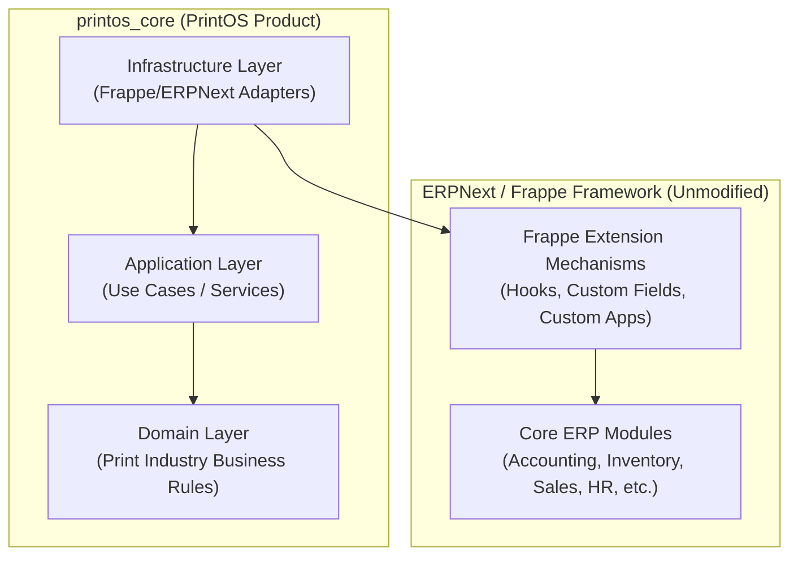
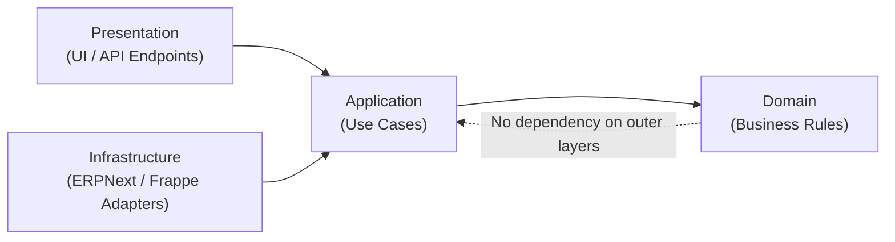

# System Architecture

Version:
1.0

Status:
Draft

Owner:
PrintHub Architecture Team

Last Updated:
2026-07-18

---

# Purpose

This document describes the overall system architecture of PrintOS: how it relates to ERPNext, how responsibilities are layered, and the architectural principles that govern all future development.

---

# Scope

This document covers the high-level architecture, the ERPNext/PrintOS boundary, Domain-Driven Design (DDD) layering, Clean Architecture principles as applied here, and future architectural directions (microservices, MachineIQ).

This document does not cover specific DocType schemas or data models — reserved for a future document (see [00_Master_Index.md](00_Master_Index.md)).

---

# Background

ERPNext (Frappe Framework) provides generic ERP capabilities: accounting, inventory, sales, HR, and more. PrintOS is the commercial product built on top of it, adding print-industry-specific workflows. To preserve upgrade compatibility and long-term maintainability, ERPNext core must never be modified — all customization occurs through Frappe's supported extension mechanisms, contained within the `printos_core` application.

---

# Main Content

## Architectural Principle: Framework vs Product

| Layer | Role | Modification Policy |
|---|---|---|
| ERPNext / Frappe Framework | Generic ERP platform capabilities | Never modified |
| `printos_core` | PrintOS-specific business logic, workflows, DocTypes | All customization lives here |

## High-Level Component Diagram

## Domain-Driven Design Layers

PrintOS applies DDD terminology to organize `printos_core`:

- **Domain Layer** — Print-industry business concepts and rules (e.g., print jobs, production workflows), expressed independently of ERPNext implementation details.
- **Application Layer** — Use cases / services that orchestrate domain logic in response to business operations.
- **Infrastructure Layer** — Adapters that connect the domain and application layers to ERPNext/Frappe (DocTypes, APIs, hooks), isolating framework dependencies at the edge.

## Clean Architecture Application

Dependencies point inward: the Domain layer has no knowledge of ERPNext, Frappe, or infrastructure concerns. This ensures business concepts remain portable and testable independent of the underlying framework.

## Major Components (Phase 1)

| Component | Responsibility |
|---|---|
| ERPNext Core | Generic ERP functionality (accounting, inventory, sales, HR) |
| `printos_core` | Print-industry domain logic, workflows, and DocType extensions |
| Frappe Extension Layer | Hooks, custom fields, custom apps connecting `printos_core` to ERPNext |

## Future Microservices

As PrintHub expands into a multi-sided ecosystem (Freelancer, Supplier, Service Engineer, Marketplace phases per [03_Product_Roadmap.md](03_Product_Roadmap.md)), components that need independent scaling or deployment — such as MachineIQ analytics or marketplace matching — may be extracted into separate services communicating via well-defined APIs, rather than being embedded directly in `printos_core`.

## Future MachineIQ Integration

MachineIQ (machine intelligence/analytics) is anticipated as a future capability layered on top of operational data generated by PrintOS. It is expected to consume data via API rather than direct database access, preserving the boundary between ERPNext/PrintOS and future analytics services.

---

# Architecture Notes

The Framework-vs-Product separation is the single most important architectural constraint in PrintHub: it directly enables upgrade safety (ADR-002 in DECISIONS.md) and long-term maintainability. Clean Architecture and DDD are applied specifically to keep the Domain layer free of ERPNext dependencies, so that business rules can be reasoned about, tested, and evolved independently of the underlying framework version.

Trade-off: this layering adds indirection (adapters between domain and Frappe) compared to writing logic directly against Frappe APIs. This cost is accepted deliberately in exchange for upgrade safety and long-term modularity.

---

# Future Considerations

- Formal bounded-context mapping for DDD (reserved for a future "05" document).
- Data and integration architecture, including API contracts (reserved for a future "06" document).
- Multi-tenant SaaS architecture as the platform moves beyond single-shop deployments.

---

# Open Questions

- At what point (data volume, team size, deployment needs) should a component be extracted from `printos_core` into a standalone microservice?
- What API contract standard will govern communication between future microservices and PrintOS core?

---

# Related Documents

- [00_Master_Index.md](00_Master_Index.md)
- [02_Business_Requirements.md](02_Business_Requirements.md)
- [03_Product_Roadmap.md](03_Product_Roadmap.md)
- [07_Technology_Stack.md](07_Technology_Stack.md)

---

# Revision History

| Version | Date | Author | Changes |
|----------|------|--------|---------|
|1.0|2026-07-18|Initial|Initial Version|

---

# Documentation Quality Checklist

- [ ] Technically accurate
- [ ] Business terminology verified
- [ ] Cross-references updated
- [ ] Mermaid diagrams validated
- [ ] No implementation code included
- [ ] Future roadmap considered
- [ ] Reviewed by Project Owner
