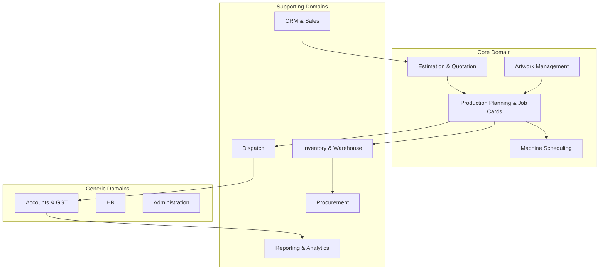
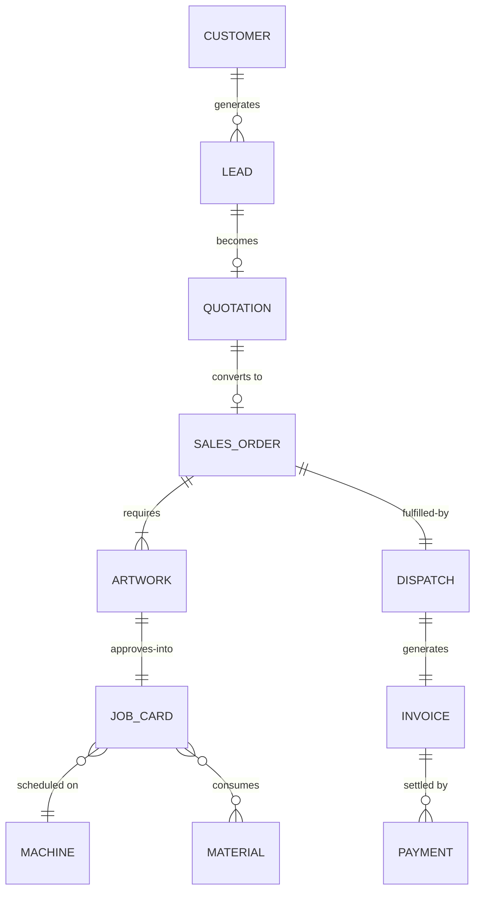

# Domain Model

Version:
1.0

Status:
Draft

Owner:
PrintHub Architecture Team

Last Updated:
2026-07-18

---

# Purpose

This document defines the business language of PrintOS using Domain-Driven Design (DDD). It establishes the domains, core business entities, their relationships, and the shared vocabulary that all future documentation, discussion, and design must use consistently.

---

# Scope

This document covers domain classification (Core, Supporting, Generic), business entities and their relationships at a conceptual level, business rules, and terminology.

This document does not cover ERPNext DocTypes, database schemas, field-level data design, or API contracts. Those are implementation concerns explicitly excluded from the Blueprint's business architecture layer.

---

# Background

PrintOS serves print shops (G2) operating across printing, digital printing, signage, packaging, gifting, LED displays, and visual communication. These businesses share a common operational pattern — a customer requests a printed or fabricated product, the shop estimates and produces it, and the shop delivers and collects payment — but each sub-industry has its own vocabulary and nuances (substrates, media, finishing types, machine profiles). A shared domain model lets PrintOS express this pattern once while remaining precise about industry vocabulary.

---

# Main Content

## Domain-Driven Design Overview

DDD classifies domains by their strategic importance to the business:

- **Core Domain** — the part of the business that differentiates PrintOS and delivers competitive advantage. Deserves the most design investment.
- **Supporting Domain** — necessary for the business to function but not differentiating; supports the Core Domain.
- **Generic Domain** — common to virtually any business (accounting, HR); best served by proven, off-the-shelf capability rather than custom design.

## Domain Classification

| Domain | Classification | Rationale |
|---|---|---|
| Estimation & Quotation | Core | Industry-specific pricing logic (substrates, finishing, machine time) is PrintOS's key differentiator |
| Production Planning & Job Cards | Core | Print-industry job/machine scheduling is central to the product's value |
| Artwork Management | Core | Approval and proofing workflows are specific to print production |
| Machine Scheduling | Core | Machine/substrate/media matching is unique to this industry |
| CRM & Sales | Supporting | Important but not differentiating; similar across industries |
| Inventory & Warehouse | Supporting | Print-specific (substrates, media) but built on generic inventory concepts |
| Procurement | Supporting | Supports production but not itself differentiating |
| Dispatch | Supporting | Logistics execution supporting the core production flow |
| Accounts & GST | Generic | Standard financial/statutory concerns handled by ERPNext |
| HR | Generic | Standard employee management handled by ERPNext |
| Administration | Generic | System configuration, common to any ERP |
| Reporting & Analytics | Supporting | Cross-cutting; becomes more differentiating as MachineIQ matures |
| MachineIQ | Core (Future) | Machine intelligence over production data is a future differentiator |
| Marketplace | Core (Future) | Future public-facing differentiation once launched |

## Domain Map

## Core Business Entities

| Entity | Description |
|---|---|
| Customer | A business or individual that requests print/production work; exists as an ERP customer record in Phase 1 |
| Lead / Enquiry | An unqualified or in-progress request for business, prior to becoming a confirmed order |
| Quotation | A priced proposal for a defined scope of print/production work |
| Sales Order | A confirmed commitment to produce and deliver work for a customer |
| Artwork | The design/creative asset submitted or approved for production |
| Job Card | The production instruction and tracking record for a unit of work |
| Machine | A production asset (press, cutter, laminator, etc.) capable of executing job operations |
| Material / Substrate | The physical input (paper, vinyl, board, etc.) consumed in production |
| Warehouse | A location where materials or finished goods are stored |
| Purchase Order | A commitment to acquire materials or services from a supplier |
| Dispatch | The act and record of delivering finished goods to a customer |
| Invoice | The billing record for delivered work |
| Payment | A record of funds received against an invoice |

## Entity Relationships (Business View)

Note: This diagram expresses business relationships only. It is not a database entity-relationship design and must not be used as a schema.

## Business Rules

- A Sales Order cannot be created without a Quotation approved by the customer, except where a business rule explicitly permits direct order entry (e.g., repeat/reorder customers).
- A Job Card cannot begin production without approved Artwork.
- Material consumption on a Job Card must be traceable back to the Sales Order it fulfills.
- A Dispatch cannot be recorded until all Job Cards for a Sales Order are marked complete, unless partial dispatch is explicitly permitted by business policy.
- An Invoice is generated only after Dispatch, except where advance billing is a defined business rule.

## Domain Terminology / Industry Vocabulary

| Term | Meaning |
|---|---|
| Substrate | The physical material printed or fabricated upon (paper, vinyl, acrylic, fabric, etc.) |
| Media | Consumable print material, often used interchangeably with substrate in digital printing contexts |
| Finishing | Post-print processes such as lamination, cutting, binding, or mounting |
| Job Card | The production record tracking a specific unit of work through the shop floor |
| Proof | A representation of artwork provided to the customer for approval before production |
| Machine Profile | The defined capabilities and constraints of a specific production machine |
| GST | Goods and Services Tax — the statutory tax regime applicable in the target market |

## Responsibilities of Each Entity

| Entity | Responsibility |
|---|---|
| Customer | Represents the party requesting and paying for work |
| Quotation | Captures priced scope prior to commitment |
| Sales Order | Represents the confirmed commercial commitment driving production |
| Artwork | Represents the approved creative/design basis for production |
| Job Card | Tracks execution of production work against a Sales Order |
| Machine | Represents production capacity and capability constraints |
| Material | Represents consumable input tracked for cost and availability |
| Dispatch | Represents fulfillment of the Sales Order to the customer |
| Invoice / Payment | Represents the financial settlement of delivered work |

---

# Architecture Notes

Classifying domains as Core, Supporting, or Generic directly informs where PrintOS should invest custom design effort (within `printos_core`) versus where it should simply rely on ERPNext's existing generic capability (Accounts, HR, Administration). This keeps development effort focused on what differentiates PrintOS, consistent with the value proposition in [01_Project_Vision.md](01_Project_Vision.md).

---

# Future Considerations

- MachineIQ and Marketplace are currently classified as future Core Domains; their entities and relationships will need to be modeled in a future revision once those phases are scoped.
- As Freelancer (G3), Supplier (G4), and Service Engineer (G5) user groups are introduced, this domain model will need corresponding entities (e.g., Freelancer Assignment, Service Request).

---

# Open Questions

- Should Reporting & Analytics be reclassified as Core once MachineIQ matures, given its increasing strategic importance?
- Where does "Complaint / Service Request" belong domain-wise — Supporting today, or Core once Service Engineers (G5) are introduced?

---

# Related Documents

- [00_Master_Index.md](00_Master_Index.md)
- [06_Bounded_Contexts.md](06_Bounded_Contexts.md)
- [08_Master_Data_Model.md](08_Master_Data_Model.md)
- [09_PrintOS_Modules.md](09_PrintOS_Modules.md)
- [04_System_Architecture.md](04_System_Architecture.md)

---

# Revision History

| Version | Date | Author | Changes |
|----------|------|--------|---------|
|1.0|2026-07-18|Initial|Initial Version|

---

# Documentation Quality Checklist

- [ ] Technically accurate
- [ ] Business terminology verified
- [ ] Cross-references updated
- [ ] Mermaid diagrams validated
- [ ] No implementation code included
- [ ] Future roadmap considered
- [ ] Reviewed by Project Owner
