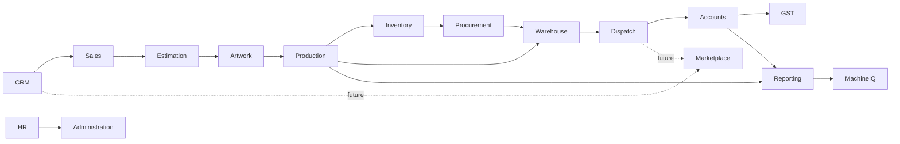

# Bounded Contexts

Version:
1.2

Status:
Draft

Owner:
PrintHub Architecture Team

Last Updated:
2026-07-25

---

# Purpose

This document divides PrintOS into bounded contexts — self-contained areas of the business, each with its own vocabulary, responsibilities, and owned business objects — so that the system can be designed and evolved modularly without ambiguity about where a given concept belongs.

---

# Scope

This document covers the definition, responsibilities, ownership, and interactions of each bounded context in PrintOS, plus a context map showing how they relate.

This document does not cover module-level feature detail (see [09_PrintOS_Modules.md](09_PrintOS_Modules.md)) or step-by-step workflows (see [10_Business_Workflows.md](10_Business_Workflows.md)).

---

# Background

A bounded context, in Domain-Driven Design, is a boundary within which a particular business model and its terminology apply consistently. Print shop operations span many distinct concerns — sales, artwork, production, inventory, finance — each with its own rules and language. Defining explicit bounded contexts prevents ambiguity (e.g., "Order" meaning different things in Sales versus Dispatch) and gives future implementation a clear map for modular design within `printos_core`.

---

# Main Content

## Context Map

## Context Definitions

### CRM

- **Purpose:** Manage relationships and communication with prospective and existing customers.
- **Responsibilities:** Lead capture, enquiry tracking, customer communication history.
- **Owned Business Objects:** Lead, Enquiry, Customer Contact.
- **Inputs:** Customer/prospect contact, marketing or referral leads.
- **Outputs:** Qualified leads handed to Sales.
- **Interactions:** Feeds Sales; future interaction with Marketplace for buyer-originated leads.
- **Future Expansion:** Integration with Marketplace-originated leads (Phase 5).

### Sales

- **Purpose:** Manage the commercial relationship from qualified lead through confirmed order.
- **Responsibilities:** Sales Order creation and tracking, customer commitment management.
- **Owned Business Objects:** Sales Order.
- **Inputs:** Qualified leads (CRM), approved Quotations (Estimation).
- **Outputs:** Confirmed Sales Orders to Production.
- **Interactions:** Consumes CRM output and Estimation output; feeds Production and Accounts (billing basis).
- **Future Expansion:** Freelancer-sourced sales (Phase 2), Supplier-linked orders (Phase 3).

### Estimation

- **Purpose:** Produce accurate, industry-specific pricing for requested work.
- **Responsibilities:** Cost estimation based on substrate, finishing, machine time, and quantity; Quotation generation.
- **Owned Business Objects:** Quotation, Cost Estimate.
- **Inputs:** Enquiry details, master data (materials, machine rates, finishing costs).
- **Outputs:** Quotation to Sales.
- **Interactions:** Reads Master Data context; feeds Sales.
- **Future Expansion:** Automated/AI-assisted estimation via MachineIQ.

### Artwork

- **Purpose:** Manage creative assets and customer approval prior to production.
- **Responsibilities:** Artwork intake, proofing, revision tracking, approval capture.
- **Owned Business Objects:** Artwork, Proof, Approval Record.
- **Inputs:** Sales Order, customer-submitted design files.
- **Outputs:** Approved Artwork to Production.
- **Interactions:** Gate before Production may begin.
- **Future Expansion:** Freelancer-sourced design work (Phase 2).

### Production

- **Purpose:** Execute and track the physical work required to fulfill a Sales Order.
- **Responsibilities:** Job Card management, production status tracking, quality checkpoints.
- **Owned Business Objects:** Job Card, Production Status, Quality Check Record.
- **Inputs:** Approved Artwork, allocated Materials, Machine Schedule.
- **Outputs:** Finished goods to Warehouse/Dispatch.
- **Interactions:** Central context; interacts with Artwork, Inventory, Machine Scheduling (within Production), Warehouse, Reporting.
- **Future Expansion:** MachineIQ-driven production optimization.

### Inventory

- **Purpose:** Track availability and consumption of materials used in production.
- **Responsibilities:** Stock level tracking, material allocation to Job Cards.
- **Owned Business Objects:** Material Stock, Allocation Record.
- **Inputs:** Procurement receipts, Production consumption.
- **Outputs:** Material availability to Production; replenishment triggers to Procurement.
- **Interactions:** Bridges Procurement and Production.
- **Future Expansion:** Supplier-integrated real-time stock visibility (Phase 3).

### Procurement

- **Purpose:** Acquire materials and services needed to support production.
- **Responsibilities:** Purchase Order creation, supplier communication, receipt tracking.
- **Owned Business Objects:** Purchase Order, Supplier Record (usage).
- **Inputs:** Replenishment triggers from Inventory.
- **Outputs:** Received materials to Warehouse/Inventory.
- **Interactions:** Consumes Inventory signals; feeds Warehouse.
- **Future Expansion:** Supplier Portal self-service ordering (Phase 3).

### Warehouse

- **Purpose:** Manage physical storage and movement of materials and finished goods.
- **Responsibilities:** Stock location management, goods receipt, goods issue.
- **Owned Business Objects:** Warehouse Location, Stock Movement.
- **Inputs:** Procurement receipts, Production output.
- **Outputs:** Materials to Production; finished goods to Dispatch.
- **Interactions:** Supports both Inventory and Production and Dispatch.
- **Future Expansion:** Multi-warehouse / multi-branch support.

### Dispatch

- **Purpose:** Deliver finished goods to customers.
- **Responsibilities:** Delivery scheduling, dispatch documentation, delivery confirmation.
- **Owned Business Objects:** Dispatch Record, Delivery Note (business concept).
- **Inputs:** Finished goods from Warehouse/Production.
- **Outputs:** Delivery confirmation to Accounts (billing trigger).
- **Interactions:** Bridges Production/Warehouse and Accounts.
- **Future Expansion:** Marketplace-originated delivery coordination (Phase 5).

### Accounts

- **Purpose:** Manage the financial record of business transactions.
- **Responsibilities:** Invoicing, payment tracking, financial reporting basis.
- **Owned Business Objects:** Invoice, Payment Record.
- **Inputs:** Dispatch confirmation, Purchase Orders (payables).
- **Outputs:** Financial data to Reporting; statutory data to GST.
- **Interactions:** Generic Domain, largely handled by ERPNext core capability.
- **Future Expansion:** Multi-currency support for cross-border transactions.

### GST

- **Purpose:** Ensure statutory tax compliance for all applicable transactions.
- **Responsibilities:** Tax computation, tax record-keeping for filing.
- **Owned Business Objects:** GST Configuration (usage), Tax Record.
- **Inputs:** Invoice and Purchase data from Accounts.
- **Outputs:** Statutory-compliant tax records.
- **Interactions:** Tightly coupled to Accounts; relies on ERPNext's generic tax capability.
- **Future Expansion:** Multi-jurisdiction tax support if PrintHub expands beyond its current market.

### HR

- **Purpose:** Manage employee records relevant to shop operations.
- **Responsibilities:** Employee records, department/role structure.
- **Owned Business Objects:** Employee, Department.
- **Inputs:** Organizational structure decisions.
- **Outputs:** Employee identity/role data used by Production (operator assignment) and Administration.
- **Interactions:** Generic Domain; supports Production's operator assignment needs.
- **Future Expansion:** Service Engineer role management (Phase 4).

### Administration

- **Purpose:** Configure and govern the overall PrintOS instance.
- **Responsibilities:** Company/branch setup, system-wide configuration, user/role administration.
- **Owned Business Objects:** Company, Branch, Role Configuration.
- **Inputs:** Business setup decisions.
- **Outputs:** Configuration consumed by all other contexts.
- **Interactions:** Cross-cutting; underpins every other context.
- **Future Expansion:** Multi-tenant SaaS administration.

### Reporting

- **Purpose:** Provide visibility into business performance across contexts.
- **Responsibilities:** Cross-context data aggregation, dashboard visibility, business performance reporting, and report/dashboard consumption and execution from Published definitions.
- **Owned Business Objects:** None. Reporting owns the cross-context reporting *capability*, not a configuration artifact — Report Definition and Dashboard Definition are configuration artifacts owned by the Configuration Studio context (see [docs/configuration/Configuration_Studio_Architecture.md](../configuration/Configuration_Studio_Architecture.md)) and are produced by its Report Designer and Dashboard Designer. Reporting consumes Published instances of them; it does not independently own or duplicate them.
- **Inputs:** Data from Production, Accounts, Inventory, and other contexts; Published Report Definitions and Dashboard Definitions from Configuration Studio.
- **Outputs:** Insights to business stakeholders; data to MachineIQ.
- **Interactions:** Consumes from most other contexts, including Configuration Studio.
- **Future Expansion:** Predictive analytics via MachineIQ.

### MachineIQ (Future)

- **Purpose:** Apply machine intelligence to production and business data for optimization and insight.
- **Responsibilities:** Pattern analysis, predictive recommendations (future).
- **Owned Business Objects:** Model Output / Insight (future).
- **Inputs:** Reporting and Production data.
- **Outputs:** Recommendations/insights to Production and Reporting.
- **Interactions:** Future consumer of Reporting and Production data.
- **Future Expansion:** Core differentiator once launched; full scope to be defined in a future Blueprint document.

### Marketplace (Future)

- **Purpose:** Connect public buyers (G1) directly with print shops as active platform participants.
- **Responsibilities:** Buyer-facing discovery, order placement (future).
- **Owned Business Objects:** Marketplace Listing, Marketplace Order (future).
- **Inputs:** Print shop capacity/catalog data (future).
- **Outputs:** Orders routed into CRM/Sales.
- **Interactions:** Future entry point feeding CRM and Sales.
- **Future Expansion:** Full scope defined at Phase 5 planning.

---

# Architecture Notes

Each bounded context is intended to map to a cohesive, loosely-coupled module within `printos_core`, consistent with the Modular Design principle in CLAUDE.md and PROJECT_RULES.md (Rule 9). Contexts communicate through well-defined inputs/outputs rather than sharing internal state, which preserves the option to later extract a context into an independent service (see Future Microservices in [04_System_Architecture.md](04_System_Architecture.md)).

---

# Future Considerations

- MachineIQ and Marketplace contexts are placeholders; their responsibilities and object ownership will be refined when those phases are formally scoped.
- As Freelancer, Supplier, and Service Engineer portals are introduced, new contexts (or extensions to Procurement, Production, and HR) will be required.

---

# Open Questions

- Should Machine Scheduling be modeled as its own bounded context distinct from Production, given its complexity?
- Should GST be folded into Accounts as a single context, given how tightly coupled they are?

---

# Related Documents

- [00_Master_Index.md](00_Master_Index.md)
- [05_Domain_Model.md](05_Domain_Model.md)
- [09_PrintOS_Modules.md](09_PrintOS_Modules.md)
- [10_Business_Workflows.md](10_Business_Workflows.md)

---

# Revision History

| Version | Date | Author | Changes |
|----------|------|--------|---------|
|1.0|2026-07-18|Initial|Initial Version|
|1.1|2026-07-22|ADR Synchronization|Corrected "### Estimations" section header to "### Estimation" (singular), per [ADR-012-Estimating-Terminology.md](../decisions/ADR-012-Estimating-Terminology.md), resolving an inconsistency between this document's own header (plural) and its prose/diagram (singular). No other content changed.|
|1.2|2026-07-25|Documentation Clarification|Clarified Reporting and Configuration Studio ownership language for reports and dashboards. Reporting owns reporting capability and consumption; Configuration Studio owns Report Definition and Dashboard Definition configuration artifacts. Documentation clarification only; no architecture change.|

---

# Documentation Quality Checklist

- [ ] Technically accurate
- [ ] Business terminology verified
- [ ] Cross-references updated
- [ ] Mermaid diagrams validated
- [ ] No implementation code included
- [ ] Future roadmap considered
- [ ] Reviewed by Project Owner
