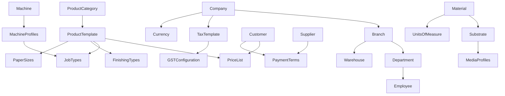

# Master Data Model

Version:
1.0

Status:
Draft

Owner:
PrintHub Architecture Team

Last Updated:
2026-07-18

---

# Purpose

This document describes, at a business level, the master data entities that underpin PrintOS operations — what they represent, who owns them, and how they relate to one another. It ensures consistent understanding of shared reference data across all bounded contexts.

---

# Scope

This document covers the business meaning, ownership, and relationships of master data entities used across PrintOS.

This document does not define database fields, ERPNext DocType structures, or data types. Field-level design is deferred to implementation and is intentionally excluded from the Blueprint's business architecture layer.

---

# Background

Master data is reference information shared and reused across transactions — a Customer record is reused across every Sales Order it appears on; a Machine Profile is reused across every Job Card scheduled on that machine. Consistent, well-owned master data is foundational to accurate estimation, scheduling, and reporting across all bounded contexts described in [06_Bounded_Contexts.md](06_Bounded_Contexts.md).

---

# Main Content

## Master Data Entities

| Entity | Business Purpose | Primary Owning Context |
|---|---|---|
| Company | Represents the legal business entity operating PrintOS | Administration |
| Branch | Represents a physical operating location of the Company | Administration |
| Department | Represents an organizational unit within a Branch | HR |
| Employee | Represents a person working within the business | HR |
| Customer | Represents a party that purchases print/production work | CRM / Sales |
| Supplier | Represents a party that supplies materials or services | Procurement |
| Product Template | Represents a sellable product definition (e.g., "Business Card," "Banner") | Sales / Estimation |
| Product Category | Groups related Product Templates for organization and reporting | Sales / Estimation |
| Material | Represents a raw input consumed in production | Inventory |
| Substrate | Represents the specific physical material printed/fabricated upon | Inventory / Production |
| Machine | Represents a production asset used to execute work | Production |
| Warehouse | Represents a physical storage location | Warehouse |
| Tax Template | Represents a defined tax computation rule set | Accounts / GST |
| Price List | Represents a defined set of prices applicable to a customer segment or channel | Sales / Estimation |
| Payment Terms | Represents agreed timing/conditions for customer or supplier payment | Accounts |
| Delivery Method | Represents an available method of delivering finished goods | Dispatch |
| GST Configuration | Represents statutory tax configuration applicable to the business | GST |
| Currency | Represents a unit of monetary value used in transactions | Accounts |
| Units of Measure | Represents standard measurement units used across materials and products | Inventory / Estimation |
| Job Types | Represents categories of production work (e.g., offset print, digital print, signage fabrication) | Production |
| Finishing Types | Represents post-production processes (e.g., lamination, cutting, binding) | Production / Estimation |
| Paper Sizes | Represents standard or custom sheet/format sizes | Estimation / Production |
| Media Profiles | Represents characteristics of a printable media (e.g., vinyl, canvas, board) | Estimation / Production |
| Machine Profiles | Represents the capabilities and constraints of a specific Machine | Production |

## Master Data Relationship Map

## Relationships Between Master Data (Narrative)

- A **Company** operates one or more **Branches**; each Branch has its own **Departments**, **Employees**, and **Warehouses**.
- A **Product Template** belongs to a **Product Category** and references applicable **Job Types**, **Finishing Types**, and **Paper Sizes** — this combination is what Estimation uses to price work.
- A **Material** is a general input; a **Substrate** is the specific physical material used in a print/production context, described further by **Media Profiles**.
- A **Machine** is described by its **Machine Profile**, which determines which **Job Types** it can perform.
- A **Customer** is associated with a **Price List** (determining applicable pricing) and **Payment Terms** (determining billing conditions); the same structure applies to **Suppliers** for procurement.
- **Tax Template** and **GST Configuration** together determine statutory tax treatment for transactions at the Company level.
- **Units of Measure** standardize how **Materials** are quantified across Inventory, Procurement, and Estimation.

## Master Data Ownership and Usage

| Entity | Created/Owned By | Consumed By |
|---|---|---|
| Company, Branch | Administration | All contexts |
| Employee, Department | HR | Production (operator assignment), Administration |
| Customer | CRM/Sales | Sales, Accounts, Dispatch |
| Supplier | Procurement | Procurement, Warehouse, Accounts |
| Product Template, Product Category | Sales/Estimation | Estimation, Sales, Reporting |
| Material, Substrate, Media Profiles | Inventory | Estimation, Production, Procurement |
| Machine, Machine Profiles | Production | Production, Estimation, Reporting |
| Warehouse | Warehouse | Inventory, Procurement, Dispatch |
| Tax Template, GST Configuration | Accounts/GST | Accounts, Sales, Procurement |
| Price List, Payment Terms | Accounts/Sales | Sales, Estimation, Procurement |
| Delivery Method | Dispatch | Dispatch, Sales |
| Currency, Units of Measure | Administration | All transactional contexts |
| Job Types, Finishing Types, Paper Sizes | Production/Estimation | Estimation, Production |

---

# Architecture Notes

Master data is deliberately owned by the bounded context most responsible for its accuracy (e.g., Machine Profiles owned by Production, not Administration), even though it is consumed broadly. This follows the DDD principle that each concept has a single authoritative source, avoiding duplicated or conflicting definitions across `printos_core` modules.

---

# Future Considerations

- As Supplier (G4) and Freelancer (G3) portals are introduced, Supplier and a new Freelancer master data entity will require self-service maintenance workflows.
- Multi-branch and eventual multi-tenant SaaS operation will increase the importance of clear Company/Branch-level data scoping.

---

# Open Questions

- Should Substrate be modeled as a specialization of Material, or as an independent entity referencing Material?
- How will Machine Profiles be kept in sync as physical equipment is added, retired, or reconfigured?

---

# Related Documents

- [00_Master_Index.md](00_Master_Index.md)
- [05_Domain_Model.md](05_Domain_Model.md)
- [06_Bounded_Contexts.md](06_Bounded_Contexts.md)
- [09_PrintOS_Modules.md](09_PrintOS_Modules.md)

---

# Revision History

| Version | Date | Author | Changes |
|----------|------|--------|---------|
|1.0|2026-07-18|Initial|Initial Version|

---

# Documentation Quality Checklist

- [ ] Technically accurate
- [ ] Business terminology verified
- [ ] Cross-references updated
- [ ] Mermaid diagrams validated
- [ ] No implementation code included
- [ ] Future roadmap considered
- [ ] Reviewed by Project Owner
