# Business Workflows

Version:
1.0

Status:
Draft

Owner:
PrintHub Architecture Team

Last Updated:
2026-07-18

---

# Purpose

This document describes the major end-to-end business workflows that PrintOS must support, showing how bounded contexts and modules interact in practice over the lifecycle of a customer engagement.

---

# Scope

This document covers business-level workflow description: actors, triggers, inputs, outputs, business rules, exceptions, and future enhancements, illustrated with Mermaid flowcharts.

This document does not cover system/API sequence diagrams, UI screens, or implementation logic.

---

# Background

The modules described in [09_PrintOS_Modules.md](09_PrintOS_Modules.md) only deliver business value when they operate together as workflows. This document traces the primary workflows a Phase 1 print shop (G2) executes, from first customer contact through payment collection, plus supporting and future workflows.

---

# Main Content

## Lead to Customer

- **Purpose:** Convert a prospective contact into a recognized customer.
- **Actors:** Sales staff, Prospect.
- **Trigger:** Inbound enquiry or outbound prospecting.
- **Inputs:** Contact details, expressed interest.
- **Outputs:** Qualified Lead / new Customer record.
- **Business Rules:** A Lead must be qualified before a Quotation can be issued against it.
- **Exceptions:** Duplicate contact detected; unqualified lead abandoned.
- **Future Enhancements:** Marketplace-originated leads (Phase 5).

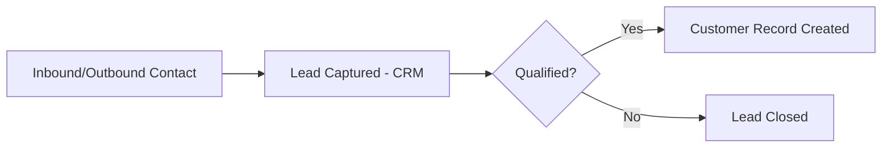

## Quotation to Sales Order

- **Purpose:** Convert priced proposal into confirmed commitment.
- **Actors:** Estimator, Sales staff, Customer.
- **Trigger:** Qualified Lead or existing Customer request.
- **Inputs:** Scope of work, master data (materials, machine rates).
- **Outputs:** Confirmed Sales Order.
- **Business Rules:** Sales Order requires an approved Quotation, except defined reorder scenarios.
- **Exceptions:** Customer requests revision; Quotation expires unapproved.
- **Future Enhancements:** MachineIQ-assisted estimation.

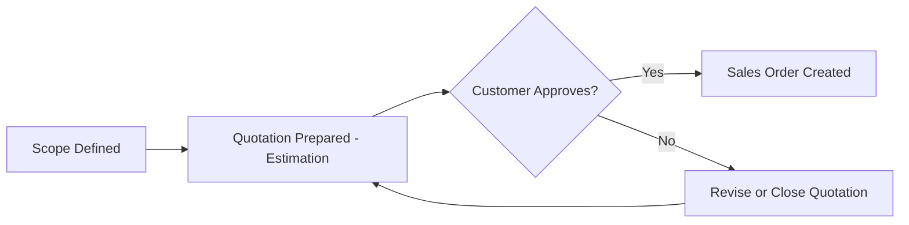

## Artwork Approval

- **Purpose:** Secure customer sign-off on design before production.
- **Actors:** Design staff, Customer.
- **Trigger:** Confirmed Sales Order requiring artwork.
- **Inputs:** Design files or briefs.
- **Outputs:** Approved Artwork.
- **Business Rules:** Production cannot begin without Approved Artwork.
- **Exceptions:** Repeated revision cycles; customer non-response.
- **Future Enhancements:** Freelancer-submitted artwork (Phase 2).

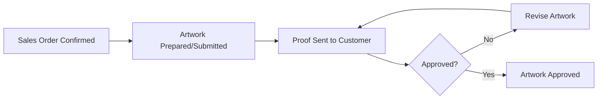

## Production Planning

- **Purpose:** Sequence and schedule confirmed work across available capacity.
- **Actors:** Production management.
- **Trigger:** Approved Artwork and confirmed Sales Order.
- **Inputs:** Job requirements, machine availability.
- **Outputs:** Scheduled Job Cards.
- **Business Rules:** Scheduling must respect Machine Profile capability constraints.
- **Exceptions:** Capacity conflict requiring re-prioritization.
- **Future Enhancements:** MachineIQ-optimized scheduling.

## Job Card Lifecycle

- **Purpose:** Track a unit of production work from creation to completion.
- **Actors:** Production operators, Production management.
- **Trigger:** Production Plan issues a Job Card.
- **Inputs:** Materials, Machine assignment, work instructions.
- **Outputs:** Finished goods, updated Job Card status.
- **Business Rules:** Status transitions must follow defined sequence (e.g., Scheduled → In Progress → Quality Check → Complete).
- **Exceptions:** Rework required after quality check failure.
- **Future Enhancements:** Real-time shop-floor status capture.

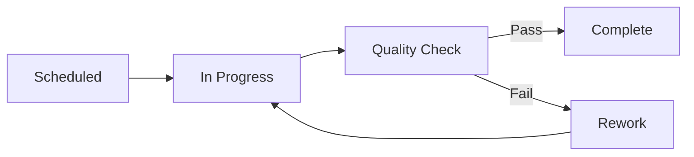

## Machine Assignment

- **Purpose:** Assign a Job Card to a specific capable machine.
- **Actors:** Production management.
- **Trigger:** Job Card scheduled.
- **Inputs:** Job Card requirements, Machine Profiles, Machine availability.
- **Outputs:** Machine-assigned Job Card.
- **Business Rules:** Only machines whose Profile supports the required Job Type may be assigned.
- **Exceptions:** No capable machine available — job delayed or outsourced.
- **Future Enhancements:** Predictive maintenance-aware assignment via MachineIQ.

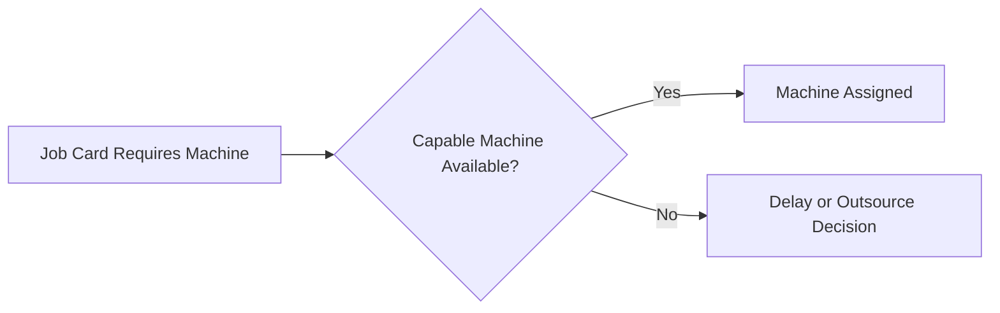

## Material Allocation

- **Purpose:** Reserve and consume materials required for a Job Card.
- **Actors:** Inventory staff, Production operators.
- **Trigger:** Job Card scheduled or started.
- **Inputs:** Bill of materials for the job, current stock levels.
- **Outputs:** Allocated/consumed material, updated stock levels.
- **Business Rules:** Material cannot be consumed beyond allocated quantity without approved variance.
- **Exceptions:** Insufficient stock triggers Procurement.
- **Future Enhancements:** Automated allocation via MachineIQ demand forecasting.

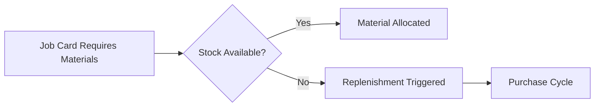

## Purchase Cycle

- **Purpose:** Acquire materials or services from suppliers.
- **Actors:** Procurement staff, Supplier.
- **Trigger:** Replenishment need from Inventory.
- **Inputs:** Required materials/quantities, supplier terms.
- **Outputs:** Received materials in Warehouse.
- **Business Rules:** Purchase Orders above a defined value require management approval.
- **Exceptions:** Supplier delay or short shipment.
- **Future Enhancements:** Supplier Portal self-service (Phase 3).

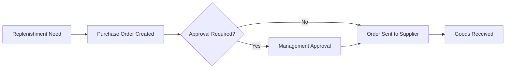

## Inventory Replenishment

- **Purpose:** Maintain sufficient material stock to support production.
- **Actors:** Inventory staff.
- **Trigger:** Stock level falls below defined threshold.
- **Inputs:** Current stock level, reorder threshold.
- **Outputs:** Replenishment request to Procurement.
- **Business Rules:** Reorder thresholds are defined per Material.
- **Exceptions:** Urgent/unplanned shortage requiring expedited purchase.
- **Future Enhancements:** Predictive replenishment via MachineIQ.

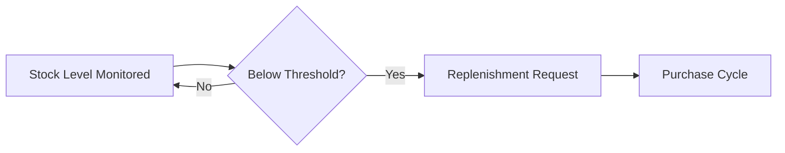

## Production Workflow (End-to-End)

- **Purpose:** Show the overall production flow from confirmed order to finished goods.
- **Actors:** Production management, Production operators.
- **Trigger:** Approved Artwork.
- **Inputs:** Job Card, Material Allocation, Machine Assignment.
- **Outputs:** Finished goods ready for Dispatch.
- **Business Rules:** All prerequisite steps (artwork approval, material allocation, machine assignment) must be satisfied before production start.
- **Exceptions:** Any prerequisite failure halts production start.
- **Future Enhancements:** MachineIQ production optimization.

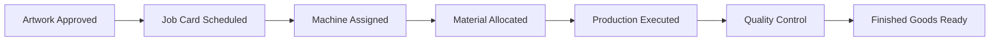

## Quality Control

- **Purpose:** Verify finished work meets required standards before dispatch.
- **Actors:** Quality checker, Production operators.
- **Trigger:** Job Card production step completed.
- **Inputs:** Produced goods, quality criteria.
- **Outputs:** Pass/fail determination.
- **Business Rules:** Failed quality checks require rework or scrap disposition before proceeding.
- **Exceptions:** Repeated failure escalates to Production management.
- **Future Enhancements:** Automated quality inspection (future technology).

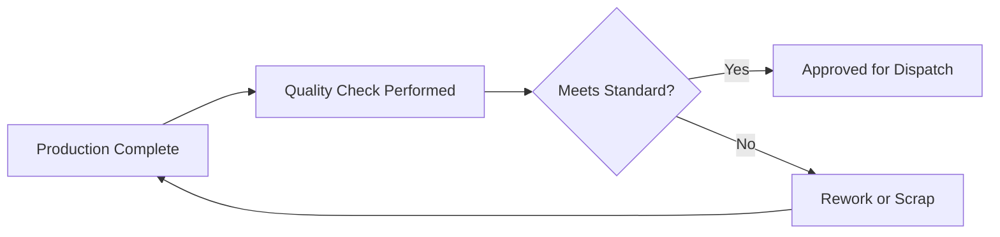

## Dispatch Workflow

- **Purpose:** Deliver finished goods to the customer.
- **Actors:** Dispatch staff, Customer.
- **Trigger:** Finished goods approved for dispatch.
- **Inputs:** Finished goods, delivery method, customer address.
- **Outputs:** Delivered goods, delivery confirmation.
- **Business Rules:** Dispatch requires all Job Cards for the Sales Order complete, unless partial dispatch is permitted.
- **Exceptions:** Delivery failure/return.
- **Future Enhancements:** Marketplace-coordinated delivery.

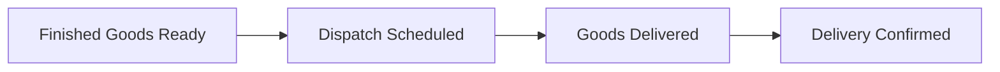

## Invoice Workflow

- **Purpose:** Bill the customer for delivered work.
- **Actors:** Accounts staff.
- **Trigger:** Delivery confirmation (or advance billing rule).
- **Inputs:** Sales Order, Dispatch confirmation, applicable Tax Template.
- **Outputs:** Issued Invoice.
- **Business Rules:** Invoice values must reconcile with the confirmed Sales Order and applicable Price List.
- **Exceptions:** Billing dispute raised by customer.
- **Future Enhancements:** Multi-currency invoicing.

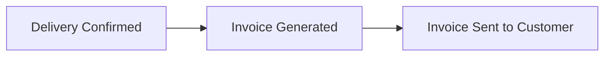

## Payment Collection

- **Purpose:** Collect and record payment against an Invoice.
- **Actors:** Accounts staff, Customer.
- **Trigger:** Issued Invoice.
- **Inputs:** Invoice, Payment Terms, received payment.
- **Outputs:** Recorded Payment, updated receivables.
- **Business Rules:** Payment must be applied against the correct Invoice; partial payments update outstanding balance.
- **Exceptions:** Overdue payment triggers follow-up per Payment Terms.
- **Future Enhancements:** Automated payment reminders.

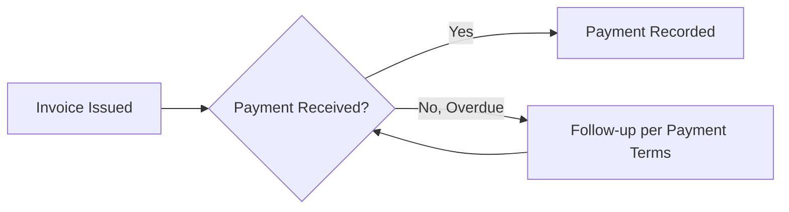

## Customer Reorder

- **Purpose:** Streamline repeat business from an existing customer.
- **Actors:** Sales staff, Customer.
- **Trigger:** Customer requests repeat of a prior order.
- **Inputs:** Prior Sales Order reference.
- **Outputs:** New Sales Order, potentially bypassing a fresh Quotation.
- **Business Rules:** Reorder pricing may reference the prior Price List, subject to validity rules.
- **Exceptions:** Specification changes require re-quotation.
- **Future Enhancements:** Self-service reorder (future customer-facing capability).

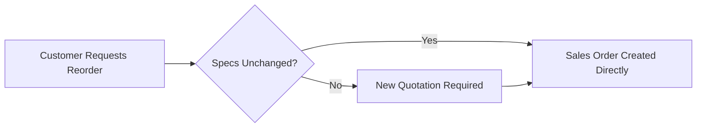

## Complaint Handling

- **Purpose:** Capture and resolve customer dissatisfaction with delivered work.
- **Actors:** Customer service staff, Customer.
- **Trigger:** Customer raises a complaint.
- **Inputs:** Complaint details, related Sales Order/Job Card.
- **Outputs:** Resolution (rework, refund, or closure).
- **Business Rules:** Complaints must be linked to the originating Sales Order for traceability.
- **Exceptions:** Escalation to management for unresolved complaints.
- **Future Enhancements:** Structured complaint analytics feeding Quality Control improvements.

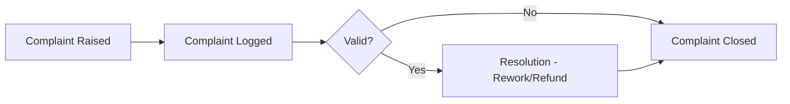

## Service Request

- **Purpose:** Capture requests for equipment service or maintenance support.
- **Actors:** Print shop staff, Service Engineer (future, G5).
- **Trigger:** Machine issue reported.
- **Inputs:** Machine identification, issue description.
- **Outputs:** Service Request record, scheduled service visit (future).
- **Business Rules:** Critical machine issues take priority over routine maintenance.
- **Exceptions:** No available Service Engineer capacity.
- **Future Enhancements:** Full Service Engineer workflow in Phase 4.

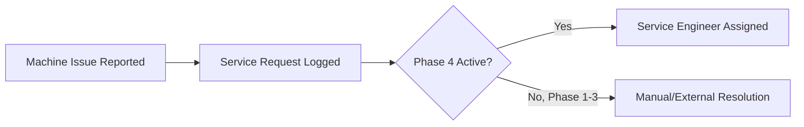

## Machine Maintenance

- **Purpose:** Maintain production equipment to minimize downtime.
- **Actors:** Production management, Service Engineer (future, G5).
- **Trigger:** Scheduled maintenance interval or reported issue.
- **Inputs:** Machine Profile, maintenance history.
- **Outputs:** Updated Machine availability status.
- **Business Rules:** Machines under maintenance must be excluded from Machine Scheduling.
- **Exceptions:** Emergency maintenance interrupting active production.
- **Future Enhancements:** Predictive maintenance via MachineIQ.

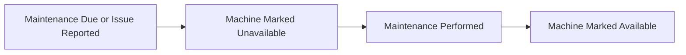

## Future Marketplace Workflow

- **Purpose:** Enable public buyers (G1) to discover and order directly from print shops.
- **Actors:** Public Buyer, Print Shop (via CRM/Sales).
- **Trigger:** Buyer browses Marketplace and places an order (future).
- **Inputs:** Print shop catalog/capacity data (future).
- **Outputs:** Order routed into CRM/Sales as a Lead or direct Sales Order.
- **Business Rules:** To be defined at Phase 5 planning.
- **Exceptions:** To be defined at Phase 5 planning.
- **Future Enhancements:** Full workflow definition is deferred to a dedicated Phase 5 Blueprint document.

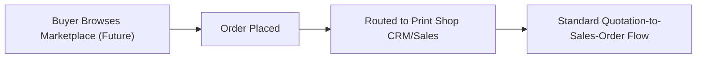

---

# Architecture Notes

These workflows are the business-level contracts that bounded contexts must honor when implemented within `printos_core`. Each workflow crosses multiple contexts (e.g., Production Workflow spans Artwork, Production, Inventory), reinforcing why clean interfaces between contexts — rather than shared internal state — are essential, per [06_Bounded_Contexts.md](06_Bounded_Contexts.md) and [04_System_Architecture.md](04_System_Architecture.md).

---

# Future Considerations

Service Request, Machine Maintenance, and Future Marketplace Workflow are described here at a preliminary level since their primary user groups (G4/G5 and G1-as-marketplace-user) are not active until later phases. Each will be expanded into a dedicated workflow specification when its phase is formally scoped.

---

# Open Questions

- What defines "critical" versus "routine" for Service Request prioritization?
- What approval thresholds apply to Purchase Cycle (values, roles)?
- Should Complaint Handling be its own bounded context rather than a workflow spanning CRM and Production?

---

# Related Documents

- [00_Master_Index.md](00_Master_Index.md)
- [06_Bounded_Contexts.md](06_Bounded_Contexts.md)
- [09_PrintOS_Modules.md](09_PrintOS_Modules.md)
- [02_Business_Requirements.md](02_Business_Requirements.md)

---

# Revision History

| Version | Date | Author | Changes |
|----------|------|--------|---------|
|1.0|2026-07-18|Initial|Initial Version|

---

# Documentation Quality Checklist

- [ ] Technically accurate
- [ ] Business terminology verified
- [ ] Cross-references updated
- [ ] Mermaid diagrams validated
- [ ] No implementation code included
- [ ] Future roadmap considered
- [ ] Reviewed by Project Owner
