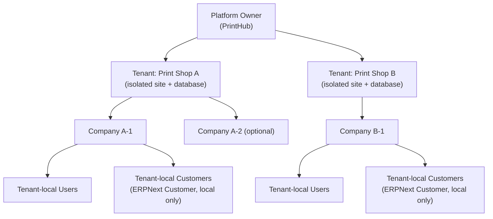

# Multi-Tenant Architecture

Version:
1.0

Status:
Approval

Owner:
PrintHub Architecture Team

Last Updated:
2026-07-28

---

# 1. Purpose

This document defines the concrete multi-tenant topology reserved by [ADR-006-MultiTenant-Strategy](../decisions/ADR-006-MultiTenant-Strategy.md) and selected through [AR-002](../decisions/Architecture_Review_Register.md) Option A, following formal Project Owner decision on 2026-07-28. It is the architecture-design elaboration of the companion [ADR-015-Tenant-Company-Multi-Tenancy-Model](../decisions/ADR-015-Tenant-Company-Multi-Tenancy-Model.md), which carries the binding decision at a concise level. This document elaborates that model; it does not redefine or contradict it.

---

# 2. Status and Authority Boundary

- This document is **Approval, Version 1.0**. Architecture Review, Business Review, and Project Owner Approval are complete (Section 26); it is a governed, Owner-approved architecture record.
- It is **not yet Published** and is **not yet a direct coding basis** — per `Documentation_Workflow.md` §5, Publication is a separate, later lifecycle stage from Approval, and only a Published document is a safe basis for code.
- **AR-002 remains Open** — reaching Approval on this document does not itself close AR-002. Closure requires the remaining repository-recording steps (Naming Registry synchronization, ADR Index registration, and formal Architecture Review Register closure), none of which is performed by this promotion.
- **No implementation authorization is granted** by this document (Section 24).

---

# 3. Scope

**In scope:**

- Tenant and Company relationship;
- site and database topology;
- isolation boundaries;
- shared-application model;
- host-sharing model;
- backup boundary;
- upgrade governance;
- service-tier principles;
- support-access principles;
- Job Card Tier A tenancy consequences.

**Out of scope:**

- central Customer identity design;
- cross-tenant analytics design;
- exact infrastructure sizing;
- exact provisioning-automation design;
- exact backup retention values;
- contractual RPO/RTO;
- pricing;
- Tenant Override implementation;
- Job Card Tier A DocType design.

---

# 4. Architecture Principles

- One Frappe **site** per Tenant.
- One operational **database** per Tenant.
- No shared operational database between unrelated print shops (Tenants).
- Tenant and Company are **distinct** concepts (Sections 6–7).
- **Shared** governed PrintHub application code across all Tenants.
- One **centrally governed** release line.
- **Automation-first** operations (Section 13).
- **Configuration-driven** service entitlements (Section 12) — no tenant-specific product forks.

---

# 5. Conceptual Tenancy Model

- **Platform Owner** — PrintHub, centrally governs code, releases, and cross-tenant operations.
- **Tenant** — a print-shop organization; one isolated site + database.
- **Company** — an ERPNext accounting/legal entity inside a Tenant; a Tenant may hold one or more Companies.
- **Tenant-local Users and Customers** — scoped entirely within their Tenant's isolated database.

No central Customer entity is depicted or implied — each Tenant's Customer records are local and independent, consistent with Section 17.

---

# 6. Tenant Boundary

The Tenant boundary spans:

- **site** — one Frappe site per Tenant;
- **database** — one isolated operational database per Tenant;
- **files** (public and private) — isolated per Tenant;
- **secrets** — isolated per Tenant;
- **configuration** — isolated per Tenant;
- **backups** — isolated per Tenant (Section 10);
- **operational controls** — provisioning, monitoring, and administrative actions scoped to one Tenant at a time;
- **support access** — access to a Tenant's systems is scoped to that Tenant and is not implicitly cross-tenant (Section 20).

---

# 7. Company Boundary

**Company** is the ERPNext legal/accounting and transaction-scoping entity **inside** a Tenant.

- Company-level permissions and scoping **supplement** site isolation — they organize records for entities that legitimately operate as separate accounting units within one print-shop Tenant.
- Company-level permissions **do not replace** site isolation — the Tenant's site/database boundary remains the actual security boundary between unrelated print shops.
- ERPNext records that require Company scoping (per ERPNext's native accounting model) remain Company-scoped within the Tenant.
- A Tenant **can** contain more than one Company (e.g., a print-shop group with multiple legal entities operating under one PrintHub subscription).

---

# 8. Shared and Isolated Components Matrix

| Category | Component | Treatment |
|---|---|---|
| Shared | Application source code | Shared across all Tenants |
| Shared | Governed custom app (`printos_core`) | Shared across all Tenants |
| Shared | Docker-image strategy | Shared across all Tenants |
| Shared | CI/CD | Shared across all Tenants |
| Shared | Release policy | Shared, centrally governed (Section 11) |
| Shared | Operational tooling | Shared platform capability |
| Shared | Monitoring platform | Shared platform, with per-Tenant data logically separated |
| Isolated | Site | One per Tenant |
| Isolated | Database | One per Tenant |
| Isolated | Files (public/private) | Per Tenant |
| Isolated | Credentials | Per Tenant |
| Isolated | Secrets | Per Tenant |
| Isolated | Configuration values | Per Tenant |
| Isolated | Backups | Per Tenant (Section 10) |
| Isolated | Tenant operational records | Per Tenant |
| Isolated | Customer transactions | Per Tenant (Section 17) |
| Conditional by service tier | Compute host | May be shared or dedicated (Section 12) |
| Conditional by service tier | Workers | May be shared or dedicated |
| Conditional by service tier | Database host | May be shared or dedicated (database itself always isolated regardless of host) |
| Conditional by service tier | Storage allocation | Entitlement varies by tier |
| Conditional by service tier | Monitoring depth | Varies by tier |
| Conditional by service tier | Backup frequency and retention | Varies by tier (Section 10) |

---

# 9. Data-Isolation Rules

- No cross-tenant operational queries occur in normal application behavior.
- No Tenant may see another Tenant's records.
- Direct platform-owner database access is **exceptional**, not routine, and is audited (Section 20).
- Tenant-local ERPNext Customer remains authoritative for that Tenant's operational transactions.
- No shared transactional Customer table is authorized (Section 17).

This document does not claim legal or regulatory compliance; isolation is stated as an architecture principle only.

---

# 10. Backup and Restore Boundary

- The Tenant site/database is the backup and restore unit.
- Backups include database, site configuration, public files, and private files.
- Backups must be **encrypted** and **access-controlled**.
- Backups must reside **outside the Tenant's primary failure boundary**.
- Restoration testing is required as an ongoing **operational** practice (mechanics deferred to Section 13/21).
- **Free tier** receives a recoverable automated backup baseline.
- **Paid tiers** may receive higher frequency, longer retention, and priority restore service.
- **Exact RPO, RTO, frequency, retention, and SLA values remain deferred** — these are planning targets for later operational and service-policy work, not commitments of this document.

---

# 11. Upgrade and Release Model

- Central platform-owner governance of ERPNext, Frappe, and PrintHub application versions.
- One governed code line.
- Release rings (e.g., internal validation, canary/pilot, standard rollout) are permitted.
- Temporary rollout staggering (e.g., a premium maintenance-window preference) is permitted.
- **Indefinite tenant version pinning is prohibited.**
- No permanent tenant-specific code branches.
- Rollback and migration mechanics remain deployment-design concerns, addressed in future Deployment Strategy work, not decided here.

---

# 12. Infrastructure Service Tiers

Architecture-level principles only — no pricing, exact quotas, or contractual figures.

- **Free** — baseline compute/memory, baseline database/file-storage allowance, standard queue/worker capacity, standard backup and support priority. Receives the same correctness, isolation, and security guarantees as every other tier.
- **Premium** — higher or reserved compute/memory, larger storage allowances, higher worker concurrency, priority background processing, faster backup/restore service, enhanced monitoring.
- **Enterprise** — optional dedicated compute/workers/database resources, advanced backup and recovery options, custom observability, enhanced support arrangements.

Tier differences are **configuration-driven** and must not require application-code forks. Paid tiers **must not** weaken Free-tier correctness, isolation, recoverability, or security.

---

# 13. Provisioning and Operations Boundary

The following operational capabilities are **required future work**, not yet implemented:

- automated site creation;
- tenant inventory and configuration tracking;
- secrets management;
- health/queue/worker/database/storage monitoring;
- backup-success verification;
- controlled, orchestrated deployment;
- incident handling and escalation;
- deprovisioning procedures;
- audited, time-limited support-access elevation.

This document states these as **required future operational capabilities**; it does not claim any of them currently exist or are implemented.

---

# 14. Job Card Tier A Consequence

- Job Card Tier A is **Company-scoped**.
- **No Tenant field by default.**
- **Site identity remains implicit** (established by the isolated site/database the record lives in).
- **No global Customer ID.**
- **No cross-tenant reporting.**
- **No Tenant Override dependency.**
- **Infrastructure service tier does not alter the DocType schema** — tier differences are operational/resource concerns only.

This document does not design the Job Card DocType, its fields, permissions, or hooks.

---

# 15. Configuration Studio Boundary

- **Tenant Override** remains outside the Job Card Tier A package and outside this document's design scope.
- AR-002's disposition supplies the **topology boundary** that Tenant Override will eventually be built against; it does **not** implement Tenant Override.
- Reconciliation between this document and `Configuration_Studio_Architecture.md`'s Tenant Override design will occur as **separate, later** governance work.

---

# 16. Plugin Boundary

- Tenant-scoped plugin configuration remains a **later design concern**, not addressed here.
- **No provider adapter is authorized** by this document.
- Shared application code must **not** imply shared tenant credentials — Plugin Architecture's credential/secret handling remains per-Tenant regardless of code sharing.

---

# 17. Central Identity Exclusion

This document explicitly does **not** authorize:

- a global Customer directory;
- automatic cross-tenant identity matching;
- cross-tenant relationship discovery;
- a shared Customer operational record.

**Future central-identity work requires a separate, formally approved privacy, security, and data-governance architecture decision.** No such decision is made or implied here, and no new Architecture Review identifier is created for it.

---

# 18. Cross-Tenant Analytics Exclusion

This document explicitly does **not** authorize:

- a centralized transaction copy;
- an analytics event schema;
- a data warehouse or data lake;
- unrestricted analytics access to tenant production databases;
- cross-shop reporting of any kind;
- a consent or retention model.

Any future platform-level analytics capability requires its own, separately governed architecture and data-governance review.

---

# 19. Failure and Blast-Radius Principles

At architecture-principle level only:

- Site/database isolation limits the blast radius of a single Tenant's data-level failure to that Tenant.
- Shared infrastructure (hosts, network, platform services) may still affect multiple Tenants if it fails.
- Dedicated infrastructure (Enterprise tier) may further reduce blast radius for Tenants that require it.
- Detailed resilience, redundancy, and disaster-recovery design remain deferred to future Deployment Architecture work.

---

# 20. Security Principles

- **Least privilege** for all platform-owner and operational access.
- **Isolation by default** — no cross-tenant access path exists unless explicitly and narrowly constructed for an audited purpose.
- **Secrets separation** per Tenant.
- **Encrypted backups.**
- **Audited privileged access.**
- **Purpose limitation** — platform-owner access is tied to a specific support, operational, or security need, not general-purpose.
- **Inter-tenant data-leakage prevention** as a first-order design goal.

This document does not claim any certification or legal/regulatory compliance status.

---

# 21. Risks and Trade-Offs

- Operational overhead of managing many isolated sites/databases rather than one shared instance.
- Provisioning scale — automation is required, not optional, for this model to remain viable as Tenant count grows.
- Monitoring scale — per-Tenant visibility must aggregate without violating isolation.
- Upgrade coordination across many independently-provisioned sites.
- Backup volume grows linearly with Tenant count.
- Infrastructure cost implications of per-Tenant database isolation versus a shared-database alternative.
- Automation dependency — the model's operational viability depends on tooling not yet built (Section 13).
- Shared-host blast radius — where hosts are shared across tiers, a host-level failure can still affect multiple Tenants even though their databases remain isolated.
- Deferred-analytics complexity — a future central-identity or cross-tenant-analytics capability will need to be designed without a shared transactional database to draw from, which is architecturally more complex than a shared-database alternative would have been.

---

# 22. Open Implementation Details

The following remain open for future, separate design work. **Topology and Tenant/Company terminology are not open** — those are decided by this document and its companion ADR-015.

- Exact provisioning-automation implementation.
- Exact monitoring/alerting implementation.
- Exact backup frequency, retention, and RPO/RTO values per tier.
- Exact infrastructure sizing and host-allocation policy per tier.
- Tenant Override implementation (Configuration Studio).
- Central customer identity architecture (separately governed, later).
- Cross-tenant analytics architecture (separately governed, later).
- Job Card Tier A DocType, permission, and validation design.
- Deployment/CI mechanics for per-Tenant site provisioning and rollout.

---

# 23. Relationship to Other Documents

- [ADR-006-MultiTenant-Strategy](../decisions/ADR-006-MultiTenant-Strategy.md) — establishes the design constraint this document concretizes; remains Accepted, unchanged.
- [ADR-015-Tenant-Company-Multi-Tenancy-Model](../decisions/ADR-015-Tenant-Company-Multi-Tenancy-Model.md) (Draft, companion) — carries the binding decision this document elaborates.
- [AR-002 — Architecture Review Register](../decisions/Architecture_Review_Register.md) — the review item this document, together with ADR-015, is intended to resolve once both complete their lifecycle.
- [../implementation/Architecture_Freeze.md](../implementation/Architecture_Freeze.md) — Approval, Version 1.1.
- [../roadmap/01_Development_Roadmap.md](../roadmap/01_Development_Roadmap.md) — Approval, Version 1.1.
- [../implementation/Module_Dependency_Matrix.md](../implementation/Module_Dependency_Matrix.md) — Draft, Version 0.4.
- [../standards/Naming_Registry.md](../standards/Naming_Registry.md) — Section 27, item 11 (Tenant vs. Company), to be synchronized only after ADR-015 reaches Accepted.
- [../configuration/Configuration_Studio_Architecture.md](../configuration/Configuration_Studio_Architecture.md) — Tenant Override reconciliation remains separate, later work (Section 15).
- [../architecture/Plugin_Architecture.md](../architecture/Plugin_Architecture.md) — tenant-scoped plugin configuration remains separate, later work (Section 16).
- [../implementation/07_Deployment_Strategy.md](../implementation/07_Deployment_Strategy.md) — provisioning, backup, and release mechanics remain separate, later work.
- [04_MultiTenant_Architecture.md](../architecture/04_MultiTenant_Architecture.md) (working draft) — to be reconciled with (merged into or explicitly superseded by) this reserved document per its own Scope Note.

None of the referenced documents is Published; none is described as Published by this document.

---

# 24. Implementation Authorization

**Implementation Authorization:** Not Granted

This architecture Draft does not authorize:

- schema changes;
- site provisioning;
- Docker changes;
- CI changes;
- migrations;
- Job Card coding;
- Tenant Override implementation;
- analytics implementation.

A separate, later, scoped implementation-authorization decision — preceded by Published implementation specifications — remains required before any of the above may occur.

---

# 25. Review Requirements

This document required, in sequence, the following before reaching Approval:

- **Architecture Review** — Completed 2026-07-28, Accepted with non-blocking observations (Section 26).
- **Business Review** — Completed 2026-07-28, Accepted with non-blocking observations (Section 26).
- **Project Owner Approval** — Completed 2026-07-28, approved lifecycle promotion to Approval 1.0 (Section 26).

Before this document can be relied upon as a direct coding basis, it additionally requires:

- a **dedicated Security Review**, required before production readiness — not a prerequisite for this Approval promotion, and not yet performed (Section 26);
- **later Publication**, only when appropriate under `Documentation_Workflow.md`, and only for the portions actually needed as a direct coding basis.

---

# 26. Review Record

**Architecture Review:** Completed
**Disposition:** Accepted with non-blocking observations
**Review date:** 2026-07-28
**Critical findings:** 0
**High findings:** 0
**Mandatory corrections before approval:** 0

**Business Review:** Completed
**Disposition:** Accepted with non-blocking observations
**Review date:** 2026-07-28
**Blocking business issues:** 0
**Mandatory corrections before approval:** 0

**Non-blocking observations acknowledged (not applied in this promotion):**

- A dedicated Security Review remains required before production readiness. It is **not** a prerequisite for this Approval lifecycle promotion, and no Security Review is claimed to have occurred (Section 25).
- Minor wording harmonization between this document's "code line" (Section 11) and the companion ADR-015's "application/platform line" (its Section 7) may occur through a later, separate, non-substantive editorial update. Not applied here.
- ADR-015's length is acknowledged as acceptable under current repository precedent. No structural change made to either document.

None of these observations changes the topology, Tenant/Company definitions, cardinality, isolation invariants, shared-host rule, shared-code rule, upgrade governance, service-tier principles, Job Card Tier A Company-scoping, implicit site identity, no-Tenant-field default, central-customer-identity deferral, cross-tenant-analytics deferral, or implementation-authorization boundary recorded in the sections above.

**Project Owner Approval:** Completed
**Decision:** Approved lifecycle promotion to Approval, Version 1.0
**Approval date:** 2026-07-28

**Approval scope and boundaries:**

- This document is approved as a governed architecture record elaborating the companion ADR-015 decision. All substantive architecture content (Sections 1–24) is unchanged by this promotion.
- **This document is not Published.** Publication remains a separate, later lifecycle stage, required only for the portions actually relied upon as a direct coding basis.
- **AR-002 remains Open** in the Architecture Review Register. Closure requires the remaining repository-recording steps — Naming Registry synchronization, ADR Index registration, and formal Register closure — none of which is performed by this promotion. **AR-002 is not stated or implied to be Resolved.**
- The Project Owner has separately stated an intention to provide product modifications and suggestions after reviewing the first authorized working ERP slice. This is a **future feedback intent only** and does **not** authorize implementation now; it must not be read as approval to begin coding.

**Implementation Authorization:** Not Granted. Approval of this document does not authorize Job Card Tier A coding, DocType creation, schema changes, migrations, hooks, fixtures, site provisioning, tenant creation, Docker changes, CI/CD changes, Deployment Strategy changes, Tenant Override implementation, plugin implementation, central Customer identity design or implementation, or cross-tenant analytics design or implementation. A separate, later, scoped implementation-authorization decision — preceded by Published implementation specifications — remains required.

---

# Related Documents

- [../decisions/ADR-006-MultiTenant-Strategy.md](../decisions/ADR-006-MultiTenant-Strategy.md)
- [../decisions/ADR-015-Tenant-Company-Multi-Tenancy-Model.md](../decisions/ADR-015-Tenant-Company-Multi-Tenancy-Model.md)
- [../decisions/Architecture_Review_Register.md](../decisions/Architecture_Review_Register.md)
- [../implementation/Architecture_Freeze.md](../implementation/Architecture_Freeze.md)
- [../roadmap/01_Development_Roadmap.md](../roadmap/01_Development_Roadmap.md)
- [../implementation/Module_Dependency_Matrix.md](../implementation/Module_Dependency_Matrix.md)
- [../standards/Naming_Registry.md](../standards/Naming_Registry.md)
- [../configuration/Configuration_Studio_Architecture.md](../configuration/Configuration_Studio_Architecture.md)
- [../architecture/Plugin_Architecture.md](../architecture/Plugin_Architecture.md)
- [../implementation/07_Deployment_Strategy.md](../implementation/07_Deployment_Strategy.md)
- [../architecture/04_MultiTenant_Architecture.md](../architecture/04_MultiTenant_Architecture.md)

---

# Revision History

| Version | Date | Author | Changes |
|----------|------|--------|---------|
| 0.1 | 2026-07-28 | Initial Draft | Initial Draft creation following Project Owner selection of AR-002 Option A (2026-07-28). Elaborates the companion ADR-015 decision: isolated site/database-per-Tenant topology, Tenant/Company boundary definitions, shared/isolated component matrix, backup boundary, upgrade governance, service-tier principles, provisioning/operations boundary, Job Card Tier A tenancy consequence, Configuration Studio and Plugin boundaries, explicit central-identity and cross-tenant-analytics exclusions, failure/blast-radius and security principles, risks, and open implementation details. Does not design Job Card fields, central identity, or analytics. No implementation authorized. AR-002 remains Open pending review and approval of this document and ADR-015. |
| 1.0 | 2026-07-28 | Project Owner Lifecycle Approval | Architecture Review completed — Accepted with non-blocking observations (0 Critical, 0 High findings, 0 mandatory corrections). Business Review completed — Accepted with non-blocking observations (0 blocking business issues, 0 mandatory corrections). Project Owner approved lifecycle promotion from Draft 0.1 to Approval 1.0. Updated Section 2 (Status and Authority Boundary) and Section 25 (Review Requirements) to reflect completed reviews; all substantive architecture content (Sections 1, 3–24) unchanged. Non-blocking observations (future Security Review before production; optional wording harmonization; ADR-015 length acceptable under precedent) recorded in the new Section 26 Review Record without being applied. Document remains **not Published**. AR-002 remains Open pending remaining repository-recording steps (Naming Registry synchronization, ADR Index registration, Register closure) and is not stated or implied to be Resolved. The Project Owner's stated intent to provide product feedback after reviewing the first authorized working ERP slice is recorded as future intent only and does not authorize implementation. Implementation Authorization remains Not Granted. |

---

# Documentation Quality Checklist

- [ ] Technically accurate
- [ ] Business terminology verified
- [ ] Cross-references updated
- [ ] Mermaid diagrams validated
- [ ] No implementation code included
- [ ] Future roadmap considered
- [ ] Reviewed by Project Owner
