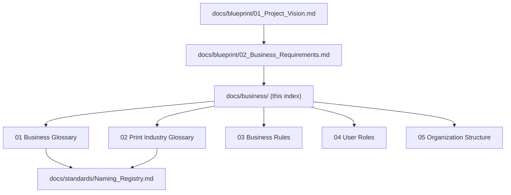

# Business Documentation Master Index

Version:
1.0

Status:
Draft

Owner:
Project Owner / Business Architecture

Last Updated:
2026-07-22

---

# Purpose

This document is the navigation hub for `docs/business/` — the Business Documentation set that sits alongside `docs/blueprint/` (architecture) and `docs/standards/` (engineering conventions). It exists so that any reader can see, at a glance, what business documentation exists, what is still pending, and how it relates to the Blueprint.

---

# Scope

This document covers the index of all documents in `docs/business/`, their status, and their relationship to `docs/blueprint/`.

This document does not restate the content of any individual business document, and does not cover Blueprint or Standards documents directly (see `docs/blueprint/00_Master_Index.md` and `docs/standards/README.md` for those indexes).

---

# Background

`docs/business/` was scaffolded with 23 placeholder documents (00–22) ahead of content being written. This index reflects **Business Documentation Phase A**: the first five substantive documents, plus this index itself. Documents 06–22 remain empty placeholders reserved for future phases.

---

# Main Content

## Business Documentation Phase A (Complete)

| # | Document | Purpose | Status |
|---|---|---|---|
| 00 | [00_Master_Index.md](00_Master_Index.md) | This document — navigation and index | Published |
| 01 | [01_Business_Glossary.md](01_Business_Glossary.md) | Business-level definitions of core PrintOS terms | Draft |
| 02 | [02_Print_Industry_Glossary.md](02_Print_Industry_Glossary.md) | Print-industry-specific vocabulary | Draft |
| 03 | [03_Business_Rules.md](03_Business_Rules.md) | Consolidated business rules across Blueprint and Workflows | Draft |
| 04 | [04_User_Roles.md](04_User_Roles.md) | User groups (G1–G5) and business-level roles | Draft |
| 05 | [05_Organization_Structure.md](05_Organization_Structure.md) | Company/Branch/Department/Employee structure | Draft |

## Reserved for Future Phases (Not Yet Written)

The following files exist as empty placeholders in `docs/business/` and are out of scope for Phase A:

| # | Document | Planned Topic |
|---|---|---|
| 06 | Print_Shop_Operations.md | Day-to-day print shop operational detail |
| 07 | Order_Lifecycle.md | Business-level order lifecycle narrative |
| 08 | Production_Lifecycle.md | Business-level production lifecycle narrative |
| 09 | Pricing_Strategy.md | Pricing policy and strategy |
| 10 | Customer_Journey.md | End-to-end Customer experience |
| 11 | Quality_Management.md | Quality policy and standards |
| 12 | Inventory_Management.md | Inventory business policy |
| 13 | Procurement_Process.md | Procurement business policy |
| 14 | Financial_Workflows.md | Financial process detail |
| 15 | Maintenance_Management.md | Maintenance business policy |
| 16 | Service_Management.md | Service Engineer business policy (Phase 4 dependent) |
| 17 | Marketplace_Business_Model.md | Marketplace business model (Phase 5 dependent) |
| 18 | Reporting_and_KPIs.md | Business KPIs and reporting expectations |
| 19 | Compliance.md | Regulatory/compliance obligations |
| 20 | Risk_Management.md | Business risk register |
| 21 | Operational_Policies.md | General operational policy |
| 22 | Future_Business_Model.md | Long-term business model evolution |

## Documentation Hierarchy Position

---

# Architecture Notes

Business Documentation sits below Vision/Blueprint and above Standards in the Documentation Hierarchy defined in `docs/Documentation_Workflow.md`, Section 3. Every document in this folder is expected to trace its content back to a specific Blueprint document rather than introducing independent business logic — this index enforces that expectation by requiring each entry to name its Blueprint source.

---

# Future Considerations

As Business Documentation Phase B is scoped, this index should be updated to move additional documents from "Reserved for Future Phases" into a completed section, following the same pattern established here.

---

# Open Questions

- Should `docs/business/Business_Glossary.md` (referenced as not-yet-existing in `docs/standards/Naming_Registry.md`) be formally identified as this folder's `01_Business_Glossary.md`, closing that open question in the Naming Registry?
- What determines the sequencing of Phase B (which of documents 06–22 should be written next)?

---

# Related Documents

- `docs/blueprint/00_Master_Index.md`
- `docs/Documentation_Workflow.md`
- `docs/standards/Naming_Registry.md`
- `docs/templates/Business_Document_Template.md`

---

# Revision History

| Version | Date | Author | Changes |
|----------|------|--------|---------|
|1.0|2026-07-22|Initial|Initial Version — indexed Business Documentation Phase A (00–05)|

---

# Documentation Quality Checklist

- [ ] Purpose defined
- [ ] Scope defined, including exclusions
- [ ] No duplicated information (referenced instead)
- [ ] Uses approved terminology (Naming Registry)
- [ ] Mermaid diagrams used where appropriate
- [ ] Traceable to relevant Blueprint document(s)
- [ ] Cross-references complete and valid
- [ ] No implementation code or ERPNext customization included
- [ ] Reviewed by Project Owner
