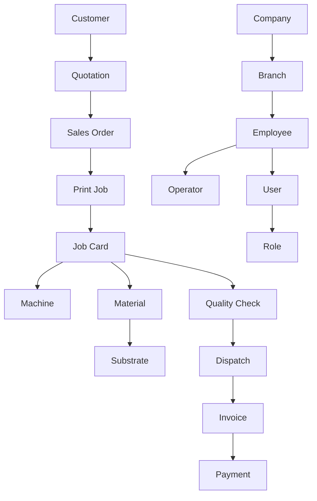

# Business Glossary

Version:
1.0

Status:
Draft

Owner:
Project Owner / Business Architecture

Last Updated:
2026-07-22

---

# Purpose

This document defines the business meaning of PrintOS's core terminology in plain, business-readable language. It exists so that any reader — business stakeholder, new employee, or contributor — can understand what a term means in the context of the PrintHub business, without needing to read the Blueprint's architectural documents.

Where `docs/standards/Naming_Registry.md` governs **which name is approved** for a concept, this Glossary explains **what that concept means in business terms**. The two documents are complementary: this Glossary should never introduce a term that is not already present in the Naming Registry, and the Naming Registry should never define business meaning independently of this Glossary once both are mature (see `docs/standards/Naming_Registry.md`, Open Questions).

---

# Scope

This document covers business-level definitions for core PrintOS terms already established in `docs/blueprint/05_Domain_Model.md` and `docs/blueprint/08_Master_Data_Model.md`, and confirmed as Approved in `docs/standards/Naming_Registry.md`.

This document does not cover print-industry-specific vocabulary (see `02_Print_Industry_Glossary.md`), does not introduce new terms not already present in the Naming Registry, and does not define technical, infrastructure, or integration vocabulary (see `docs/standards/Naming_Registry.md`, Sections 7–9).

---

# Background

PrintHub is built by a mixed team of a human Project Owner and AI collaborators across many sessions (see `docs/Documentation_Workflow.md`, Section 6). Business terminology defined once, consistently, and referenced everywhere prevents the same concept from acquiring multiple names over time — the exact failure mode the Naming Registry (`docs/standards/Naming_Registry.md`) was created to prevent. This Glossary is the business-facing counterpart to that Registry: where the Registry tracks approval status and governance, this Glossary explains meaning for a business audience.

---

# Main Content

## How to Read This Glossary

Each entry below states the approved term (matching `docs/standards/Naming_Registry.md`, Section 6, Business Vocabulary Registry), its business definition, and where it is used. Terms marked **(Proposed)** are not yet formally approved — they are included here for completeness because they appear in the Naming Registry as Proposed, but should not be treated as settled business fact until resolved (see Open Questions). Terms marked **(Rejected / Not Adopted)** were considered and formally declined by an accepted ADR; they are retained here, clearly marked, so a reader who encounters the term elsewhere understands it is not in use and why.

## Core Business Terms

| Term | Definition | Used In |
|---|---|---|
| Customer | A business or individual that requests print/production work. In Phase 1, a Customer exists only as an ERP customer record — not as an active platform user. | CRM, Sales, Accounts |
| Supplier | A party that supplies materials or services to the print shop. | Procurement, Warehouse, Accounts |
| Sales Order | A confirmed commitment to produce and deliver work for a Customer, created once a Quotation is approved. | Sales, Production, Accounts |
| Quotation | A priced proposal for a defined scope of work, presented to a Customer before they commit to a Sales Order. | Estimation, Sales |
| Print Job | A unit of print or production work carried out to fulfill a Sales Order. | Production |
| Job Card | The production instruction and tracking record for a Print Job — the document shop-floor staff use to execute and track work. | Production |
| Machine | A production asset (press, cutter, laminator, etc.) capable of executing job operations. | Production, Machine Scheduling |
| Operator | An Employee assigned to run or oversee a Machine during production. | Production, HR |
| Material | A physical input consumed in production (paper, vinyl, ink, etc.). | Inventory, Estimation |
| Substrate | The specific physical material printed or fabricated upon. | Inventory, Production, Estimation |
| Warehouse | A physical location where Materials or finished goods are stored. | Warehouse, Inventory |
| Invoice | The billing record issued to a Customer for delivered work. | Accounts |
| Payment | A record of funds received against an Invoice. | Accounts |
| Dispatch | The act and record of delivering finished goods to a Customer. | Dispatch |
| Company | The legal business entity operating a PrintOS instance. | Administration |
| Branch | A physical operating location belonging to a Company. | Administration |
| Employee | A person working within the business. | HR |
| User | An authenticated person operating the PrintOS system; may or may not be an Employee. | Administration, Security |
| Role | A named set of permissions assigned to a User. | Administration, Security |
| Service Request | A request for equipment service or maintenance support. | Maintenance (future), Service Engineer workflows (future) |
| Machine Event | A discrete, time-stamped occurrence reported by or about a Machine. | MachineIQ (future), Production |
| Quality Check | A verification step confirming that produced work meets the required standard before it proceeds to Dispatch. | Production |
| Production Order **(Rejected / Not Adopted)** | Considered as a potential distinct concept upstream of the Job Card, but rejected per [ADR-014](../decisions/ADR-014-Production-Terminology.md). **Job Card remains the sole canonical production-execution document** — no separate Production Order entity exists or is planned. | Not used |
| Workstation **(Proposed)** | A potential distinct concept from Machine, not yet formally defined. Included here as Proposed only. | Production (proposed) |
| Asset **(Proposed)** | A potential broader category than Machine, not yet formally defined. Included here as Proposed only. | Production, Maintenance (proposed) |

## Business Term Hierarchy

---

# Architecture Notes

Every term in this Glossary is traceable to a specific entry in `docs/blueprint/05_Domain_Model.md` (Core Business Entities) or `docs/blueprint/08_Master_Data_Model.md` (Master Data Entities), and to its approval status in `docs/standards/Naming_Registry.md` (Section 6, Business Vocabulary Registry). This Glossary does not restate the Domain Model's entity relationships or business rules in full — it exists to give each term a plain-language business definition, and defers to the Domain Model and `03_Business_Rules.md` for behavior and constraints.

---

# Future Considerations

As Phase 2–5 user groups (Freelancer, Supplier, Service Engineer, Marketplace Buyer) are introduced per `docs/blueprint/03_Product_Roadmap.md`, this Glossary will need new entries for concepts specific to those phases (e.g., Marketplace Order, Freelancer Assignment), sourced from `docs/standards/Naming_Registry.md` Sections 23–24 (MachineIQ and Marketplace Vocabulary) once those terms move from Proposed to Approved.

---

# Open Questions

- Should this document formally become the authoritative "Business Glossary" referenced by `docs/standards/Naming_Registry.md` (which currently notes that `docs/business/Business_Glossary.md` "does not yet exist")? If so, the Naming Registry's Background and Open Questions sections should be updated to point here.
- Should "Production Order," "Workstation," and "Asset" be resolved (via ADR, per `docs/standards/Naming_Registry.md` Section 27, items 12 and others) before or after they appear in this business-facing Glossary?
- Should this Glossary include worked examples/scenarios per term, or remain a pure definition table?

---

# Related Documents

- `docs/standards/Naming_Registry.md` (Section 6, Business Vocabulary Registry — naming approval authority)
- `docs/blueprint/05_Domain_Model.md` (Core Business Entities, Entity Relationships)
- `docs/blueprint/08_Master_Data_Model.md` (Master Data Entities)
- `docs/business/02_Print_Industry_Glossary.md` (industry-specific terminology)
- `docs/business/03_Business_Rules.md` (behavioral rules governing these terms)
- `docs/business/04_User_Roles.md` (User, Role, Employee, Operator in organizational context)
- `docs/business/00_Master_Index.md`
- `docs/Documentation_Workflow.md`
- `docs/decisions/ADR-012-Estimating-Terminology.md` (canonical "Estimation" naming for the pricing/estimation business capability)
- `docs/decisions/ADR-014-Production-Terminology.md` (Job Card as the sole production-execution document; Production Order rejected)

---

# Revision History

| Version | Date | Author | Changes |
|----------|------|--------|---------|
|1.0|2026-07-22|Initial|Initial Version|
|1.1|2026-07-22|ADR Synchronization|Replaced remaining "Estimations" reference (Quotation entry's Used In column) with "Estimation," per [ADR-012](../decisions/ADR-012-Estimating-Terminology.md). Updated the Production Order entry from "(Proposed)" to "(Rejected / Not Adopted)," per [ADR-014](../decisions/ADR-014-Production-Terminology.md), clarifying that Job Card remains the sole canonical production-execution document. Added cross-references to ADR-012 and ADR-014. Updated the "How to Read This Glossary" note to explain the new (Rejected / Not Adopted) marker.|

---

# Documentation Quality Checklist

- [ ] Purpose defined
- [ ] Scope defined, including exclusions
- [ ] No duplicated information (referenced instead)
- [ ] Uses approved terminology (Naming Registry)
- [ ] Mermaid diagrams used where appropriate
- [ ] Traceable to relevant Blueprint document(s)
- [ ] Cross-references complete and valid
- [ ] No implementation code or ERPNext customization included
- [ ] Reviewed by Project Owner
