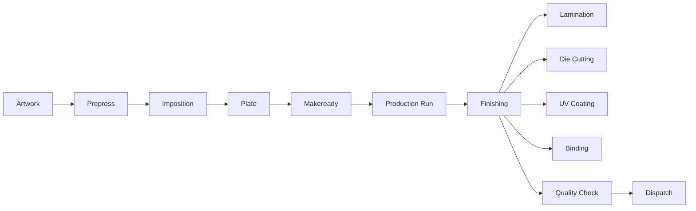

# Print Industry Glossary

Version:
1.0

Status:
Draft

Owner:
Project Owner / Business Architecture

Last Updated:
2026-07-22

---

# Purpose

This document defines print-industry-specific terminology used throughout PrintOS, in plain business language, for readers who may be familiar with general ERP concepts but not with printing, signage, packaging, or visual communication industry vocabulary.

---

# Scope

This document covers print-industry terms already present in `docs/blueprint/05_Domain_Model.md` (Domain Terminology / Industry Vocabulary) and the expanded print-industry vocabulary in `docs/standards/Naming_Registry.md` (Sections 22 and 35).

This document does not cover general business terms (see `01_Business_Glossary.md`), and does not introduce new terms beyond what is already recorded in the Naming Registry.

---

# Background

PrintHub serves the printing, digital printing, signage, packaging, gifting, LED display, and visual communication industries (`docs/blueprint/01_Project_Vision.md`). These industries share a specialized vocabulary — substrates, finishing processes, prepress steps, color systems — that a generic ERP glossary would not capture. This document exists so that business stakeholders, trainers, and new contributors have one place to learn this vocabulary without needing to read the full Naming Registry.

---

# Main Content

## Approved Print Industry Terms

These terms are formally Approved in `docs/blueprint/05_Domain_Model.md` and confirmed in `docs/standards/Naming_Registry.md`, Section 22:

| Term | Definition |
|---|---|
| Substrate | The physical material printed or fabricated upon (paper, vinyl, acrylic, fabric, etc.). |
| Media | Consumable print material; often used interchangeably with Substrate in digital printing contexts. |
| Finishing | Post-print processes such as lamination, cutting, binding, or mounting. |
| Proof | A representation of artwork provided to the Customer for approval before production begins. |
| Machine Profile | The defined capabilities and constraints of a specific production Machine. |

## Proposed Print Industry Terms

These terms are recorded in `docs/standards/Naming_Registry.md`, Section 35, as **Proposed** — foundational to the industry but not yet formally added to `docs/blueprint/05_Domain_Model.md`. They are presented here for business understanding, marked clearly as not-yet-approved.

| Term | Definition | Status |
|---|---|---|
| Prepress | The preparatory stage between Artwork approval and production, covering imposition and plate-making. | Proposed |
| Imposition | Arrangement of pages or artwork on a press sheet for efficient printing and finishing. | Proposed |
| Plate | The image-carrying surface used in offset printing. | Proposed |
| CTP | Computer-to-Plate — imaging plates directly from digital files, without film. | Proposed |
| GSM | Grams per Square Meter — a measure of paper/substrate weight. | Proposed |
| Bleed | Artwork extended beyond the trim edge, to avoid unprinted edges after cutting. | Proposed |
| Trim | The final cut edge or size of a finished piece. | Proposed |
| Registration | Alignment accuracy of multiple print passes or colors. | Proposed |
| Lamination | A Finishing process applying a protective or decorative film. | Proposed |
| Binding | A Finishing process joining printed sheets into a bound product. | Proposed |
| Die Cutting | A Finishing process cutting custom shapes using a die. | Proposed |
| UV Coating | A Finishing process applying a UV-cured protective coating. | Proposed |
| Varnish | A Finishing coating applied for protection or visual effect. | Proposed |
| Spot UV | A Finishing process applying UV Coating to specific areas only. | Proposed |
| Pantone | A standardized spot-color matching system. | Proposed |
| CMYK | The four-color (Cyan, Magenta, Yellow, Black) process printing color model. | Proposed |
| RGB | The additive color model used for digital display; relevant to proofing and artwork review. | Proposed |
| Batch | A grouped set of Job Cards or materials processed together. | Proposed |
| Run Length | The quantity of units produced in a single production run. | Proposed |
| Makeready | Machine setup and adjustment time before a production run begins. | Proposed |
| Waste Sheet | Substrate consumed during Makeready/setup that does not yield sellable output. | Proposed |
| Ink Consumption | Measured Material usage of ink during a production run. | Proposed |
| Color Profile | A defined color-management configuration applied to a Machine or Job. | Proposed |
| Job Cost | The computed total cost of producing a Print Job. | Proposed |
| Revision | A tracked change to Artwork prior to Customer Approval. | Proposed |
| Customer Approval | The recorded act of a Customer approving Artwork or a Proof. | Proposed |

**Note on unresolved synonyms:** "Estimate" (vs. Quotation), "Production Batch" (vs. Batch), and "Machine Setup" (vs. Makeready) are tracked as unresolved in `docs/standards/Naming_Registry.md`, Section 25 (Synonym Registry) and Section 27 (Naming Decision Matrix, items 7, 17). This Glossary does not pick a winner between them.

## Production Flow Using Print Industry Terms

---

# Architecture Notes

This Glossary deliberately separates Approved terms (already reflected in the Domain Model) from Proposed terms (recorded only in the Naming Registry's expanded vocabulary) so that readers can distinguish settled business vocabulary from vocabulary awaiting formal Blueprint adoption. This mirrors the Term Maturity model in `docs/standards/Naming_Registry.md`, Section 31.

---

# Future Considerations

As Prepress, Finishing, and color-management workflows are implemented in later phases, the Proposed terms in this document are expected to move to Approved via the standard Term Change Policy (`docs/standards/Naming_Registry.md`, Section 33), at which point `docs/blueprint/05_Domain_Model.md` should be updated to formally include them.

---

# Open Questions

- Should Prepress be modeled as its own bounded context/module distinct from Production, given its position ahead of Job Card scheduling?
- Should this Glossary be expanded with signage-, packaging-, and LED-display-specific terminology, given PrintHub's stated scope extends beyond traditional print (`docs/blueprint/01_Project_Vision.md`, Target Industries)?

---

# Related Documents

- `docs/standards/Naming_Registry.md` (Sections 22, 35 — Print Industry Vocabulary)
- `docs/blueprint/05_Domain_Model.md` (Domain Terminology / Industry Vocabulary)
- `docs/business/01_Business_Glossary.md` (general business terminology)
- `docs/business/03_Business_Rules.md`
- `docs/business/00_Master_Index.md`

---

# Revision History

| Version | Date | Author | Changes |
|----------|------|--------|---------|
|1.0|2026-07-22|Initial|Initial Version|

---

# Documentation Quality Checklist

- [ ] Purpose defined
- [ ] Scope defined, including exclusions
- [ ] No duplicated information (referenced instead)
- [ ] Uses approved terminology (Naming Registry)
- [ ] Mermaid diagrams used where appropriate
- [ ] Traceable to relevant Blueprint document(s)
- [ ] Cross-references complete and valid
- [ ] No implementation code or ERPNext customization included
- [ ] Reviewed by Project Owner
