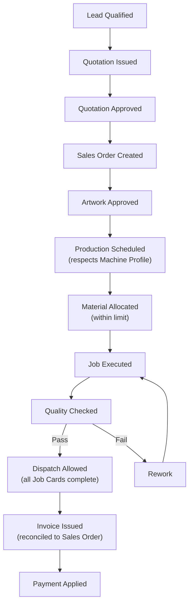

# Business Rules

Version:
1.0

Status:
Draft

Owner:
Project Owner / Business Architecture

Last Updated:
2026-07-22

---

# Purpose

This document consolidates the business rules that govern PrintOS operations — the constraints and conditions that must hold true regardless of implementation — in one business-readable reference, rather than requiring readers to extract rules piecemeal from architecture documents.

---

# Scope

This document covers business rules already established in `docs/blueprint/02_Business_Requirements.md` (Business Rules section) and `docs/blueprint/10_Business_Workflows.md` (per-workflow Business Rules), consolidated and cross-referenced.

This document does not introduce new business rules beyond what the Blueprint already establishes, and does not define technical validation or implementation logic.

---

# Background

Business rules in PrintOS were originally distributed across `02_Business_Requirements.md` and, per-workflow, across `10_Business_Workflows.md`. As the number of workflows and modules grows, a single consolidated Business Rules reference reduces the risk of a rule being violated in one part of the system because it was only documented next to a different workflow.

---

# Main Content

## Core Business Rules

Sourced from `docs/blueprint/02_Business_Requirements.md`, Business Rules:

| ID | Rule | Rationale |
|---|---|---|
| BR-1 | ERPNext core must never be modified; all customization occurs through Frappe's extension mechanisms inside `printos_core`. | Upgrade safety (see `docs/decisions/ADR-002-PrintOS-Core.md`) |
| BR-2 | Business concepts must not depend directly on ERPNext internals. | Maintainability, Clean Architecture (`docs/blueprint/04_System_Architecture.md`) |
| BR-3 | Marketplace functionality (G1 as active platform users) is explicitly out of scope until Phase 5. | Phased delivery discipline (see `docs/decisions/ADR-009-Marketplace.md`) |

## Workflow-Level Business Rules

Sourced from `docs/blueprint/10_Business_Workflows.md`, consolidated by workflow:

| Workflow | Business Rule |
|---|---|
| Lead to Customer | A Lead must be qualified before a Quotation can be issued against it. |
| Quotation to Sales Order | A Sales Order requires an approved Quotation, except in defined reorder scenarios. |
| Artwork Approval | Production cannot begin without customer-Approved Artwork. |
| Production Planning | Scheduling must respect Machine Profile capability constraints. |
| Job Card Lifecycle | Status transitions must follow the defined sequence (Scheduled → In Progress → Quality Check → Complete), including Rework where applicable. |
| Machine Assignment | Only machines whose Profile supports the required Job Type may be assigned. |
| Material Allocation | Material cannot be consumed beyond allocated quantity without an approved variance. |
| Purchase Cycle | Purchase Orders above a defined value require management approval. |
| Inventory Replenishment | Reorder thresholds are defined per Material. |
| Quality Control | Failed quality checks require rework or scrap disposition before proceeding. |
| Dispatch Workflow | Dispatch requires all Job Cards for the Sales Order to be complete, unless partial dispatch is explicitly permitted. |
| Invoice Workflow | Invoice values must reconcile with the confirmed Sales Order and applicable Price List. |
| Payment Collection | Payment must be applied against the correct Invoice; partial payments update the outstanding balance. |
| Customer Reorder | Reorder pricing may reference the prior Price List, subject to validity rules; specification changes require re-quotation. |
| Complaint Handling | Complaints must be linked to the originating Sales Order for traceability. |
| Service Request | Critical machine issues take priority over routine maintenance. |
| Machine Maintenance | Machines under maintenance must be excluded from Machine Scheduling. |

## Business Rule Dependency Flow

---

# Architecture Notes

Every rule in this document is a consolidation, not a new authority — each row cites its origin in `docs/blueprint/02_Business_Requirements.md` or `docs/blueprint/10_Business_Workflows.md`. If a future change to business rules is needed, the source Blueprint document is updated first, per the Documentation-First principle (`docs/Documentation_Workflow.md`, Section 2), and this consolidation follows.

---

# Future Considerations

As Phase 2–5 workflows (Freelancer, Supplier, Service Engineer, Marketplace) are scoped, their business rules should be added to this consolidated reference at the same time they are added to `docs/blueprint/10_Business_Workflows.md`, to prevent this document from falling out of sync with the Blueprint.

---

# Open Questions

- Should this document become the single authoritative source for business rules going forward, with `02_Business_Requirements.md` and `10_Business_Workflows.md` deferring to it, or should it remain a read-only consolidation that always defers to the Blueprint?
- What approval threshold values (e.g., Purchase Order value requiring management approval) should be formally specified, given `10_Business_Workflows.md` leaves this as "a defined value" without a number?

---

# Related Documents

- `docs/blueprint/02_Business_Requirements.md` (Business Rules)
- `docs/blueprint/10_Business_Workflows.md` (per-workflow Business Rules)
- `docs/business/01_Business_Glossary.md`
- `docs/business/04_User_Roles.md`
- `docs/decisions/ADR-002-PrintOS-Core.md`
- `docs/decisions/ADR-009-Marketplace.md`
- `docs/business/00_Master_Index.md`

---

# Revision History

| Version | Date | Author | Changes |
|----------|------|--------|---------|
|1.0|2026-07-22|Initial|Initial Version|

---

# Documentation Quality Checklist

- [ ] Purpose defined
- [ ] Scope defined, including exclusions
- [ ] No duplicated information (referenced instead)
- [ ] Uses approved terminology (Naming Registry)
- [ ] Mermaid diagrams used where appropriate
- [ ] Traceable to relevant Blueprint document(s)
- [ ] Cross-references complete and valid
- [ ] No implementation code or ERPNext customization included
- [ ] Reviewed by Project Owner
