# User Roles

Version:
1.0

Status:
Draft

Owner:
Project Owner / Business Architecture

Last Updated:
2026-07-22

---

# Purpose

This document defines the user groups and business-level roles relevant to PrintOS, consolidating who uses the system, what they do, and how their access is expected to be scoped — in business terms, ahead of any technical permission design.

---

# Scope

This document covers the User Groups (G1–G5) defined in `docs/blueprint/02_Business_Requirements.md`, and the business-level Permissions references found per-module in `docs/blueprint/09_PrintOS_Modules.md`.

This document does not define ERPNext Role/Permission implementation, and does not define authentication or security architecture (reserved for a future Security Architecture document, currently deferred per this session's Phase C decision).

---

# Background

PrintOS Phase 1 serves Print Shops (G2) as its active user base, with Customers (G1) existing only as ERP records. Future phases introduce Freelancers (G3), Suppliers (G4), and Service Engineers (G5) as active users, and eventually Public Customers (G1) as active Marketplace participants. Documenting roles at the business level now — before any phase-specific portal is built — keeps role expectations traceable to the Roadmap rather than invented ad hoc per phase.

---

# Main Content

## User Groups

Sourced from `docs/blueprint/02_Business_Requirements.md` and `docs/standards/Naming_Registry.md`, Section 10:

| Group | Name | Status in Current Phase | Description |
|---|---|---|---|
| G1 | Public Customer | Record-only (ERP customer record) | End buyers of print/production work; becomes an active platform participant in Phase 5 (Marketplace). |
| G2 | Print Shop | Active (Phase 1) | The primary active user group; operates PrintOS ERP directly. |
| G3 | Freelancer | Future (Phase 2) | Freelance resources engaged by print shops. |
| G4 | Supplier | Future (Phase 3) | Suppliers of materials/services to print shops. |
| G5 | Service Engineer | Future (Phase 4) | Field service/maintenance personnel. |

## Business-Level Roles Within a Print Shop (G2)

Sourced from the Permissions column of each module in `docs/blueprint/09_PrintOS_Modules.md`:

| Role | Typical Responsibilities | Modules Involved |
|---|---|---|
| Sales Staff | Lead capture, Sales Order creation | CRM, Sales |
| Sales Management | Order approval/amendment, Quotation approval | Sales, Quotation |
| Estimator | Cost estimation, Quotation creation | Quotation |
| Design Staff | Artwork creation/revision | Artwork |
| Production Management | Capacity planning, Job Card scheduling, Machine assignment | Production Planning, Job Cards, Machine Scheduling |
| Production Operator | Job Card status updates, shop-floor execution | Job Cards |
| Inventory Staff | Stock movement recording, allocation | Inventory |
| Procurement Staff | Purchase Order creation and receipt | Purchasing |
| Warehouse Staff | Goods receipt/issue, location management | Warehouse |
| Dispatch Staff | Delivery scheduling and confirmation | Dispatch |
| Accounts Staff | Invoicing, payment recording | Accounts, GST |
| HR Staff | Employee record maintenance | HR |
| System Administrator | Company/Branch setup, user/role administration | Administration |
| Management (cross-cutting) | Report/dashboard access, approvals above threshold | Reports, Analytics |

## User Group to Role Relationship

```mermaid
flowchart TB
    G2["G2: Print Shop (Active, Phase 1)"] --> SalesStaff["Sales Staff"]
    G2 --> SalesMgmt["Sales Management"]
    G2 --> Estimator
    G2 --> DesignStaff["Design Staff"]
    G2 --> ProdMgmt["Production Management"]
    G2 --> ProdOperator["Production Operator"]
    G2 --> InventoryStaff["Inventory Staff"]
    G2 --> ProcurementStaff["Procurement Staff"]
    G2 --> WarehouseStaff["Warehouse Staff"]
    G2 --> DispatchStaff["Dispatch Staff"]
    G2 --> AccountsStaff["Accounts Staff"]
    G2 --> HRStaff["HR Staff"]
    G2 --> SysAdmin["System Administrator"]

    G1["G1: Public Customer (Record-only, Phase 1)"] -.future Phase 5.-> Buyer["Marketplace Buyer Role"]
    G3["G3: Freelancer (Future, Phase 2)"] -.future.-> FreelancerRole["Freelancer Role"]
    G4["G4: Supplier (Future, Phase 3)"] -.future.-> SupplierRole["Supplier Portal Role"]
    G5["G5: Service Engineer (Future, Phase 4)"] -.future.-> ServiceEngRole["Service Engineer Role"]
```

---

# Architecture Notes

Roles listed here are business-level descriptions of who does what, not a technical Role/Permission design. Technical implementation (ERPNext Roles, Permission rules) is deferred to implementation and, per `docs/standards/Security_Standards.md`, must enforce least-privilege access — this document establishes the business roles that technical permissions must eventually map to, not the other way around.

---

# Future Considerations

As Phase 2–5 introduce G3–G5 as active users and G1 as an active Marketplace participant, this document should be extended with their specific business-level roles once each phase is formally scoped, consistent with `docs/blueprint/03_Product_Roadmap.md`.

---

# Open Questions

- Should "Management (cross-cutting)" be split into distinct roles per module (e.g., Production Management vs. Accounts Management), or does a single cross-cutting Management role remain business-accurate?
- What is the minimum viable role set for a small print shop (fewer staff wearing multiple hats) versus a larger one, and should this document describe both?

---

# Related Documents

- `docs/blueprint/02_Business_Requirements.md` (Target Users)
- `docs/blueprint/09_PrintOS_Modules.md` (Permissions per module)
- `docs/standards/Security_Standards.md`
- `docs/business/05_Organization_Structure.md`
- `docs/business/01_Business_Glossary.md`
- `docs/business/00_Master_Index.md`

---

# Revision History

| Version | Date | Author | Changes |
|----------|------|--------|---------|
|1.0|2026-07-22|Initial|Initial Version|

---

# Documentation Quality Checklist

- [ ] Purpose defined
- [ ] Scope defined, including exclusions
- [ ] No duplicated information (referenced instead)
- [ ] Uses approved terminology (Naming Registry)
- [ ] Mermaid diagrams used where appropriate
- [ ] Traceable to relevant Blueprint document(s)
- [ ] Cross-references complete and valid
- [ ] No implementation code or ERPNext customization included
- [ ] Reviewed by Project Owner
