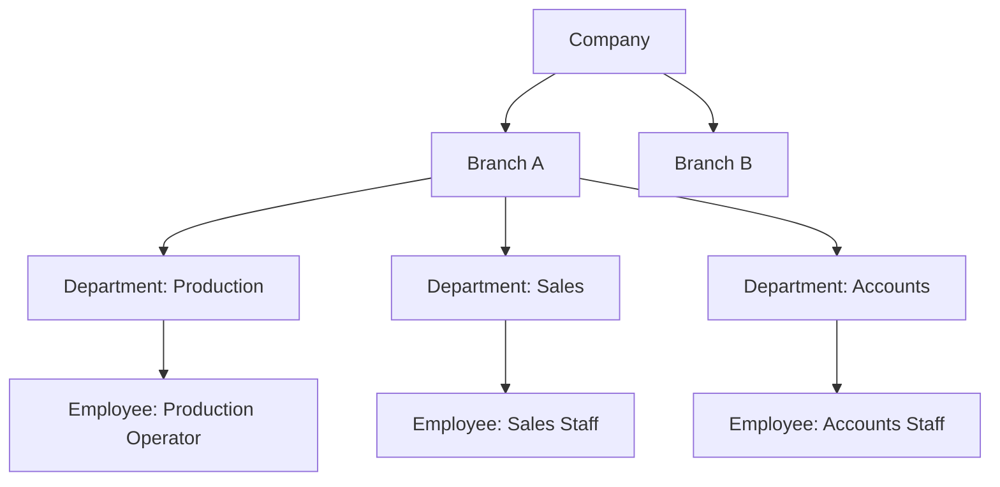

# Organization Structure

Version:
1.0

Status:
Draft

Owner:
Project Owner / Business Architecture

Last Updated:
2026-07-22

---

# Purpose

This document describes the organizational structure a PrintOS deployment assumes — Company, Branch, Department, Employee — in business terms, so that setup and onboarding decisions have a clear business reference independent of ERPNext's technical configuration screens.

---

# Scope

This document covers the organizational master data entities defined in `docs/blueprint/08_Master_Data_Model.md` (Company, Branch, Department, Employee) and their relationships.

This document does not define ERPNext DocType configuration, and does not cover Roles/Permissions in detail (see `04_User_Roles.md`).

---

# Background

PrintOS is designed for a single print shop business (Company) that may operate from one or more physical locations (Branches), each with its own staff structure. This mirrors ERPNext's own Company/Branch model, adopted directly per `docs/decisions/ADR-001-ERPNext-Framework.md`, and reused as PrintOS's tenant-scope anchor per `docs/standards/Naming_Registry.md`, Section 8.

---

# Main Content

## Organizational Entities

Sourced from `docs/blueprint/08_Master_Data_Model.md`:

| Entity | Business Purpose | Owning Context |
|---|---|---|
| Company | The legal business entity operating a PrintOS instance | Administration |
| Branch | A physical operating location belonging to a Company | Administration |
| Department | An organizational unit within a Branch | HR |
| Employee | A person working within the business, belonging to a Department | HR |

## Organization Hierarchy

## Relationship to Warehouses and Machines

Per `docs/blueprint/08_Master_Data_Model.md`, a Branch owns one or more Warehouses, and Machines are typically associated with the Branch where they are physically located, though this association is not yet formalized as a distinct Blueprint entity relationship.

| Relationship | Description |
|---|---|
| Company → Branch | A Company operates one or more Branches |
| Branch → Department | A Branch has one or more Departments |
| Department → Employee | A Department has one or more Employees |
| Branch → Warehouse | A Branch has one or more Warehouses (per `08_Master_Data_Model.md`) |

---

# Architecture Notes

Company is deliberately reused as PrintOS's tenant-scope anchor (`docs/decisions/ADR-006-MultiTenant-Strategy.md`), rather than introducing a separate "Tenant" concept in Phase 1. This means organizational structure decisions made here (Company/Branch scoping) directly affect future multi-tenant design — any Phase 1 shortcut that assumes a single global Company would need to be revisited before multi-tenant rollout.

---

# Future Considerations

As multi-branch and eventual multi-tenant SaaS operation matures (`docs/blueprint/03_Product_Roadmap.md`, `docs/decisions/ADR-006-MultiTenant-Strategy.md`), this document should be expanded to describe cross-Company/cross-Branch scenarios (e.g., a group operating multiple print shop brands under one PrintHub subscription), once that scope is formally defined.

---

# Open Questions

- Should Machine ownership by Branch be formalized as an explicit relationship in `docs/blueprint/08_Master_Data_Model.md`, given it is currently only implied?
- How should organizational structure differ between a small, single-branch print shop and a larger, multi-branch operation — does this document need two illustrative scenarios?

---

# Related Documents

- `docs/blueprint/08_Master_Data_Model.md` (Company, Branch, Department, Employee)
- `docs/decisions/ADR-006-MultiTenant-Strategy.md`
- `docs/business/04_User_Roles.md`
- `docs/business/01_Business_Glossary.md`
- `docs/business/00_Master_Index.md`

---

# Revision History

| Version | Date | Author | Changes |
|----------|------|--------|---------|
|1.0|2026-07-22|Initial|Initial Version|

---

# Documentation Quality Checklist

- [ ] Purpose defined
- [ ] Scope defined, including exclusions
- [ ] No duplicated information (referenced instead)
- [ ] Uses approved terminology (Naming Registry)
- [ ] Mermaid diagrams used where appropriate
- [ ] Traceable to relevant Blueprint document(s)
- [ ] Cross-references complete and valid
- [ ] No implementation code or ERPNext customization included
- [ ] Reviewed by Project Owner
