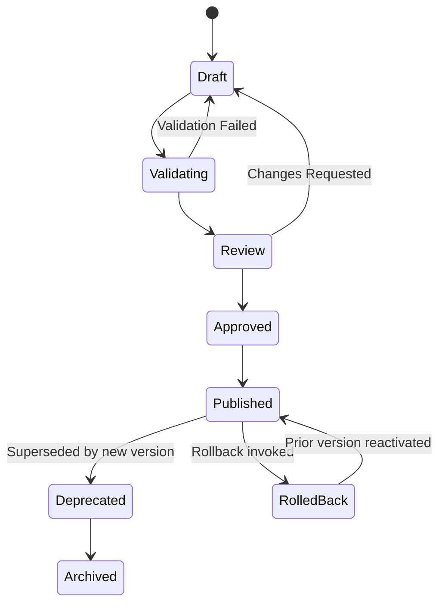
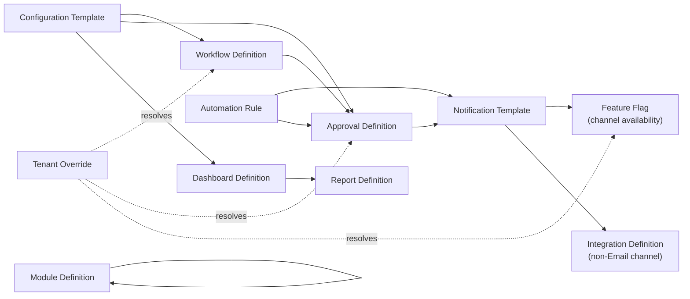
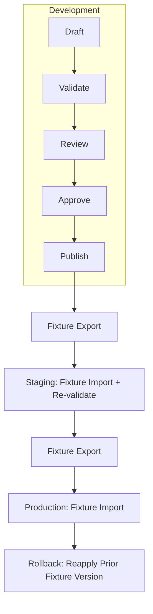
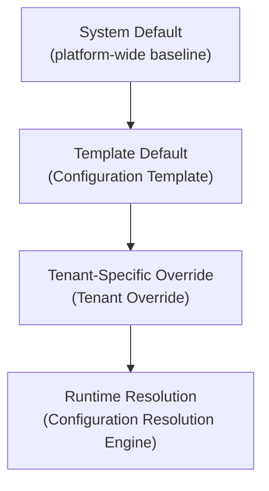

# Configuration Studio Architecture

Version:
0.2

Status:
Draft

Owner:
PrintHub Architecture Team

Last Updated:
2026-07-25

---

## Executive Summary

Configuration Studio is the runtime platform that lets a PrintHub installation be shaped — modules, workflows, approvals, forms, dashboards, reports, notifications, integrations, feature availability, and automation — entirely through governed metadata, without code changes or ERPNext core modification. The 16 documents in `docs/configuration/` already define each designer individually; this document is the cross-cutting architecture layer above them, defining the platform behaviors every designer shares: how configuration is versioned, validated, deployed, audited, resolved per tenant, secured, and consumed at runtime. It introduces no new designer and no new configuration artifact beyond what [../architecture/Canonical_Domain_Model.md](../architecture/Canonical_Domain_Model.md) already catalogs as the Configuration Studio Bounded Context; it organizes and completes the platform-level architecture around that existing entity set.

---

## Architectural Principles

- **Configuration is Data, Not Code.** Every designer produces configuration records — DocTypes — read and interpreted by Application-layer use cases at runtime; no designer generates or injects executable code, per [01_Configuration_Architecture.md](01_Configuration_Architecture.md).
- **Everything configurable is metadata.** A capability that cannot be expressed as a structured configuration record does not belong in Configuration Studio; it belongs in `printos_core`'s Domain/Application layers directly.
- **Versioned.** Every Published configuration artifact is an immutable snapshot; editing creates a new Draft, never mutates a Published version in place.
- **Validated.** No configuration artifact may be Published without passing reference, dependency, circular-reference, missing-object, and schema validation (see Validation Framework).
- **Auditable.** Every version, its author, timestamp, and change reason are recorded and retained, per [../database/06_Data_Lifecycle.md](../database/06_Data_Lifecycle.md)'s audit principle applied to configuration specifically.
- **Deployable.** Configuration moves through the same Development → Staging → Production progression as code, per [15_Deployment_Model.md](15_Deployment_Model.md).
- **Rollback-capable.** Reverting means reactivating a prior Published version, never manually reversing a change.
- **Importable / Exportable.** Configuration is portable via Frappe's native fixture mechanism, enabling promotion across environments and, prospectively, across installations.
- **Tenant-isolated.** One installation's configuration and overrides are never visible to or affected by another's, subject to [Architecture Review Register](../decisions/Architecture_Review_Register.md) **AR-002**'s still-open Tenant/Company definition — referenced throughout this document, never resolved.

---

## Configuration Lifecycle

Every configuration artifact — regardless of designer — passes through the same lifecycle:

- **Draft** — Being authored or edited; not consumed by runtime services.
- **Validating** — Automated checks run (see Validation Framework); failure returns the artifact to Draft.
- **Review** — A human reviewer examines the artifact before it can be approved, mirroring `docs/Documentation_Workflow.md`'s Review stage applied to configuration.
- **Approved** — Reviewed and cleared for publication; awaiting the Publish action itself.
- **Published** — Active and consumed by runtime services; immutable once reached.
- **Deprecated** — Superseded by a newer Published version; retained for audit and rollback reference, never deleted.
- **RolledBack** — A prior Published version has been reactivated in place of the most recent one; the rolled-back-from version becomes Deprecated.
- **Archived** — No longer referenced anywhere active; retained only for historical record, consistent with `docs/Documentation_Workflow.md` Section 8's Archive Policy.

This lifecycle applies uniformly to Workflow Definition, Approval Definition, Form Definition, Dashboard Definition, Report Definition, Notification Template, Integration Definition, Automation Rule, and Configuration Template. Module Definition and Feature Flag follow a lighter variant (see their designer sections below), since their primary state is enabled/disabled rather than versioned content.

---

## Designers

### Module Designer

- **Purpose:** Control which PrintOS business modules are active for a given installation.
- **Business Scope:** Per [02_Module_Manager.md](02_Module_Manager.md) — enable/disable modules, enforce dependency rules, surface compatibility information.
- **Configuration Artifacts:** Module Definition (per [../architecture/Canonical_Domain_Model.md](../architecture/Canonical_Domain_Model.md); Custom PrintHub per [../database/ERPNext_DocType_Mapping.md](../database/ERPNext_DocType_Mapping.md)).
- **Runtime Behaviour:** Application-layer use cases and Interface-layer routes consult Module Definition's enabled/disabled state before exposing a module's menus, forms, or automation.
- **Versioning:** Module Definition's *state* (enabled/disabled) is tracked via Frappe's native audit trail rather than the full Draft→Published lifecycle above, since there is no "content" to version beyond the state itself and its dependency declarations. A change to a module's dependency declarations does follow the full lifecycle.
- **Validation:** Dependency validation (a module cannot be enabled if a required module is disabled) and circular dependency detection across the Module Definition dependency graph are mandatory before any enable/disable action takes effect.

---

### Workflow Designer

- **Purpose:** Define document workflows (states and transitions) for PrintOS transactional documents without code.
- **Business Scope:** Per [03_Workflow_Designer.md](03_Workflow_Designer.md).
- **Configuration Artifacts:** Workflow Definition (Extended ERPNext — Frappe's native Workflow engine, per [../database/ERPNext_DocType_Mapping.md](../database/ERPNext_DocType_Mapping.md)).
- **Runtime Behaviour:** Frappe's native Workflow engine evaluates state transitions on the target document; guard conditions are evaluated by an Application-layer use case, not embedded in the workflow record itself.
- **Versioning:** A new Workflow Definition version is authored as Draft and does not affect documents currently governed by the Published version until it is itself Published. Documents already mid-transition when a new version publishes continue under the version active at their creation, to avoid invalidating in-flight state — an explicit runtime principle this document establishes for consistency across all versioned designers.
- **Validation:** Target document type exists; every referenced state is reachable and every transition's source/target states exist; guard conditions reference only fields that exist on the target document type; no orphan (unreachable) states.

---

### Approval Designer

- **Purpose:** Configure multi-step, condition-based approval chains.
- **Business Scope:** Per [04_Approval_Designer.md](04_Approval_Designer.md).
- **Configuration Artifacts:** Approval Definition (Extended ERPNext — Workflow + Role-based approval).
- **Runtime Behaviour:** Approval Definition drives creation of Approval Record entities (per [../architecture/Canonical_Domain_Model.md](../architecture/Canonical_Domain_Model.md), owned by the Artwork context but referenced across Estimation/Production) as chains execute; escalation and timeout logic are evaluated by the Application layer.
- **Versioning:** Same in-flight principle as Workflow Definition — an approval chain already initiated against a Sales Order, Quotation, or Artwork continues under the Approval Definition version active at initiation, even if a newer version is Published mid-chain.
- **Validation:** Every referenced approver role or user is resolvable; no circular escalation path (Approver A escalates to B, B escalates back to A); referenced Roles exist in the Role & Permission Designer's configuration.

---

### Form Designer

- **Purpose:** Configure form layout, field visibility, and field-level behavior.
- **Business Scope:** Per [05_Form_Designer.md](05_Form_Designer.md).
- **Configuration Artifacts:** Form Definition (Extended ERPNext — Customize Form / Client Script).
- **Runtime Behaviour:** Presentation-only; client-side rendering reflects Form Definition, with any validation hint mirrored from — never authoritative over — server-side Domain-layer enforcement.
- **Versioning:** Follows the standard lifecycle; a Form Definition version applies per target document type.
- **Validation:** Every referenced field exists on the target document type; any validation message configured here must correspond to an existing server-side rule (schema/reference validation against the Domain layer's actual enforcement, not an independent client-only rule).

---

### Dashboard Designer

- **Purpose:** Compose dashboards from widgets backed by defined data sources.
- **Business Scope:** Per [06_Dashboard_Designer.md](06_Dashboard_Designer.md).
- **Configuration Artifacts:** Dashboard Definition (Extended ERPNext — Number Card / Dashboard Chart).
- **Runtime Behaviour:** Widgets read from Report Definition outputs or defined Application-layer query use cases; never raw SQL directly in configuration.
- **Versioning:** Follows the standard lifecycle.
- **Validation:** Every widget's data source (a Report Definition reference) must exist and be Published; a widget's effective permission scope must not exceed the underlying report's permission scope (missing-object and reference validation combined).
- **Ownership Clarification:** Dashboard Designer owns Dashboard Definition as a configuration artifact. The Blueprint's Reporting bounded context (per [../blueprint/06_Bounded_Contexts.md](../blueprint/06_Bounded_Contexts.md), as clarified) owns the cross-context reporting *capability* and consumes Published Dashboard Definitions — it does not independently own or duplicate this artifact.

---

### Report Designer

- **Purpose:** Configure reports consistent with PrintOS data access rules.
- **Business Scope:** Per [10_Report_Designer.md](10_Report_Designer.md).
- **Configuration Artifacts:** Report Definition (Extended ERPNext — Query Report / Script Report).
- **Runtime Behaviour:** Executed on demand or on schedule; permission-scoped identically to the underlying DocType(s).
- **Versioning:** Follows the standard lifecycle; a query/script change is itself a new version subject to Review before Publish.
- **Validation:** Any SQL used is parameterized only (schema/security validation); every referenced DocType and field exists.
- **Ownership Clarification:** Report Designer owns Report Definition as a configuration artifact. The Blueprint's Reporting bounded context (per [../blueprint/06_Bounded_Contexts.md](../blueprint/06_Bounded_Contexts.md), as clarified) owns the cross-context reporting *capability* and consumes Published Report Definitions — it does not independently own or duplicate this artifact.

---

### Notification Designer

- **Purpose:** Configure alerts and notifications — trigger, recipient, channel, and template.
- **Business Scope:** Per [08_Notification_Designer.md](08_Notification_Designer.md).
- **Configuration Artifacts:** Notification Template (Extended ERPNext — Notification / Email Alert).
- **Runtime Behaviour:** Triggered by an Automation Rule or native document event; recipient resolution and channel dispatch performed by the Application layer.
- **Versioning:** Same in-flight principle — a notification already queued for dispatch uses the template version active when it was triggered.
- **Validation:** Every template placeholder resolves against the triggering document's actual fields; HTML output escapes by default (security/schema validation); any non-Email channel referenced (WhatsApp, SMS) must resolve to a valid, Published Integration Definition.

---

### Integration Designer

- **Purpose:** Configure connections to external systems as data.
- **Business Scope:** Per [11_Integration_Designer.md](11_Integration_Designer.md).
- **Configuration Artifacts:** Integration Definition (Extended ERPNext — Webhook, extended).
- **Runtime Behaviour:** An Infrastructure-layer adapter is invoked per configured Integration Definition instance; exactly one adapter implementation exists per integration type, per [../architecture/10_Integration_Architecture.md](../architecture/10_Integration_Architecture.md).
- **Versioning:** Follows the standard lifecycle; credential references (never embedded credentials) are versioned independently of endpoint/mapping configuration to avoid unnecessary re-review of secrets on every configuration change.
- **Validation:** The referenced adapter type exists; the credential reference resolves to a valid Frappe encrypted field or environment variable (never a plain-text value); field mappings reference existing fields on both sides.

---

### Feature Flag Manager

- **Purpose:** Toggle PrintOS functionality per installation, environment, or rollout stage.
- **Business Scope:** Per [12_Feature_Flags.md](12_Feature_Flags.md).
- **Configuration Artifacts:** Feature Flag, with per-installation state carried via Tenant Override (see Tenant Customization below).
- **Runtime Behaviour:** Consulted at the Application-layer boundary; Domain-layer logic never depends on flag state directly.
- **Versioning:** Like Module Definition, a flag's on/off *state* is tracked via audit trail rather than the full content-versioning lifecycle; the flag's definition (name, description, intended removal point) follows the standard lifecycle.
- **Validation:** Flag key uniqueness across the installation; flags without an intended-removal note past a defined age are surfaced for cleanup review (not blocking, but flagged) — this operationalizes the "flags are not meant to live forever" principle already stated in [12_Feature_Flags.md](12_Feature_Flags.md).

---

### Automation Designer

- **Purpose:** Configure trigger–condition–action automation without embedding logic ad hoc.
- **Business Scope:** Per [07_Automation_Rules.md](07_Automation_Rules.md).
- **Configuration Artifacts:** Automation Rule (Custom PrintHub — no native Frappe Server Script reuse, per [../database/ERPNext_DocType_Mapping.md](../database/ERPNext_DocType_Mapping.md)).
- **Runtime Behaviour:** Conditions are evaluated by a constrained, safely-evaluated expression syntax (never raw code execution); actions call named Application-layer use cases only.
- **Versioning:** Follows the standard lifecycle; every automation run is logged separately from the rule's own version history, as an operational execution log rather than a configuration version.
- **Validation:** Condition syntax validated against the constrained grammar before Publish; referenced Application-layer use case exists; **circular reference detection is mandatory here specifically** — an Automation Rule triggered by an event that its own action re-raises (directly or transitively through another rule) must be detected and blocked before Publish, since this is the highest-risk area for runaway automation in the entire platform.

---

### Tenant Customization

- **Purpose:** Resolve configuration through a tenant-specific override → template-default → system-default order across every other designer.
- **Business Scope:** Per [13_Tenant_Customization.md](13_Tenant_Customization.md).
- **Configuration Artifacts:** Tenant Override (Pending Architecture Review, per [../database/ERPNext_DocType_Mapping.md](../database/ERPNext_DocType_Mapping.md), citing [Architecture Review Register](../decisions/Architecture_Review_Register.md) **AR-002**).
- **Runtime Behaviour:** The Configuration Resolution Engine (Domain Service, per [../architecture/Canonical_Domain_Model.md](../architecture/Canonical_Domain_Model.md)) resolves every other designer's artifacts through this order at read time.
- **Versioning:** Each override change is individually audited; overrides do not carry their own multi-version lifecycle beyond the audit trail, since an override is inherently a single current value per key.
- **Validation:** The overridden key must exist in the referenced Configuration Template; the override's value type must match the templated default's schema.
- **Architecture Review Note:** "Tenant" here is used per the informal convention already established in [01_Configuration_Architecture.md](01_Configuration_Architecture.md) and [13_Tenant_Customization.md](13_Tenant_Customization.md) — not yet an Approved Naming Registry term. This document does not resolve **AR-002**; see Tenant Resolution below for how this document handles that dependency architecturally.

---

## Version Management

Every Published artifact (excluding Module Definition's/Feature Flag's state-only tracking, per above) is assigned an immutable version identifier at the moment it is Published. Editing a Published artifact never mutates it in place — it creates a new Draft that must independently pass Validating → Review → Approved → Published before it supersedes the prior version. This is the same non-negotiable rule `docs/Documentation_Workflow.md` Section 8 applies to documentation, applied here to configuration:

- **Version identification:** Each Published version is uniquely identified relative to its artifact (a monotonically increasing version number per artifact), consistent with `docs/standards/Versioning.md`'s general MAJOR.MINOR framing adapted to configuration content rather than document content.
- **Rollback:** Reverting to a prior version reactivates that version's Published state and moves the version being rolled back from to Deprecated — never a manual, field-by-field undo. This mirrors [15_Deployment_Model.md](15_Deployment_Model.md)'s existing rollback principle ("reapplying the previous fixture version, not manual undo") applied at the individual-artifact level, not just the environment-promotion level.
- **In-flight continuity:** Where a configuration change could invalidate already-in-progress business documents (Workflow Definition, Approval Definition, Notification Template), the version active at the point of initiation continues to govern that specific document instance, as established in each relevant designer section above.

---

## Validation Framework

Five validation categories apply, in this order, before any artifact may leave Draft:

| Category | Definition | Primary Risk Areas |
|---|---|---|
| **Schema Validation** | The artifact's own structure conforms to its DocType definition (field types, required fields present). | All designers |
| **Missing Object Detection** | Every referenced object (a target DocType, a referenced Role, a referenced Report Definition) actually exists and is Published. | Dashboard Designer (Report reference), Notification Designer (Integration reference), Approval Designer (Role reference) |
| **Reference Validation** | Every referenced field/attribute on a referenced object actually exists on that object. | Form Designer, Report Designer, Automation Designer (use case reference) |
| **Dependency Validation** | The artifact's declared or implicit dependencies are satisfiable — a Module Definition cannot enable a module whose dependency is disabled; a Notification Template cannot target a disabled channel. | Module Designer, Notification Designer |
| **Circular Reference Detection** | No dependency chain loops back on itself. | Automation Designer (rule-triggers-rule), Approval Designer (escalation loop), Module Designer (module dependency cycle) |

No artifact proceeds from Validating to Review until all five categories pass; a failure returns it to Draft with the specific failure surfaced to the author.

---

## Dependency Management

Configuration artifacts commonly depend on one another across designers. A representative dependency chain, per this task's own example:

- **Workflow Definition → Approval Definition:** A workflow transition may require a configured approval chain before it can proceed.
- **Approval Definition → Notification Template:** An approval request or decision triggers a configured notification.
- **Notification Template → Feature Flag / Integration Definition:** A notification's channel availability may be gated by a Feature Flag (e.g., SMS only where enabled) and, for non-Email channels, requires a resolvable Integration Definition.
- **Automation Rule → Notification Template / Approval Definition:** An Automation Rule's action may trigger a notification or initiate an approval, but per [07_Automation_Rules.md](07_Automation_Rules.md), it must never bypass an Approval Definition's gate.
- **Dashboard Definition → Report Definition:** Every widget depends on an existing, Published report.
- **Configuration Template → {Workflow, Approval, Dashboard, ...} Definitions:** A template bundles specific versions of other artifacts; publishing a new version of a bundled artifact does not silently change what a previously-applied template delivered.
- **Tenant Override → any Configuration Template-sourced artifact:** Overrides resolve against whatever the Configuration Template most recently delivered, per the Configuration Resolution Engine.
- **Module Definition → Module Definition:** Self-referential dependency graph (a module depends on another module); this is the primary circular-dependency risk alongside Automation Rule chains.

Every dependency above is validated at Publish time per the Validation Framework; none is resolved silently at runtime without having first passed validation.

---

## Deployment Model

Configuration deployment operates at two composed layers:

1. **Artifact Lifecycle** (within one environment): Draft → Validate → Review → Approve → Publish → Rollback, as defined in Configuration Lifecycle above.
2. **Environment Promotion** (across environments): Development → Staging → Production, per [15_Deployment_Model.md](15_Deployment_Model.md), using Frappe fixture export/import as the portable transport mechanism.

A configuration artifact Published in Development is not automatically Published in Staging or Production — each environment independently imports and re-validates the fixture before it takes effect there, consistent with [15_Deployment_Model.md](15_Deployment_Model.md)'s existing rule that "no configuration change is made by editing production data directly" and every environment re-validates rather than trusting the prior environment's validation blindly.

---

## Audit Model

Every configuration artifact's audit record — reused from Frappe's native Version DocType, per [../database/ERPNext_DocType_Mapping.md](../database/ERPNext_DocType_Mapping.md)'s Configuration Studio entries being Extended ERPNext where the underlying mechanism already provides this — captures:

| Field | Purpose |
|---|---|
| Version identifier | Uniquely identifies this snapshot of the artifact |
| Author | Who authored/edited this version |
| Timestamp | When this version was created/Published |
| Change reason | A required, human-authored justification for the change (not auto-generated) |
| Approver | Who moved the artifact from Review to Approved |
| Publisher | Who executed the Publish action (may differ from Approver — see Security Model) |
| Rollback history | If this version was reached via rollback, which prior version and who invoked it |

This audit record is never edited retroactively; corrections are made by creating a new version, consistent with the immutability principle already stated for Published versions.

---

## Tenant Resolution

- **Global configuration** is the System Default — the platform-wide baseline shipped with PrintOS.
- A **Configuration Template** may supply a Template Default that overrides the System Default for installations that apply that template, per [14_Template_Library.md](14_Template_Library.md).
- A **Tenant Override** may further override either the System Default or Template Default for one specific installation, per [13_Tenant_Customization.md](13_Tenant_Customization.md).
- **Runtime resolution** always checks Tenant Override first, then Template Default, then System Default, returning the first value found — this is the Configuration Resolution Engine Domain Service, per [../architecture/Canonical_Domain_Model.md](../architecture/Canonical_Domain_Model.md).

**This entire resolution chain is architecturally sound regardless of how [Architecture Review Register](../decisions/Architecture_Review_Register.md) AR-002 (Tenant vs. Company definition, multi-tenant model) is eventually resolved** — whether "tenant" ultimately means "Company," a new dedicated construct, or a one-site-per-installation boundary with no in-database tenant concept at all, the override → template → system resolution order and its validation/versioning rules do not change. What AR-002 will determine is *what scoping key* a Tenant Override is keyed by — not *whether* this resolution architecture is correct. This document does not resolve AR-002 and does not need to in order to be complete.

---

## Security Model

| Right | Description | Typical Holder |
|---|---|---|
| **Edit (Draft)** | Author or modify a Draft configuration artifact. | Designer-specific configuration role (e.g., a Workflow Designer role distinct from a Report Designer role) |
| **Review** | Examine a Validating/Review-stage artifact and request changes or advance it. | A reviewer role, distinct from the artifact's author (separation of duties) |
| **Approve** | Move a Reviewed artifact to Approved. | An approval-authority role, per [09_Role_Permission_Designer.md](09_Role_Permission_Designer.md)'s general role model |
| **Publish** | Execute the Publish action, making a version active at runtime. | Typically distinct from Approve, so that no single actor can both approve and publish their own change unchecked — mirroring `docs/Documentation_Workflow.md` Section 11's separation between Architecture Review and Owner Approval |
| **Rollback** | Reactivate a prior Published version. | Restricted to a narrower set of roles than Publish, given rollback's potential to affect in-flight business documents (see Version Management) |
| **Tenant Override Management** | Create/edit Tenant Overrides for a specific installation. | Restricted to Administration-level roles for that installation only; never cross-tenant |

**Tenant isolation:** No role, regardless of privilege level, may view or modify another installation's Tenant Overrides, Draft artifacts, or audit history. This isolation guarantee is stated architecturally here; its concrete enforcement mechanism depends on how AR-002's multi-tenant model resolves (Company-scoped permission rules if single-instance-multi-Company, or physical instance separation if one-site-per-tenant) — both satisfy this guarantee, so this document does not need to choose between them.

---

## Runtime Architecture

Runtime services consume **only Published** configuration — never Draft, Validating, Review, or Approved-but-not-yet-Published states. This is enforced by construction: the Configuration Resolution Engine and every designer-specific runtime consumer (Workflow engine, Approval evaluator, Automation trigger dispatcher, Notification dispatcher, Integration adapter invoker) read exclusively from the Published-version table/view for their artifact type.

- **No runtime code generation.** Configuration is read as data by pre-existing, generic engines (Frappe's native Workflow/Notification/Report mechanisms, or `printos_core`'s Automation condition evaluator) — no designer output is ever compiled, interpreted as a new code path, or dynamically executed outside these bounded, pre-built engines.
- **Caching.** Per [../architecture/08_Performance_Architecture.md](../architecture/08_Performance_Architecture.md), frequently-resolved configuration (especially Tenant Override resolution, consulted on nearly every request) is a strong caching candidate; cache invalidation must occur atomically with a new version's Publish action, never lag behind it.
- **Ports & Adapters boundary.** Integration Definition-driven runtime calls to external systems pass through the same Ports & Adapters pattern as the rest of `printos_core`, per [../architecture/10_Integration_Architecture.md](../architecture/10_Integration_Architecture.md) — Configuration Studio does not introduce a second integration mechanism.
- **Failure isolation.** A failure in one configured artifact's runtime evaluation (e.g., an Automation Rule erroring) must not cascade into or block unrelated Application-layer transactions, consistent with [../architecture/06_Event_Architecture.md](../architecture/06_Event_Architecture.md)'s consumption-boundary principle.

---

## Risks

| Risk | Description | Mitigation Referenced |
|---|---|---|
| Circular dependency in Automation Rules | A rule's action re-triggers its own condition, directly or transitively. | Mandatory circular reference detection at Publish (Validation Framework) |
| Circular dependency in Module Definitions | Two modules mutually depend on each other, making both un-enableable. | Same validation category applied to Module Designer |
| Rollback invalidating in-flight business documents | Reactivating a prior Workflow/Approval Definition version could orphan a document mid-transition under the newer version. | In-flight continuity principle (Version Management) — a document continues under the version active at its initiation |
| Tenant isolation failure | Without a ratified multi-tenant model, isolation enforcement mechanism is undecided. | Explicitly deferred to [Architecture Review Register](../decisions/Architecture_Review_Register.md) AR-002; this document's resolution-order architecture is designed to hold regardless of outcome |
| Configuration drift across environments | Production configuration diverges from what Development/Staging validated, due to manual edits bypassing the fixture pipeline. | [15_Deployment_Model.md](15_Deployment_Model.md)'s existing rule against direct production edits, reinforced by this document's per-environment re-validation requirement |
| Over-permissioned Publish/Rollback rights | If Approve, Publish, and Rollback are held by the same role, separation-of-duties protection is defeated. | Security Model's explicit role separation |
| Stale Feature Flags accumulating indefinitely | Flags without an intended removal point never get cleaned up, growing platform complexity. | Feature Flag Manager's cleanup-review validation |
| Report Definition using unparameterized SQL | A Script Report bypasses parameterization, introducing SQL injection risk. | Validation Framework's schema/security validation category |

---

## Validation

- ✓ **Every designer has a defined purpose.** All eleven designers above (Module, Workflow, Approval, Form, Dashboard, Report, Notification, Integration, Feature Flag Manager, Automation, Tenant Customization) have an explicit Purpose field.
- ✓ **Every configuration artifact has a lifecycle.** All eleven designers' artifacts follow the Configuration Lifecycle (with the explicitly noted lighter variant for Module Definition's and Feature Flag's state tracking).
- ✓ **Every artifact is versioned.** See Version Management; state-only artifacts (Module Definition, Feature Flag) are explicitly called out as using audit-trail tracking rather than the full multi-version lifecycle, which is a stated, deliberate distinction, not an omission.
- ✓ **Rollback is defined.** See Version Management and Deployment Model — rollback reactivates a prior Published version at both the individual-artifact and environment-promotion layers.
- ✓ **Validation is defined.** See Validation Framework's five categories, applied per designer in each designer's own Validation field.
- ✓ **Audit is defined.** See Audit Model — version identifier, author, timestamp, change reason, approver, publisher, rollback history.
- ✓ **Tenant isolation is documented.** See Tenant Resolution and Security Model's Tenant Isolation clause.
- ✓ **Open Architecture Review items are referenced but not resolved.** AR-002 (Tenant/Company, cited in Tenant Customization, Tenant Resolution, and Security Model) is the only AR item materially affecting this document's scope; it is referenced in three places and resolved in none.

---

# Related Documents

- [00_Master_Index.md](00_Master_Index.md)
- [01_Configuration_Architecture.md](01_Configuration_Architecture.md)
- [02_Module_Manager.md](02_Module_Manager.md) through [13_Tenant_Customization.md](13_Tenant_Customization.md)
- [14_Template_Library.md](14_Template_Library.md)
- [15_Deployment_Model.md](15_Deployment_Model.md)
- [../architecture/Canonical_Domain_Model.md](../architecture/Canonical_Domain_Model.md)
- [../database/ERPNext_DocType_Mapping.md](../database/ERPNext_DocType_Mapping.md)
- [../decisions/Architecture_Review_Register.md](../decisions/Architecture_Review_Register.md)
- [../architecture/10_Integration_Architecture.md](../architecture/10_Integration_Architecture.md)
- [../architecture/08_Performance_Architecture.md](../architecture/08_Performance_Architecture.md)

---

# Revision History

| Version | Date | Author | Changes |
|---|---|---|---|
| 0.1 | 2026-07-25 | Initial | Initial Configuration Studio Architecture. Defined the cross-cutting platform architecture (Lifecycle, Version Management, Validation Framework, Dependency Management, Deployment Model, Audit Model, Tenant Resolution, Security Model, Runtime Architecture, Risks) above the 11 existing designers, without introducing new configuration artifacts beyond those already cataloged in the Canonical Domain Model. AR-002 referenced in Tenant Customization, Tenant Resolution, and Security Model without resolution. |
| 0.2 | 2026-07-25 | Documentation Clarification | Clarified Reporting and Configuration Studio ownership language for reports and dashboards. Reporting owns reporting capability and consumption; Configuration Studio owns Report Definition and Dashboard Definition configuration artifacts. Documentation clarification only; no architecture change. |

---

# Documentation Quality Checklist

- [ ] Technically accurate
- [ ] Business terminology verified against Naming Registry
- [ ] Cross-references updated
- [ ] Mermaid diagrams validated
- [ ] No implementation code, DocTypes, database tables, or API definitions included
- [ ] No Blueprint/ADR terminology invented, renamed, or superseded
- [ ] No Architecture Review Register item resolved
- [ ] Consistent with Canonical Domain Model and ERPNext DocType Mapping
- [ ] Reviewed by Project Owner
