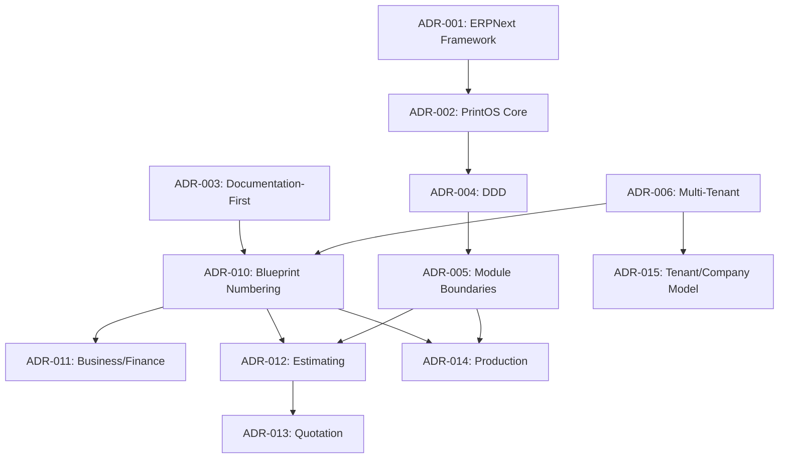

# Architecture Decision Records — Index

Version:
1.2

Status:
Draft

Owner:
PrintHub Architecture Team

Last Updated:
2026-07-22

---

# Purpose

This document is the navigation index for all Architecture Decision Records (ADRs) in `docs/decisions/`. It exists so that any contributor can see, at a glance, every architectural decision made, its status, and which terminology or structural conflict it resolves — without needing to open every ADR file individually.

---

# Scope

This document indexes every ADR in `docs/decisions/`. It does not restate any ADR's content — see the linked ADR for full Context, Decision, and Consequences.

---

# ADR Index

| ADR | Title | Status | Resolves |
|---|---|---|---|
| [ADR-001](ADR-001-ERPNext-Framework.md) | ERPNext Framework | Accepted | Foundational framework choice |
| [ADR-002](ADR-002-PrintOS-Core.md) | PrintOS Core | Accepted | ERPNext core never modified; all customization in `printos_core` |
| [ADR-003](ADR-003-Documentation-First.md) | Documentation-First | Accepted | Documentation-before-implementation workflow |
| [ADR-004](ADR-004-Domain-Driven-Design.md) | Domain-Driven Design | Accepted | DDD applied to `printos_core` |
| [ADR-005](ADR-005-Module-Boundaries.md) | Module Boundaries | Accepted | Modules align to bounded contexts |
| [ADR-006](ADR-006-MultiTenant-Strategy.md) | Multi-Tenant Strategy | Accepted (strategy); Implementation Deferred | Future multi-tenant SaaS design constraint |
| [ADR-007](ADR-007-Offline-First.md) | Offline-First | Accepted (strategy); Implementation Deferred | Offline sync as a future-first design consideration |
| [ADR-008](ADR-008-MachineIQ.md) | MachineIQ | Accepted (strategy); Scope Deferred | MachineIQ as a future, API-consumed analytics capability |
| [ADR-009](ADR-009-Marketplace.md) | Marketplace | Accepted | Marketplace postponed to Phase 5 |
| [ADR-010](ADR-010-Blueprint-Numbering-Strategy.md) | Blueprint Numbering Strategy | Accepted | Blueprint numbering collision (12–15 reserved vs. 11–20 scaffold) — resolved via 21–25 reservation |
| [ADR-011](ADR-011-Business-Finance-Terminology.md) | Business/Finance Terminology | Accepted | Accounts vs. Finance vs. Financial Management — Naming Decision Matrix item #4 |
| [ADR-012](ADR-012-Estimating-Terminology.md) | Estimating Terminology | Accepted | Estimating vs. Estimations vs. Estimation — Naming Decision Matrix item #2 |
| [ADR-013](ADR-013-Quotation-Terminology.md) | Quotation Terminology | Accepted | Quote vs. Quotation vs. Estimate vs. Proposal — Naming Decision Matrix item #7 |
| [ADR-014](ADR-014-Production-Terminology.md) | Production Terminology | Accepted | Production Planning/Management/Order, Job Card/Ticket/Work Order — Naming Decision Matrix items #8, #12 |
| [ADR-015](ADR-015-Tenant-Company-Multi-Tenancy-Model.md) | Tenant and Company Multi-Tenancy Model | Accepted | One isolated Frappe site and one isolated operational database per Tenant; Company is a distinct ERPNext legal/accounting entity inside a Tenant (one Tenant may contain one or more Companies) — companion to ADR-006, completing its deferred concrete topology; Naming Decision Matrix item #11 |

---

# ADR Relationships

---

# Pending Terminology Not Yet Covered by an ADR

Per `docs/standards/Naming_Registry.md` Section 27 (Naming Decision Matrix), the following items remain **Pending ADR** and are not yet resolved by ADR-011 through ADR-015 (item #11, "Tenant" vs. "Company," was resolved by ADR-015 and has been removed from this table):

| Matrix Item | Conflict |
|---|---|
| #1 | Event naming casing: snake_case vs. PascalCase |
| #3 | Purchasing (module) vs. Procurement (context) |
| #5 | Dispatch vs. Delivery |
| #6 | Customer vs. Client vs. Party |
| #9 | New "Quality" and "Maintenance" modules not yet in Blueprint |
| #10 | ERPNext "Item" vs. PrintOS "Material"/"Product Template" |
| #13 | "Vendor" (Marketplace) vs. "Supplier" |
| #14 | "Marketplace Quote"/"Marketplace Payment" vs. "Quotation"/"Payment" |
| #15 | "Delivery Partner" vs. "Dispatch" context |
| #16 | "Estimate" as print-industry term vs. rejected Quotation synonym (largely addressed by ADR-013, formal Matrix closure still pending) |
| #17 | "Production Batch" vs. "Batch"; "Machine Setup" vs. "Makeready" |

---

# Related Documents

- `docs/standards/Naming_Registry.md`
- `docs/blueprint/00_Master_Index.md`
- `docs/Documentation_Workflow.md`
- `docs/templates/ADR_Template.md`
- [Architecture_Review_Register.md](Architecture_Review_Register.md) — tracks unresolved review items (AR-001 onward) that may become future ADRs; this register is not itself an ADR and records questions, not decisions

---

# Revision History

| Version | Date | Author | Changes |
|----------|------|--------|---------|
|1.0|2026-07-22|Initial|Initial Version — populated index for ADR-001 through ADR-014 (previously empty placeholder)|
|1.1|2026-07-26|Owner-Verification Status Reconciliation|Status corrected from Published to Draft. The previous Published header was removed because formal Project Owner approval had not occurred (explicit Project Owner declaration, 2026-07-26); the document returns to its supported pre-publication Draft lifecycle status. This correction affects only this index document — no ADR changed status or decision state, and no index content changed.|
|1.2|2026-07-28|ADR-015 Registration|Registered ADR-015 (Tenant and Company Multi-Tenancy Model, Accepted, Version 1.0, 2026-07-28) in the ADR Index table, immediately following ADR-014, recording its decision summary and Naming Decision Matrix item #11 resolution. Added ADR-015 to the ADR Relationships diagram as a companion to ADR-006. Removed item #11 ("Tenant" vs. "Company") from the Pending Terminology table, since it is now Resolved via ADR-015, and updated the introductory sentence accordingly. Does not claim AR-002 is Resolved, does not claim `25_MultiTenant_Architecture.md` is Published, and does not authorize implementation. No other ADR's Status, Version, title, or decision summary changed.|

---

# Documentation Quality Checklist

- [x] All existing ADRs indexed
- [x] Status accurately reflects each ADR's own Status field
- [x] Relationships diagram matches actual cross-references
- [x] Pending (unresolved) Naming Decision Matrix items listed for visibility
- [ ] Reviewed by Project Owner
