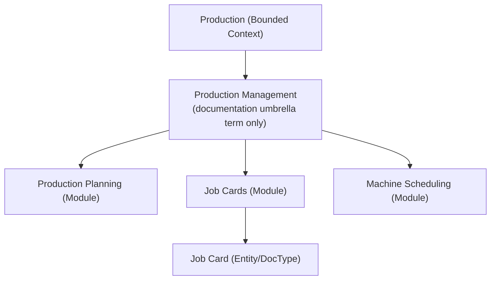

# ADR-014: Production Terminology

Status:
Accepted

Date:
2026-07-22

---

## Context

`docs/blueprint/09_PrintOS_Modules.md` names three Approved, distinct modules within the Production bounded context: **Production Planning**, **Job Cards**, and **Machine Scheduling**. `docs/blueprint/05_Domain_Model.md` names **Job Card** as the Approved production-execution entity. Separately, `docs/blueprint/15_Production_Management.md` exists as a Placeholder Blueprint document (part of the 11–20 scaffold reconciled by [ADR-010-Blueprint-Numbering-Strategy.md](ADR-010-Blueprint-Numbering-Strategy.md)), and `docs/standards/Naming_Registry.md` Section 27a flagged "Production Management" as a possible synonym of "Production Planning" without resolving the question. This task additionally raises "Production Order," "Job Ticket," and "Work Order" as candidate terms, all previously recorded in `Naming_Registry.md` as Proposed (Section 6) or Synonym Registry entries (Section 25) tied to Naming Decision Matrix items #8 and #12.

## Problem Statement

How do Production Planning, Production Management, Production Order, Job Card, Job Ticket, and Work Order relate to one another — which are the same concept under different names, which are genuinely distinct, and what is the canonical hierarchy?

## Decision Drivers

- Single meaning per term, no synonyms in active use (`Naming_Registry.md` Section 2).
- Preserving already-Approved, Published Blueprint entities and modules (Job Card, Production Planning, Machine Scheduling) without unnecessary renaming.
- Distinguishing a **documentation-level umbrella topic** (suitable as a Blueprint chapter title) from an **implementation-level module or entity name** (suitable as a DocType, API resource, or UI label) — these serve different purposes and need not collapse into one term.
- Avoiding proliferation of near-synonymous execution-record entities (Job Card vs. Production Order vs. Job Ticket vs. Work Order) when one already-Approved entity (Job Card) fully covers the concept.

## Options Considered

1. **Treat "Production Management" as a documentation-level umbrella term** covering Production Planning + Job Cards + Machine Scheduling collectively, while leaving each existing module name unchanged; treat "Production Order," "Job Ticket," and "Work Order" as deprecated synonyms of the single Approved "Job Card" entity.
2. **Merge Production Planning, Job Cards, and Machine Scheduling into one module named "Production Management,"** replacing all three. Rejected: this would require restructuring three already-Published, Approved modules in `09_PrintOS_Modules.md` for a naming preference, and would lose the deliberate separation of planning/execution/scheduling concerns established in `06_Bounded_Contexts.md`.
3. **Introduce "Production Order" as a genuinely distinct entity** upstream of Job Card (e.g., one Production Order spawning multiple Job Cards). Rejected for this ADR: no business requirement in `docs/blueprint/02_Business_Requirements.md` or `10_Business_Workflows.md` currently describes a one-to-many relationship between a higher-level order and multiple Job Cards; introducing the entity now would be speculative. Revisit if a concrete business need for order-to-multiple-jobs splitting is documented (see Future Considerations equivalent in Consequences).
4. **Keep "Job Ticket" and "Work Order" as regionally/contextually acceptable synonyms of Job Card**, used interchangeably. Rejected: violates the no-synonyms-in-active-use principle and directly conflicts with the Naming Registry's already-rejected ambiguous abbreviation "WO" (Section 19), which exists precisely because "Work Order" was already flagged as confusable.

## Decision

**Canonical hierarchy:**

| Term | Status | Layer / Usage |
|---|---|---|
| Production Planning | Approved (unchanged) | Module name — capacity planning and scheduling activity |
| Job Cards | Approved (unchanged) | Module name — production execution tracking |
| Machine Scheduling | Approved (unchanged) | Module name — machine assignment |
| Job Card | Approved (unchanged) | Entity / future DocType name — the sole production-execution record |
| Production Management | **Approved, but only as a documentation umbrella term** | Used as a Blueprint chapter/document title (e.g., `docs/blueprint/15_Production_Management.md`) referring to Production Planning + Job Cards + Machine Scheduling collectively. **Not** used as a module name, DocType, API resource, or UI label. |
| Production Order | **Rejected — not adopted** | No distinct entity introduced; superseded by Job Card |
| Job Ticket | Deprecated | Synonym of Job Card |
| Work Order | Deprecated | Synonym of Job Card |

**Business usage:** "Job Card" in all business communication, reports, and UI.

**Technical usage:** DocType name "Job Card"; API resource `job-cards`; no "Production Order" DocType is created.

**Future DocType naming:** Only "Job Card" is designated as a production-execution DocType. If a genuine one-to-many need (one order, many Job Cards) is documented in the future, it must go through this same ADR process as a new proposal, not be assumed from this decision.

**Workflow naming:** Unchanged — the Job Card Lifecycle states already defined in `docs/blueprint/10_Business_Workflows.md` and `docs/standards/Workflow_Standards.md` (Scheduled, In Progress, Quality Check, Rework, Complete) continue to apply to Job Card without modification.

## Consequences

- This ADR resolves `docs/standards/Naming_Registry.md` Naming Decision Matrix items #8 (Job Card vs. Job Ticket vs. Work Order) and #12 (Production Order vs. Job Card), and closes the Section 27a flag on "Production Management" vs. "Production Planning."
- `docs/blueprint/15_Production_Management.md` (Placeholder) may proceed to be written as a documentation umbrella chapter without renaming any existing module.
- No currently-Published Blueprint document requires content changes.
- If a future business requirement genuinely needs an order-level grouping above Job Card, that requires a new ADR — this decision does not preclude it, but does not pre-approve it either.

## Alternatives Rejected

- Merging Production Planning/Job Cards/Machine Scheduling into one "Production Management" module — rejected per Options Considered, item 2.
- Adopting "Production Order" as a distinct entity now — rejected per Options Considered, item 3, as speculative without documented business need.
- Treating "Job Ticket"/"Work Order" as acceptable interchangeable synonyms — rejected per Options Considered, item 4.

## Migration Strategy

1. This ADR is accepted as the authority resolving Naming Decision Matrix items #8 and #12, and the Section 27a "Production Management" flag.
2. In a subsequent documentation task, `docs/standards/Naming_Registry.md` should: move "Job Ticket," "Work Order," and "Production Order" into the Deprecated Names table (Section 28) referencing this ADR; update the Section 27a entry for "Production Management" to record it as Approved-for-documentation-use-only, referencing this ADR; close Matrix items #8 and #12.
3. This ADR does not perform that update itself, consistent with this task's instruction to create ADRs only.

## Related Documents

- `docs/blueprint/05_Domain_Model.md` (Job Card entity)
- `docs/blueprint/06_Bounded_Contexts.md` (Production context)
- `docs/blueprint/09_PrintOS_Modules.md` (Production Planning, Job Cards, Machine Scheduling modules)
- `docs/blueprint/10_Business_Workflows.md` (Job Card Lifecycle)
- `docs/blueprint/15_Production_Management.md` (Placeholder)
- `docs/standards/Workflow_Standards.md`
- `docs/standards/Naming_Registry.md` (Sections 6, 19, 25, 27, 27a)

## Related ADRs

- [ADR-010-Blueprint-Numbering-Strategy.md](ADR-010-Blueprint-Numbering-Strategy.md) (established the 11–20 scaffold this ADR's "Production Management" placeholder belongs to)
- [ADR-005-Module-Boundaries.md](ADR-005-Module-Boundaries.md) (module-to-context alignment principle)

---

# Revision History

| Version | Date | Author | Changes |
|----------|------|--------|---------|
|1.0|2026-07-22|Initial|Initial Version|

---

# Quality Checklist

- [x] Problem Statement clearly scoped
- [x] Decision Drivers stated
- [x] Options Considered documented, including rejected options
- [x] Decision is unambiguous, with explicit hierarchy diagram
- [x] Consequences stated
- [x] Migration Strategy does not exceed this task's scope (no direct Blueprint/Registry edits)
- [x] Related Documents and Related ADRs cross-referenced
- [ ] Reviewed by Project Owner
