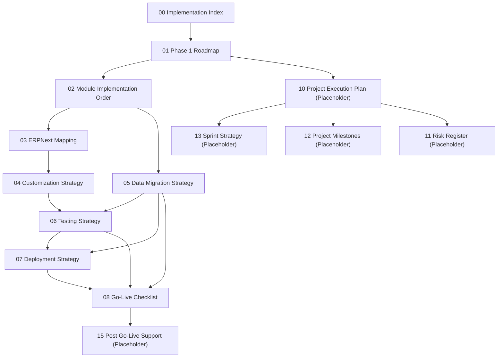

# Implementation Documentation — Master Index

Version:
0.1

Status:
Draft

Owner:
PrintHub Architecture Team

Last Updated:
2026-07-23

---

# Purpose

Master navigation hub for `docs/implementation/` — the planning documents that translate Blueprint, Business, Architecture, Technical, Database, and Configuration documentation into a concrete, sequenced delivery plan. This category answers "how and in what order do we build this," never "what is this" or "why is it designed this way."

---

# Scope

Covers navigation, phase overview, document dependencies, and status tracking for all documents in `docs/implementation/`. Does not define architecture, business rules, or naming — every substantive claim in this folder must trace to an existing Blueprint, Business, Architecture, Technical, Database, Configuration, Standards, or ADR document. Where no such source exists, the gap is documented as an Open Question, never invented.

---

# Background

Per `docs/Documentation_Workflow.md` Section 3, Implementation sits below Reviews and above Testing/Deployment in the Documentation Hierarchy — it is downstream of every other category. This index exists because, until now, no document translated the (now substantial) Blueprint/Business/Architecture/Technical/Database/Configuration documentation set into an actual build sequence.

---

# Main Content

## Document Status Legend

| Status | Meaning |
|---|---|
| Draft | Actively being written; not yet safe to build against, per `docs/Documentation_Workflow.md` Section 5 |
| Placeholder | File exists but is empty; reserved for planned content |

## Document Index

| # | Document | Purpose | Status |
|---|---|---|---|
| 00 | 00_Implementation_Index.md | This document — navigation and index | Draft |
| 01 | [01_Phase_1_Roadmap.md](01_Phase_1_Roadmap.md) | Technical implementation phases (distinct from Blueprint's business roadmap phases — see that document's Terminology & Sequencing Conflicts section) | Draft |
| 02 | [02_Module_Implementation_Order.md](02_Module_Implementation_Order.md) | Module-by-module build sequence and dependencies | Draft |
| 03 | [03_ERPNext_Mapping.md](03_ERPNext_Mapping.md) | Business concept → ERPNext object mapping (Reuse/Extend/Custom) | Draft |
| 04 | [04_Customization_Strategy.md](04_Customization_Strategy.md) | How ERPNext is customized, governed, and reviewed | Draft |
| 05 | [05_Data_Migration_Strategy.md](05_Data_Migration_Strategy.md) | Migration principles, phases, validation, rollback | Draft |
| 06 | [06_Testing_Strategy.md](06_Testing_Strategy.md) | Testing philosophy and pyramid across Clean Architecture layers | Draft |
| 07 | [07_Deployment_Strategy.md](07_Deployment_Strategy.md) | Deployment planning: environments, backup, monitoring, CI/CD readiness | Draft |
| 08 | [08_Go_Live_Checklist.md](08_Go_Live_Checklist.md) | Go-live readiness checklist and sign-off matrix | Draft |
| 09 | 09_Coding_Standards_Implementation.md | Applying `docs/standards/Coding_Standards.md` in practice | Placeholder |
| 10 | 10_Project_Execution_Plan.md | Overall execution plan tying phases to delivery | Placeholder |
| 11 | 11_Risk_Register.md | Project-level risk tracking | Placeholder |
| 12 | 12_Project_Milestones.md | Milestone tracking (see also `docs/milestones/`) | Placeholder |
| 13 | 13_Sprint_Strategy.md | Sprint planning approach | Placeholder |
| 14 | 14_Release_Checklist.md | Per-release readiness checklist (distinct from one-time Go-Live) | Placeholder |
| 15 | 15_Post_GoLive_Support.md | Hypercare and post-go-live support model | Placeholder |
| — | [Module_Dependency_Matrix.md](Module_Dependency_Matrix.md) | What must exist before each module can be implemented, by dependency category; direct blockers vs. transitive delays; formalizes the approved implementation dependency review | Draft |

## Document Dependency Graph

## Roadmap Overview

This folder plans delivery of Blueprint Phase 1 (PrintOS ERP, per [../blueprint/03_Product_Roadmap.md](../blueprint/03_Product_Roadmap.md)) using the technical phase structure defined in [01_Phase_1_Roadmap.md](01_Phase_1_Roadmap.md). That document explicitly documents — rather than resolves — a phase-numbering conflict between its own technical phases and the Blueprint's business phases; readers should consult it directly before assuming any phase alignment.

## Status Tracking

| Category | Documents Complete | Documents Placeholder | Overall |
|---|---|---|---|
| Implementation (this folder) | 10 of 16 (00, 01–08, Module_Dependency_Matrix) | 7 of 16 (09–15) | Early Draft |

## Cross-Cutting Rule (Non-Negotiable)

Every document in this folder:

- Must not redefine architecture (`docs/architecture/`, `docs/technical/`) — it may only reference and sequence it.
- Must not redefine business rules (`docs/blueprint/`, `docs/business/`) — it may only reference and plan against them.
- Must not introduce new terminology (`docs/standards/Naming_Registry.md` is the sole naming authority) — any apparent gap or conflict is documented, with a citation to the governing ADR or Naming Registry entry, and left unresolved for the Project Owner/Architecture Review.

---

# Architecture Notes

This index and its constituent documents are deliberately downstream-only: they consume Blueprint, Business, Architecture, Technical, Database, and Configuration documentation as fixed inputs. Where implementation planning surfaces a gap in one of those upstream categories (e.g. Machine vs. Asset mapping in [03_ERPNext_Mapping.md](03_ERPNext_Mapping.md)), the correct response is to raise it as an Open Question there and escalate to Architecture Review — never to quietly decide it within an Implementation document.

---

# Future Considerations

- Documents 09–15 remain Placeholder and should be populated once 00–08 have been reviewed and the phase-numbering conflict in [01_Phase_1_Roadmap.md](01_Phase_1_Roadmap.md) has at least been acknowledged by Architecture Review, so later documents (Sprint Strategy, Project Execution Plan) aren't built on an unresolved numbering ambiguity.
- As Pending ADR items referenced throughout this folder (Tenant vs. Company, Purchasing vs. Procurement, Item vs. Material, Machine vs. Asset) are resolved, the affected Implementation documents ([02_Module_Implementation_Order.md](02_Module_Implementation_Order.md), [03_ERPNext_Mapping.md](03_ERPNext_Mapping.md)) must be updated accordingly.

---

# Open Questions

- Should documents 09–15 be drafted now as working outlines, or intentionally held back until 00–08 pass Architecture Review, given several depend on decisions ([01_Phase_1_Roadmap.md](01_Phase_1_Roadmap.md)'s phase-numbering conflict) that are not yet resolved?
- Who owns closing the Pending ADR items this folder repeatedly surfaces as blocking (see [03_ERPNext_Mapping.md](03_ERPNext_Mapping.md) Open Questions in particular)?

---

# Related Documents

- [../Documentation_Map.md](../Documentation_Map.md)
- [../Documentation_Status.md](../Documentation_Status.md)
- [../blueprint/00_Master_Index.md](../blueprint/00_Master_Index.md)
- [../architecture/00_Architecture_Index.md](../architecture/00_Architecture_Index.md)
- [../configuration/00_Master_Index.md](../configuration/00_Master_Index.md)
- [../standards/Naming_Registry.md](../standards/Naming_Registry.md)
- [../decisions/00_ADR_Index.md](../decisions/00_ADR_Index.md)

---

# Revision History

| Version | Date | Author | Changes |
|---|---|---|---|
| 0.1 | 2026-07-23 | Initial | Initial working draft. Indexed documents 00–08 (populated) and 09–15 (Placeholder), documented status tracking and the cross-cutting non-redefinition rule. |

---

# Documentation Quality Checklist

- [ ] Technically accurate
- [ ] Business terminology verified
- [ ] Cross-references updated
- [ ] Mermaid diagrams validated
- [ ] No implementation code included
- [ ] Future roadmap considered
- [ ] Reviewed by Project Owner
