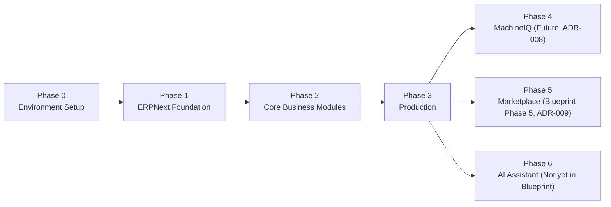

# 01 — Phase 1 Roadmap (Implementation)

Version:
0.2

Status:
Draft

Owner:
PrintHub Architecture Team

Last Updated:
2026-09-20

---

# Purpose

Describe the technical **implementation phases** required to deliver `docs/blueprint/03_Product_Roadmap.md`'s Phase 1 (PrintOS ERP, G2 Print Shops) — i.e., how Phase 1 is built, not what Phase 1 is. This document sequences implementation work; it does not define or alter the business roadmap itself.

---

# Scope

Covers technical delivery phases (environment setup through Marketplace/AI-assistant readiness, as scoped below) for implementing PrintOS. Does not define business requirements ([../blueprint/02_Business_Requirements.md](../blueprint/02_Business_Requirements.md)), business roadmap phases ([../blueprint/03_Product_Roadmap.md](../blueprint/03_Product_Roadmap.md)), architecture ([../architecture/](../architecture/), [../technical/](../technical/)), or naming ([../standards/Naming_Registry.md](../standards/Naming_Registry.md)). Where this document's phase names appear to overlap with Blueprint concepts, the conflict is documented in **Terminology & Sequencing Conflicts** below, not resolved.

---

# Background

`docs/blueprint/03_Product_Roadmap.md` defines five **business/delivery phases** sequenced by user group: Phase 1 PrintOS ERP (G2), Phase 2 Freelancer Portal (G3), Phase 3 Supplier Portal (G4), Phase 4 Service Engineers (G5), Phase 5 Marketplace (G1). That document explicitly excludes "detailed sprint planning" and states MachineIQ and mobile applications are "not yet assigned to a specific phase" (Open Questions).

This document was commissioned using a different, **technical implementation phase** structure (Phase 0 Environment Setup → Phase 6 AI Assistant) that numbers phases by technical delivery step rather than by user group, and that assigns MachineIQ, Marketplace, and a new "AI Assistant" phase into that sequence. This is a distinct phase numbering scheme from the Blueprint's, addressed explicitly below rather than silently merged with it.

---

# Main Content

## Terminology & Sequencing Conflicts (Not Resolved Here)

| # | Conflict | Governing Reference | Disposition |
|---|---|---|---|
| 1 | This document's "Phase 1" through "Phase 6" are **technical implementation phases**, numbered differently from `03_Product_Roadmap.md`'s **business phases** 1–5 (G2→G3→G4→G5→G1). The two numbering schemes are not the same sequence and must not be conflated. | [../blueprint/03_Product_Roadmap.md](../blueprint/03_Product_Roadmap.md) | Documented here; renaming either scheme requires an Architecture Review decision, not a unilateral choice by this document. |
| 2 | This document's technical phases (Environment Setup, ERPNext Foundation, Core Business Modules, Production, MachineIQ, Marketplace, AI Assistant) all fall within delivering Blueprint's **business Phase 1** (PrintOS ERP for G2), except the MachineIQ, Marketplace, and AI Assistant phases, which correspond to Blueprint's **Phase 5** (Marketplace) and to capability the Blueprint has not yet phased at all. | `03_Product_Roadmap.md` Open Questions ("MachineIQ... not yet assigned to a specific phase") | Documented as an open gap; not resolved here. |
| 3 | Blueprint Phase 2–4 (Freelancer Portal, Supplier Portal, Service Engineers — G3/G4/G5) have **no corresponding technical implementation phase** in this document's requested structure. | `03_Product_Roadmap.md` | Flagged as a sequencing gap in Open Questions below — this document does not assume those phases are skipped, only that they are not yet scoped technically. |
| 4 | "AI Assistant" is used below as a technical phase name. It is registered as a **Proposed name only** in `docs/standards/Naming_Registry.md` Section 40 ([Architecture Review Register](../decisions/Architecture_Review_Register.md) AR-003, Resolved 2026-09-19), with no Approved Bounded Context, Blueprint concept, architecture, provider, model, plugin design, implementation owner, or implementation authorization. | `Naming_Registry.md` Section 40 (AR-003 Naming Alignment Disposition) | Used here only as a placeholder label for a future capability; the term itself is already registered — what remains is separate Blueprint scoping and architecture governance before it may appear in any Approved document, module name, or DocType. |

## Technical Implementation Phases

These are **technical delivery phases**, not a replacement for or reordering of `03_Product_Roadmap.md`'s business phases. Phases 0–3 deliver Blueprint's business Phase 1 (PrintOS ERP). Phases 4–6 extend beyond current Blueprint scope and are marked accordingly.

```mermaid
gantt
    title Technical Implementation Phases (Conceptual Sequence, Not Scheduled)
    dateFormat  X
    axisFormat %s
    section Foundation
    Phase 0 - Environment Setup      :t0, 0, 1
    Phase 1 - ERPNext Foundation     :t1, after t0, 1
    section Core Delivery (Blueprint Phase 1)
    Phase 2 - Core Business Modules  :t2, after t1, 1
    Phase 3 - Production             :t3, after t2, 1
    section Beyond Current Blueprint Scope
    Phase 4 - MachineIQ              :t4, after t3, 1
    Phase 5 - Marketplace            :t5, after t3, 1
    Phase 6 - AI Assistant           :t6, after t3, 1
```

### Phase 0 — Environment Setup

- **Objectives:** Establish a working, verified development environment for `printos_core` on ERPNext v16/Frappe, per [../blueprint/07_Technology_Stack.md](../blueprint/07_Technology_Stack.md) and `CLAUDE.md`'s workspace/verification rules.
- **Deliverables:** Local Docker-based dev environment; Git repository structure per `docs/standards/Git_Workflow.md`/`Branching_Strategy.md`; base ERPNext v16 install with no core modifications.
- **Dependencies:** None (foundational phase).
- **Risks:** Environment drift between contributors if setup steps are undocumented — mitigate via a reproducible setup script/Docker configuration (implementation artifact, not covered here).
- **Success Criteria:** A contributor can stand up a working ERPNext instance from a documented, repeatable process.
- **Exit Criteria:** ERPNext instance running with `printos_core` app installed and no core files modified.
- **Estimated Complexity:** Low.

### Phase 1 — ERPNext Foundation

- **Objectives:** Establish the Clean Architecture scaffold (`domain/`, `application/`, `infrastructure/`, `interface/`) per [../technical/05_Project_Structure.md](../technical/05_Project_Structure.md), and confirm ERPNext extension points work as expected before business modules are built on top.
- **Deliverables:** `printos_core` app skeleton; Company/Branch setup confirming the tenant-scope anchor from [ADR-006](../decisions/ADR-006-MultiTenant-Strategy.md); baseline hooks.py wiring.
- **Dependencies:** Phase 0 complete.
- **Risks:** Skipping this foundation and jumping directly to business modules risks Domain/Application code accreting `frappe` dependencies (the failure mode [../architecture/02_Clean_Architecture.md](../architecture/02_Clean_Architecture.md) exists to prevent).
- **Success Criteria:** A trivial end-to-end vertical slice (one Domain entity through to one Interface endpoint) proves the layering works before real business modules are built.
- **Exit Criteria:** Architecture Review confirms the scaffold matches [../technical/03_Layer_Architecture.md](../technical/03_Layer_Architecture.md) and [../technical/04_Dependency_Rules.md](../technical/04_Dependency_Rules.md).
- **Estimated Complexity:** Medium.

### Phase 2 — Core Business Modules

- **Objectives:** Implement the Phase 1 (Blueprint) business modules in Approved dependency order — see [02_Module_Implementation_Order.md](02_Module_Implementation_Order.md) for the module-by-module sequence, which this phase does not restate.
- **Deliverables:** CRM, Sales, Estimation, Artwork, Inventory, Purchasing, Warehouse, Dispatch, Accounts, GST, HR, Administration modules functioning per [../blueprint/09_PrintOS_Modules.md](../blueprint/09_PrintOS_Modules.md).
- **Dependencies:** Phase 1 complete.
- **Risks:** Module sequencing errors (e.g. building Sales before Estimation exists) — mitigated by following [02_Module_Implementation_Order.md](02_Module_Implementation_Order.md).
- **Success Criteria:** Each module satisfies the acceptance criteria in [06_Testing_Strategy.md](06_Testing_Strategy.md).
- **Exit Criteria:** All Phase 1 non-Production modules pass their defined test suite and a Business Review confirms alignment with [../blueprint/10_Business_Workflows.md](../blueprint/10_Business_Workflows.md).
- **Estimated Complexity:** High.

### Phase 3 — Production

- **Objectives:** Implement Production Planning, Job Cards, and Machine Scheduling — the Core Domain per [../blueprint/05_Domain_Model.md](../blueprint/05_Domain_Model.md) — including their dependency on Estimation, Artwork, and Inventory delivered in Phase 2.
- **Deliverables:** Production Planning, Job Cards, Machine Scheduling modules; Quality Check Record capability per [../blueprint/06_Bounded_Contexts.md](../blueprint/06_Bounded_Contexts.md).
- **Dependencies:** Phase 2 complete (Estimation, Artwork, Inventory).
- **Risks:** Machine Scheduling complexity may warrant reconsidering its Bounded Context boundary — see the Open Question already recorded in [../blueprint/06_Bounded_Contexts.md](../blueprint/06_Bounded_Contexts.md).
- **Success Criteria:** End-to-end Production Workflow (per `10_Business_Workflows.md`) executes correctly from Approved Artwork through Finished Goods.
- **Exit Criteria:** Full Phase 1 (Blueprint) business scope is deliverable end-to-end.
- **Estimated Complexity:** High.

### Phase 4 — MachineIQ *(beyond current Blueprint scope)*

- **Objectives:** Not yet defined. Per [ADR-008-MachineIQ](../decisions/ADR-008-MachineIQ.md), MachineIQ's scope is deferred to a future scoping document.
- **Deliverables:** None defined; placeholder pending scoping.
- **Dependencies:** Phase 3 (Production/Reporting data must exist for MachineIQ to consume).
- **Risks:** Beginning implementation before a Blueprint scoping document exists would violate Documentation-First (`docs/Documentation_Workflow.md`).
- **Success Criteria / Exit Criteria:** Not defined until MachineIQ is scoped.
- **Estimated Complexity:** Unknown — not yet scoped.

### Phase 5 — Marketplace *(Blueprint Phase 5)*

- **Objectives:** Deliver `03_Product_Roadmap.md`'s Phase 5 (Marketplace, G1 Public Buyers), per [ADR-009-Marketplace](../decisions/ADR-009-Marketplace.md).
- **Deliverables:** Not yet defined; deferred pending Marketplace scoping.
- **Dependencies:** Phase 3 (Dispatch/CRM/Sales must exist as Marketplace order-routing targets, per [../blueprint/06_Bounded_Contexts.md](../blueprint/06_Bounded_Contexts.md)'s Marketplace context definition). Note: per Blueprint sequencing, Phases 2–4 (Freelancer, Supplier, Service Engineer) precede Marketplace; this technical phase list does not include those phases (see Conflict #3 above).
- **Risks:** Implementing Marketplace ahead of Blueprint's own Phase 2–4 sequencing would contradict the Blueprint's stated rationale ("marketplace functionality is deliberately deferred until the ERP core is proven" — `03_Product_Roadmap.md` Background).
- **Success Criteria / Exit Criteria:** Not defined until Marketplace is scoped.
- **Estimated Complexity:** Unknown — not yet scoped.

### Phase 6 — AI Assistant *(registered as Proposed only; not yet scoped in Blueprint)*

- **Objectives:** Not defined. "AI Assistant" does not appear in `03_Product_Roadmap.md` or `09_PrintOS_Modules.md`; it is registered in `Naming_Registry.md` Section 40 as a **Proposed name only** ([Architecture Review Register](../decisions/Architecture_Review_Register.md) AR-003, Resolved 2026-09-19), with no Approved Bounded Context, architecture, provider, model, plugin design, implementation owner, or implementation authorization.
- **Deliverables / Dependencies / Risks / Success Criteria / Exit Criteria:** Cannot be defined without a separate Blueprint scoping document and architecture governance decision — the naming question itself is already resolved (Proposed) and is not what remains outstanding here. This phase remains an unscoped placeholder only.
- **Estimated Complexity:** Unknown — not yet scoped.

---

# Architecture Notes

This document does not alter `../blueprint/03_Product_Roadmap.md`'s business phase sequencing, its stated rationale for deferring Marketplace, or its Open Question about MachineIQ's phase placement. Where this document's technical phases reference future capability (MachineIQ, Marketplace, AI Assistant), it explicitly defers to the Blueprint and ADR process rather than inventing scope.

---

# Future Considerations

- Once Freelancer Portal, Supplier Portal, and Service Engineer phases (Blueprint Phases 2–4) are technically scoped, this document should gain corresponding implementation phases between Phase 3 and Phase 5 here, closing Conflict #3.
- "AI Assistant" is already registered as Proposed (AR-003 Resolved); before this document can leave Draft status, it still requires a separate Blueprint scoping document and architecture governance decision, or removal from this document if that scoping is not pursued.

---

# Open Questions

- Should this document's technical phase numbers be renamed (e.g. "Increment 0–6" or "Sprint Group A–G") to avoid colliding with Blueprint's Phase 1–5 numbering, given they are demonstrably not the same sequence?
- Where do Freelancer Portal, Supplier Portal, and Service Engineer implementation work fit in this technical phase list?
- "AI Assistant" is already registered as a Naming Registry Proposed term (AR-003 Resolved); should it be scoped as a Blueprint capability, with an Approved Bounded Context and architecture, before appearing in any implementation document again in a non-placeholder capacity?

---

# Related Documents

- [00_Implementation_Index.md](00_Implementation_Index.md)
- [02_Module_Implementation_Order.md](02_Module_Implementation_Order.md)
- [../blueprint/03_Product_Roadmap.md](../blueprint/03_Product_Roadmap.md)
- [../blueprint/09_PrintOS_Modules.md](../blueprint/09_PrintOS_Modules.md)
- [../decisions/ADR-008-MachineIQ.md](../decisions/ADR-008-MachineIQ.md)
- [../decisions/ADR-009-Marketplace.md](../decisions/ADR-009-Marketplace.md)
- [../standards/Naming_Registry.md](../standards/Naming_Registry.md)

---

# Revision History

| Version | Date | Author | Changes |
|---|---|---|---|
| 0.1 | 2026-07-23 | Initial | Initial working draft. Documented (not resolved) the phase-numbering conflict between this document's technical implementation phases and `03_Product_Roadmap.md`'s business phases, and flagged "AI Assistant" as an unregistered term. |
| 0.2 | 2026-09-20 | AR-003 Disposition Synchronization | Corrected every active statement describing "AI Assistant" as unregistered, following [Architecture Review Register](../decisions/Architecture_Review_Register.md) AR-003's Resolved disposition (2026-09-19): Conflict #4, the Phase 6 heading and Objectives/Deliverables text, the Future Considerations bullet, and the Open Questions bullet now record that "AI Assistant" is registered as a **Proposed name only** (`Naming_Registry.md` Section 40), with no Approved Bounded Context, Blueprint concept, architecture, provider, model, plugin design, implementation owner, or implementation authorization. Technical Phase 6 remains an **unscoped placeholder only**; what remains outstanding is a separate Blueprint scoping document and architecture governance decision, not Naming Registry proposal, which is already complete. The pre-existing phase-numbering conflict between this document's technical phases and `03_Product_Roadmap.md`'s business phases is **not resolved or renamed** by this correction. Historical Revision History row 0.1 is preserved unchanged. No implementation was authorized; no Blueprint, ADR, or Architecture Review Register item was modified. |

---

# Documentation Quality Checklist

- [ ] Technically accurate
- [ ] Business terminology verified
- [ ] Cross-references updated
- [ ] Mermaid diagrams validated
- [ ] No implementation code included
- [ ] Future roadmap considered
- [ ] Reviewed by Project Owner
