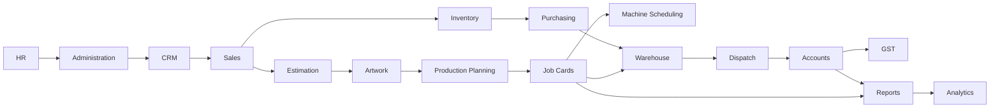

# 02 — Module Implementation Order

Version:
0.2

Status:
Draft

Owner:
PrintHub Architecture Team

Last Updated:
2026-09-20

---

# Purpose

Define the recommended build sequence for PrintOS's Phase 1 modules, based strictly on the module catalog in [../blueprint/09_PrintOS_Modules.md](../blueprint/09_PrintOS_Modules.md), the dependency relationships in [../blueprint/06_Bounded_Contexts.md](../blueprint/06_Bounded_Contexts.md), and the Module Registry in [../standards/Naming_Registry.md](../standards/Naming_Registry.md) Section 11. No module is invented here.

---

# Scope

Covers implementation sequencing and per-module dependencies for the Approved Phase 1 modules only. Does not define module features (see `09_PrintOS_Modules.md`), redefine bounded contexts, or introduce new modules. "Quality" and "Maintenance," requested informally elsewhere, are **not** included here because they are Pending ADR, not yet Approved modules (Naming Registry Section 27, item 9) — see Open Questions.

---

# Background

`09_PrintOS_Modules.md` lists 19 modules/sub-modules for Phase 1 and Future. It does not itself state a build order — it is a functional catalog, not a delivery plan. This document adds that missing sequencing layer without altering the catalog.

---

# Main Content

## Dependency Diagram

Derived directly from the Context Map in [../blueprint/06_Bounded_Contexts.md](../blueprint/06_Bounded_Contexts.md):

## Module Sequencing Table

Each row's dependencies are sourced from `06_Bounded_Contexts.md` (Inputs/Outputs per context) and `08_Master_Data_Model.md` (master data ownership). "Recommended Sprint" and "Estimated Effort" are implementation-planning placeholders, not architectural facts, and should be replaced with real estimates once sprint planning begins (see [13_Sprint_Strategy.md](13_Sprint_Strategy.md), currently a placeholder).

| Module | Business Dependency | Technical Dependency | Database Dependency | Configuration Dependency | ERPNext Dependency | Required Preceding Modules | Recommended Sprint | Estimated Effort | Risk | Priority |
|---|---|---|---|---|---|---|---|---|---|---|
| Administration | None — foundational (`06_Bounded_Contexts.md`) | Clean Architecture scaffold ([01_Phase_1_Roadmap.md](01_Phase_1_Roadmap.md) Phase 1) | Company, Branch ([../database/03_Master_Data.md](../database/03_Master_Data.md)) | Role & Permission Designer ([../configuration/09_Role_Permission_Designer.md](../configuration/09_Role_Permission_Designer.md)) | ERPNext core Company/Branch/User/Role | None | 1 | Medium | Low | Critical |
| HR | Administration | — | Employee, Department | — | ERPNext core HR | Administration | 1 | Low | Low | High |
| CRM | Administration | — | Customer (usage) | Module Manager ([../configuration/02_Module_Manager.md](../configuration/02_Module_Manager.md)) | ERPNext Customer/Contact | Administration | 2 | Medium | Low | High |
| Sales | CRM, Estimation (approved Quotations) | — | Customer, Price List | Workflow Designer | ERPNext Sales Order (extended) | CRM, Estimation | 3 | High | Medium | Critical |
| Estimation | CRM (enquiry) | Pricing calculation logic (Domain layer) | Product Template, Material, Machine Profile | Form Designer | None core-native; largely custom | CRM | 2 | High | Medium | Critical |
| Artwork | Sales Order confirmed | File storage/versioning | Artwork (transactional, not master data) | Approval Designer | ERPNext File attachment mechanism | Sales | 3 | Medium | Medium | High |
| Production Planning | Approved Artwork, confirmed Sales Order | — | Job Types, Finishing Types | Workflow Designer | — | Sales, Artwork | 4 | High | Medium | Critical |
| Job Cards | Production Planning | — | Job Card (transactional) | Workflow, Approval Designers | — | Production Planning | 4 | High | High | Critical |
| Machine Scheduling | Job Cards, Machine Profiles | — | Machine, Machine Profile | — | None (Custom, AR-004 Resolved Option C) | Job Cards | 5 | High | High | Critical |
| Inventory | Sales/Production consumption | — | Material, Substrate, Media Profiles | — | ERPNext Stock Ledger (extended) | Sales | 3 | Medium | Medium | High |
| Purchasing | Inventory replenishment signal | — | Supplier | — | ERPNext Purchase Order | Inventory | 4 | Medium | Low | Medium |
| Warehouse | Purchasing receipts, Production output | — | Warehouse | — | ERPNext Warehouse | Purchasing, Job Cards | 4 | Medium | Low | Medium |
| Dispatch | Finished goods from Warehouse | — | Delivery Method | — | ERPNext Delivery Note | Warehouse | 5 | Medium | Low | High |
| Accounts | Dispatch confirmation | — | Tax Template, Payment Terms, Currency | — | ERPNext core Accounts | Dispatch | 5 | Low | Low | Critical |
| GST | Accounts | — | GST Configuration | — | ERPNext core Tax | Accounts | 5 | Low | Low | High |
| Reports | Data from all transactional modules | — | — | Report Designer | — | All above | 6 | Medium | Low | Medium |
| Analytics | Reports | — | — | Dashboard Designer | — | Reports | 6 | Medium | Low | Low |
| MachineIQ (Future) | Reporting, Production | Not yet scoped | Not yet scoped | Integration Designer (future) | Not yet scoped | Reports, Machine Scheduling | Not yet scoped | Unknown | Unknown | Future |
| Marketplace (Future) | CRM, Sales, Dispatch | Not yet scoped | Not yet scoped | Integration Designer (future) | Not yet scoped | CRM, Sales, Dispatch | Not yet scoped | Unknown | Unknown | Future |

---

# Architecture Notes

Sequencing above follows the Context Map dependency direction exactly; no module is scheduled ahead of a module whose output it consumes as an Input per `06_Bounded_Contexts.md`. Where a dependency is bidirectional in practice (e.g. Job Cards and Warehouse both interact with Inventory), the sequencing favors whichever direction the majority of Business Workflows in [../blueprint/10_Business_Workflows.md](../blueprint/10_Business_Workflows.md) establish as primary.

---

# Future Considerations

- Purchasing vs. Procurement naming (Naming Registry Section 27, item 3, Pending ADR) should be resolved before this table is finalized, since "Purchasing" is used here only because it is the current module name in `09_PrintOS_Modules.md`.
- "Quality" and "Maintenance" modules, if approved via ADR, would need to be inserted into this sequence — likely after Job Cards (Quality) and alongside Machine Scheduling (Maintenance) — but are excluded until Approved.

---

# Open Questions

- Should Quality Check functionality (currently embedded in Job Cards per `09_PrintOS_Modules.md`) be implemented as part of the Job Cards module, or held back pending the "Quality" module ADR (Naming Registry Section 27, item 9)?
- What is the actual team capacity available to translate "Recommended Sprint" placeholders into real sprint numbers (see [13_Sprint_Strategy.md](13_Sprint_Strategy.md))?

---

# Related Documents

- [00_Implementation_Index.md](00_Implementation_Index.md)
- [01_Phase_1_Roadmap.md](01_Phase_1_Roadmap.md)
- [../blueprint/09_PrintOS_Modules.md](../blueprint/09_PrintOS_Modules.md)
- [../blueprint/06_Bounded_Contexts.md](../blueprint/06_Bounded_Contexts.md)
- [../standards/Naming_Registry.md](../standards/Naming_Registry.md)
- [../configuration/02_Module_Manager.md](../configuration/02_Module_Manager.md)

---

# Revision History

| Version | Date | Author | Changes |
|---|---|---|---|
| 0.1 | 2026-07-23 | Initial | Initial working draft, derived from the existing Module Registry and Bounded Context map without inventing new modules. |
| 0.2 | 2026-09-20 | AR-004 Disposition Synchronization; Pre-Existing Cell Correction | Corrected the Machine Scheduling row's ERPNext Dependency column from "—" to "None (Custom, AR-004 Resolved Option C)". This corrects two distinct issues in the same cell: (1) the pre-existing "—" symbol was independently stale, since this table uses "—" elsewhere to mean "no ERPNext dependency exists" (e.g. Production Planning, Job Cards), which misrepresented Machine Scheduling's ERPNext-base question as never having existed, rather than as previously undetermined; (2) following [Architecture Review Register](../decisions/Architecture_Review_Register.md) AR-004's Resolved disposition (Option C, 2026-09-20), the correct current value is "None," since Machine is a wholly Custom PrintOS DocType, per `../blueprint/16_Print_Machine_Model.md`, Version 0.1. No other row, dependency, sequencing, or priority value was changed; no implementation was authorized. |

---

# Documentation Quality Checklist

- [ ] Technically accurate
- [ ] Business terminology verified
- [ ] Cross-references updated
- [ ] Mermaid diagrams validated
- [ ] No implementation code included
- [ ] Future roadmap considered
- [ ] Reviewed by Project Owner
