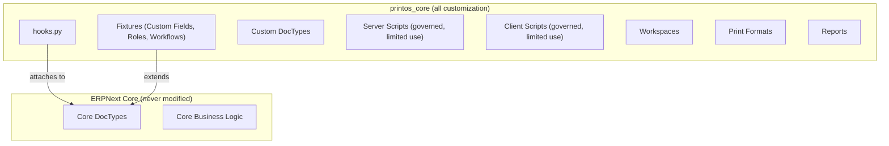
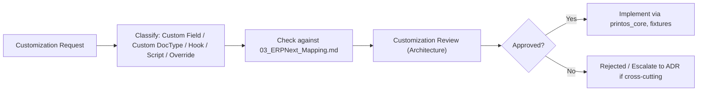

# 04 — Customization Strategy

Version:
0.1

Status:
Draft

Owner:
PrintHub Architecture Team

Last Updated:
2026-07-23

---

# Purpose

Describe how PrintOS customizes ERPNext in practice — which extension mechanisms are used, how changes are governed and reviewed, and how upgrade safety is preserved — operationalizing the rules already established in [../technical/09_Extensibility_Model.md](../technical/09_Extensibility_Model.md) and [../architecture/05_Extensibility_Architecture.md](../architecture/05_Extensibility_Architecture.md).

---

# Scope

Covers the governance process and mechanism inventory for customization. Does not redefine the extension mechanisms themselves (authoritative in `../technical/09_Extensibility_Model.md`) or the extension-point ladder (authoritative in `../architecture/05_Extensibility_Architecture.md`). Contains no code, hook implementation, or script content.

---

# Background

`PROJECT_RULES.md` Rule 1 and `CLAUDE.md`'s ERP section both state "Never modify ERPNext core." `../technical/09_Extensibility_Model.md` lists the mechanisms available (Custom DocTypes, Custom Fields, Hooks, Server/Client Scripts, Overrides). This document exists to add the missing operational layer: how a specific customization request is decided, reviewed, and safely delivered using those mechanisms.

---

# Main Content

## Custom App Structure

All customization lives inside the `printos_core` custom Frappe app, per [ADR-002-PrintOS-Core](../decisions/ADR-002-PrintOS-Core.md) and [../technical/05_Project_Structure.md](../technical/05_Project_Structure.md). No ERPNext core app is ever forked or edited in place.

## Mechanism Inventory

| Mechanism | Use For | Governance |
|---|---|---|
| Custom Fields | Adding print-industry attributes to native DocTypes (see [03_ERPNext_Mapping.md](03_ERPNext_Mapping.md) "Extend" rows) | Delivered as fixtures, version-controlled; no manual production edits |
| Custom DocTypes | Concepts with no ERPNext native equivalent (e.g. Job Card, Machine Profile) | Follows `docs/standards/DocType_Standards.md` |
| Hooks (`hooks.py`) | Attaching PrintOS behavior to ERPNext document events (`doc_events`) or scheduler events | Business logic in the hook delegates to an Application-layer use case; hooks themselves stay thin, per [../technical/03_Layer_Architecture.md](../technical/03_Layer_Architecture.md) |
| Fixtures | Exporting/importing Custom Fields, Roles, Workflows, Custom DocType definitions across environments | Same fixture mechanism used by [../configuration/15_Deployment_Model.md](../configuration/15_Deployment_Model.md) for configuration promotion |
| Server Scripts | Narrow, low-risk automation only; not a substitute for Application-layer use cases | Requires Customization Review (below) before use; preferred path is a proper Application-layer use case instead |
| Client Scripts | Presentation-only behavior (field visibility, simple validation hints) | Must mirror server-side enforcement, never be the sole validation, per [../configuration/05_Form_Designer.md](../configuration/05_Form_Designer.md) |
| Workspaces | One per module, per [../blueprint/09_PrintOS_Modules.md](../blueprint/09_PrintOS_Modules.md) | Standard ERPNext Workspace mechanism |
| Print Formats | Print-industry-specific document layouts (Job Card, Quotation, Invoice) | No business logic; presentation only |
| Reports | Query/Script Reports per [../configuration/10_Report_Designer.md](../configuration/10_Report_Designer.md) | Parameterized SQL only, per [../database/01_Data_Architecture.md](../database/01_Data_Architecture.md) |
| Role Profiles | Bundling Roles for common job functions (e.g. "Production Operator") | Delivered as fixtures |
| Override (`override_doctype_class`) | Only where ERPNext explicitly supports controller subclassing | Subclass, never fork; documented per [../technical/09_Extensibility_Model.md](../technical/09_Extensibility_Model.md) |

## Upgrade Strategy

Because every mechanism above is a supported Frappe/ERPNext extension point, an ERPNext version upgrade requires re-validating only the Infrastructure-layer adapters and fixtures — never a merge conflict against modified core files, since none exist. This is the direct, practical payoff of [ADR-002-PrintOS-Core](../decisions/ADR-002-PrintOS-Core.md).

## Customization Governance

## Customization Approval Workflow

1. **Request** — Any new customization is first checked against [03_ERPNext_Mapping.md](03_ERPNext_Mapping.md); if the concept is already mapped, follow the mapped strategy rather than re-deciding it.
2. **Classification** — The requester classifies the change using the Mechanism Inventory above.
3. **Customization Review** — An Architecture Review pass (per `docs/Documentation_Workflow.md` Section 7) confirms the mechanism choice does not violate [ADR-002-PrintOS-Core](../decisions/ADR-002-PrintOS-Core.md) or [../technical/04_Dependency_Rules.md](../technical/04_Dependency_Rules.md).
4. **Approval** — Only after Review does implementation proceed; this mirrors `docs/Documentation_Workflow.md` Section 11's Documentation Approval Workflow, applied to customization decisions specifically.

## Customization Checklist

- [ ] Concept checked against [03_ERPNext_Mapping.md](03_ERPNext_Mapping.md) before deciding on a new mechanism
- [ ] No ERPNext core file modified
- [ ] Business logic placed in Application-layer use case, not directly in a hook/server script
- [ ] Delivered as version-controlled fixtures, not manual production edits
- [ ] Naming checked against `docs/standards/Naming_Registry.md`
- [ ] Customization Review completed before implementation

---

# Architecture Notes

This document adds process, not new extension mechanisms. Any customization need that does not fit the Mechanism Inventory above is, by definition, outside currently Approved extensibility architecture and must be escalated to [../architecture/05_Extensibility_Architecture.md](../architecture/05_Extensibility_Architecture.md)'s governing Architecture Review rather than implemented ad hoc.

---

# Future Considerations

- As Plugin/Feature Pack capability matures (per [../architecture/05_Extensibility_Architecture.md](../architecture/05_Extensibility_Architecture.md) Future Considerations), this governance process should be re-examined for whether it scales to third-party or industry-vertical customization requests, not just PrintHub-authored ones.

---

# Open Questions

- Should Server Script usage be disallowed entirely in favor of always requiring a proper Application-layer use case, or is there a legitimate narrow use case for them in Phase 1?
- Who holds Customization Review authority day-to-day, given the project currently operates without a dedicated review team (per `docs/Documentation_Workflow.md` Section 13 Open Questions)?

---

# Related Documents

- [00_Implementation_Index.md](00_Implementation_Index.md)
- [03_ERPNext_Mapping.md](03_ERPNext_Mapping.md)
- [../technical/09_Extensibility_Model.md](../technical/09_Extensibility_Model.md)
- [../architecture/05_Extensibility_Architecture.md](../architecture/05_Extensibility_Architecture.md)
- [../decisions/ADR-002-PrintOS-Core.md](../decisions/ADR-002-PrintOS-Core.md)
- `docs/standards/DocType_Standards.md`

---

# Revision History

| Version | Date | Author | Changes |
|---|---|---|---|
| 0.1 | 2026-07-23 | Initial | Initial working draft. |

---

# Documentation Quality Checklist

- [ ] Technically accurate
- [ ] Business terminology verified
- [ ] Cross-references updated
- [ ] Mermaid diagrams validated
- [ ] No implementation code included
- [ ] Future roadmap considered
- [ ] Reviewed by Project Owner
