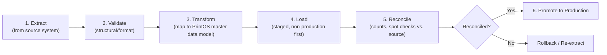

# 05 — Data Migration Strategy

Version:
0.1

Status:
Draft

Owner:
PrintHub Architecture Team

Last Updated:
2026-07-23

---

# Purpose

Define the architectural approach to migrating data into PrintOS from existing ERP systems, legacy print-shop software, spreadsheets, and other external sources — principles and phases only, no migration scripts or field-level mapping.

---

# Scope

Covers migration principles, phasing, validation, rollback, and data ownership at the architecture level. Does not contain ETL code, SQL, or specific source-system connector detail — those are downstream implementation artifacts.

---

# Background

Print shops adopting PrintOS (G2, per `docs/standards/Naming_Registry.md` Section 10) will typically already operate some system — a legacy print-management tool, a generic ERP, or spreadsheets — holding Customer, Material, and historical transaction data. `08_Master_Data_Model.md` and `06_Data_Lifecycle.md` define what data exists and how its lifecycle works once inside PrintOS; this document defines how it gets there safely.

---

# Main Content

## Migration Sources (Anticipated)

| Source Type | Examples | Typical Data |
|---|---|---|
| Existing ERP users | Generic ERP or accounting systems | Customer, Supplier, Item/Material master data, historical Invoices |
| Legacy print software | Industry-specific MIS/print-management tools | Job history, Machine/Press definitions, pricing sheets |
| Excel / CSV | Manually maintained spreadsheets | Customer lists, price lists, material catalogs |
| External systems | Payment gateways, accounting exports | Transaction history, payment records |

## Migration Phases

1. **Extract** — Pull data from the source system in its native format, without transformation.
2. **Validate (structural)** — Confirm extracted data matches expected structure/format before any business mapping is attempted.
3. **Transform** — Map source fields to PrintOS's Approved Master Data entities per [../blueprint/08_Master_Data_Model.md](../blueprint/08_Master_Data_Model.md) and terminology per [../standards/Naming_Registry.md](../standards/Naming_Registry.md) — a source system's "Client" record maps to PrintOS's Approved "Customer" entity, for example, never introducing "Client" as a parallel term.
4. **Load** — Load transformed data into a non-production (Staging) environment first, per [../architecture/09_Deployment_Architecture.md](../architecture/09_Deployment_Architecture.md)'s environment progression.
5. **Reconcile** — Compare record counts, spot-check sample records, and validate referential integrity (e.g. every migrated Job Card references a valid Customer) against the source.
6. **Promote** — Only after reconciliation passes does migrated data move to Production, following the same environment progression used for configuration and code ([../configuration/15_Deployment_Model.md](../configuration/15_Deployment_Model.md)).

## Data Ownership by Category

Categories follow [../database/06_Data_Lifecycle.md](../database/06_Data_Lifecycle.md)'s lifecycle stages and [../blueprint/08_Master_Data_Model.md](../blueprint/08_Master_Data_Model.md)'s ownership model:

| Category | Examples | Migration Approach |
|---|---|---|
| Master Data | Customer, Supplier, Material, Machine, Price List | Migrated first — transactional data depends on master data existing |
| Transactional Data | Open Sales Orders, in-progress Job Cards | Migrated only for genuinely open/in-flight records; closed historical transactions are migrated as Historical Data instead |
| Historical Data | Completed Invoices, past Job Cards, past Payments | Migrated as read-only/reporting data; must not re-trigger business workflows (e.g. a historical Invoice must not re-fire an "Invoice Generated" event per [../architecture/06_Event_Architecture.md](../architecture/06_Event_Architecture.md)) |
| Reference Data | Units of Measure, Tax Templates, Paper Sizes | Migrated early alongside Master Data; typically small in volume |

## Validation

- Structural validation (Phase 2 above) occurs before any transformation, catching format errors cheaply.
- Business validation confirms migrated records satisfy the Business Rules already stated in [../blueprint/05_Domain_Model.md](../blueprint/05_Domain_Model.md) (e.g. a migrated Job Card must reference approved Artwork, per that document's Business Rules section) — migration must not create records that violate rules the system enforces going forward.

## Rollback

Per [../configuration/15_Deployment_Model.md](../configuration/15_Deployment_Model.md)'s rollback principle (reapply a previous fixture version rather than manual undo), a failed migration is rolled back by restoring the pre-migration database backup in the affected environment, not by attempting to manually reverse individual migrated records.

## Migration Risks

| Risk | Mitigation |
|---|---|
| Source data uses different terminology than PrintOS's Approved vocabulary (e.g. "Client," "Quote," "Work Order") | Transform step explicitly maps to Approved terms per `Naming_Registry.md`; no Deprecated/Rejected term (Quote, Estimate, Job Ticket, Work Order, Production Order) is introduced during migration |
| Incomplete or inconsistent source data (e.g. missing Machine Profiles) | Reconciliation step flags gaps before Production promotion; migration does not silently fabricate missing master data |
| Migrating historical transactional data re-triggers live business workflows | Historical Data is loaded through a distinct path that does not invoke Application-layer use cases meant for new transactions |
| Large data volumes causing extended downtime during Load | Staged, non-production Load first; Production promotion scheduled during a defined maintenance window |

## Migration Checklist

- [ ] Source system and data categories identified (Master / Transactional / Historical / Reference)
- [ ] Field mapping to Approved PrintOS terminology confirmed against `Naming_Registry.md`
- [ ] Structural validation passed before transformation
- [ ] Loaded and reconciled in Staging before Production promotion
- [ ] Business Rule validation passed (no records violating `05_Domain_Model.md` rules)
- [ ] Rollback plan (pre-migration backup) confirmed available
- [ ] Historical Data confirmed not to re-trigger live workflows/events

---

# Architecture Notes

This document assumes the Development → Staging → Production environment progression already established in [../architecture/09_Deployment_Architecture.md](../architecture/09_Deployment_Architecture.md) (itself a working draft) — migration strategy should be revisited once that document is reconciled with the reserved `docs/blueprint/24_Deployment_Architecture.md`.

---

# Future Considerations

- As Supplier (G4) and Freelancer (G3) portals are introduced, migration strategy will need to account for external-party self-service data (per `08_Master_Data_Model.md` Future Considerations).
- Multi-tenant migration (bulk-onboarding multiple print shops) depends on [../architecture/04_MultiTenant_Architecture.md](../architecture/04_MultiTenant_Architecture.md) being resolved.

---

# Open Questions

- What specific legacy print-industry systems are anticipated for Phase 1 customer onboarding, and do any require dedicated connector research (`docs/research/`)?
- What data retention/reconciliation tolerance (e.g. acceptable discrepancy percentage) is required before Production promotion is approved?

---

# Related Documents

- [00_Implementation_Index.md](00_Implementation_Index.md)
- [../blueprint/08_Master_Data_Model.md](../blueprint/08_Master_Data_Model.md)
- [../database/06_Data_Lifecycle.md](../database/06_Data_Lifecycle.md)
- [../configuration/15_Deployment_Model.md](../configuration/15_Deployment_Model.md)
- [../architecture/09_Deployment_Architecture.md](../architecture/09_Deployment_Architecture.md)
- [../standards/Naming_Registry.md](../standards/Naming_Registry.md)

---

# Revision History

| Version | Date | Author | Changes |
|---|---|---|---|
| 0.1 | 2026-07-23 | Initial | Initial working draft. |

---

# Documentation Quality Checklist

- [ ] Technically accurate
- [ ] Business terminology verified
- [ ] Cross-references updated
- [ ] Mermaid diagrams validated
- [ ] No implementation code included
- [ ] Future roadmap considered
- [ ] Reviewed by Project Owner
