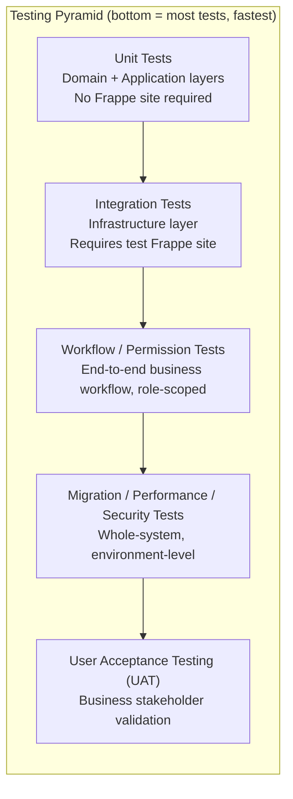

# 06 — Testing Strategy

Version:
0.1

Status:
Draft

Owner:
PrintHub Architecture Team

Last Updated:
2026-07-23

---

# Purpose

Describe the testing philosophy and test-type coverage for PrintOS implementation, operationalizing `PROJECT_RULES.md` Rule 18 ("Testing is mandatory for business-critical features") and `docs/standards/Testing_Standards.md` into a concrete strategy aligned with Clean Architecture layering.

---

# Scope

Covers testing philosophy, test types, and acceptance criteria at the architecture/planning level. Does not restate detailed testing conventions already defined in `docs/standards/Testing_Standards.md`, and contains no test code.

---

# Background

Clean Architecture ([../technical/02_Clean_Architecture.md](../technical/02_Clean_Architecture.md)) exists partly to make testing tractable: Domain and Application logic can be tested without a running Frappe site, while Infrastructure requires one. This document's testing pyramid follows that layering directly rather than treating "testing" as a single undifferentiated activity.

---

# Main Content

## Testing Pyramid

## Test Types

| Test Type | Layer / Scope | Purpose | Governing Reference |
|---|---|---|---|
| Unit | Domain, Application | Verify business rules and use case orchestration in isolation, per [../architecture/02_Clean_Architecture.md](../architecture/02_Clean_Architecture.md)'s enforcement mechanism (a Domain/Application test requiring a live site signals a boundary violation) | `docs/standards/Testing_Standards.md` |
| Integration | Infrastructure | Verify adapters correctly translate to/from ERPNext DocTypes, against a real test Frappe site | `docs/standards/Testing_Standards.md` |
| ERPNext / DocType Testing | Infrastructure | Verify Custom DocTypes and Custom Field extensions behave correctly per [03_ERPNext_Mapping.md](03_ERPNext_Mapping.md) | `docs/standards/DocType_Standards.md` |
| Workflow Testing | Cross-layer, business-facing | Verify configured Workflows ([../configuration/03_Workflow_Designer.md](../configuration/03_Workflow_Designer.md)) match the business workflows in [../blueprint/10_Business_Workflows.md](../blueprint/10_Business_Workflows.md) exactly (states, transitions, guard conditions) |
| Permission Testing | Cross-layer, security-facing | Verify Role/Permission configuration ([../configuration/09_Role_Permission_Designer.md](../configuration/09_Role_Permission_Designer.md)) enforces the intended access per user role, and that no report/dashboard bypasses permission scoping | [../architecture/07_Security_Architecture.md](../architecture/07_Security_Architecture.md) |
| Migration Testing | System-level | Verify [05_Data_Migration_Strategy.md](05_Data_Migration_Strategy.md)'s reconciliation step catches discrepancies before Production promotion | [05_Data_Migration_Strategy.md](05_Data_Migration_Strategy.md) |
| Performance Testing | System-level | Verify budgets/behavior described in [../architecture/08_Performance_Architecture.md](../architecture/08_Performance_Architecture.md) (caching, background job usage, query discipline) hold under realistic data volumes | `docs/standards/Performance_Standards.md` |
| Security Testing | System-level | Verify secure defaults in [../architecture/07_Security_Architecture.md](../architecture/07_Security_Architecture.md) (parameterized queries, credential handling, XSS escaping) | `docs/standards/Security_Standards.md` |
| UAT | Business-facing | Confirm business stakeholders (Project Owner, and eventually real print shop users) validate delivered functionality against [../blueprint/02_Business_Requirements.md](../blueprint/02_Business_Requirements.md) | — |
| Regression | Cross-layer | Confirm previously passing tests (all types above) still pass after a change | `docs/standards/Testing_Standards.md` |
| Automation | Cross-layer | Automated execution of Unit/Integration/Regression suites in CI, per [../architecture/09_Deployment_Architecture.md](../architecture/09_Deployment_Architecture.md) (working draft) | — |

## Acceptance Criteria and Definition of Done

A module is considered Done for a given implementation phase (see [01_Phase_1_Roadmap.md](01_Phase_1_Roadmap.md)) only when:

- [ ] All Domain/Application business rules have passing Unit tests.
- [ ] All Infrastructure adapters have passing Integration tests against a test Frappe site.
- [ ] Every business workflow the module participates in (per `10_Business_Workflows.md`) has a passing Workflow test.
- [ ] Permission scoping has been verified for every Role expected to interact with the module.
- [ ] No test relies on a Deprecated or Rejected term (per `Naming_Registry.md` §28) in its assertions or fixtures.
- [ ] Regression suite passes with the change included.

## Traceability

Every test should be traceable to the business requirement, workflow, or rule it verifies — a Workflow test for Job Card status transitions, for example, should cite [../blueprint/10_Business_Workflows.md](../blueprint/10_Business_Workflows.md)'s "Job Card Lifecycle" workflow directly, so a future reader can see why the test exists without needing to reverse-engineer intent from assertions alone.

---

# Architecture Notes

This pyramid mirrors Clean Architecture layering deliberately: it is not a generic testing pyramid borrowed from elsewhere, but one shaped specifically around where PrintOS's own boundaries sit (Domain/Application vs. Infrastructure vs. cross-cutting business behavior).

---

# Future Considerations

- MachineIQ, once scoped, will likely require its own testing category (e.g. model/analytics validation) distinct from the categories above.
- Marketplace's public-facing surface (Phase 5) will require additional security and load-testing emphasis given untrusted external traffic, per [../architecture/07_Security_Architecture.md](../architecture/07_Security_Architecture.md) Future Considerations.

---

# Open Questions

- What minimum Unit/Integration test coverage percentage, if any, should be mandated, versus relying on Definition of Done review alone?
- Should Workflow/Permission testing be automated from the start, or begin as manual UAT-style verification until the Configuration Studio surfaces stabilize?

---

# Related Documents

- [00_Implementation_Index.md](00_Implementation_Index.md)
- `docs/standards/Testing_Standards.md`
- [../architecture/02_Clean_Architecture.md](../architecture/02_Clean_Architecture.md)
- [../blueprint/10_Business_Workflows.md](../blueprint/10_Business_Workflows.md)
- [../architecture/07_Security_Architecture.md](../architecture/07_Security_Architecture.md)
- [05_Data_Migration_Strategy.md](05_Data_Migration_Strategy.md)

---

# Revision History

| Version | Date | Author | Changes |
|---|---|---|---|
| 0.1 | 2026-07-23 | Initial | Initial working draft. |

---

# Documentation Quality Checklist

- [ ] Technically accurate
- [ ] Business terminology verified
- [ ] Cross-references updated
- [ ] Mermaid diagrams validated
- [ ] No implementation code included
- [ ] Future roadmap considered
- [ ] Reviewed by Project Owner
