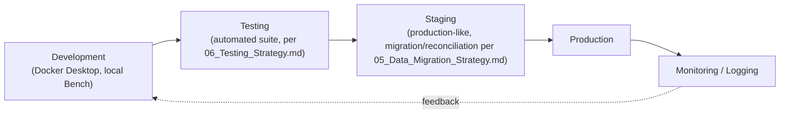

# 07 — Deployment Strategy

Version:
0.1

Status:
Draft

Owner:
PrintHub Architecture Team

Last Updated:
2026-07-23

---

# Purpose

Describe the practical deployment approach for PrintOS implementation — environment progression, Bench/Docker strategy, backup/restore, monitoring, and release approval — as an implementation-planning companion to [../architecture/09_Deployment_Architecture.md](../architecture/09_Deployment_Architecture.md).

---

# Scope

Covers deployment planning at the implementation level. Does not redefine deployment architecture (see `../architecture/09_Deployment_Architecture.md`, itself a working draft pending the reserved `docs/blueprint/24_Deployment_Architecture.md`) or configuration promotion mechanics (see [../configuration/15_Deployment_Model.md](../configuration/15_Deployment_Model.md), which governs configuration specifically). Contains no CI/CD scripts, Dockerfiles, or infrastructure-as-code.

---

# Background

`../architecture/09_Deployment_Architecture.md` establishes the Development → Staging → Production environment progression and the current/future technology stack. This document translates that into a concrete, phase-aware deployment plan for implementation.

---

# Main Content

## Deployment Architecture (Summary)

## Bench Strategy

- Frappe Bench manages the ERPNext/`printos_core` app lifecycle (install, migrate, update) in every environment.
- Bench-level operations (site creation, app installation, migration) are never run directly against Production without first succeeding in Staging, consistent with [../configuration/15_Deployment_Model.md](../configuration/15_Deployment_Model.md)'s promotion discipline.

## Docker (Future)

Per [../blueprint/07_Technology_Stack.md](../blueprint/07_Technology_Stack.md), Docker Desktop is the current local development containerization tool. Production containerization strategy (orchestration platform, image registry) is not yet decided and is explicitly deferred to the eventual `docs/blueprint/24_Deployment_Architecture.md`.

## Backup and Restore

- Full database backups are taken before any Production migration or release, per `PROJECT_RULES.md` Rule 2 (never perform destructive operations without confirmation) and the project's general stance against irreversible actions.
- Restore procedure is the designated rollback mechanism for both failed deployments and failed data migrations (see [05_Data_Migration_Strategy.md](05_Data_Migration_Strategy.md) Rollback).

## Monitoring and Logging

- Application-level logging follows `docs/standards/Logging_Standards.md`.
- Error handling and translation-at-boundary follow [../technical/08_Error_Handling.md](../technical/08_Error_Handling.md); monitoring should surface Interface-layer errors distinctly from Infrastructure-layer failures, since they indicate different failure classes.
- Background job (Scheduler/Worker) health, per [../architecture/01_System_Architecture.md](../architecture/01_System_Architecture.md), should be monitored separately from web-request health, since a stalled queue is a distinct failure mode from a web server outage.

## Scaling

Current scope (Phase 1, single print shop per instance per [ADR-006](../decisions/ADR-006-MultiTenant-Strategy.md)) does not require horizontal scaling design. Scaling strategy is deferred to whichever multi-tenant model [../architecture/04_MultiTenant_Architecture.md](../architecture/04_MultiTenant_Architecture.md) eventually resolves to.

## Multi-Tenant Deployment

Not yet decided — see [../architecture/04_MultiTenant_Architecture.md](../architecture/04_MultiTenant_Architecture.md) (working draft) for candidate models. This document does not assume any one model; Phase 1 deployment proceeds as single-tenant-per-instance regardless of which future model is eventually chosen.

## CI/CD Readiness

| Readiness Item | Status |
|---|---|
| Automated test suite (per [06_Testing_Strategy.md](06_Testing_Strategy.md)) runnable in CI | Not yet implemented |
| Branching strategy defined | Yes — `docs/standards/Branching_Strategy.md`, `Git_Workflow.md` |
| Release process defined | Yes — `docs/standards/Release_Process.md` |
| Automated deployment pipeline | Not yet implemented |

## Release Approval

Release to Production requires: passing automated/manual tests (per [06_Testing_Strategy.md](06_Testing_Strategy.md)), a completed backup, and explicit approval — consistent with `CLAUDE.md`'s Git section ("Never push automatically... Always ask before destructive operations") applied to releases specifically, not only git operations.

## Rollback

Rollback follows the same principle as [../configuration/15_Deployment_Model.md](../configuration/15_Deployment_Model.md): restore the previous known-good state (code via version control, configuration via fixtures, data via backup) rather than attempting to manually reverse individual changes.

## Disaster Recovery

Not yet formally scoped. At minimum, Production backups must be restorable in a documented, tested procedure — an untested backup is not a disaster recovery plan. Full DR planning (recovery time objective, recovery point objective) is deferred pending the eventual `docs/blueprint/24_Deployment_Architecture.md`.

---

# Architecture Notes

This document assumes but does not redefine the environment progression and technology stack established in `../architecture/09_Deployment_Architecture.md` and `../blueprint/07_Technology_Stack.md`. Where those documents are themselves working drafts (multi-tenant topology, future infrastructure choices), this document explicitly defers rather than assuming an answer.

---

# Future Considerations

- CI/CD pipeline implementation should be prioritized once [06_Testing_Strategy.md](06_Testing_Strategy.md)'s automated suite exists, to close the CI/CD Readiness gap identified above.
- Disaster Recovery planning should be formalized once Production deployment is imminent, not deferred indefinitely.

---

# Open Questions

- What Recovery Time Objective (RTO) and Recovery Point Objective (RPO) are acceptable for Phase 1 Production, and who defines them — Project Owner, or a future Operations role?
- Should backup frequency be time-based (e.g. nightly) or tied to specific events (e.g. before every migration/release only)?

---

# Related Documents

- [00_Implementation_Index.md](00_Implementation_Index.md)
- [../architecture/09_Deployment_Architecture.md](../architecture/09_Deployment_Architecture.md)
- [../configuration/15_Deployment_Model.md](../configuration/15_Deployment_Model.md)
- `docs/standards/Release_Process.md`
- `docs/standards/Branching_Strategy.md`
- [06_Testing_Strategy.md](06_Testing_Strategy.md)
- [05_Data_Migration_Strategy.md](05_Data_Migration_Strategy.md)

---

# Revision History

| Version | Date | Author | Changes |
|---|---|---|---|
| 0.1 | 2026-07-23 | Initial | Initial working draft. |

---

# Documentation Quality Checklist

- [ ] Technically accurate
- [ ] Business terminology verified
- [ ] Cross-references updated
- [ ] Mermaid diagrams validated
- [ ] No implementation code included
- [ ] Future roadmap considered
- [ ] Reviewed by Project Owner
