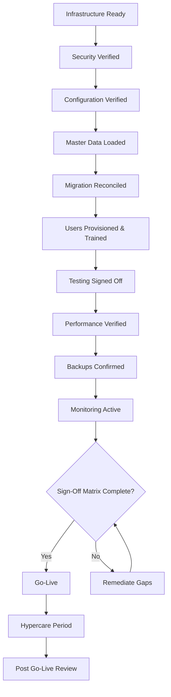

# 08 — Go-Live Checklist

Version:
0.1

Status:
Draft

Owner:
PrintHub Architecture Team

Last Updated:
2026-07-23

---

# Purpose

Define the readiness checklist a print shop deployment must satisfy before going live on PrintOS, consolidating criteria already established across Testing, Migration, Deployment, and Security documents into one sign-off checklist.

---

# Scope

Covers go-live readiness criteria and sign-off process. Does not redefine testing, migration, or deployment strategy themselves (see [06_Testing_Strategy.md](06_Testing_Strategy.md), [05_Data_Migration_Strategy.md](05_Data_Migration_Strategy.md), [07_Deployment_Strategy.md](07_Deployment_Strategy.md)) — it only confirms, at the point of go-live, that each has been satisfied.

---

# Background

Go-live is the point at which a print shop (G2) begins operating PrintOS as its system of record. Given `PROJECT_RULES.md`'s emphasis on caution around irreversible actions, go-live readiness must be explicitly checked rather than assumed once implementation "feels" complete.

---

# Main Content

## Readiness Workflow

## Readiness Checklist

### Infrastructure

- [ ] Production environment provisioned per [07_Deployment_Strategy.md](07_Deployment_Strategy.md)
- [ ] Bench/ERPNext instance confirmed running with no core modifications ([04_Customization_Strategy.md](04_Customization_Strategy.md))

### Security

- [ ] Role/Permission configuration verified per [../configuration/09_Role_Permission_Designer.md](../configuration/09_Role_Permission_Designer.md)
- [ ] No hardcoded secrets/credentials present ([../architecture/07_Security_Architecture.md](../architecture/07_Security_Architecture.md))
- [ ] Security testing completed per [06_Testing_Strategy.md](06_Testing_Strategy.md)

### Configuration

- [ ] Module Manager configuration confirmed to enable only Phase 1 modules relevant to this deployment ([../configuration/02_Module_Manager.md](../configuration/02_Module_Manager.md))
- [ ] Workflows, Approvals, Notifications configured and verified against [../blueprint/10_Business_Workflows.md](../blueprint/10_Business_Workflows.md)
- [ ] Configuration promoted through Development → Staging → Production per [../configuration/15_Deployment_Model.md](../configuration/15_Deployment_Model.md)

### Master Data

- [ ] Company, Branch, Employee structure loaded ([../blueprint/08_Master_Data_Model.md](../blueprint/08_Master_Data_Model.md))
- [ ] Customer, Supplier, Material, Machine Profile master data loaded and verified

### Migration

- [ ] Migration reconciliation completed per [05_Data_Migration_Strategy.md](05_Data_Migration_Strategy.md)
- [ ] No Deprecated/Rejected terminology present in migrated records (per `Naming_Registry.md` §28)

### Users

- [ ] User accounts and Roles provisioned
- [ ] Training completed for each user group expected to use PrintOS at go-live

### Testing

- [ ] Definition of Done satisfied for every in-scope module ([06_Testing_Strategy.md](06_Testing_Strategy.md))
- [ ] UAT sign-off obtained from business stakeholders

### Performance

- [ ] Performance testing completed against realistic data volumes ([../architecture/08_Performance_Architecture.md](../architecture/08_Performance_Architecture.md))

### Backups

- [ ] Pre-go-live full backup taken and restore verified ([07_Deployment_Strategy.md](07_Deployment_Strategy.md))

### Monitoring

- [ ] Logging and monitoring active per [07_Deployment_Strategy.md](07_Deployment_Strategy.md)

### Support / Hypercare

- [ ] Hypercare support plan defined for the immediate post-go-live period (see [15_Post_GoLive_Support.md](15_Post_GoLive_Support.md), currently a placeholder)

### Rollback Readiness

- [ ] Rollback procedure confirmed (backup restore, per [07_Deployment_Strategy.md](07_Deployment_Strategy.md))

## Sign-Off Matrix

| Area | Sign-Off Owner | Status |
|---|---|---|
| Infrastructure | Technical Lead | Pending |
| Security | Technical Lead | Pending |
| Configuration | Architecture Team | Pending |
| Master Data & Migration | Implementation Lead | Pending |
| Testing / UAT | Project Owner (Business Review) | Pending |
| Overall Go-Live Approval | Project Owner | Pending |

## Post Go-Live Review

Conducted after the Hypercare period concludes; reviews actual issues encountered against this checklist to identify whether gaps were missed at sign-off (a checklist defect) or arose from genuinely unforeseen conditions (a process improvement input for the next deployment).

---

# Architecture Notes

This checklist aggregates criteria already defined elsewhere; it introduces no new architectural requirement. If a future gap is found that isn't traceable to an existing Testing/Migration/Deployment/Security document, that is a signal those documents are incomplete, not that this checklist should invent a new standalone requirement.

---

# Future Considerations

- As multi-tenant deployment ([../architecture/04_MultiTenant_Architecture.md](../architecture/04_MultiTenant_Architecture.md)) matures, this checklist will need a tenant-provisioning-specific variant distinct from a single-instance go-live.

---

# Open Questions

- Who serves as "Technical Lead" and "Implementation Lead" in the Sign-Off Matrix, given current team roles are not yet formally defined beyond Project Owner/ChatGPT/Claude?
- What defines the end of the Hypercare period — a fixed duration, or a stability criterion?

---

# Related Documents

- [00_Implementation_Index.md](00_Implementation_Index.md)
- [06_Testing_Strategy.md](06_Testing_Strategy.md)
- [05_Data_Migration_Strategy.md](05_Data_Migration_Strategy.md)
- [07_Deployment_Strategy.md](07_Deployment_Strategy.md)
- [15_Post_GoLive_Support.md](15_Post_GoLive_Support.md)
- [../architecture/07_Security_Architecture.md](../architecture/07_Security_Architecture.md)

---

# Revision History

| Version | Date | Author | Changes |
|---|---|---|---|
| 0.1 | 2026-07-23 | Initial | Initial working draft. |

---

# Documentation Quality Checklist

- [ ] Technically accurate
- [ ] Business terminology verified
- [ ] Cross-references updated
- [ ] Mermaid diagrams validated
- [ ] No implementation code included
- [ ] Future roadmap considered
- [ ] Reviewed by Project Owner
