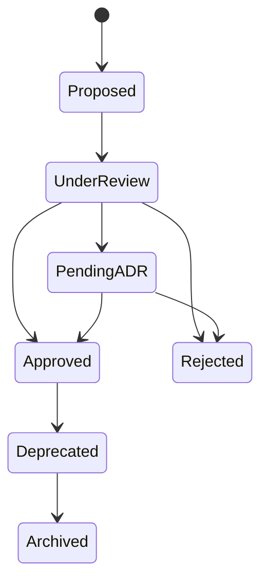
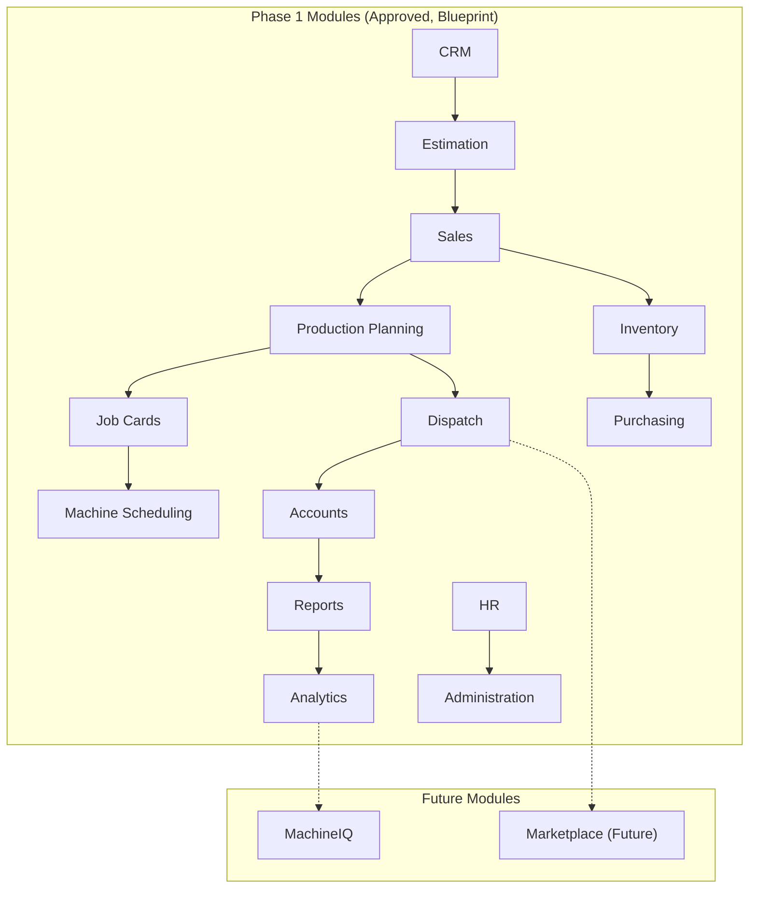
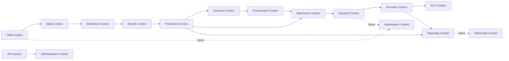
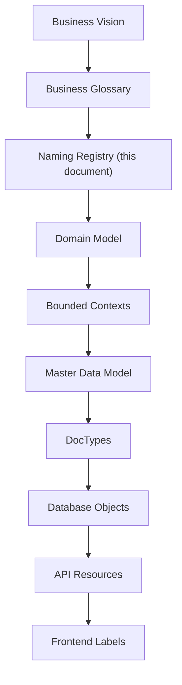
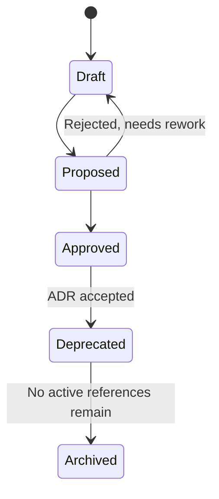
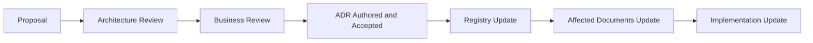
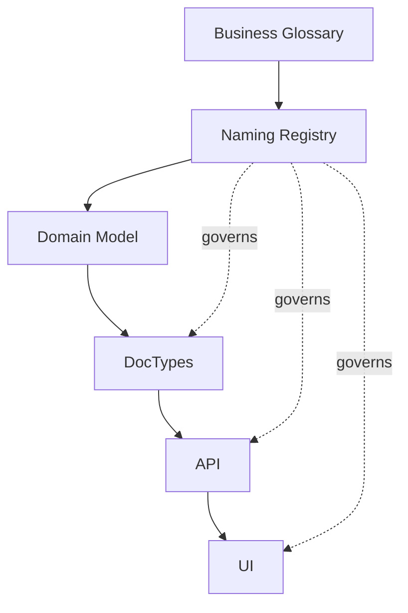

# Naming Registry

Version:
1.17

Status:
Draft

Owner:
PrintHub Architecture Team

Last Updated:
2026-09-12

---

# Purpose

This document is the single source of truth for **which names are officially approved** across PrintHub/PrintOS — business terms, module names, entity names, service names, integration names, abbreviations, and reserved words. It exists to eliminate duplicate terminology, prevent multiple names for the same concept, and give every contributor (human or AI) one place to check "what is this called here?" before introducing a new term.

This is distinct from [Naming_Standards.md](Naming_Standards.md), which defines **how** an approved name is formatted (snake_case, PascalCase, camelCase). Naming Standards answers "how do I write this name?"; the Naming Registry answers "is this the right name, and does it already exist under another name?" A name can be correctly formatted per the Standards and still be wrong per the Registry, if a different, already-approved term exists for the same concept.

---

# Scope

This document covers approved vocabulary across five layers: Business, Technical, Infrastructure, Integration, and User-Facing (UI). It covers naming for terms, modules, bounded contexts, entities, services, APIs, events, database objects, and UI labels.

This document does not define formatting rules (see [Naming_Standards.md](Naming_Standards.md)), does not define database schemas or field-level design (see `docs/blueprint/08_Master_Data_Model.md`), and does not contain application code.

**Explicit constraint on this version:** Where this Registry surfaces a naming inconsistency against existing Blueprint or Standards documents, this document does **not** unilaterally pick a winner or deprecate Blueprint terminology. Such conflicts are recorded as **Pending ADR** items (see Section 27, Naming Decision Matrix) for the Project Owner / Architecture Review to resolve.

---

# Background

PrintHub is built by a mixed team (Project Owner, ChatGPT, Claude) across many sessions and, eventually, many contributors, on top of ERPNext — a framework with its own established vocabulary. Without a controlled vocabulary, the same business concept tends to acquire multiple names over time (e.g., "Client" vs "Customer," "Quote" vs "Quotation" vs "Estimate"), each introduced independently and each locally reasonable. In an ERP system, where the same term appears in code, UI, reports, and customer-facing documents, this drift is expensive: it creates confusion, duplicated logic, and inconsistent reporting.

This Registry is grounded in the domain vocabulary already established in `docs/blueprint/05_Domain_Model.md`, the bounded contexts in `docs/blueprint/06_Bounded_Contexts.md`, and the master data entities in `docs/blueprint/08_Master_Data_Model.md`. `docs/business/Business_Glossary.md` does not yet exist; this Registry uses Blueprint terminology as its authoritative source until a formal Business Glossary is created (see Open Questions).

---

# Main Content

## 1. Purpose of Naming Registry

Enterprise projects require a controlled vocabulary because meaning must remain stable across a large surface area: code, UI, contracts, reports, training material, and customer-facing documents. Without central control, two independently reasonable naming choices (e.g., a developer writing "Client" while the Blueprint says "Customer") silently fork the vocabulary, and every subsequent contributor must guess which is authoritative.

| Aspect | Naming Standards | Naming Registry |
|---|---|---|
| Question answered | How should a name be written? | Which name is approved for this concept? |
| Scope | Casing, formatting, structural conventions | Vocabulary — the actual words/terms in use |
| Example | "DocTypes use PascalCase" | "The approved term is 'Sales Order', not 'Order' or 'Client Order'" |
| Changes when | A formatting convention changes | A new concept is introduced, or terminology is clarified/disambiguated |
| Owning document | `Naming_Standards.md` | `Naming_Registry.md` (this document) |

## 2. Naming Principles

- **Single meaning per term.** Each approved term maps to exactly one concept; a term is never reused for two different things.
- **No synonyms in active use.** Where multiple words could describe the same concept, exactly one is approved for active use; others are tracked in the Synonym Registry (Section 25) rather than used interchangeably.
- **Business first, technology second.** Approved names originate from business meaning (Domain Model, bounded contexts) rather than from implementation convenience.
- **Readable.** Names favor clarity over brevity; abbreviations are only used where explicitly approved (Section 19).
- **Expandable.** The Registry is structured so new terms can be added without restructuring existing entries.
- **Future-proof.** Naming anticipates future phases (Freelancer, Supplier, Service Engineer, Marketplace, MachineIQ) so that Phase 1 terms do not need renaming when later phases arrive.
- **ERPNext-compatible.** Approved names avoid collision with ERPNext's own reserved vocabulary (Section 21) unless intentionally extending an ERPNext concept.

## 3. Naming Decision Levels

Not every naming decision carries the same weight. This Registry distinguishes three decision levels so that trivial naming choices are not blocked waiting for architecture-level sign-off, while significant ones are not decided casually.

| Level | Description | Who Decides | Example |
|---|---|---|---|
| Level 1 — Terminology | A single business or technical term, not yet in conflict with existing vocabulary | Document author, recorded here for visibility | Adding "Workstation" as a new entity term |
| Level 2 — Structural | A module, bounded context, service, or API naming decision that affects multiple documents/modules | Architecture Review | Naming a new module "Quality" vs "Quality Control" |
| Level 3 — Conflicting/Cross-Cutting | A naming decision that conflicts with existing Blueprint or Standards terminology, or affects vocabulary shared across contexts | Project Owner via ADR (see Section 28) | Resolving "Estimating" vs "Estimations" (see [ADR-012](../decisions/ADR-012-Estimating-Terminology.md)), or the still-open event-naming casing conflict (Section 16 / Section 27, item #1) |

## 4. Naming Authority

| Role | Authority |
|---|---|
| Project Owner | Final authority on all Level 3 naming decisions; approves new ADRs arising from naming conflicts |
| Architecture Review (ChatGPT + Project Architecture) | Authority over Level 2 structural naming (modules, bounded contexts, services), subject to Owner ratification |
| Document Author (Claude or other contributor) | Authority to propose Level 1 terminology, recorded in this Registry as Draft/Pending until reviewed |
| Standards Review (per `docs/Documentation_Workflow.md` Section 7) | Confirms new names comply with `Naming_Standards.md` formatting once approved |

No individual contributor — human or AI — may unilaterally deprecate or rename existing Blueprint terminology. Any apparent conflict is routed to the Naming Decision Matrix (Section 27) as Pending ADR, never resolved silently within this document.

## 5. Naming Lifecycle

Names in this Registry pass through the following states, mirroring the document lifecycle in `docs/Documentation_Workflow.md` Section 5:

- **Proposed** — A new term suggested by a contributor, not yet reviewed.
- **Under Review** — Being evaluated against existing Registry entries for conflicts or duplication.
- **Pending ADR** — A conflict was found against existing Blueprint/Standards terminology; routed to Architecture Decision Record process (Section 28) rather than resolved here.
- **Approved** — Accepted into active use; appears in the tables below as an Approved Name.
- **Deprecated** — Superseded by an Owner/Architecture-approved decision; retained in the Deprecated Names table (Section 28) for migration reference.
- **Archived** — No longer referenced anywhere active; retained for historical record only.

## 6. Business Vocabulary Registry

Approved business terms, sourced from `docs/blueprint/05_Domain_Model.md` and `docs/blueprint/08_Master_Data_Model.md`. Since `docs/business/Business_Glossary.md` does not yet exist, this table serves as the interim authoritative business vocabulary.

| Approved Name | Definition | Usage | Deprecated Names |
|---|---|---|---|
| Customer | A party that purchases print/production work; an ERP customer record in Phase 1 | CRM, Sales, Accounts | Client, Party *(see Synonym Registry, Section 25 — not deprecated, tracked as synonym pending ADR)* |
| Supplier | A party that supplies materials or services to the business | Procurement, Warehouse, Accounts | Vendor *(pending ADR — see Section 27)* |
| Sales Order | A confirmed commercial commitment to produce and deliver work for a Customer | Sales, Production, Accounts | Order *(pending ADR)* |
| Quotation | A priced proposal for a defined scope of work, prior to customer approval | Estimation, Sales | Quote, Estimate, Proposal *(Deprecated per [ADR-013](../decisions/ADR-013-Quotation-Terminology.md))* |
| Print Job | A unit of print/production work performed to fulfill a Sales Order | Production | Job |
| Job Card | The production instruction and tracking record for a Print Job | Production | Job Ticket, Work Order *(Deprecated per [ADR-014](../decisions/ADR-014-Production-Terminology.md))* |
| Machine | A production asset capable of executing job operations | Production, Machine Scheduling, MachineIQ | Equipment |
| Operator | An Employee assigned to run or oversee a Machine during production | Production, HR | — |
| Production Order | **Rejected — not adopted.** No distinct entity introduced upstream of Job Card; Job Card remains the sole production-execution record. | Production | Per [ADR-014](../decisions/ADR-014-Production-Terminology.md) |
| Material | A physical input consumed in production | Inventory, Estimation | — |
| Substrate | The specific physical material printed or fabricated upon | Inventory, Production, Estimation | — |
| Inventory | The tracked stock of Materials available for production | Inventory | Stock |
| Warehouse | A physical location where Materials or finished goods are stored | Warehouse, Inventory | — |
| Invoice | The billing record for delivered work | Accounts | — |
| Payment | A record of funds received against an Invoice | Accounts | — |
| Dispatch | The act and record of delivering finished goods to a Customer | Dispatch | Delivery *(tracked in Synonym Registry, Section 25 — Blueprint uses both; see Section 27)* |
| Workstation | Not yet defined in Blueprint — recorded here as Proposed, pending clarification against Machine | Production | — |
| Company | The legal business entity operating PrintOS | Administration | — |
| Branch | A physical operating location of the Company | Administration | — |
| Employee | A person working within the business | HR | — |
| User | An authenticated actor operating the PrintOS system (may or may not be an Employee) | Administration, Security | — |
| Role | A named set of permissions assigned to a User | Administration, Security | — |
| Permission | A specific, grantable capability within the system | Administration, Security | — |
| Asset | Not yet defined in Blueprint distinctly from Machine — recorded here as Proposed | Production, Maintenance | — |
| Maintenance | Activity performed to keep a Machine/Asset in working order | Maintenance (proposed module, see Section 11) | — |
| Service Request | A request for equipment service or maintenance support | Maintenance, Service Engineer workflows (future) | — |
| Machine Event | A discrete, time-stamped occurrence reported by or about a Machine | MachineIQ, Production | — |
| Quality Check | A verification step confirming produced work meets required standards | Production, Quality (proposed module, see Section 11) | — |

Entries marked "Proposed" (Production Order, Workstation, Asset) are not yet present in `docs/blueprint/05_Domain_Model.md` or `08_Master_Data_Model.md`. They are recorded here at your request but require Blueprint update or an ADR before being treated as fully Approved (see Section 27, Open Questions).

## 7. Technical Vocabulary Registry

Approved technical terms used in architecture and implementation discussion, distinct from business vocabulary above.

| Approved Name | Definition | Usage | Deprecated Names |
|---|---|---|---|
| Bounded Context | A DDD boundary within which one business model and vocabulary apply consistently | Architecture | — |
| Domain Layer | The layer containing business rules, free of Frappe/ERPNext dependency | Architecture, Coding Standards | — |
| Application Layer | The layer orchestrating use cases against the Domain Layer | Architecture | — |
| Infrastructure Layer | The layer adapting Domain/Application logic to Frappe/ERPNext | Architecture | — |
| DocType | An ERPNext/Frappe schema-defining construct | DocType Standards, Database Standards | — |
| Custom Field | A field added to an existing ERPNext core DocType via extension mechanism | DocType Standards | — |
| Module | A cohesive unit of `printos_core` functionality mapped to one Bounded Context | Module Registry (Section 11) | — |
| Service | A named unit of application-layer logic performing one cohesive responsibility | Service Naming Registry (Section 14) | — |
| Event | A named, published fact representing a business-significant state change | Event Naming (Section 16) | — |

## 8. Infrastructure Vocabulary Registry

Approved terms describing deployment and platform infrastructure, kept distinct from business/technical vocabulary since infrastructure terms are sourced from `docs/blueprint/07_Technology_Stack.md` rather than the Domain Model.

| Approved Name | Definition | Usage | Deprecated Names |
|---|---|---|---|
| Company | An ERPNext legal and accounting entity that exists inside a Tenant; the business/transaction-scoping anchor for ERPNext operational records; one Tenant may contain one or more Companies; not synonymous with Tenant and not, alone, the isolation boundary between unrelated print shops | Administration, Multi-Tenant Architecture (`25_MultiTenant_Architecture.md`, Approval 1.0) | — |
| Tenant | The print-shop organization and PrintHub subscription represented by one isolated Frappe site and one isolated operational database; the boundary for site identity, operational database, files/private files, credentials/secrets, Tenant-specific configuration, backups/restoration, upgrade rollout, and operational management | Multi-Tenant Architecture (`25_MultiTenant_Architecture.md`, Approval 1.0); ADR-015 (Accepted 1.0) | — |
| Environment | A named deployment context (Development, Testing, Staging, Production) | Deployment (reserved `docs/blueprint/24_Deployment_Architecture.md` per [ADR-010](../decisions/ADR-010-Blueprint-Numbering-Strategy.md)) | — |
| Instance | A single running deployment of PrintOS for one or more Companies | Deployment, Multi-Tenant Architecture | — |
| Background Job | An asynchronously executed unit of work (Frappe/Redis-backed) | Performance Standards | — |

## 9. Integration Vocabulary Registry

Approved terms for external and cross-system integration, distinct from internal technical vocabulary.

| Approved Name | Definition | Usage | Deprecated Names |
|---|---|---|---|
| Integration | A connection between PrintOS and an external system or service | Integration Architecture (reserved `docs/blueprint/22_Integration_Architecture.md` per [ADR-010](../decisions/ADR-010-Blueprint-Numbering-Strategy.md)) | — |
| Webhook | An inbound or outbound HTTP callback used for event notification to/from an external system | Integration | — |
| Payment Gateway | An external service used to process customer payments | Integration | — |
| WhatsApp Channel | The integration surface used for WhatsApp-based customer/operational communication | Integration | — |
| MachineIQ Service | The future machine-intelligence service consumed via API (see [ADR-008-MachineIQ.md](../decisions/ADR-008-MachineIQ.md)) | MachineIQ Vocabulary (Section 23) | — |
| Marketplace Service | The future public-facing marketplace service (see [ADR-009-Marketplace.md](../decisions/ADR-009-Marketplace.md)) | Marketplace Vocabulary (Section 24) | — |

## 10. User Groups

| Group | Name | Description |
|---|---|---|
| G1 | Public Customer | End buyers of print/production work; in Phase 1, exist only as ERP customer records, not active platform users. Becomes an active platform participant in Phase 5 (Marketplace). |
| G2 | Print Shop | The primary active user group in Phase 1; operates PrintOS ERP directly. |
| G3 | Freelancer | Freelance resources engaged by print shops; introduced in Phase 2 (Freelancer Portal). |
| G4 | Supplier | Suppliers of materials/services to print shops; introduced in Phase 3 (Supplier Portal). |
| G5 | Service Engineer | Field service/maintenance personnel; introduced in Phase 4 (Service Engineers). |

## 11. Module Registry

Modules currently defined in `docs/blueprint/09_PrintOS_Modules.md` are listed here as **Approved (Blueprint)**. Where your requested module list uses a different name for what appears to be the same or an overlapping concept, this is recorded as **Pending ADR**, not resolved.

| Approved Name (Blueprint) | Status | Requested Name (this task) | Note |
|---|---|---|---|
| CRM | Approved | CRM | Match |
| Estimation | Approved | Estimating | **Resolved — [ADR-012](../decisions/ADR-012-Estimating-Terminology.md).** Module renamed from "Quotation" to "Estimation" to match its bounded context; "Quotation" retained as the artifact this module produces, per [ADR-013](../decisions/ADR-013-Quotation-Terminology.md). "Estimating" (gerund) not adopted. |
| Sales | Approved | Sales | Match |
| Production Planning / Job Cards / Machine Scheduling | Approved (three sub-modules, unchanged) | Production Management | **Resolved — [ADR-014](../decisions/ADR-014-Production-Terminology.md).** The three modules remain separate; "Production Management" is approved only as a documentation-umbrella term (e.g., Blueprint chapter title), never as a module/DocType/API/UI name. |
| Inventory | Approved | Inventory | Match |
| Purchasing | Approved | Procurement | **Pending ADR** — same concept, two names; see Section 27 |
| Accounts | Approved | Finance | **Resolved — [ADR-011](../decisions/ADR-011-Business-Finance-Terminology.md).** "Accounts" is canonical at every layer; "Finance" and "Financial Management" are Deprecated aliases. |
| HR | Approved | HR | Match |
| — | Not yet in Blueprint | Quality | **Pending ADR** — new module proposed; no corresponding entry in `09_PrintOS_Modules.md` |
| — | Not yet in Blueprint | Maintenance | **Pending ADR** — new module proposed; no corresponding entry in `09_PrintOS_Modules.md` |
| Dispatch | Approved | Dispatch | Match |
| Reports / Analytics | Approved | Analytics | Partial match — Blueprint separates Reports and Analytics |
| Administration | Approved | Administration | Match |
| MachineIQ (Future) | Approved | MachineIQ | Match |
| Marketplace (Future) | Approved | Marketplace (Future) | Match |

## 12. Bounded Context Names

Official bounded context names, per `docs/blueprint/06_Bounded_Contexts.md`. Names are used exactly as listed; no abbreviated or alternate forms are approved for these context names.

| Context | Brief Description |
|---|---|
| CRM Context | Lead/enquiry capture and customer relationship tracking |
| Sales Context | Confirmed order management |
| Estimation Context | Industry-specific pricing and Quotation generation *(renamed from "Estimations Context" per [ADR-012](../decisions/ADR-012-Estimating-Terminology.md); source document `06_Bounded_Contexts.md` header corrected in the same pass as this Registry update)* |
| Artwork Context | Design asset management and customer approval |
| Production Context | Job Card execution and tracking |
| Inventory Context | Material availability and consumption tracking |
| Procurement Context | Material/service acquisition from Suppliers |
| Warehouse Context | Physical storage and goods movement |
| Dispatch Context | Delivery of finished goods |
| Accounts Context | Financial transaction recording |
| GST Context | Statutory tax compliance |
| HR Context | Employee record management |
| Administration Context | System and organizational configuration |
| Reporting Context | Cross-context reporting and dashboards |
| MachineIQ Context (Future) | Machine intelligence over production/reporting data |
| Marketplace Context (Future) | Public buyer-facing discovery and ordering |

Note: "Estimating Context" and "Finance Context," used in the requested Section 6 list, are **resolved**: the approved names are `Estimation Context` (per [ADR-012](../decisions/ADR-012-Estimating-Terminology.md)) and `Accounts Context` (per [ADR-011](../decisions/ADR-011-Business-Finance-Terminology.md)), respectively.

## 13. Entity Naming Registry

| Approved Entity Name | Definition | Blueprint Source | Note |
|---|---|---|---|
| Customer | See Business Vocabulary (Section 6) | `05_Domain_Model.md` | — |
| Supplier | See Business Vocabulary | `08_Master_Data_Model.md` | — |
| Print Job | See Business Vocabulary | `05_Domain_Model.md` | Requested list also includes "Job Ticket" and "Work Order" — **Deprecated per [ADR-014](../decisions/ADR-014-Production-Terminology.md)**, not merged |
| Artwork | The design/creative asset submitted or approved for production | `05_Domain_Model.md` | — |
| Machine | See Business Vocabulary | `05_Domain_Model.md` | — |
| Production Order | Not adopted | — | **Rejected per [ADR-014](../decisions/ADR-014-Production-Terminology.md)** — Job Card remains the sole production-execution entity |
| Inventory Item | Not yet a distinct Blueprint entity (Blueprint uses "Material" / "Substrate") | — | **Pending ADR** — clarify relationship to Material/Substrate |
| Material | See Business Vocabulary | `08_Master_Data_Model.md` | — |
| Paper | Not a distinct Blueprint entity — treated as a Paper Size (master data) or a Substrate instance | `08_Master_Data_Model.md` | **Pending ADR** — clarify whether "Paper" needs its own entity distinct from Substrate/Paper Sizes |
| Ink | Not yet defined in Blueprint | — | **Proposed** |
| Plate | Not yet defined in Blueprint | — | **Proposed** |
| Job Ticket | Not an approved name — see Job Card | — | **Deprecated per [ADR-014](../decisions/ADR-014-Production-Terminology.md)** |
| Work Order | Not an approved name — see Job Card | — | **Deprecated per [ADR-014](../decisions/ADR-014-Production-Terminology.md)** |
| Quality Record | Corresponds to Blueprint's "Quality Check Record" (`09_PrintOS_Modules.md`, Job Cards) | `09_PrintOS_Modules.md` | **Pending ADR** — confirm exact name |
| Maintenance Log | Not yet defined in Blueprint | — | **Proposed** |

## 13a. Artwork/Job Card Technical DocType Names (Proposed 2026-08-22)

Six net-new technical DocType-name candidates for the already-governed Artwork System Design (now Approval, Version 1.6, 2026-09-13, promoted in place at the same version number since it remained uncommitted — `ART-M4-LCV-F1` corrected; Approval, Version 1.3 is the immediately prior approved baseline) and Job Card Tier A System Design (now Approval, Version 1.10, 2026-09-13, promoted in place at the same version number since it remained uncommitted — `ART-M4-LCV-F1` corrected; Approval, Version 1.7 is the immediately prior Owner-approved baseline). Entered by explicit Project Owner decision on **2026-08-22** at **Proposed** status only (Naming Lifecycle, Section 5). **All six subsequently entered Under Review as one bounded package by explicit Project Owner decision on 2026-09-11 (Section 13i) — Architecture Review and Business Review are both pending, and none of the six is Approved.** Each is a **net-new registration, not a rename** of any existing Approved term; Section 33 (Term Change Policy) does not govern this entry. Source-based collision verification against Frappe/ERPNext DocType, module, and reserved-name namespaces (`ART-RVR-C08`, `../reviews/Artwork_Runtime_Validation_Readiness_Register.md`) is **partially complete**: the Stage 1 Frappe/ERPNext static inspection is done and independently verified (Section 13f), while Stage 2 (`printos_core` pre-creation) and Stage 3 (Tenant deployment-time) remain outstanding — **`ART-RVR-C08` as a whole remains incomplete and no final collision clearance exists.**

| Term | Category | Status | Business Owner | Architecture Owner | Source Document | Approved By | ADR Reference |
|---|---|---|---|---|---|---|---|
| `PrintHub Artwork` | Technical (Entity/DocType) | Under Review | Project Owner | Project Architecture Team | `../blueprint/18_Artwork_Management.md` §3; `../database/Artwork_Authority_DocType_Specification.md` §4/§5 | Pending — not yet Approved | — |
| `PrintHub Artwork Revision` | Technical (Entity/DocType) | Under Review | Project Owner | Project Architecture Team | `../blueprint/18_Artwork_Management.md` §6.2; `../database/Artwork_Authority_DocType_Specification.md` §5/§7 | Pending — not yet Approved | — |
| `PrintHub Customer Approval Evidence` | Technical (Entity/DocType) | Under Review | Project Owner | Project Architecture Team | `../blueprint/18_Artwork_Management.md` §6.2a; `../database/Artwork_Authority_DocType_Specification.md` §7.1 | Pending — not yet Approved | — |
| `PrintHub Production Artwork Set` | Technical (Entity/DocType) | Under Review | Project Owner | Project Architecture Team | `../blueprint/18_Artwork_Management.md` §6.3; `../database/Artwork_Authority_DocType_Specification.md` §5/§8.1 | Pending — not yet Approved | — |
| `PrintHub Production Artwork Set Item` | Technical (Entity/DocType, child table) | Under Review | Project Owner | Project Architecture Team | `../blueprint/18_Artwork_Management.md` §6.4; `../database/Artwork_Authority_DocType_Specification.md` §5/§8.2 | Pending — not yet Approved | — |
| `PrintHub Job Card` | Technical (Entity/DocType) | Under Review | Project Owner | Project Architecture Team | `../implementation/JobCard_TierA_System_Design.md`; `../database/JobCard_TierA_DocType_Specification.md` §5 | Pending — not yet Approved | [ADR-014](../decisions/ADR-014-Production-Terminology.md) — **rationale/traceability only** |

Notes:

- `PrintHub Customer Approval Evidence` is the **first tracked technical-name candidate** for the already-governed, standalone, Artwork-internal Customer Approval Evidence DocType (`../blueprint/18_Artwork_Management.md` §6.2a). This entry introduces only a **provisional technical identity**; the underlying entity, its business rules, its uniqueness behavior, and its revocation treatment are pre-existing and unchanged by this registration.
- For `PrintHub Job Card`: **[ADR-014](../decisions/ADR-014-Production-Terminology.md)** is cited here only as rationale and traceability for the business term `Job Card` and the documented need for a distinct technical identity to avoid collision with ERPNext's native `Job Card` DocType. ADR-014 approved the **business term** `Job Card` and states "Technical usage: DocType name 'Job Card'" (unprefixed) — **it does not mention or approve the exact prefixed string `PrintHub Job Card`.** This Registry entry does not claim otherwise.
- **No Architecture Review disposition and no Business Review disposition is recorded or claimed for any of the six names** — both lenses are *pending*, opened but not completed, per Section 13i. Source-based collision verification is **partial**: Stage 1 (exact Frappe/ERPNext v16.29.0 baselines) is complete and independently verified (Section 13f); Stages 2 and 3 remain outstanding. All six are **Under Review**; none is Approved.

## 13b. Collision-Evidence Governance Direction for §13a Names (Adopted 2026-08-25)

Per explicit Project Owner decision dated 2026-08-25, the following **governance direction** is recorded for the six §13a names' eventual collision evidence (`ART-RVR-C08`, `../reviews/Artwork_Runtime_Validation_Readiness_Register.md`). **This direction sets future evidence requirements only — it performs no inspection, selects no source identity, and changes no name's status.** All six names remain **Proposed**.

- **Inspection population (direction only, not yet executed):** the future static collision inspection shall cover the exact governed Frappe source baseline; the exact governed ERPNext source baseline; `printos_core`, when and only when an identity-verifiable source tree for it exists; and each external plugin specifically governed as part of the applicable PrintOS deployment baseline. **Absence of `printos_core` source is not collision-clearance evidence** — an unavailable component must be recorded as not yet available, never as inspected or collision-free.
- **Version identities:** historical validation references (e.g., the exact-commit evidence pins recorded in `../implementation/JobCard_TierA_System_Design.md` §5 and `../database/JobCard_TierA_DocType_Specification.md` §24, tied to specific past Job Card gate closures) **do not automatically become naming-review source baselines**. Exact Frappe, ERPNext, `printos_core`, and applicable plugin source identities must be **separately selected or confirmed** before static inspection is authorized. A usable identity must be reproducible and verifiable, normally by an exact Git commit, together with the relevant release/version label where available. **No source identity is selected by this entry.**
- **Source availability direction:** the preferred future path is controlled acquisition of exact, pinned source identities into an Owner-approved location when suitable existing source roots are not available. **This direction is not acquisition authorization.** A separate, explicitly bounded authorization must define: exact source repositories or already-present roots; exact commits or other immutable identities; permitted destination paths; permitted network operations, if any; the inspection boundary; prohibited environment and execution actions; and required post-acquisition verification.
- **Deployment-specific assurance:** static source inspection alone will **not** constitute final Tenant-specific collision assurance. A separately governed later check shall compare the six candidate names against the actual DocType and application inventory applicable to a Tenant before installation, migration, or activation. **This entry establishes the assurance requirement only** — it does not authorize or execute that check and does not authorize environment creation.
- **Name lifecycle effect:** all six names remain **Proposed**. This decision does not move any name to Under Review or Approved. `ART-RVR-C08` remains incomplete until the governed inspection population and exact identities have been inspected under separate authority and the resulting evidence has been independently verified.
- **Unresolved governance gap (recorded, not invented):** existing governance does not define sufficient entry and exit criteria for the `Proposed → Under Review → Approved` transitions with respect to collision evidence specifically — i.e., whether `ART-RVR-C08` completion (and at what population scope) is a mandatory precondition for Under Review, for Approved, or for neither. This gap is recorded here as **unresolved**; no criteria are invented and no Architecture Review Register identifier is created. `AR-003` does not govern this decision and remains unrelated.

## 13c. Prospectively Adopted Frappe/ERPNext Source Identities and Inspection Sequencing (Adopted 2026-08-26)

Per explicit Project Owner decision dated 2026-08-26, the following **source-identity and sequencing decision** is recorded for the six §13a names' `ART-RVR-C08` collision evidence. **This entry authorizes documentation synchronization only — it does not authorize network access, source acquisition, source inspection, environment creation, implementation, or name-lifecycle advancement.**

- **Prospectively adopted pair (future static-inspection baseline candidates):**
  - Frappe — full commit `06613fc60b44d5736007ae3107cdab029b2ae045`
  - ERPNext — full commit `a5de60c357d531cb31da093f0b86301776965173`
  - Recorded release context: `v16.29.0` (contextual only — the two complete commits are the intended immutable identities, not the release label)
- **Origin and effect of this decision:** this pair originated as an **approved historical Job Card validation baseline** (`../implementation/JobCard_TierA_System_Design.md` §5; `../database/JobCard_TierA_DocType_Specification.md` §24) — its historical use alone did **not** make it the naming-review baseline. **This 2026-08-26 Project Owner decision is what prospectively selects it** for future `ART-RVR-C08` static inspection. **The commits have not been independently confirmed against their upstream repositories during this decision.** Upstream provenance, reachability, release association, and suitability for acquisition **must be verified under separate read-only network authority** before any acquisition or inspection. **This decision does not claim the commits are current upstream tips or the latest available versions, and does not authorize their acquisition or inspection.**
- **Inspection sequencing:** a separately authorized Frappe/ERPNext-first static-inspection phase is permitted **after** (1) upstream identities are independently verified, and (2) required source roots become available through a separately authorized path. Any resulting partial Frappe/ERPNext result **may be retained as subordinate evidence, must be labelled partial-population evidence, does not complete `ART-RVR-C08`, does not move any name to Under Review or Approved, and does not provide `printos_core`, plugin, or Tenant-specific clearance.** `ART-RVR-C08` remains incomplete until every required population has been addressed and the combined result independently verified.
- **`printos_core` treatment:** no tracked `printos_core` source tree, governed repository origin, or exact commit currently exists; its absence remains **missing evidence, not collision clearance**. It is excluded from the first Frappe/ERPNext-only phase for this reason alone. When an identity-verifiable `printos_core` source baseline exists, its collision inspection requires **separate authorization**. Final `ART-RVR-C08` completion **cannot rely solely on the partial Frappe/ERPNext result**. This entry does not authorize creation or implementation of `printos_core`.
- **External-plugin treatment:** current governance identifies **no specific installed or mandatory external Frappe application plugin** that can presently be assigned an exact source identity for the first static phase — architectural examples, integration categories, external services, and implementation-owner classifications are **not automatically Frappe application plugins**. The first partial static phase therefore contains **no external-plugin source**. Before final `ART-RVR-C08` completion, the applicable plugin baseline must be **explicitly reconfirmed**; if no governed Frappe application plugin is applicable, that **empty population must be recorded explicitly as a verified baseline, not inferred from silence**. Any later addition of an applicable plugin requires collision assurance for that plugin before deployment or activation, under the separately governed Tenant-specific assurance rule (§13b). **No plugin is approved or rejected by this entry.**
- **Name-lifecycle effect:** all six §13a names remain exactly **Proposed**. This decision does not move any of them to Under Review, does not approve any of them, does not resolve the existing `Proposed → Under Review → Approved` criteria gap recorded in §13b, and does not decide whether partial evidence would be sufficient for a future lifecycle transition. It does not complete `ART-RVR-C08`.

## 13d. Completed Upstream Source-Identity Metadata Verification (Recorded 2026-08-27)

Per Project Owner-directed documentation synchronization dated 2026-08-27, this entry records the result of a **completed, read-only, network-based upstream metadata verification** of the two §13c prospectively selected commits, performed 2026-08-27. **This entry records evidence only — it performs no new inspection, acquires no source, and changes no name's status.**

- **Frappe** (`06613fc60b44d5736007ae3107cdab029b2ae045`): confirmed to exist in the official repository `https://github.com/frappe/frappe`; the official tag `v16.29.0` in that repository resolves exactly to this commit; the commit is a confirmed ancestor of the observed `version-16` branch tip, which was **326 commits ahead** of the selected commit at the 2026-08-27 observation time.
- **ERPNext** (`a5de60c357d531cb31da093f0b86301776965173`): confirmed to exist in the official repository `https://github.com/frappe/erpnext`; the official tag `v16.29.0` in that repository resolves exactly to this commit; the commit is a confirmed ancestor of the observed `version-16` branch tip, which was **496 commits ahead** of the selected commit at the 2026-08-27 observation time.
- **Nature and limits of this evidence:** this was **read-only upstream metadata verification only** — no source archive, tree, blob, or application file was acquired or inspected. The 326/496 ahead-counts are **dated observations, tied to the 2026-08-27 verification timestamp, and are not governed baseline identities** — they will change as upstream development continues and must not be treated as fixed facts going forward. **The complete commits `06613fc60b44d5736007ae3107cdab029b2ae045` and `a5de60c357d531cb31da093f0b86301776965173` remain the governed immutable baseline**, independent of how far upstream has since moved. This verification does **not** prove runtime compatibility, implementation suitability, security currency, or collision freedom, and does not represent that GitHub, Frappe, or ERPNext approved or endorsed the PrintOS baseline — it confirms only that the stated identity relationships exist in the official repositories.
- **Effect on `ART-RVR-C08`:** this verification satisfies the upstream-provenance prerequisite recorded in §13c. **No controlled source acquisition and no static collision inspection have occurred.** `ART-RVR-C08` remains incomplete, pending separate authorization for acquisition and/or inspection, `printos_core` identity resolution, applicable-plugin baseline confirmation, and the later Tenant-specific deployment-time check.
- **Name-lifecycle effect:** all six §13a names remain exactly **Proposed**. This entry does not move any of them to Under Review or Approved and does not resolve the `Proposed → Under Review → Approved` criteria gap recorded in §13b.

## 13e. Independently Verified Remediated Source Acquisitions for §13c/§13d Identities (Recorded 2026-08-30)

Per Project Owner-directed documentation synchronization dated 2026-08-30, this entry records that local, untracked, read-only evidence checkouts of both §13c/§13d governed source identities now exist and have been independently verified. **This entry records evidence only — it performs no source inspection, acquires no new evidence, and changes no name's status.**

- **Frappe evidence checkout:** local path `.artifacts/art-rvr-c08/source/frappe-v16.29.0`; origin `https://github.com/frappe/frappe.git`; HEAD exactly `06613fc60b44d5736007ae3107cdab029b2ae045`; tag `v16.29.0` resolves exactly to that commit; shallow, complete, clean. Acquired directly on the first attempt with no complication.
- **ERPNext evidence checkout:** local path `.artifacts/erpnext`; origin `https://github.com/frappe/erpnext.git`; HEAD exactly `a5de60c357d531cb31da093f0b86301776965173`; tag `v16.29.0` resolves exactly to that commit; shallow, complete, clean. **This is the remediated replacement path.** ERPNext's first acquisition attempt, into the longer path `.artifacts/art-rvr-c08/source/erpnext-v16.29.0`, failed checkout with a Windows filename-length error; an unauthorized retry into `erpnext-v16.29.0-retry-check` was then made in error and self-disclosed; both incomplete artifacts were later removed under explicit, separately bounded Project Owner remediation authority, and a single authorized reacquisition into the shorter path `.artifacts/erpnext` — using a command-scoped `git -c core.longpaths=true clone ...` invocation, transcript-supported but not independently reconstructable afterward since the flag is ephemeral and no persisted `core.longpaths` setting exists in the final repository configuration — succeeded on its one authorized attempt. **Both former incomplete paths are absent and are not represented as evidence.**
- **Independent verification performed:** a separate, strictly read-only, no-network verification pass confirmed both checkouts' path, origin, HEAD, tag equality, shallow state, checkout completeness (`.git/index` presence and size), and working-tree cleanliness, and confirmed PrintHub repository isolation throughout. That verification's sole finding was the accepted non-blocking observation above regarding the ephemeral `core.longpaths` flag; no Blocking finding was identified.
- **Nature and limits of this evidence:** `.artifacts/` is an untracked, local evidence location only — it is not an application, Bench, environment, module path, or product source location, and neither checkout is a `printos_core` source tree. **No application source content — no file, tree, blob, DocType, hook, module, fixture, or schema — has been opened, listed, searched, parsed, or hashed under this or any §13c/§13d/§13e entry.** This entry establishes only that verified, identity-matched local evidence now exists; it draws **no** collision, compatibility, security, or implementation conclusion. Any future modification, replacement, cleanup, or deletion of these acquired artifacts, and any future source inspection of their contents, each requires separate Project Owner authorization.
- **Effect on `ART-RVR-C08`:** acquisition and its independent verification are prerequisites to static collision inspection, not the inspection itself. **No static collision inspection has occurred.** `ART-RVR-C08` remains incomplete, pending separate authorization for source inspection, `printos_core` identity resolution, applicable-plugin baseline confirmation, and the later Tenant-specific deployment-time check.
- **Name-lifecycle effect:** all six §13a names remain exactly **Proposed**. This entry does not move any of them to Under Review or Approved and does not resolve the `Proposed → Under Review → Approved` criteria gap recorded in §13b.

## 13f. Independently Verified Partial Frappe/ERPNext Static Collision Inspection Evidence for §13a Names (Recorded 2026-08-31)

Per Project Owner-directed documentation synchronization dated 2026-08-31, this entry records the result of a completed, read-only, static technical-name collision inspection of the six §13a Proposed names against the exact §13c/§13d/§13e Frappe and ERPNext baselines, and its independent verification, both performed 2026-08-31. **This entry records evidence only — it performs no new inspection, changes no name's status, and reaches no collision-clearance conclusion.**

- **Baselines inspected:** Frappe commit `06613fc60b44d5736007ae3107cdab029b2ae045` (tag `v16.29.0`) and ERPNext commit `a5de60c357d531cb31da093f0b86301776965173` (tag `v16.29.0`), at the local evidence checkouts established in §13e. No other source root was inspected.
- **Methodology:** static, read-only inspection only — no Frappe or ERPNext module was imported or executed, no Bench/application command ran. Standard DocType JSON metadata (`doctype/<name>/<name>.json`) was enumerated and parsed with an external JSON parser; declared DocType names were compared against each candidate's exact display name and normalized identifier using exact, Unicode case-folded, whitespace-normalized, and normalized-identifier (directory-name/basename) equality; a full-source text search covered every tracked file in both repositories for each candidate's exact name and normalized identifier, and for the case-insensitive substrings `PrintHub`/`printhub_`. Independent verification reproduced this methodology using a separate toolchain (a different parser and language than the original inspection) and separately re-ran the text searches.
- **Inventory:** Frappe — 279 parsed DocType definitions (0 duplicates within the repository); ERPNext — 529 parsed DocType definitions (0 duplicates within the repository); 0 parse failures in either repository; 0 duplicate declared names between Frappe and ERPNext. The original inspection and its independent verification agreed exactly on these parsed/unique/duplicate figures; they differed only in an intermediate, non-substantive "candidates examined" traversal-depth statistic (a fully explained, non-blocking methodology difference that did not affect any parsed DocType count or any candidate result).
- **Per-candidate result, all six identical and independently confirmed:**
  - `PrintHub Artwork` (`printhub_artwork`) — **NO COLLISION FOUND IN AUTHORIZED FRAPPE/ERPNEXT BASELINES**
  - `PrintHub Artwork Revision` (`printhub_artwork_revision`) — **NO COLLISION FOUND IN AUTHORIZED FRAPPE/ERPNEXT BASELINES**
  - `PrintHub Customer Approval Evidence` (`printhub_customer_approval_evidence`) — **NO COLLISION FOUND IN AUTHORIZED FRAPPE/ERPNEXT BASELINES**
  - `PrintHub Production Artwork Set` (`printhub_production_artwork_set`) — **NO COLLISION FOUND IN AUTHORIZED FRAPPE/ERPNEXT BASELINES**
  - `PrintHub Production Artwork Set Item` (`printhub_production_artwork_set_item`) — **NO COLLISION FOUND IN AUTHORIZED FRAPPE/ERPNEXT BASELINES**
  - `PrintHub Job Card` (`printhub_job_card`) — **NO COLLISION FOUND IN AUTHORIZED FRAPPE/ERPNEXT BASELINES**; contextually, ERPNext declares an existing, unprefixed `Job Card` DocType (`erpnext/manufacturing/doctype/job_card/job_card.json`, normalized identifier `job_card`) — a different display name and different normalized identifier from the candidate, therefore not a match, and consistent with the ERPNext-collision-avoidance rationale already recorded for this name in ADR-014.
- **No `PrintHub`/`printhub_`-prefixed declared name of any kind exists in either baseline** (zero prefix hits across all 808 combined declared names in both repositories). A shared prefix, had one existed, would have been recorded as contextual evidence only, not an automatic collision; none existed to record.
- **Other registration surfaces:** fixtures, hooks (`hooks.py`), and patch directories exist in both repositories and were within the scope of the full-source text search (which covers every tracked file, not a restricted subtree); no fixture, hook mapping, override/alias registration, or patch/seed record was found referencing any candidate name or identifier in either repository.
- **This finding must not be read as:** collision-free, cleared, Approved, globally unique, or safe for implementation. It states only that no match was found against the two named source baselines using the described static methods.
- **What remains nonexistent or unresolved:** `printos_core` collision evidence (no identity-verifiable source tree exists); external Frappe-application-plugin collision evidence (the applicable plugin baseline itself remains unreconfirmed); Tenant-created Custom DocType and runtime-installed-app collision evidence; collision evidence against any future upstream Frappe/ERPNext version beyond this exact pin; full `ART-RVR-C08` completion; the `Proposed → Under Review → Approved` lifecycle-transition criteria (§13b gap, still unresolved); and any Architecture Review or Business Review disposition for any of the six names. **The absence of a match in Frappe/ERPNext does not reserve, register, or permanently protect any of the six names against a future collision finding in an as-yet-uninspected population.**
- **Name-lifecycle effect:** all six §13a names remain exactly **Proposed**. This entry does not move any of them to Under Review or Approved and does not resolve the `Proposed → Under Review → Approved` criteria gap recorded in §13b.

## 13g. Adopted Proposed-Name Lifecycle Criteria and `ART-RVR-C08` Staging for §13a Names (Adopted 2026-08-31)

Per explicit Project Owner decision dated 2026-08-31, the following **lifecycle-criteria and evidence-staging decision** is adopted for the six §13a Proposed names. **This decision defines criteria and evidence structure only. It does not itself move any of the six names, does not Approve any of them, does not resolve `ART-RVR-B02`, does not complete `ART-RVR-C08`, and does not authorize `printos_core` creation, implementation, installation, deployment, or runtime validation.**

- **Proposed → Under Review eligibility.** A name becomes eligible to enter Under Review when: its spelling and intended business meaning are stable; it is registered as Proposed; registry-level duplication checks are complete; the applicable governed Frappe/ERPNext static collision evidence has been independently verified; no Blocking collision is known; and all remaining evidence gaps and downstream safeguards are explicitly recorded. **The six §13a names now satisfy these eligibility conditions**, based on the §13f verified Frappe/ERPNext evidence. **Eligibility does not itself change status** — all six remain **Proposed** until a separately authorized review-initiation action occurs.
- **Under Review → Approved criteria.** A name may become Approved only when: applicable Architecture Review has passed; applicable Business Review has passed; naming-governance review (§26/§39) has passed; no unresolved Blocking naming or collision finding exists; `ART-RVR-B02` module/app-path governance has been resolved; ownership of the name by `printos_core` is explicitly recorded (reservation, per below); the applicable external-plugin population has been confirmed (per below); pre-DocType-creation self-collision safeguards are governed; Tenant installation/deployment collision safeguards are governed; and the Project Owner gives a separate, explicit lifecycle-approval decision. **Name Approval remains separate from implementation authorization, source creation, installation, deployment, and runtime validation.**
- **`ART-RVR-C08` staging.** `ART-RVR-C08` is adopted as a **staged control**, not a single monolithic gate:
  - *Stage 1 — Governed framework baseline:* static collision inspection against the exact governed Frappe and ERPNext v16.29.0 commits. **Complete and independently verified for all six candidates (§13f).** Its result supports Under Review eligibility but does not automatically advance or Approve a name, and does not by itself complete full `ART-RVR-C08`.
  - *Stage 2 — `printos_core` pre-creation control:* because `printos_core` source does not yet exist, its absence is **not** clearance. A separately authorized check must occur after an identity-verifiable `printos_core` source baseline exists and **before** any of the six DocTypes is created. This is a pre-implementation/pre-creation safeguard, not a prerequisite for defining or reviewing the reserved names.
  - *Stage 3 — Tenant deployment control:* before installation, migration, or activation on a Tenant site, a separately authorized check must compare the six names against that Tenant's actual installed-app and Custom DocType inventory. Runtime/Tenant evidence is **not** required before name review or name Approval, because the relevant environment does not yet lawfully exist; it remains **mandatory before deployment or activation**.
  - **Full `ART-RVR-C08` remains incomplete** until all applicable stages and their independent evidence verification are complete.
- **`printos_core` treatment.** The six names may be reviewed and later Approved as **reserved names for future `printos_core` ownership** before its source exists. This reservation does not create `printos_core`; does not authorize implementation; does not prove self-collision absence; requires a pre-DocType-creation check once source exists; and prohibits silent reassignment of the names to another app or module. **`ART-RVR-B02` must be resolved before any of the six names can become Approved** (it is not a prerequisite for Under Review eligibility).
- **External-plugin baseline.** For the current naming-review baseline, the applicable external Frappe application-plugin population is **explicitly confirmed as empty**, based on current governed documentation identifying no specific mandatory or installed external Frappe application plugin applicable to these names. This does **not** mean external services are plugins, that no plugin will ever be adopted, or that future plugins are collision-free. If an external Frappe application plugin becomes applicable later, its DocType population must be checked before installation or activation, and before name Approval if it becomes applicable while a name is still Under Review.
- **What this decision does not do:** it does not change any name from Proposed; does not Approve any name; does not resolve `ART-RVR-B02`; does not complete `ART-RVR-C08`; does not authorize creation of `printos_core`; does not authorize implementation, installation, deployment, or runtime validation; and does not close any runtime or production gate. `AR-003` remains unrelated, Open, High priority, Partial blocking, untouched.

## 13h. Adopted `printos_core` App, Package, and Module-Path Model for §13a Names (`ART-RVR-B02`, Adopted 2026-09-09)

Per explicit Project Owner decision dated 2026-09-09, resolving `ART-RVR-B02` at the design/governance level, the following app, package, and Frappe module model is adopted for the six §13a Proposed names. **This decision governs identity, ownership, and conceptual placement only. It creates no app, module, directory, or DocType; does not change any of the six names from Proposed; does not initiate Under Review; does not Approve any name; does not complete `ART-RVR-C08`; does not authorize `printos_core` creation, source inspection, implementation, installation, deployment, or runtime validation; and does not resolve `AR-003`.**

- **Adopted identities:** Product `PrintOS`; project/repository `PrintHub`; Frappe app technical name `printos_core`; installed-app identity `printos_core`; Python package `printos_core`; human-readable app title (where required later) `PrintOS Core`. These are distinct from Frappe Module Def names and from the six DocType names. No repository location, app checkout, installation, or implementation exists or is created by this entry.
- **Adopted module model (Model B — bounded-context modules within one governed custom app):** one governed custom app (`printos_core`) contains two bounded-context modules — **Artwork** (normalized directory `artwork`; bounded-context owner: Artwork authority) and **Production** (normalized directory `production`; bounded-context owner: Production execution). Module display names do not replace the `PrintHub` prefixes of the six DocType names.
- **Adopted DocType ownership and conceptual placement** (all paths conceptual and app-relative; none created):

| Technical name | Module | Normalized DocType name | Conceptual path (proposed only) |
|---|---|---|---|
| `PrintHub Artwork` | Artwork | `printhub_artwork` | `printos_core/artwork/doctype/printhub_artwork/` |
| `PrintHub Artwork Revision` | Artwork | `printhub_artwork_revision` | `printos_core/artwork/doctype/printhub_artwork_revision/` |
| `PrintHub Customer Approval Evidence` | Artwork | `printhub_customer_approval_evidence` | `printos_core/artwork/doctype/printhub_customer_approval_evidence/` |
| `PrintHub Production Artwork Set` | Artwork | `printhub_production_artwork_set` | `printos_core/artwork/doctype/printhub_production_artwork_set/` |
| `PrintHub Production Artwork Set Item` | Artwork | `printhub_production_artwork_set_item` | `printos_core/artwork/doctype/printhub_production_artwork_set_item/` |
| `PrintHub Job Card` | Production | `printhub_job_card` | `printos_core/production/doctype/printhub_job_card/` |

  The Production Artwork Set (and its Item) remain **Artwork-owned** because Artwork is the sole release authority; Production's consumption of the Set does not transfer ownership. The Set Item remains in the same module and bounded context as its parent, per observed Frappe/ERPNext parent/child co-location convention.
- **Adopted dependency direction:** `Production → Artwork authority`. Production may reference the exact Approved Production Artwork Set through governed Links only. **Artwork must not depend on Production** to establish, rewrite, or validate Artwork authority. No copied approval evidence, silent rebinding, or duplicated authority is permitted. Cross-module Links do not transfer bounded-context ownership.
- **Governed vs. deferred:** this decision governs app/package/installed-app identity, the Module Def model and display names, normalized module directories, per-DocType module ownership, normalized DocType directories, conceptual placement pattern, and dependency direction. It explicitly leaves as **implementation details requiring later authorization**: physical repository creation or location; app scaffolding; Module Def creation; `modules.txt` creation; controller/JavaScript files; hooks; permissions; fixtures; patches; migrations; tests; workspace/UI configuration; installation; and deployment.
- **Collision note:** `printos_core`, `Artwork`, and `Production` were checked, as part of the preceding independently verified brief, against the exact governed Frappe (`06613fc6...`) and ERPNext (`a5de60c3...`) `modules.txt` module-name lists and both apps' `app_name` values — **no exact, case-insensitive, or normalized collision was found**. This is a bounded module-name check only; it does not extend or substitute for full `ART-RVR-C08` DocType-namespace collision completion.
- **Name-lifecycle effect:** all six §13a names remain exactly **Proposed**. This entry does not move any of them to Under Review or Approved and does not resolve the `Proposed → Under Review → Approved` criteria gap recorded in §13b. `AR-003` remains unrelated, Open, High priority, Partial blocking, untouched.

## 13i. Under Review Initiation for the Six §13a Names — One Bounded Package (Adopted 2026-09-11)

Per explicit Project Owner decision dated 2026-09-11, **Option A** was selected from the independently verified name-review initiation brief: all six §13a technical DocType names enter **Under Review** as **one bounded review package**. **This decision performs a lifecycle-state transition only. It approves no name, completes no review, establishes no collision clearance, does not complete `ART-RVR-C08`, and authorizes no implementation, Publication, deployment, or runtime validation.**

- **Review population (exactly six, no others):** `PrintHub Artwork`; `PrintHub Artwork Revision`; `PrintHub Customer Approval Evidence`; `PrintHub Production Artwork Set`; `PrintHub Production Artwork Set Item`; `PrintHub Job Card`. All six §13a Status cells move `Proposed` → `Under Review`. No other registered term changes status.
- **Entry basis:** §26 (Naming Review Checklist, applied before a name may move to Under Review) and the §13g Proposed → Under Review eligibility criteria, which §13g records as satisfied by the six names on the strength of the §13f independently verified Frappe/ERPNext evidence. Per §13g, Stage 2 (`printos_core` pre-creation) is "not a prerequisite for defining or reviewing the reserved names" and Stage 3 (Tenant deployment) is "not required before name review or name Approval" — so initiation is permitted while the later `ART-RVR-C08` stages remain incomplete.
- **Review state:** **Architecture Review is pending. Business Review is pending.** Both lenses are *opened, not completed* — consistent with §5's definition of Under Review as "being evaluated". Per `../Documentation_Workflow.md` §7 each applicable lens must be explicitly considered, not silently skipped. **No reviewer, review date, disposition, finding, or outcome is recorded, because none exists.** Naming-governance review under §26/§39 likewise remains outstanding.
- **Packaging rationale:** the six form one interdependent design package — the Set contains the Set Item, the Job Card references the Set through a governed Link, and the Revision and Customer Approval Evidence gate the Set — so cross-name consistency is assessed together. `PrintHub Job Card` participates in this single package while remaining **Production-module-owned** per §13h; the five Artwork authority names remain **Artwork-module-owned**. The governed dependency direction `Production → Artwork authority` is unchanged by this entry.
- **Known review inputs carried into the package (questions, not findings):** (1) `PrintHub Job Card` diverges from [ADR-014](../decisions/ADR-014-Production-Terminology.md), which approved the business term `Job Card` and states "Technical usage: DocType name 'Job Card'" (unprefixed) — ADR-014 did **not** approve the prefixed string; (2) `PrintHub Production Artwork Set` and `PrintHub Production Artwork Set Item` begin with "Production" while being Artwork-module-owned under sole Artwork release authority; (3) `PrintHub Customer Approval Evidence` remains the first tracked technical-name candidate for its already-governed entity, a provisional technical identity only. **These are recorded as inputs for the reviews to evaluate; none is a review finding and none is resolved by this entry.**
- **Exit remains governed by §39 and §13g:** Approval additionally requires passed Architecture Review, passed Business Review, passed §26/§39 naming-governance review, no unresolved Blocking naming or collision finding, `ART-RVR-B02` resolved (done, §13h), `printos_core` ownership recorded as reservation, confirmed external-plugin population, governed pre-creation and Tenant safeguards, and a **separate, explicit Project Owner lifecycle-approval decision**. Under Review is not Approval.
- **What this entry does not change:** `ART-RVR-C08` remains **incomplete**; the Stage 1 Frappe/ERPNext result remains **partial-population evidence only** and is not collision clearance; `printos_core` is not created and its source does not exist; `AR-003` remains unrelated, Open, High priority, Partial blocking, untouched; all 62 Artwork runtime-validation gates and the Artwork production gate remain **Open**; no document was promoted or Published; no implementation authority is granted. No planning identifier or Architecture Review Register ID was created by this entry.

## 13j. Model 4 Artwork Applicability Decision and Conditional Review Acceptance (Adopted 2026-09-12)

Per explicit Project Owner decision dated 2026-09-12, recorded as **A4, B2, C2**:

> Adopt Tenant enablement with governed per-order applicability; accept the independently verified Architecture Review and Business Review advisory dispositions subject to their verified corrections and remaining rule definition.

**Effect on the six §13a names: none.** Model 4 changes no selected technical name, no module allocation, and no conceptual path. All six names remain exactly **Under Review**; none returns to Proposed; **none is Approved**; no additional name enters the review package.

- **A4 adopted.** The high-level design direction is Tenant enablement with governed per-order applicability. Its governing statement is `../blueprint/18_Artwork_Management.md` Section 2.1, with Job Card release consequences at `../implementation/JobCard_TierA_System_Design.md` Section 10.4. Detailed rule definition remains **unresolved** and no executable mechanism is defined or authorized.
- **B2 selected — Architecture Review.** The verified advisory disposition *Accepted with non-blocking corrections* is accepted **subject to the listed corrections**. **This does not complete the lens.** Per `../Documentation_Workflow.md` Section 7, a lens is complete only when it has been *explicitly passed*; conditional acceptance is not a pass, and Sections 6 and 11 keep Project Owner approval distinct from Architecture Review. **Architecture Review remains pending.**
- **C2 selected — Business Review.** The verified advisory disposition *Accepted with non-blocking corrections* is accepted **subject to the listed corrections or Owner decision**, on the same basis. **Business Review remains pending.**
- **No finding is Closed by this entry.** All twelve independently verified findings — `ART-NAR-F1`, `ART-NAR-F2`, `ART-NAR-F3`, `ART-NAR-F4`, `ART-NAR-F5`, `ART-NBR-F1`, `ART-NBR-F2`, `ART-NBR-F3`, `ART-NBR-F4`, `ART-NBR-F5`, `ART-TLV-F1`, `ART-TLV-F2` — remain **pending**, at their verified severities, because none has completed correction **plus** independent verification. `ART-NBR-F5` is addressed at direction level only: A4 supplies the decision, not the operative rules. These are **local review labels used for traceability only; none is an Architecture Review Register identifier**, and **`AR-003` is neither modified nor resolved**.
- **Further review is required and pending.** Because Model 4 is new normative design content, **targeted Architecture Review and Business Review of it are Pending**, additionally to the pending six-name lenses. Any future change to the governing Artwork prerequisite requires separate Architecture Review, Business Review, and Project Owner approval per Job Card Tier A System Design Section 10.1.
- **What this entry does not do.** It approves no name; completes no review lens; closes no finding; does not complete `ART-RVR-C08`; does not alter `ART-RVR-B02`; defines no executable non-Artwork Job Card release path; and authorizes no implementation, Publication, deployment, or runtime validation.

---

## 13k. Model 4 Seventeen-Rule Definition Adoption (Adopted 2026-09-12)

Per explicit Project Owner decision dated 2026-09-12:

> Adopt all seventeen recommended selections exactly as listed in the verified Model 4 ratification sheet. Exceptions: None.

**Effect on the six §13a names: none.** This decision changes no selected technical name, no module allocation, and no conceptual path. All six names remain exactly **Under Review**; **none is Approved**; no additional name enters the review package.

- **What was adopted.** A complete business and architecture policy for all seventeen requirements identified as unresolved in Section 13j's A4 direction (`../blueprint/18_Artwork_Management.md` Section 2.1). The policy is recorded normatively in `../blueprint/18_Artwork_Management.md` Section 2.2 (sixteen rules) and `../implementation/JobCard_TierA_System_Design.md` Section 10.5 (Rule 11, non-Artwork release authority) — this Registry does not restate the rules.
- **Distinct from the A4/B2/C2 decision.** This is a **later, separate act** from the high-level direction and conditional review acceptance recorded in Section 13j. Adopting the direction did not itself adopt these seventeen rules.
- **Conditional acceptance still does not complete a governed review lens.** Adoption of a policy is not implementation, Publication, coding-readiness, or completed review — per `../Documentation_Workflow.md` Section 7, a lens is complete only when explicitly passed. **Architecture Review and Business Review of Sections 2.1/2.2 and Section 10.5 remain pending**, in addition to the still-pending six-name lenses.
- **No finding is Closed by this entry.** All twelve independently verified findings remain **pending**, at their verified severities, because none has completed correction **plus** independent verification. `ART-NBR-F5` is answered **at direction and policy level only**; it still requires targeted re-review and independent closure verification once execution-level rules are drafted. These are local review labels, **not** Architecture Review Register identifiers; **`AR-003` is neither modified nor resolved**.
- **No new business entity.** Tenant enablement, applicability evidence, correction history, and non-Artwork release evidence are each treated as Tenant-scoped configuration, an attribute/state of the existing Sales Order, or an audit event — consistent with the existing controlled-operation and Audit Model patterns already governed elsewhere. No DocType or technical name is proposed or approved by this entry.
- **`RO-13`/`UV-017` unaffected.** The adopted transaction-boundary policy (Rule 17) does not resolve, close, or reclassify either identifier in `../reviews/Artwork_Runtime_Validation_Readiness_Register.md`; both remain in their current sections with readiness counts unchanged.
- **What this entry does not do.** It approves no name; completes no review lens; closes no finding; does not complete `ART-RVR-C08`; does not alter `ART-RVR-B02`; does not define an executable release, enablement, or applicability mechanism; and authorizes no implementation, Publication, deployment, or runtime validation.

---

## 13l. Four-Finding Correction to the Seventeen-Rule Package (Adopted 2026-09-12)

Per explicit Project Owner decision dated 2026-09-12 (Option A of the Project Owner Decision Brief following the independent two-lens review of the seventeen-rule package; exceptions: none), four independently identified Non-blocking findings were corrected: `ART-M4-17-ARCH-F1`, `ART-M4-17-ARCH-F2`, `ART-M4-17-ARCH-F3` (all in `../blueprint/18_Artwork_Management.md` Section 2.2 Rules 2/9/16 and `../implementation/JobCard_TierA_System_Design.md` Section 10.5), and `ART-M4-17-BIZ-F1` (Artwork SD Section 2.2 Rules 2/16).

**Effect on the six §13a names: none.** This correction changes no selected technical name, no module allocation, and no conceptual path. All six names remain exactly **Under Review**; **none is Approved**; no additional name enters the review package.

- **Distinct from and later than** the A4/B2/C2 direction (§13j) and the seventeen-rule detailed adoption (§13k). Correcting a Non-blocking finding does not itself adopt, reopen, or reverse any of the seventeen adopted selections.
- **No finding is Closed by this entry.** All four corrections are recorded in the governing System Designs as **corrected, pending separate independent closure verification** — this entry does not perform that verification and does not mark any finding Closed.
- **Review dispositions not re-affirmed.** The seventeen-rule package's prior advisory dispositions (Architecture and Business "Accepted with non-blocking corrections"; Documentation Governance "Passed with non-blocking corrections") are **not** treated as final, accepted, or re-affirmed by this correction — accepting those dispositions remains a separate, not-yet-made Project Owner decision.
- **No new business entity, no executable mechanism.** The correction adds business-policy detail (a Tenant-level fail-closed rule, an atomic Set-withdrawal rule, a post-lock correction-scope rule, and a new-Tenant/existing-Tenant migration-default distinction) without defining any field, DocType, API, permission, workflow transition, or migration mechanism, and without creating a new conceptual business entity.
- **`RO-13`/`UV-017` unaffected**, exactly as before this correction; readiness counts unchanged.
- **What this entry does not do.** It approves no name; completes no review lens; closes any of the four findings; does not complete `ART-RVR-C08`; does not alter `ART-RVR-B02`; does not define an executable release, enablement, or applicability mechanism; and authorizes no implementation, Publication, deployment, or runtime validation.

---

## 13m. Project Owner Lifecycle Decision — Seventeen-Rule Package (Adopted 2026-09-13)

Per explicit Project Owner decision dated 2026-09-13 (Option A of the Model 4 Lifecycle Decision Brief; exceptions: none):

> Accept the completed Architecture Review disposition of Accepted with non-blocking corrections, accept the completed Business Review disposition of Accepted with non-blocking corrections, and accept the Documentation Governance disposition of Passed with non-blocking corrections, with all five corrections independently verified Closed. Promote Artwork System Design Version 1.6 from Draft to Approval and promote Job Card Tier A System Design Version 1.10 from Draft to Approval. Retain [both DocType Specifications] as Draft and not safe for coding. Retain all six technical names at Under Review; none may advance to Approved while `ART-RVR-C08` remains incomplete.

**Effect on the six §13a names: none.** This decision changes no selected technical name, no module allocation, and no conceptual path. All six names remain exactly **Under Review**; **none is Approved**; no additional name enters the review package.

- **Dispositions accepted.** The Project Owner formally accepted the Architecture Review, Business Review, and Documentation Governance dispositions for the seventeen-rule Model 4 package, each preserved as a historical record of a *conditional* pass ("... with non-blocking corrections") whose corrections are independently verified Closed — not rewritten as an originally unconditional result.
- **System Designs promoted.** `../blueprint/18_Artwork_Management.md` advanced **Draft, Version 1.6 → Approval, Version 1.6** (2026-09-13, promoted **in place, at the same version number**, since Version 1.6 remained uncommitted; no content change) and `../implementation/JobCard_TierA_System_Design.md` advanced **Draft, Version 1.10 → Approval, Version 1.10** (2026-09-13, promoted **in place, at the same version number**, since Version 1.10 remained uncommitted; no content change). **Approval, Version 1.3** (Artwork) and **Approval, Version 1.7** (Job Card) are preserved as the immediately prior approved baselines, historically unchanged.
- **`ART-M4-LCV-F1` (Blocking, corrected 2026-09-13, pending independent closure verification).** Both promotions above were first, briefly, recorded under erroneous new version numbers — Artwork at "Version 1.7," Job Card at "Version 1.11" — on the mistaken premise that Versions 1.6/1.10 were already committed. Independent verification established that neither had been committed (last commit `8e03727` holds Artwork at Draft, Version 1.5 and Job Card at Draft, Version 1.9), and that each document's own established precedent (Artwork's Version 1.1, Job Card's Version 1.5 — same-version in-place Draft-to-Approval promotion while uncommitted) applied directly. Per Project Owner decision dated 2026-09-13 (Option A of the `ART-M4-LCV-F1` resolution, exceptions none), the erroneous Version 1.7/1.11 lifecycle rows were withdrawn and consolidated into the Version 1.6/1.10 rows of their respective documents before any commit; no Version 1.7 (Artwork) or Version 1.11 (Job Card) is retained as a current or historical lifecycle version. This is a local lifecycle-verification finding label, **not** an Architecture Review Register identifier; it is **corrected, pending separate independent closure verification, and is not Closed by this entry**.
- **DocType Specifications retained Draft.** Both companion Specifications remain **Draft** and **not safe for coding**, per the Owner's explicit instruction, synchronized only to cite the newly Approved System Designs.
- **Six names unaffected.** All six names remain **Under Review**; **the Naming Registry does not permit any name to advance to Approved while `ART-RVR-C08` remains incomplete** — confirmed unchanged by this decision.
- **No finding is Closed by this entry beyond what was already independently verified.** The twelve findings from the separate, still-pending six-name naming review (`ART-NAR-F1`–`F5`, `ART-NBR-F1`–`F5`, `ART-TLV-F1`–`F2`) remain **pending**, unaffected by and unrelated to this decision.
- **`RO-13`/`UV-017` unaffected**; readiness counts unchanged.
- **What this entry does not do.** It approves no technical name; does not complete `ART-RVR-C08`; does not alter `ART-RVR-B02`; does not resolve or modify `AR-003`; does not authorize a physical DocType, field, API, workflow, or implementation mechanism; does not authorize source inspection, migration, deployment, or runtime validation; and does not close any of the 62 Artwork runtime gates or the Artwork production gate; and does not achieve Full Architecture Freeze.

---

## 14. Service Naming Registry

Illustrative, architecture-level service names for the Application Layer (no implementation). Naming convention: `<Concept>Service`, PascalCase, per `Naming_Standards.md`.

| Service Name | Responsibility | Bounded Context |
|---|---|---|
| EstimateService | Produces priced Quotations from job scope and master data | Estimation |
| ProductionPlanningService | Sequences and schedules Job Cards across capacity | Production |
| InventoryAllocationService | Allocates Material stock to Job Cards | Inventory |
| PricingService | Computes pricing rules shared across Estimation and Sales | Estimation, Sales |
| SchedulingService | Assigns Job Cards to Machines within capability constraints | Production (Machine Scheduling) |
| NotificationService | Dispatches notifications (e.g., approval requests, status changes) across channels | Cross-cutting |
| MachineIntegrationService | Mediates communication with Machines/MachineIQ (future) | MachineIQ (Future) |

These names are illustrative architecture-level placeholders, not a commitment to a specific implementation structure; they are provided here to reserve consistent vocabulary ahead of implementation.

## 15. API Naming

Architecture-level conventions only — no endpoint implementation.

- **REST resource names** use plural nouns matching the approved Entity Naming Registry (Section 13) — e.g., `sales-orders`, `job-cards`, `quotations` — not singular or ad hoc alternatives (`order`, `job`).
- **Plural rules** follow standard English pluralization; irregular business terms retain their approved singular/plural form as registered here rather than being auto-pluralized (e.g., "Inventory" is treated as a mass noun and not pluralized).
- **URI conventions** are namespaced under `printos_core`, consistent with `API_Standards.md` (e.g., `/api/method/printos_core.sales.sales_order.*`).
- **Version naming** follows `MAJOR` version increments only in the URI/namespace (e.g., `v1`, `v2`); MINOR/PATCH changes per `Versioning.md` do not appear in the API path.

## 16. Event Naming

Two conventions currently exist in the repository and are **in direct conflict**:

| Source | Convention | Example |
|---|---|---|
| `docs/standards/Event_Standards.md` | `<entity>.<action>`, snake_case | `job_card.completed`, `artwork.approved` |
| This task's requested Event Naming list | PascalCase, `<Entity><PastTenseAction>` | `JobCompleted`, `OrderConfirmed`, `QuotationCreated` |

**This conflict is not resolved in this document.** Per your instruction, it is recorded here as a **Pending ADR** (see Section 27, Naming Decision Matrix) rather than choosing a winner. Until an ADR is accepted, `Event_Standards.md`'s existing snake_case convention remains the only Approved convention in force, since it predates this Registry and is already Published; the PascalCase form requested in this task is recorded as **Proposed, Pending ADR**.

Illustrative event names (business meaning only, casing pending ADR):

| Business Event | Trigger |
|---|---|
| Quotation Created | A new Quotation is generated (see Business Workflows: Quotation to Sales Order) |
| Order Confirmed | A Sales Order is confirmed from an approved Quotation |
| Job Started | A Job Card transitions to In Progress |
| Job Completed | A Job Card transitions to Complete |
| Inventory Reserved | Material is allocated to a Job Card |
| Machine Stopped | A Machine transitions to an unavailable/stopped state |
| Maintenance Scheduled | A Machine Maintenance activity is scheduled |

## 17. Database Naming

References existing standards rather than restating them, per Cross-Referencing Rules in `docs/Documentation_Workflow.md` Section 9:

- **DocType names** — see `DocType_Standards.md` (PascalCase with spaces, matching business entity names).
- **Table names** — see `Database_Standards.md` (Frappe-managed `tab<DocType>` convention).
- **Field names** — snake_case internally, per `Naming_Standards.md`.
- **Index names** — follow Frappe's default index-naming behavior; no custom index-naming convention is separately approved at this time (see Open Questions).
- **Constraint names** — follow Frappe/MariaDB defaults; no PrintOS-specific constraint-naming convention is separately approved at this time (see Open Questions).

This Registry does not introduce new database naming rules beyond what `Database_Standards.md` and `DocType_Standards.md` already define; it exists here only to confirm those documents remain the single source for database naming, avoiding a duplicate, possibly conflicting rule set.

## 18. UI Naming

| Category | Convention | Example |
|---|---|---|
| Screen names | Match the approved Entity or Module name, title case | "Job Cards", "Sales Orders" |
| Menu names | Match Module Registry names (Section 11) | "Production", "Inventory" |
| Navigation labels | Short form of screen name where space-constrained, never a new synonym | "Jobs" only if explicitly registered as an approved short form (not currently registered) |
| Button labels | Verb-first, action-oriented | "Create Quotation", "Approve Artwork" |
| Status names | Match approved Workflow state names exactly, per `Workflow_Standards.md` | "Scheduled", "In Progress", "Quality Check", "Complete" |

## 19. Abbreviation Registry

Approved abbreviations only. An abbreviation not listed here is not approved for use in code, UI, or documentation.

| Abbreviation | Expansion | Approved For |
|---|---|---|
| ERP | Enterprise Resource Planning | General reference |
| CRM | Customer Relationship Management | Module/Context name |
| API | Application Programming Interface | Technical documentation |
| SKU | Stock Keeping Unit | Inventory (once formally introduced to Master Data Model) |
| BOM | Bill of Materials | Production/Estimation (once formally introduced) |
| UOM | Unit of Measure | Master Data (matches `Units of Measure` in `08_Master_Data_Model.md`) |
| GST | Goods and Services Tax | Accounts/GST Context |
| PO | Purchase Order | Procurement |
| SO | Sales Order | Sales |
| RFQ | Request for Quotation | CRM/Estimation (once formally introduced) |
| OTP | One-Time Password | Security/Authentication |

**Rejected (ambiguous) abbreviations:** "QC" (ambiguous between Quality Check and Quotation/Quote Confirmation — use full "Quality Check"); "MR" (ambiguous — could mean Material Request or Maintenance Request; use full term); "WO" (ambiguous between Work Order and, potentially, Warehouse Operation — not approved while "Job Card" remains the approved term and "Work Order" is an unresolved synonym per Section 25).

## 20. Reserved Words

The following words are reserved due to existing meaning within ERPNext/Frappe or this Registry, and must not be repurposed for a different concept:

| Reserved Word | Reason |
|---|---|
| User | Reserved — ERPNext core concept (authenticated system user) |
| Role | Reserved — ERPNext core concept (permission grouping) |
| Company | Reserved — ERPNext core concept and this Registry's approved tenant-scope anchor (Section 8) |
| Owner | Reserved — ERPNext core concept (document ownership field) and overlaps with "Project Owner" role in `CLAUDE.md`; disambiguate explicitly wherever used |
| Administrator | Reserved — ERPNext core system account name |
| Document | Reserved — ERPNext core concept (any DocType record) |
| Status | Reserved — ERPNext core concept and this Registry's approved term for workflow state (Section 18) |
| System | Reserved — generic term; avoid using as part of a specific entity/module name |

## 21. ERPNext Reserved Terms

Terms owned by the ERPNext/Frappe framework itself, listed separately from PrintOS's own Reserved Words (Section 20) because they originate from the framework, not from this Registry:

| Term | ERPNext Meaning | PrintOS Constraint |
|---|---|---|
| DocType | Frappe's schema-defining construct | Must not be redefined; PrintOS entities are implemented as DocTypes, not renamed at the framework level |
| Naming Series | Frappe's auto-numbering mechanism | Referenced, not renamed |
| Workflow | Frappe's built-in approval-workflow feature | PrintOS's own `Workflow_Standards.md` usage of "workflow" (business process) must be read in context — this is a known terminology overlap, tracked here rather than silently merged |
| Custom Field / Custom DocType | Frappe extension mechanisms | See `DocType_Standards.md`; terms retained exactly as ERPNext defines them |
| Company | ERPNext's multi-company/tenant-scoping DocType | Adopted directly as PrintOS's tenant-scope anchor (Section 8) — not renamed |
| Item | ERPNext's generic stock/product DocType | Overlaps conceptually with PrintOS's "Material"/"Product Template" — **Pending ADR**, see Section 27 |

## 22. Print Industry Vocabulary

Industry-specific terms from `docs/blueprint/05_Domain_Model.md` (Domain Terminology / Industry Vocabulary), reproduced here for Registry completeness rather than restated with new definitions:

| Term | Meaning |
|---|---|
| Substrate | The physical material printed or fabricated upon (paper, vinyl, acrylic, fabric, etc.) |
| Media | Consumable print material; often used interchangeably with Substrate in digital printing contexts |
| Finishing | Post-print processes such as lamination, cutting, binding, or mounting |
| Proof | A representation of artwork provided to the customer for approval before production |
| Machine Profile | The defined capabilities and constraints of a specific production Machine |

## 23. MachineIQ Vocabulary

MachineIQ's detailed vocabulary is not yet defined — its scope is deferred to a future Blueprint document per [ADR-008-MachineIQ.md](../decisions/ADR-008-MachineIQ.md). The following terms are provisionally reserved for MachineIQ usage:

| Term | Provisional Meaning | Status |
|---|---|---|
| Machine Event | A discrete, time-stamped occurrence reported by/about a Machine | Approved (Business Vocabulary, Section 6) |
| Insight | A MachineIQ-generated recommendation or observation | Proposed — pending MachineIQ scoping document |
| Model Output | The result of a MachineIQ analytical process | Proposed — pending MachineIQ scoping document |

## 24. Marketplace Vocabulary

Marketplace's detailed vocabulary is deferred to Phase 5 planning per [ADR-009-Marketplace.md](../decisions/ADR-009-Marketplace.md). Provisional terms:

| Term | Provisional Meaning | Status |
|---|---|---|
| Marketplace Listing | A print shop's advertised capability/catalog entry visible to public buyers | Proposed — pending Marketplace scoping document |
| Marketplace Order | An order originated by a Public Customer (G1) through the Marketplace | Proposed — pending Marketplace scoping document |

## 25. Synonym Registry

Terms that are **not** deprecated but are tracked because more than one form currently appears across Blueprint/Standards documents or this task's requested vocabulary. Per your instruction, none of these are unilaterally resolved here.

| Concept | Forms in Use | Where Found | Status |
|---|---|---|---|
| Customer | Customer, Client, Party | `05_Domain_Model.md` uses Customer; "Client"/"Party" appear only in this task's prompt history, not in Blueprint | Pending ADR |
| Quotation | Quotation, Quote, Estimate | `05_Domain_Model.md`/`09_PrintOS_Modules.md` use Quotation; "Estimate" appears in this task's requested Entity list | **Resolved — [ADR-013](../decisions/ADR-013-Quotation-Terminology.md).** Quotation canonical; Quote/Estimate/Proposal Deprecated. |
| Job Card | Job Card, Job Ticket, Work Order | `05_Domain_Model.md`/`09_PrintOS_Modules.md` use Job Card; "Job Ticket"/"Work Order" appear only in this task's requested Entity list | **Resolved — [ADR-014](../decisions/ADR-014-Production-Terminology.md).** Job Card canonical; Job Ticket/Work Order Deprecated. |
| Dispatch / Delivery | Dispatch, Delivery | `06_Bounded_Contexts.md` uses "Dispatch" as context name but "Delivery Note" as a business concept, and other documents use "Delivery" informally | Pending ADR |
| Procurement / Purchasing | Procurement, Purchasing | `06_Bounded_Contexts.md` uses "Procurement"; `09_PrintOS_Modules.md` module is named "Purchasing" | Pending ADR |
| Accounts / Finance | Accounts, Finance | `06_Bounded_Contexts.md`/`09_PrintOS_Modules.md` use "Accounts"; this task's requested Module list uses "Finance" | **Resolved — [ADR-011](../decisions/ADR-011-Business-Finance-Terminology.md).** Accounts canonical; Finance/Financial Management Deprecated. |
| Estimations / Estimating | Estimations, Estimating | `06_Bounded_Contexts.md` uses "Estimations"; this task's requested list uses "Estimating" | **Resolved — [ADR-012](../decisions/ADR-012-Estimating-Terminology.md).** Estimation (singular) canonical; Estimations/Estimating Deprecated. |
| Vendor / Supplier | Supplier, Vendor | `08_Master_Data_Model.md` uses "Supplier" exclusively; "Vendor" not present in Blueprint but a common ERP synonym | Pending ADR |
| Estimate / Quotation | Quotation, Estimate | Also surfaced in Section 35 (Print Industry Standard Terms) — duplicate reference to the same conflict as row 2 above, not a new one | **Resolved — see [ADR-013](../decisions/ADR-013-Quotation-Terminology.md)** (same resolution as the Quotation row above) |
| Production Batch / Batch | Batch, Production Batch | Surfaced in Section 35 (Print Industry Standard Terms) — both Proposed, relationship not yet defined | Pending ADR |
| Machine Setup / Makeready | Makeready, Machine Setup | Surfaced in Section 35 (Print Industry Standard Terms) — both Proposed, relationship not yet defined | Pending ADR |
| Delivery Partner / Dispatch | Dispatch, Delivery Partner | Surfaced in Section 37 (Marketplace Terminology) — Delivery Partner is a future third-party concept; relationship to internal Dispatch context not yet defined | Pending ADR |
| Production Management / Production Planning | Production Planning, Production Management | Surfaced in Section 27a — Blueprint scaffold `15_Production_Management.md` vs. existing "Production Planning" module | **Resolved — [ADR-014](../decisions/ADR-014-Production-Terminology.md).** Production Planning remains the module name; Production Management approved only as a documentation-umbrella term, not a synonym in active technical use. |

## 26. Naming Review Checklist

Applied whenever a new name is proposed (Section 5, Proposed state) before it can move to Under Review:

- [ ] Term does not already exist under a different name in this Registry
- [ ] Term does not collide with a Reserved Word (Section 20) or ERPNext Reserved Term (Section 21)
- [ ] Term is placed in the correct vocabulary registry (Business / Technical / Infrastructure / Integration)
- [ ] Term follows formatting conventions in `Naming_Standards.md`
- [ ] If the term conflicts with existing Blueprint or Standards terminology, it is recorded as Pending ADR (Section 27), not silently substituted
- [ ] Term's bounded context / module ownership is identified
- [ ] Abbreviation, if any, is checked against the Abbreviation Registry (Section 19) for ambiguity
- [ ] Cross-references to source Blueprint/Standards documents are included

## 27. Naming Decision Matrix

Consolidated list of every conflict surfaced while compiling this Registry, each requiring a Naming Authority (Section 4) decision via ADR before resolution:

| # | Conflict | Options | Decision Level | Status |
|---|---|---|---|---|
| 1 | Event naming casing: `entity.action` (snake_case, `Event_Standards.md`) vs `EntityAction` (PascalCase, requested here) | Keep snake_case / Adopt PascalCase / Support both with defined scope | Level 3 | Pending ADR |
| 2 | Estimations (Blueprint) vs Estimating (requested) | Standardize on Estimations / Standardize on Estimating | Level 2 | **Resolved — [ADR-012](../decisions/ADR-012-Estimating-Terminology.md).** Estimation (singular) is canonical. |
| 3 | Purchasing (Blueprint module) vs Procurement (Blueprint context, also requested) | Standardize module name to match context name | Level 2 | Pending ADR |
| 4 | Accounts (Blueprint) vs Finance (requested) | Standardize on Accounts / Standardize on Finance | Level 2 | **Resolved — [ADR-011](../decisions/ADR-011-Business-Finance-Terminology.md).** Accounts is canonical. |
| 5 | Dispatch vs Delivery used interchangeably | Standardize on Dispatch as context/module name; define Delivery as a specific business object within it, or vice versa | Level 2 | Pending ADR |
| 6 | Customer vs Client vs Party | Confirm Customer as sole approved term; formally deprecate others once confirmed | Level 3 | Pending ADR |
| 7 | Quotation vs Quote vs Estimate | Confirm Quotation as sole approved term | Level 3 | **Resolved — [ADR-013](../decisions/ADR-013-Quotation-Terminology.md).** Quotation is canonical; Quote/Estimate/Proposal Deprecated. |
| 8 | Job Card vs Job Ticket vs Work Order | Confirm Job Card as sole approved term, or define distinct meanings if they are not actually synonyms | Level 3 | **Resolved — [ADR-014](../decisions/ADR-014-Production-Terminology.md).** Job Card is canonical; Job Ticket/Work Order Deprecated. |
| 9 | New modules "Quality" and "Maintenance" not present in `09_PrintOS_Modules.md` | Add as new Blueprint modules / fold into existing Production module | Level 2 | Pending ADR |
| 10 | ERPNext "Item" vs PrintOS "Material"/"Product Template" | Clarify mapping between ERPNext core concept and PrintOS domain terms | Level 2 | Pending ADR |
| 11 | "Tenant" (future multi-tenancy term) vs "Company" (current ERPNext anchor) | Confirm Company remains the tenant-scope anchor, or introduce a distinct Tenant concept | Level 3 | **Resolved — [ADR-015](../decisions/ADR-015-Tenant-Company-Multi-Tenancy-Model.md), Accepted 1.0, 2026-07-28.** A distinct Tenant concept is approved (one isolated Frappe site and operational database per Tenant); Company remains an Approved ERPNext legal/accounting and business-scoping term inside a Tenant. Not synonymous. |
| 12 | "Production Order" not yet distinguished from "Job Card" | Confirm Production Order is a distinct upstream concept from Job Card, or drop it in favor of Job Card alone | Level 3 | **Resolved — [ADR-014](../decisions/ADR-014-Production-Terminology.md).** Production Order rejected; not adopted. |
| 13 | "Vendor" (Marketplace terminology, Section 37) vs "Supplier" (Approved, Section 6) | Confirm Supplier remains the sole approved term across both ERP and Marketplace contexts, or introduce Vendor as a Marketplace-specific term | Level 2 | Pending ADR |
| 14 | "Marketplace Quote" / "Marketplace Payment" (Section 37) vs "Quotation" / "Payment" (Approved, Section 6) | Confirm these are the same concept scoped to Marketplace, or distinct Marketplace-specific entities | Level 2 | Pending ADR (note: "Marketplace Quote" should be read against the "Quotation" resolution in [ADR-013](../decisions/ADR-013-Quotation-Terminology.md) once addressed) |
| 15 | "Delivery Partner" (Section 37) vs "Dispatch" context (Section 12) | Clarify whether Delivery Partner is a role within the Dispatch context or a separate future concept | Level 2 | Pending ADR |
| 16 | "Estimate" used as both a Print Industry term (Section 35) and a rejected synonym for Quotation (Section 25) | Confirm "Estimate" is fully subsumed by Quotation, with no residual distinct meaning | Level 3 | **Resolved — [ADR-013](../decisions/ADR-013-Quotation-Terminology.md).** "Estimate" is Deprecated as a Quotation synonym; "Cost Estimate" survives as a distinct internal artifact. |
| 17 | "Production Batch" vs "Batch"; "Machine Setup" vs "Makeready" (Section 35) | Confirm whether each pair is a true synonym (merge) or represents distinct concepts | Level 2 | Pending ADR |
| 18 | "Production Management" (Section 27a scaffold term) vs "Production Planning" (Approved module) | Confirm whether Production Management replaces, merges with, or coexists alongside Production Planning | Level 2 | **Resolved — [ADR-014](../decisions/ADR-014-Production-Terminology.md).** Production Planning remains the module name; Production Management approved only as a documentation-umbrella term. |

## 27a. Blueprint Scaffold Terminology (Proposed)

The following Blueprint document names (from the 11–20 scaffold, see `docs/blueprint/00_Master_Index.md`) are registered here as **Proposed** terminology, per the Mandatory Registration rule (Section 38) and following the Naming Review Checklist (Section 26/39). None are Approved; none are resolved against existing Registry entries. Numbering for the cross-cutting architecture documents these scaffold files collided with is addressed separately by [ADR-010-Blueprint-Numbering-Strategy.md](../decisions/ADR-010-Blueprint-Numbering-Strategy.md).

| Term | Source | Status | Note |
|---|---|---|---|
| Print Industry Model | `docs/blueprint/11_Print_Industry_Model.md` | Proposed | Relationship to existing Print Industry Vocabulary (Section 22/35) not yet defined |
| PrintOS Product Catalog | `docs/blueprint/12_PrintOS_Product_Catalog.md` | Proposed | Relationship to "Product Template" / "Product Category" (Master Data, Section 6) not yet defined |
| Pricing Engine | `docs/blueprint/13_Pricing_Engine.md` | Proposed | Relationship to "PricingService" (Section 14) not yet defined |
| Quotation Engine | `docs/blueprint/14_Quotation_Engine.md` | Proposed | "Quotation" itself is now Approved/canonical per [ADR-013](../decisions/ADR-013-Quotation-Terminology.md) and the underlying context is "Estimation" per [ADR-012](../decisions/ADR-012-Estimating-Terminology.md); "Quotation Engine" as a document title remains Proposed pending its own content review — not itself a Naming Decision Matrix item |
| Production Management | `docs/blueprint/15_Production_Management.md` | **Approved (documentation-umbrella use only)** | **Resolved — [ADR-014](../decisions/ADR-014-Production-Terminology.md).** Not a synonym of "Production Planning"; approved solely as this Blueprint document's title, never as a module/DocType/API/UI term. |
| Print Machine Model | `docs/blueprint/16_Print_Machine_Model.md` | Proposed | Relationship to "Machine" (Approved, Section 6) not yet defined |
| Inventory Model | `docs/blueprint/17_Inventory_Model.md` | Proposed | Relationship to "Inventory" (Approved, Section 6) not yet defined |
| Artwork Management | `docs/blueprint/18_Artwork_Management.md` | Proposed | Relationship to "Artwork" (Approved, Section 6/13) not yet defined |
| Job Card Model | `docs/blueprint/19_Job_Card_Model.md` | Proposed | Relationship to "Job Card" (Approved, Section 6) not yet defined |
| Dashboard Architecture | `docs/blueprint/20_Dashboard_Architecture.md` | Proposed | Relationship to "Reporting Context" / "Analytics" module (Section 12, 09_PrintOS_Modules.md) not yet defined |

These entries are recorded, not approved: per the Term Change Policy (Section 33) and Governance Rule (Section 38), no existing Approved term (e.g., "Production Planning," "Quotation") is renamed or superseded by these Proposed entries. Each should go through the Naming Review Checklist (Section 39) before its corresponding Blueprint document is written with substantive content.

## 28. Future Naming Governance

- **Who approves new names:** Level 1 (terminology) additions are recorded by the proposing author and surfaced in this Registry as Proposed; Level 2 (structural) additions require Architecture Review; Level 3 (conflicting/cross-cutting) additions require a Project-Owner-approved ADR, following the same process as other architectural decisions (`docs/Documentation_Workflow.md` Section 11).
- **How names are added:** A contributor proposes a term via the Naming Review Checklist (Section 26); if no conflict is found, it is added directly as Approved at Level 1; if a conflict is found, it is added to the Naming Decision Matrix (Section 27) as Pending ADR.
- **How names are deprecated:** A name only moves to the Deprecated Names table below once a Level 3 ADR has been accepted resolving the corresponding Naming Decision Matrix entry — never before.
- **How the Registry evolves:** This document follows the same Version Control rules as all documentation (`docs/Documentation_Workflow.md` Section 8); a new Approved term is a Minor version increment, while resolving a Pending ADR into a Deprecated/Approved pair is a Major version increment given its cross-cutting impact.

### Deprecated Names

The following terms are formally deprecated, each by an accepted ADR. Terms not listed here remain either Approved or Proposed (see Sections 6–9, 13, 27a) — nothing is deprecated pre-emptively without an ADR.

| Deprecated | Approved | Reason | ADR Reference |
|---|---|---|---|
| Finance | Accounts | ERPNext itself names this domain "Accounts"; all Published Blueprint content already used "Accounts" | [ADR-011](../decisions/ADR-011-Business-Finance-Terminology.md) |
| Financial Management | Accounts | Broader in scope than the actual bounded context (invoicing/payment/GST); inconsistent with single-word context-naming pattern | [ADR-011](../decisions/ADR-011-Business-Finance-Terminology.md) |
| Estimations | Estimation | Plural form inconsistent with every sibling bounded context (all singular nouns); also internally inconsistent with `06_Bounded_Contexts.md`'s own prose | [ADR-012](../decisions/ADR-012-Estimating-Terminology.md) |
| Estimating | Estimation | Gerund form describes an activity, not a named business area; inconsistent with noun-based convention | [ADR-012](../decisions/ADR-012-Estimating-Terminology.md) |
| Quote | Quotation | Colloquial short form; not used anywhere in Published Blueprint content | [ADR-013](../decisions/ADR-013-Quotation-Terminology.md) |
| Estimate *(as a Quotation-document synonym)* | Quotation | Creates ambiguity with the distinct internal "Cost Estimate" artifact (`06_Bounded_Contexts.md`) | [ADR-013](../decisions/ADR-013-Quotation-Terminology.md) |
| Proposal | Quotation | Previously unused in the Blueprint; generic term risking ambiguity with non-pricing sales proposals | [ADR-013](../decisions/ADR-013-Quotation-Terminology.md) |
| Job Ticket | Job Card | Synonym of an already-Approved entity; no distinct meaning identified | [ADR-014](../decisions/ADR-014-Production-Terminology.md) |
| Work Order | Job Card | Synonym of an already-Approved entity; also already a Rejected abbreviation source ("WO", Section 19) | [ADR-014](../decisions/ADR-014-Production-Terminology.md) |
| Production Order | Job Card | No documented business need for a distinct upstream entity; rejected as speculative | [ADR-014](../decisions/ADR-014-Production-Terminology.md) |

## 29. Canonical Naming Hierarchy

Naming authority flows in one direction only. Each layer below derives its vocabulary from the layer above it; a lower layer **MUST NOT invent terminology** that does not already exist above it. If a lower layer needs a term that does not yet exist upstream, the term must be proposed upstream first (per Section 3, Naming Decision Levels, and Section 33, Term Change Policy) — it is never coined locally and pushed downward informally.

| Layer | Role | Source of Truth For |
|---|---|---|
| Business Vision | Why PrintHub/PrintOS exists | `docs/blueprint/01_Project_Vision.md` |
| Business Glossary | Business meaning of terms (not yet created — see Open Questions) | `docs/business/Business_Glossary.md` |
| Naming Registry | Which name is approved for a concept (this document) | `docs/standards/Naming_Registry.md` |
| Domain Model | Business entities, relationships, and rules | `docs/blueprint/05_Domain_Model.md` |
| Bounded Contexts | Contextual ownership and boundaries | `docs/blueprint/06_Bounded_Contexts.md` |
| Master Data Model | Reference/master data entities | `docs/blueprint/08_Master_Data_Model.md` |
| DocTypes | ERPNext/Frappe schema constructs | `docs/standards/DocType_Standards.md` |
| Database Objects | Tables, fields, indexes, constraints | `docs/standards/Database_Standards.md` |
| API Resources | REST resource names and contracts | `docs/standards/API_Standards.md`, Section 15 above |
| Frontend Labels | Screen, menu, button, and status labels | Section 18 above |

This hierarchy is a strict precedence order, not a suggestion: a naming decision made at, e.g., the API Resources layer that conflicts with the Domain Model layer is invalid regardless of how convenient it is locally, and must be escalated per Section 33 rather than implemented as-is.

## 30. Term Ownership

Every registered term in this Registry carries ownership metadata so that governance questions ("who do I ask about this term?", "who approved it?") have a documented answer rather than requiring archaeology through chat history.

| Field | Meaning |
|---|---|
| Business Owner | The role accountable for the term's business meaning (typically Project Owner, or a named business stakeholder once the team grows) |
| Architecture Owner | The role accountable for the term's structural placement (Project Architecture Team) |
| Status | Current Term Maturity state (see Section 31) |
| Source Document | The Blueprint/Business/Standards document where the term is first defined |
| Approved By | Who approved the term's current status (Project Owner for Level 3, Architecture Review for Level 2, Author for Level 1 — per Section 4, Naming Authority) |
| ADR Reference | The ADR that approved or resolved the term, where applicable |

**Illustrative ownership entries** (applied retroactively to already-Approved terms from Section 6 as an example of the model; not a re-approval event):

| Term | Business Owner | Architecture Owner | Status | Source Document | Approved By | ADR Reference |
|---|---|---|---|---|---|---|
| Customer | Project Owner | Project Architecture Team | Approved | `05_Domain_Model.md` | Author (Level 1, pre-Registry) | — |
| Sales Order | Project Owner | Project Architecture Team | Approved | `05_Domain_Model.md` | Author (Level 1, pre-Registry) | — |
| Job Card | Project Owner | Project Architecture Team | Approved | `05_Domain_Model.md` | Author (Level 1, pre-Registry) | — |
| Production Order | Project Owner | Project Architecture Team | Proposed | This document (Section 6) | Not yet approved | Pending ADR (Section 27, item 12 below) |

New terms added after this version must populate all six ownership fields at the time they are proposed (see Section 26, Naming Review Checklist, extended in Section 39 below).

## 31. Term Maturity

Every registered term carries exactly one maturity state at any time, aligned with the Naming Lifecycle (Section 5) but expressed here as the field recorded against the term itself:

| State | Meaning |
|---|---|
| Draft | Term is being formulated; not yet proposed for Registry inclusion |
| Proposed | Term has been submitted to the Registry; awaiting review (corresponds to "Proposed" in Section 5) |
| Approved | Term is in active, sanctioned use |
| Deprecated | Term has been superseded by ADR; retained for migration reference (Section 28, Deprecated Names) |
| Archived | Term is no longer referenced anywhere active |

This mirrors the Naming Lifecycle in Section 5, with "Draft" added ahead of "Proposed" to distinguish a term still being formulated by its author from one formally submitted for Registry review. All entries in Sections 6–9 and 13 above are, as of this version, either **Approved** (matching existing Blueprint terminology) or **Proposed** (net-new terms introduced by this task, as already annotated inline).

## 32. Traceability

Business-significant terms must be traceable across every document layer that references them, so that a future reader (or an ADR discussion) can see the term's full footprint before deciding to change it.

**Example — Production Order** (currently Proposed, Section 6):

| Layer | Reference |
|---|---|
| Domain Model | Not yet present — proposed addition to `05_Domain_Model.md` |
| Master Data Model | Not yet present — proposed addition to `08_Master_Data_Model.md` |
| Modules | Referenced implicitly by "Production Planning" module in `09_PrintOS_Modules.md`; no explicit "Production Order" entity named |
| Business Workflows | Referenced implicitly by "Production Workflow (End-to-End)" in `10_Business_Workflows.md`; workflow currently keys off Job Card, not a separate Production Order |
| Future DocType | Not yet designed — contingent on Section 27, item 12 resolution |

**Example — Job Card** (Approved):

| Layer | Reference |
|---|---|
| Domain Model | `05_Domain_Model.md` — Core Business Entities, Entity Relationships |
| Bounded Contexts | `06_Bounded_Contexts.md` — Production context, owned business object |
| Master Data Model | Not a master data entity (transactional, not reference data) — correctly absent from `08_Master_Data_Model.md` |
| Modules | `09_PrintOS_Modules.md` — Job Cards module |
| Business Workflows | `10_Business_Workflows.md` — Job Card Lifecycle, Production Workflow |
| Future DocType | Not yet designed; reserved name confirmed via `DocType_Standards.md` naming convention |

Every future Proposed→Approved transition (Section 31) for a business-significant term should populate a traceability table of this shape as part of its ADR (Section 33), not merely update Section 6's single-row summary.

## 33. Term Change Policy

**No business term may be renamed directly.** A rename — including promoting a Synonym Registry (Section 25) entry to Approved status in place of the current Approved term — always follows this fixed sequence:

1. **Proposal** — A contributor proposes the rename, citing the specific Naming Decision Matrix entry (Section 27) or Synonym Registry entry (Section 25) it resolves.
2. **Architecture Review** — Confirms the rename does not violate the Canonical Naming Hierarchy (Section 29) or create new collisions with Reserved Words (Section 20) / ERPNext Reserved Terms (Section 21).
3. **Business Review** — Confirms the rename accurately reflects business meaning and does not silently narrow or widen the term's scope.
4. **ADR** — A formal Architecture Decision Record is authored and accepted by the Project Owner (per Naming Authority, Section 4, Level 3), recording the decision and its rationale.
5. **Registry Update** — This document is updated: the new term is marked Approved, the old term moves to the Deprecated Names table (Section 28) with an ADR Reference, and the corresponding Naming Decision Matrix row (Section 27) is closed out.
6. **Affected Documents Update** — Every Blueprint, Business, Standards, or other document identified via Traceability (Section 32) is updated to use the new term.
7. **Implementation Update** — Only after Registry and documentation updates are complete does any corresponding code, DocType, or UI label change proceed.

No step may be skipped, and no step may be performed out of order — in particular, Implementation Update never precedes Registry Update, and Registry Update never precedes an accepted ADR.

## 34. Term Dependency Map

This diagram shows how a single piece of terminology propagates downward once approved, distinct from the Canonical Naming Hierarchy (Section 29, which shows precedence/authority) — this shows actual propagation flow for a term as it moves from concept to visible system surface.

The dotted "governs" relationships indicate that the Naming Registry remains the checkpoint at every downstream layer (per Section 26/39 Review Checklists), not merely the origin point — a DocType, API resource, or UI label can be checked directly against this Registry without necessarily re-deriving it from the Domain Model each time.

## 35. Print Industry Standard Terms (Expanded)

Expands Section 22 (Print Industry Vocabulary) with additional foundational print-industry terms. These are recorded as **Proposed** pending formal addition to `docs/blueprint/05_Domain_Model.md`'s Domain Terminology section, consistent with Section 31 (Term Maturity) — they are foundational and expected to be approved, but are not yet reflected in the Blueprint itself.

| Term | Meaning | Status |
|---|---|---|
| Prepress | The preparatory stage between Artwork approval and production (imposition, plate-making, etc.) | Proposed |
| Imposition | Arrangement of pages/artwork on a press sheet for efficient printing and finishing | Proposed |
| Plate | The image-carrying surface used in offset printing (see also Section 13, Entity Naming Registry) | Proposed |
| CTP | Computer-to-Plate — the process of imaging plates directly from digital files | Proposed |
| Proof | See Section 22 (already Approved via Domain Model) | Approved |
| Substrate | See Section 22 (already Approved via Domain Model) | Approved |
| GSM | Grams per Square Meter — a paper/substrate weight measurement | Proposed |
| Bleed | Artwork extended beyond the trim edge to avoid unprinted edges after cutting | Proposed |
| Trim | The final cut edge/size of a finished piece | Proposed |
| Registration | Alignment accuracy of multiple print passes/colors | Proposed |
| Finishing | See Section 22 (already Approved via Domain Model) | Approved |
| Lamination | A Finishing process applying a protective/decorative film | Proposed |
| Binding | A Finishing process joining printed sheets into a bound product | Proposed |
| Die Cutting | A Finishing process cutting custom shapes using a die | Proposed |
| UV Coating | A Finishing process applying a UV-cured protective coating | Proposed |
| Varnish | A Finishing coating applied for protection or effect | Proposed |
| Spot UV | A Finishing process applying UV Coating to specific areas only | Proposed |
| Pantone | A standardized spot-color matching system | Proposed |
| CMYK | The four-color process printing color model | Proposed |
| RGB | The additive color model used for digital display, relevant to proofing/artwork | Proposed |
| Batch | A grouped set of Job Cards or materials processed together | Proposed |
| Run Length | The quantity of units produced in a single production run | Proposed |
| Makeready | Machine setup and adjustment time before production run begins | Proposed |
| Waste Sheet | Substrate consumed during Makeready/setup, not yielding sellable output | Proposed |
| Production Batch | See Batch — tracked as a possible synonym, not merged (see Section 25 note below) | Proposed |
| Machine Setup | See Makeready — tracked as a possible synonym, not merged (see Section 25 note below) | Proposed |
| Ink Consumption | Measured Material usage of ink during a production run | Proposed |
| Color Profile | A defined color-management configuration applied to a Machine or Job | Proposed |
| Job Cost | The computed total cost of producing a Print Job | Proposed |
| Estimate | Not an Approved term — see Section 25, Synonym Registry (tracked against Quotation) | Pending ADR |
| Artwork | See Section 6/13 (already Approved via Domain Model) | Approved |
| Revision | A tracked change to Artwork prior to Approval | Proposed |
| Customer Approval | The recorded act of a Customer approving Artwork or a Proof | Proposed |

**New Synonym Registry candidates surfaced by this expansion:** "Production Batch" vs. "Batch," and "Machine Setup" vs. "Makeready," are added to Section 25 (see below) rather than silently merged.

## 36. MachineIQ Terminology (Expanded)

Expands Section 23 (MachineIQ Vocabulary). Per [ADR-008-MachineIQ.md](../decisions/ADR-008-MachineIQ.md), MachineIQ's full scope remains deferred to a future scoping document; these terms are reserved in advance so implementation does not informally coin conflicting vocabulary once MachineIQ work begins.

| Term | Provisional Meaning | Status |
|---|---|---|
| Machine | See Section 6 (already Approved) | Approved |
| PLC | Programmable Logic Controller — the industrial control unit a Machine may expose for telemetry | Proposed |
| Sensor | A physical device reporting a measurable Machine condition | Proposed |
| Telemetry | Streamed measurement data reported from a Machine or Sensor | Proposed |
| Machine Event | See Section 6/23 (already Approved) | Approved |
| Alert | A MachineIQ-generated notification of a condition requiring attention | Proposed |
| Alarm | A Machine-originated (not MachineIQ-derived) critical condition signal | Proposed |
| Downtime | A period during which a Machine is not producing | Proposed |
| OEE | Overall Equipment Effectiveness — a composite Machine productivity metric | Proposed |
| Cycle Count | The number of production cycles completed by a Machine | Proposed |
| Runtime | The total time a Machine has been actively producing | Proposed |
| Idle Time | Time a Machine is available but not producing, distinct from Downtime (unplanned) and Maintenance Window (planned) | Proposed |
| Maintenance Window | A scheduled period reserved for Machine Maintenance | Proposed |
| Production Counter | A running tally of units produced by a Machine | Proposed |
| Health Score | A MachineIQ-derived composite indicator of Machine condition | Proposed |

## 37. Marketplace Terminology (Expanded)

Expands Section 24 (Marketplace Vocabulary). Per [ADR-009-Marketplace.md](../decisions/ADR-009-Marketplace.md), Marketplace remains postponed to Phase 5; these terms are reserved in advance of formal scoping.

| Term | Provisional Meaning | Status |
|---|---|---|
| Buyer | A Marketplace-active Public Customer (G1) — see Section 10 | Proposed |
| Seller | A Print Shop (G2) acting as a Marketplace-listed provider | Proposed |
| Vendor | Not an Approved term — see Section 25, Synonym Registry (tracked against Supplier) | Pending ADR |
| Supplier | See Section 6 (already Approved) | Approved |
| Marketplace Order | See Section 24 (already Proposed) | Proposed |
| Marketplace Quote | Relationship to Quotation (Section 6) not yet defined — is this the same concept surfaced in a Marketplace context, or distinct? | Pending ADR |
| Marketplace Payment | Relationship to Payment (Section 6) not yet defined | Pending ADR |
| Marketplace Commission | A fee retained by the Marketplace operator on a Marketplace Order | Proposed |
| Escrow | Funds held by the Marketplace pending fulfillment confirmation | Proposed |
| Delivery Partner | A third-party logistics provider fulfilling Marketplace deliveries — relationship to Dispatch (Section 6/25) not yet defined | Pending ADR |
| Review | A Buyer-submitted evaluation of a completed Marketplace Order | Proposed |
| Rating | A quantitative score associated with a Review | Proposed |
| Dispute | A contested Marketplace Order requiring resolution | Proposed |
| Settlement | The financial reconciliation of a Marketplace Order between Buyer, Seller, and Marketplace operator | Proposed |

## 38. Governance Rule — Mandatory Registration

**No new business term may be introduced anywhere in PrintHub without first being registered in `Naming_Registry.md`.**

This applies uniformly to:

- Blueprint documents
- Business documents
- Technical documents
- Architecture Decision Records
- Code (identifiers, comments, docstrings)
- Database objects (DocTypes, tables, fields)
- APIs (resources, payload fields)
- UI (labels, screens, messages)

A document, ADR, or code change that introduces a term not present in this Registry — at minimum as a Proposed entry with ownership metadata (Section 30) — is non-compliant with this governance rule and must be corrected before merge/publication, per the Documentation Quality Checklist (Section 10 of `docs/Documentation_Workflow.md`) and the Naming Review Checklist (Section 26, extended in Section 39 below).

## 39. Terminology Review Checklist (Extended)

Extends Section 26 (Naming Review Checklist) with the specific dimensions required before any new term — business, technical, print-industry, MachineIQ, or Marketplace — may move from Proposed to Approved:

- [ ] Business meaning is clear and singular (no ambiguity between two readings)
- [ ] Architecture consistency confirmed (Canonical Naming Hierarchy, Section 29, is respected — term does not invert precedence)
- [ ] ERPNext compatibility confirmed (no collision with ERPNext Reserved Terms, Section 21, unless intentionally extending)
- [ ] Print industry alignment confirmed against Section 22/35 vocabulary
- [ ] Future scalability considered (term remains meaningful across Phases 2–5, per `docs/blueprint/03_Product_Roadmap.md`)
- [ ] Marketplace compatibility confirmed against Section 24/37 vocabulary
- [ ] MachineIQ compatibility confirmed against Section 23/36 vocabulary
- [ ] No unresolved synonym conflict (Section 25) — or, if one exists, it is explicitly logged rather than the new term being approved alongside it
- [ ] No abbreviation conflict (Section 19) — including no new ambiguous abbreviation introduced
- [ ] Ownership fields (Section 30) are populated: Business Owner, Architecture Owner, Status, Source Document, Approved By, ADR Reference
- [ ] Traceability (Section 32) is documented for business-significant terms before Approval

---

# Architecture Notes

This Registry is deliberately structured to separate **recording a conflict** from **resolving a conflict**. Every apparent inconsistency between this task's requested vocabulary and the existing, Published Blueprint/Standards documents is captured in the Naming Decision Matrix (Section 27) and Synonym Registry (Section 25) rather than being resolved unilaterally, consistent with the Naming Authority model (Section 4): only the Project Owner, via ADR, has authority to deprecate or rename Blueprint terminology. This keeps the Registry itself trustworthy — it reflects what is actually approved today, not what one contributor believes should be approved.

The four-way split into Business, Technical, Infrastructure, and Integration vocabularies mirrors the layering already established in `docs/blueprint/04_System_Architecture.md` (Domain / Application / Infrastructure) and keeps each vocabulary's source of truth traceable to a specific origin (Domain Model for Business; Architecture documents for Technical; Technology Stack for Infrastructure; future Integration Architecture for Integration).

---

# Future Considerations

- Once `docs/business/Business_Glossary.md` is created, this Registry's Business Vocabulary Registry (Section 6) should be reconciled with it, with the Glossary defining business meaning and this Registry continuing to define which name is approved.
- Once the Pending ADR items in Section 27 are resolved, this Registry's version should increment to Major, and the newly-resolved terms should move from their current tables into the Deprecated Names table where applicable.
- `docs/blueprint/22_Integration_Architecture.md`, `23_Security_Architecture.md`, `24_Deployment_Architecture.md`, and `25_MultiTenant_Architecture.md` (numbers reserved per [ADR-010-Blueprint-Numbering-Strategy.md](../decisions/ADR-010-Blueprint-Numbering-Strategy.md), not yet created) will likely introduce additional Infrastructure and Integration vocabulary that should be folded into Sections 8–9 once written.
- MachineIQ and Marketplace vocabularies (Sections 23–24) are placeholders pending their own scoping documents referenced in [ADR-008](../decisions/ADR-008-MachineIQ.md) and [ADR-009](../decisions/ADR-009-Marketplace.md).

---

# Open Questions

- Should `docs/business/Business_Glossary.md` be created as a formal standalone document, given this Registry currently substitutes Blueprint terminology for it?
- All eleven items in the Naming Decision Matrix (Section 27) require ADR resolution — which should be prioritized first, given they block finalizing several module and entity names?
- Should "Production Order," "Workstation," "Asset," "Ink," "Plate," and "Maintenance Log" be formally added to the Domain Model (`05_Domain_Model.md`) and Master Data Model (`08_Master_Data_Model.md`) before being treated as Approved here, since they currently exist only as Proposed entries introduced by this task?
- Should Database index/constraint naming (Section 17) receive its own dedicated convention, or is deferring entirely to Frappe/MariaDB defaults sufficient long-term?

---

# Related Documents

- `docs/standards/Naming_Standards.md`
- `docs/standards/Documentation_Standards.md`
- `docs/standards/Event_Standards.md`
- `docs/standards/DocType_Standards.md`
- `docs/standards/Database_Standards.md`
- `docs/blueprint/00_Master_Index.md`
- `docs/blueprint/05_Domain_Model.md`
- `docs/blueprint/06_Bounded_Contexts.md`
- `docs/blueprint/08_Master_Data_Model.md`
- `docs/blueprint/09_PrintOS_Modules.md`
- `docs/Documentation_Workflow.md`
- `docs/decisions/ADR-006-MultiTenant-Strategy.md`
- `docs/decisions/ADR-008-MachineIQ.md`
- `docs/decisions/ADR-009-Marketplace.md`
- `docs/blueprint/03_Product_Roadmap.md`
- `docs/standards/API_Standards.md`
- `docs/blueprint/00_Master_Index.md`
- `docs/decisions/ADR-010-Blueprint-Numbering-Strategy.md`
- `docs/decisions/ADR-011-Business-Finance-Terminology.md`
- `docs/decisions/ADR-012-Estimating-Terminology.md`
- `docs/decisions/ADR-013-Quotation-Terminology.md`
- `docs/decisions/ADR-014-Production-Terminology.md`

---

# Revision History

| Version | Date | Author | Changes |
|----------|------|--------|---------|
|1.0|2026-07-22|Initial|Initial Version — established Naming Registry with Business/Technical/Infrastructure/Integration vocabularies, Naming Decision Levels/Authority/Lifecycle, Synonym Registry, and Naming Decision Matrix recording all conflicts as Pending ADR|
|1.1|2026-07-22|Extension|Added Canonical Naming Hierarchy (§29), Term Ownership (§30), Term Maturity (§31), Traceability (§32), Term Change Policy (§33), Term Dependency Map (§34), expanded Print Industry (§35), MachineIQ (§36), and Marketplace (§37) vocabularies, Mandatory Registration governance rule (§38), extended Terminology Review Checklist (§39). Added 5 new Synonym Registry entries and 6 new Naming Decision Matrix items (#12–#17), all Pending ADR. No existing content removed or unilaterally renamed.|
|1.2|2026-07-22|Documentation Consistency Fix|Repaired 3 stale cross-references (Section 8, 9, Future Considerations) from `12_Integration_Architecture.md`/`13_Security_Architecture.md`/`15_MultiTenant_Architecture.md` to `22_Integration_Architecture.md`/`23_Security_Architecture.md`/`25_MultiTenant_Architecture.md` per ADR-010. Added Section 27a registering the 11–20 Blueprint scaffold document names as Proposed terminology, per ADR-010 and the Mandatory Registration rule (§38). No existing Approved term changed.|
|1.3|2026-07-22|ADR Synchronization|Closed Naming Decision Matrix items #2, #4, #7, #8, #12, #16, and new item #18 as Resolved, each citing its accepted ADR (ADR-011 through ADR-014). Updated Business Vocabulary (§6), Module Registry (§11, incl. diagram), Bounded Context Names (§12, incl. diagram), Entity Naming Registry (§13), Service Naming Registry (§14), Synonym Registry (§25), and §27a to reflect: "Accounts" (not Finance/Financial Management) canonical; "Estimation" (not Estimations/Estimating) canonical for the context/module; "Quotation" (not Quote/Estimate/Proposal) canonical; "Job Card" (not Job Ticket/Work Order) canonical, "Production Order" rejected; "Production Management" approved as documentation-umbrella term only. Populated the previously-empty Deprecated Names table (§28) with 10 entries. Remaining Pending ADR items (#3, #5, #6, #9, #10, #11, #13, #14, #15, #17) left unchanged.|
|1.4|2026-07-28|Tenant/Company ADR Synchronization|Ratified "Tenant" as an Approved term (Section 8, Infrastructure Vocabulary Registry) and formally distinguished it from "Company": Tenant is the print-shop organization/subscription represented by one isolated Frappe site and one isolated operational database (site identity, database, files/private files, credentials/secrets, configuration, backups, upgrade rollout, and operational-management boundary); Company is retained, unchanged in substance and not deprecated, as the ERPNext legal/accounting entity and business-scoping anchor inside a Tenant, with a Tenant able to contain one or more Companies. Removed the obsolete "pending ADR" hedge from the Company (Infrastructure Vocabulary Registry) row. Closed Naming Decision Matrix item #11 as Resolved, citing Accepted ADR-015 (Version 1.0, 2026-07-28). No Tenant DocType introduced; no implementation authorization granted. Header Version reconciled from 1.0 to 1.4 to match this Revision History, which had already reached 1.3 before this entry — a pre-existing header lag corrected as part of this update, not a separate content change. Remaining Pending ADR items (#1, #3, #5, #6, #9, #10, #13, #14, #15, #17) left unchanged.|
|1.17|2026-09-13|Project Owner Lifecycle Decision — Seventeen-Rule Package (Option A); `ART-M4-LCV-F1` Versioning Correction|Per explicit Project Owner decision dated 2026-09-13 (Option A of the Model 4 Lifecycle Decision Brief, exceptions none), added Section 13m recording that the Project Owner accepted the Architecture Review (Accepted with non-blocking corrections), Business Review (Accepted with non-blocking corrections), and Documentation Governance (Passed with non-blocking corrections) dispositions for the seventeen-rule Model 4 package, with all five corrections independently verified Closed, and promoted `../blueprint/18_Artwork_Management.md` **in place, at the same version number**, to **Approval, Version 1.6**, and `../implementation/JobCard_TierA_System_Design.md` **in place, at the same version number**, to **Approval, Version 1.10** (both 2026-09-13, since both remained uncommitted, no content change from their respective prior Draft states). **`ART-M4-LCV-F1` (corrected same day, before commit).** Both promotions were first, briefly, recorded under erroneous new version numbers ("Version 1.7" for Artwork, "Version 1.11" for Job Card), on the mistaken premise that Versions 1.6/1.10 were already committed; independent verification established neither had been committed, and each document's own precedent (Artwork Version 1.1, Job Card Version 1.5) required same-version in-place promotion instead. Per Project Owner decision dated 2026-09-13 (Option A of the `ART-M4-LCV-F1` resolution), the erroneous version rows were withdrawn and consolidated before any commit; `ART-M4-LCV-F1` is corrected, pending separate independent closure verification, and is not Closed by this entry. **Effect on the six §13a names: none** — all six remain exactly **Under Review**; **none is Approved**; the Naming Registry does not permit any name to advance to Approved while `ART-RVR-C08` remains incomplete, confirmed unchanged. Both companion DocType Specifications are retained **Draft, not safe for coding**, per the Owner's explicit instruction, synchronized only to cite the newly Approved System Designs (now Draft, Version 1.7 each). Also synchronized the §13a scope note's two current-state citations to **Approval, Version 1.6** (Artwork; Approval 1.3 preserved as the immediately prior baseline) and **Approval, Version 1.10** (Job Card Tier A; Approval 1.7 preserved). The twelve findings from the separate, still-pending six-name naming review remain **pending**, unaffected by this decision. No AR identifier was created; `AR-003` was not modified or resolved. `ART-RVR-C08` remains **incomplete**; `ART-RVR-B02` remains stable and design/governance-resolved. No executable release, enablement, or applicability mechanism is defined; no implementation, Publication, deployment, source-inspection, or runtime-validation authority is granted; no runtime or production gate is closed; Full Architecture Freeze remains unachieved.|
|1.16|2026-09-12|Four-Finding Correction to the Seventeen-Rule Package (Project Owner Decision, Option A)|Per explicit Project Owner decision dated 2026-09-12, added Section 13l recording the correction of four independently identified Non-blocking findings (`ART-M4-17-ARCH-F1`, `ART-M4-17-ARCH-F2`, `ART-M4-17-ARCH-F3`, `ART-M4-17-BIZ-F1`) against the seventeen-rule package, normatively resolved in `../blueprint/18_Artwork_Management.md` Section 2.2 Rules 2/9/16 and `../implementation/JobCard_TierA_System_Design.md` Section 10.5. **Effect on the six §13a names: none** — all six remain exactly **Under Review**; **none is Approved**. Distinct from and later than the A4/B2/C2 direction (§13j) and the seventeen-rule adoption (§13k). **No finding is Closed** — all four are corrected pending separate independent closure verification; the package's prior advisory dispositions are **not** re-affirmed as final by this entry. No new business entity or executable mechanism is created; `RO-13`/`UV-017` and readiness counts are unaffected. Also synchronized the §13a scope note's two current-state citations to the governing designs, now **Draft, Version 1.6** (Artwork; Approval 1.3 preserved) and **Draft, Version 1.10** (Job Card Tier A; Approval 1.7 preserved). `ART-RVR-C08` remains **incomplete**; `ART-RVR-B02` remains stable and design/governance-resolved. No executable non-Artwork release, enablement, or applicability mechanism is defined; no implementation, Publication, deployment, or runtime-validation authority is granted.|
|1.15|2026-09-12|Model 4 Seventeen-Rule Definition Adoption (Project Owner Decision — Adopt All Seventeen)|Per explicit Project Owner decision dated 2026-09-12 — "Adopt all seventeen recommended selections exactly as listed in the verified Model 4 ratification sheet. Exceptions: None." — added Section 13k, distinct from and later than Section 13j's A4/B2/C2 decision, recording that the seventeen previously unresolved rule-definition requirements now each carry an adopted business and architecture policy, recorded normatively in `../blueprint/18_Artwork_Management.md` Section 2.2 (sixteen rules) and `../implementation/JobCard_TierA_System_Design.md` Section 10.5 (Rule 11); this Registry does not restate the rules. **Effect on the six §13a names: none** — all six remain exactly **Under Review**; **none is Approved**; no additional name entered the package. **Conditional acceptance does not complete a governed review lens**: Architecture Review and Business Review of the newly adopted content remain **pending**, in addition to the still-pending six-name lenses. **No finding is Closed** — all twelve independently verified findings remain pending at their verified severities; `ART-NBR-F5` is answered at direction and policy level only. These are local review labels, **not** Architecture Review Register identifiers; **no AR identifier was created and `AR-003` was not modified or resolved**. Also synchronized the §13a scope note's two current-state citations to the governing designs, now **Draft, Version 1.5** (Artwork; Approval 1.3 preserved) and **Draft, Version 1.9** (Job Card Tier A; Approval 1.7 preserved). No new conceptual business entity is created. `RO-13` and `UV-017` are unaffected — no reclassification, no rename, no row added or removed; readiness counts unchanged at A=12, B=2, C=9, D=7. No executable non-Artwork release, enablement, or applicability mechanism is defined; no implementation, Publication, deployment, or runtime-validation authority is granted.|
|1.14|2026-09-12|Model 4 Artwork Applicability Decision and Conditional Review Acceptance (Project Owner Decision A4, B2, C2)|Per explicit Project Owner decision dated 2026-09-12, added Section 13j recording the adopted **Model 4** design direction — Tenant enablement with governed per-order applicability — and the acceptance of the independently verified Architecture Review and Business Review advisory dispositions **subject to** their verified corrections and remaining rule definition. **Effect on the six §13a names: none** — Model 4 changes no selected name, module allocation, or conceptual path. All six remain exactly **Under Review**; none returns to Proposed; **none is Approved**; no additional name entered the package. **Conditional acceptance does not complete a governed review lens** (`../Documentation_Workflow.md` Section 7 requires an explicit pass; Sections 6 and 11 keep Project Owner approval distinct from the lenses): **Architecture Review and Business Review both remain pending**, and targeted Architecture Review and Business Review of the Model 4 content are additionally **Pending**. **No finding is Closed** — all twelve independently verified findings (`ART-NAR-F1`–`F5`, `ART-NBR-F1`–`F5`, `ART-TLV-F1`–`F2`) remain pending at their verified severities, none having completed correction plus independent verification; `ART-NBR-F5` is addressed at direction level only. These are local review labels, **not** Architecture Review Register identifiers; **no AR identifier was created and `AR-003` was not modified or resolved**. Also synchronized the §13a scope note's two current-state citations to the governing designs, now **Draft, Version 1.4** (Artwork; Approval 1.3 preserved) and **Draft, Version 1.8** (Job Card Tier A; Approval 1.7 preserved). `ART-RVR-C08` remains **incomplete**; `ART-RVR-B02` remains stable and design/governance-resolved. No executable non-Artwork release path is defined; detailed rule definition remains unresolved; no implementation, Publication, deployment, or runtime-validation authority is granted.|
|1.13|2026-09-11|Under Review Initiation for the Six §13a Names — One Bounded Package (Project Owner Decision, Option A)|Added Section 13i and moved all six §13a Status cells from **Proposed** to **Under Review**, per explicit Project Owner decision dated 2026-09-11 selecting **Option A** from the independently verified name-review initiation brief. **This is a lifecycle-state transition only — it approves no name, completes no review, establishes no collision clearance, does not complete `ART-RVR-C08`, and authorizes no implementation, Publication, deployment, or runtime validation.** Review population is exactly the six names — `PrintHub Artwork`, `PrintHub Artwork Revision`, `PrintHub Customer Approval Evidence`, `PrintHub Production Artwork Set`, `PrintHub Production Artwork Set Item`, `PrintHub Job Card` — reviewed as one bounded package; no other registered term changed status. Entry basis recorded: §26 (checklist applied before a name may move to Under Review) and the §13g eligibility criteria, which §13g records as satisfied on the strength of the §13f independently verified Frappe/ERPNext evidence; §13g expressly makes Stage 2 (`printos_core` pre-creation) not a prerequisite for reviewing the names and Stage 3 (Tenant deployment) not required before review or Approval, so initiation is permitted while the later `ART-RVR-C08` stages remain incomplete. **Architecture Review is pending; Business Review is pending** — both opened, not completed; **no reviewer, review date, disposition, finding, or outcome is recorded, because none exists**; naming-governance review under §26/§39 remains outstanding. Records the packaging rationale (the six are one interdependent design package, with `PrintHub Job Card` participating while remaining Production-module-owned per §13h and the five Artwork names remaining Artwork-module-owned; governed dependency direction `Production → Artwork authority` unchanged) and three known review inputs carried into the package as questions, not findings: the `PrintHub Job Card` divergence from ADR-014's stated unprefixed technical usage; the "Production"-prefixed naming of two Artwork-module-owned DocTypes; and the provisional-identity status of `PrintHub Customer Approval Evidence`. Exit to Approved remains governed by §39 and §13g, including a separate explicit Project Owner lifecycle-approval decision. Synchronized §13a's intro and closing note to current state — recording that both review lenses are pending rather than unrecorded, and that collision verification is **partial** (Stage 1 complete and independently verified per §13f; Stages 2 and 3 outstanding) rather than the prior "unauthorized and outstanding" wording, which had become stale after §13f. **`ART-RVR-C08` remains incomplete; the Stage 1 result remains partial-population evidence only and is not collision clearance.** `printos_core` was not created and its source does not exist. `AR-003` remains unrelated, Open, High priority, Partial blocking, untouched. All 62 Artwork runtime gates and the Artwork production gate remain **Open**; no gate is closed. No document was promoted or Published. No Architecture Review Register item was created or modified; no AR identifier and no planning identifier was invented. No earlier lifecycle or evidence history row was rewritten.|
|1.12|2026-09-09|Adopted printos_core App, Package, and Module-Path Model (ART-RVR-B02, Project Owner Governance Decision)|Added Section 13h, recording an explicit Project Owner decision dated 2026-09-09 resolving `ART-RVR-B02` at the design/governance level for the six §13a names. **Documentation synchronization of an adopted governance decision only — this entry defines identity, ownership, and conceptual placement; it creates no app, module, directory, or DocType; does not change any name from Proposed; does not initiate Under Review; does not Approve any name; does not complete `ART-RVR-C08`; does not authorize `printos_core` creation, implementation, installation, deployment, or runtime validation; and does not resolve `AR-003`.** Records: adopted identities (product `PrintOS`, project `PrintHub`, Frappe app technical name/installed-app identity/Python package all `printos_core`, app title `PrintOS Core`); the adopted Model B module structure — one governed custom app containing an `Artwork` module (directory `artwork`) and a `Production` module (directory `production`); per-DocType module ownership and conceptual (proposed-only, not created) app-relative paths for all six names, with the Production Artwork Set and its Item remaining Artwork-owned despite Production's consumption, and the Set Item co-located with its parent; the adopted dependency direction `Production → Artwork authority` via governed Links only, with Artwork never depending on Production and no copied evidence, silent rebinding, or duplicated authority permitted; the explicit governed-versus-deferred split (identity/ownership/placement/dependency governed now; repository creation, scaffolding, Module Def creation, `modules.txt`, controller/JS files, hooks, permissions, fixtures, patches, migrations, tests, workspace configuration, installation, and deployment all deferred to later implementation authorization); and a bounded module-name collision note (`printos_core`/`Artwork`/`Production` checked against the exact Frappe/ERPNext `modules.txt` lists and `app_name` values with no collision found, explicitly not a substitute for full `ART-RVR-C08` completion). Confirms all six names remain **Proposed**; none moved to Under Review or Approved; the `Proposed → Under Review → Approved` criteria gap (§13b) remains unresolved. `AR-003` remains unrelated, Open, High priority, Partial blocking, untouched. No Architecture Review Register item was created or modified; no AR identifier was invented. No implementation, `printos_core` creation, environment creation, or runtime validation was authorized; no gate is closed.|
|1.11|2026-08-31|Adopted Proposed-Name Lifecycle Criteria and ART-RVR-C08 Staging (Project Owner Governance Decision)|Added Section 13g, recording an explicit Project Owner governance decision dated 2026-08-31 defining lifecycle entry/approval criteria and a staged evidence model for the six §13a names. **Documentation synchronization of an adopted governance decision only — this entry defines criteria and evidence structure, and does not itself move any name, does not Approve any name, does not resolve `ART-RVR-B02`, does not complete `ART-RVR-C08`, and does not authorize `printos_core` creation, implementation, installation, deployment, or runtime validation.** Records: Proposed → Under Review eligibility criteria (stable spelling/meaning, Proposed registration, registry-duplication check, independently verified Frappe/ERPNext evidence, no known Blocking collision, explicit remaining-gap disclosure) — **the six names now satisfy these eligibility conditions, but eligibility does not itself change status; all six remain Proposed** pending a separately authorized review-initiation action; Under Review → Approved criteria (Architecture Review, Business Review, naming-governance review, no Blocking finding, `ART-RVR-B02` resolved, `printos_core` ownership recorded as reservation, external-plugin population confirmed, pre-DocType-creation self-collision safeguard governed, Tenant installation/deployment safeguard governed, and a separate explicit Project Owner Approval decision); `ART-RVR-C08` adopted as a three-stage control — Stage 1 (Frappe/ERPNext static baseline, complete and independently verified, §13f) supports eligibility only; Stage 2 (`printos_core` pre-creation control, pending, absence not clearance) required before any DocType creation, not before review; Stage 3 (Tenant deployment control, pending) required before installation/migration/activation, not before review or Approval; full `ART-RVR-C08` remains incomplete until all stages are independently verified; `printos_core` ownership treated as a **reservation**, not source creation, not implementation authorization, not proof of self-collision absence, with `ART-RVR-B02` required to be resolved before Approval (not before Under Review eligibility) and reassignment of the reserved names to another app/module prohibited; the current external-plugin population **explicitly confirmed as empty** based on current governed documentation, with explicit statements this does not mean external services are plugins, that no plugin will ever be adopted, or that future plugins are collision-free, and that a later-applicable plugin requires collision checking before installation/activation and before Approval if it becomes applicable during Under Review. Confirms all six names remain **Proposed**; none moved to Under Review or Approved; `ART-RVR-B02` remains separately unresolved; `AR-003` remains unrelated, Open, High priority, Partial blocking, untouched. No Architecture Review Register item was created or modified; no AR identifier was invented. No implementation, `printos_core` creation, environment creation, or runtime validation was authorized; no gate is closed.|
|1.10|2026-08-31|Independently Verified Partial Frappe/ERPNext Static Collision Inspection Evidence (Documentation Synchronization)|Added Section 13f, per Project Owner-directed documentation synchronization dated 2026-08-31, recording the result of a completed, read-only, static technical-name collision inspection of the six §13a names against the exact §13c/§13d/§13e Frappe and ERPNext baselines, and its independent verification, both performed 2026-08-31. **Documentation-only synchronization of already-completed inspection and verification work — no new source inspection, source acquisition, environment creation, implementation, or name-lifecycle advancement occurs in this entry.** Records: the static methodology (standard-format DocType JSON enumeration/parsing, exact/case-folded/whitespace-normalized/normalized-identifier comparisons, and full-source text search for exact names, normalized identifiers, and `PrintHub`/`printhub_` substrings), independently reproduced with a separate toolchain; the inventory (279 Frappe / 529 ERPNext parsed DocType definitions, 0 duplicates within or across the two repositories, 0 parse failures, one fully explained non-blocking intermediate-count methodology difference between the original inspection and its independent verification, with no effect on any parsed count or candidate result); all six candidates' identical result, **NO COLLISION FOUND IN AUTHORIZED FRAPPE/ERPNEXT BASELINES**, independently confirmed for each; the contextual, non-matching observation that ERPNext separately declares an existing unprefixed `Job Card` DocType (different display name and normalized identifier from the candidate `PrintHub Job Card`); the zero-prefix-hit result across all combined declared names in both repositories; and that no fixture, hook, override/alias registration, or patch/seed record referencing any candidate was found in either repository. States explicitly that this finding must not be read as collision-free, cleared, Approved, globally unique, or safe for implementation — it states only that no match was found against the two named baselines using the described static methods — and that this absence of a match does not reserve, register, or permanently protect any name against a future collision finding in an as-yet-uninspected population (`printos_core`, external plugins, Tenant Custom DocTypes/runtime metadata, or future upstream versions, all of which remain uninspected). **No controlled name advancement, full `ART-RVR-C08` completion, or lifecycle-transition-criteria resolution has occurred.** Confirms all six names remain **Proposed**; none moved to Under Review or Approved; the `Proposed → Under Review → Approved` criteria gap (§13b) remains unresolved. `AR-003` remains unrelated, Open, High priority, Partial blocking, untouched. No Architecture Review Register item was created or modified; no AR identifier was invented; `ART-RVR-B02` remains separately unresolved. No implementation was authorized; no Publication, collision-clearance, or gate-closure claim is made.|
|1.9|2026-08-30|Independently Verified Remediated Source Acquisitions (Documentation Synchronization)|Added Section 13e, per Project Owner-directed documentation synchronization dated 2026-08-30, recording that local, untracked, read-only evidence checkouts of both §13c/§13d governed source identities now exist and have been independently verified. **Documentation-only synchronization of already-completed acquisition and verification work — no new source acquisition, source inspection, environment creation, implementation, or name-lifecycle advancement occurs in this entry.** Records: the complete Frappe evidence checkout (`.artifacts/art-rvr-c08/source/frappe-v16.29.0`, origin `https://github.com/frappe/frappe.git`, HEAD `06613fc60b44d5736007ae3107cdab029b2ae045`, tag `v16.29.0` exact, shallow, clean, acquired without complication); the complete, remediated ERPNext evidence checkout (`.artifacts/erpnext`, origin `https://github.com/frappe/erpnext.git`, HEAD `a5de60c357d531cb31da093f0b86301776965173`, tag `v16.29.0` exact, shallow, clean) which replaced two confirmed-incomplete prior ERPNext acquisition attempts (`.artifacts/art-rvr-c08/source/erpnext-v16.29.0`, which failed checkout on a Windows filename-length error, and an unauthorized, self-disclosed retry artifact `erpnext-v16.29.0-retry-check`), both since removed under separately bounded Project Owner remediation authority and neither represented as evidence; and a completed independent, read-only, no-network verification pass confirming both final checkouts' path, origin, exact HEAD, exact tag equality, shallow state, checkout completeness, and working-tree cleanliness, with **no Blocking finding** and one accepted non-blocking observation (the command-scoped `core.longpaths=true` flag used during reacquisition is transcript-supported but, being ephemeral, could not be independently reconstructed from final repository configuration, which contains no persisted `core.longpaths` setting). States explicitly that `.artifacts/` is an untracked local evidence location only — not an application, Bench, environment, module path, or product source location, and not `printos_core`; that no application source content has been opened, listed, searched, parsed, or hashed; that acquisition and its verification are prerequisites to static collision inspection, not the inspection itself; and that any future modification, replacement, cleanup, deletion, or inspection of these artifacts requires separate Project Owner authorization. **No static collision inspection has occurred; `ART-RVR-C08` remains incomplete.** Confirms all six names remain **Proposed**; none moved to Under Review or Approved; the `Proposed → Under Review → Approved` criteria gap (§13b) remains unresolved. `AR-003` remains unrelated, Open, High priority, Partial blocking, untouched. No Architecture Review Register item was created or modified; no AR identifier was invented; `ART-RVR-B02` remains separately unresolved. No implementation was authorized; no Publication, collision-clearance, or gate-closure claim is made.|
|1.8|2026-08-27|Completed Upstream Source-Identity Metadata Verification (Documentation Synchronization)|Added Section 13d, per Project Owner-directed documentation synchronization dated 2026-08-27, recording the result of a completed, read-only, network-based upstream metadata verification (performed 2026-08-27) of the two §13c prospectively selected commits. **Documentation-only synchronization of already-completed evidence — no new network query, source acquisition, source inspection, environment creation, implementation, or name-lifecycle advancement occurs in this entry.** Confirms: Frappe commit `06613fc60b44d5736007ae3107cdab029b2ae045` exists in the official `https://github.com/frappe/frappe` repository, with the official `v16.29.0` tag resolving exactly to it, and confirmed as an ancestor of the observed `version-16` branch tip (326 commits ahead at the 2026-08-27 observation time); ERPNext commit `a5de60c357d531cb31da093f0b86301776965173` exists in the official `https://github.com/frappe/erpnext` repository, with the official `v16.29.0` tag resolving exactly to it, and confirmed as an ancestor of the observed `version-16` branch tip (496 commits ahead at the 2026-08-27 observation time). States explicitly that this was read-only metadata verification only — no source archive, tree, blob, or application file was acquired or inspected; that the 326/496 ahead-counts are dated, time-bound observations, not governed identities, and will change over time; that the complete commits remain the governed immutable baseline regardless of upstream movement; and that commit/tag verification does not prove runtime compatibility, implementation suitability, security currency, or collision freedom, and does not represent that GitHub, Frappe, or ERPNext approved the PrintOS baseline. **No controlled source acquisition or static collision inspection has occurred; `ART-RVR-C08` remains incomplete.** Confirms all six names remain **Proposed**; none moved to Under Review or Approved; the `Proposed → Under Review → Approved` criteria gap (§13b) remains unresolved. `AR-003` remains unrelated, Open, High priority, Partial blocking, untouched. No Architecture Review Register item was created or modified; no AR identifier was invented; `ART-RVR-B02` remains separately unresolved. No implementation was authorized; no Publication or gate-closure claim is made.|
|1.7|2026-08-26|Prospective Source-Identity Selection and Inspection Sequencing (Project Owner Decision)|Added Section 13c, recording an explicit Project Owner source-identity and sequencing decision dated 2026-08-26 for the six §13a names' `ART-RVR-C08` collision evidence. **Documentation synchronization only — authorizes no network access, source acquisition, source inspection, environment creation, implementation, or name-lifecycle advancement.** Prospectively adopts the historical Job Card validation pair — Frappe commit `06613fc60b44d5736007ae3107cdab029b2ae045`, ERPNext commit `a5de60c357d531cb31da093f0b86301776965173`, recorded release context v16.29.0 — as the intended future static-inspection baseline candidates, recording explicitly that historical use alone did not make this pair the naming baseline (this decision is what does), that the commits are **not independently confirmed against their upstream repositories by this decision**, that upstream provenance/reachability/release association/acquisition suitability require **separate read-only network authority** before any acquisition or inspection, and that no claim is made these are current upstream tips or the latest available versions. Records the permitted inspection sequencing: a separately authorized Frappe/ERPNext-first phase after independent upstream verification and separately authorized source-root availability; any resulting partial result is subordinate evidence only, does not complete `ART-RVR-C08`, and does not advance any name. Records `printos_core`'s continued absence as missing evidence, not clearance, excluded from the first phase for that reason, with its own eventual inspection requiring separate authorization, and that final `ART-RVR-C08` completion cannot rely solely on a partial Frappe/ERPNext result. Records that no governed Frappe application plugin is currently identified for the first phase, that architectural categories/services are not automatically Frappe application plugins, and that an empty plugin population must eventually be explicitly recorded as verified, not inferred from silence — with **no plugin approved or rejected by this entry**. Confirms all six names remain **Proposed**; none moved to Under Review or Approved; the `Proposed → Under Review → Approved` criteria gap (§13b) remains unresolved; whether partial evidence would suffice for a future transition remains undecided. `AR-003` does not govern this decision and remains unrelated, Open, High priority, Partial blocking, untouched. No Architecture Review Register item was created or modified; no AR identifier was invented; `ART-RVR-B02` remains separately unresolved. No source was inspected, acquired, or externally verified; no environment was created; no runtime validation occurred; no implementation was authorized. The historical Job Card documents containing the original pins were **not** modified by this entry.|
|1.6|2026-08-25|Collision-Evidence Governance Direction (Project Owner Decision)|Added Section 13b, recording an explicit Project Owner governance-direction decision dated 2026-08-25 for the six §13a names' future collision evidence (`ART-RVR-C08`). **This is a future-evidence-requirement decision only; it performs no inspection, selects no source identity, authorizes no acquisition, and changes no name's status.** Establishes: (1) the future static-inspection population — governed Frappe baseline, governed ERPNext baseline, `printos_core` only if and when an identity-verifiable source tree exists (its absence is not collision-clearance evidence), and specifically governed external plugins; (2) that historical validation-evidence commit pins (Job Card Tier A System Design §5; Job Card Tier A DocType Specification §24) **do not automatically become naming-review source baselines** — exact identities must be separately selected or confirmed; (3) that controlled acquisition of pinned source is the preferred future availability path but **is not itself authorized** by this entry, pending a separate, explicitly bounded authorization; (4) that static inspection alone will **not** constitute final Tenant-specific collision assurance, and that a separately governed later deployment-time check against each Tenant's actual app inventory is required before installation, migration, or activation — establishing the requirement only, not executing or authorizing it; (5) that all six names remain **Proposed**, with no movement to Under Review or Approved. **Records as an unresolved governance gap** — not invented, not assigned an identifier — that existing governance does not yet define sufficient entry/exit criteria for `Proposed → Under Review → Approved` with respect to collision evidence. `AR-003` does not govern this decision and remains unrelated, Open, High priority, Partial blocking, untouched. No Architecture Review Register item was created or modified; no AR identifier was invented; `ART-RVR-B02` (module-path governance) remains separately unresolved and is not addressed by this entry. No source was inspected, acquired, or modified; no environment was created; no runtime validation occurred; no implementation was authorized.|
|1.5|2026-08-22|Artwork/Job Card Technical DocType Names — Proposed Registration|Added Section 13a, recording six net-new technical DocType-name candidates for the Artwork and Job Card Tier A packages at **Proposed** status only, per explicit Project Owner decision dated 2026-08-22: `PrintHub Artwork`, `PrintHub Artwork Revision`, `PrintHub Customer Approval Evidence`, `PrintHub Production Artwork Set`, `PrintHub Production Artwork Set Item`, and `PrintHub Job Card`. Each is a **net-new registration, not a rename** — Section 33 (Term Change Policy) does not govern this entry. **`PrintHub Customer Approval Evidence` is introduced here as the first tracked technical-name candidate** for the already-governed, standalone, Artwork-internal Customer Approval Evidence entity (`../blueprint/18_Artwork_Management.md` §6.2a) — the underlying entity and its business rules are pre-existing and unchanged; only a provisional technical identity is added. For `PrintHub Job Card`, [ADR-014](../decisions/ADR-014-Production-Terminology.md) is cited as **rationale/traceability only** for the business term `Job Card` and the ERPNext-collision-avoidance need; ADR-014's own text approves the business term `Job Card` and states "Technical usage: DocType name 'Job Card'" (unprefixed) — **ADR-014 did not approve the exact prefixed string `PrintHub Job Card`**, and this entry does not represent otherwise. **None of the six names is Approved.** Naming Lifecycle Under Review (Section 5) has **not begun** for any of them. No Architecture Review disposition or Business Review disposition is recorded. Source-based collision verification against Frappe/ERPNext DocType, module, and reserved-name namespaces (`ART-RVR-C08`) **remains unauthorized and outstanding** — not performed, and not claimed to have occurred. This entry does not resolve or modify `AR-003` (unrelated, recorded scope limited to its own eight named terms, remains Open); does not select or establish any `printos_core` module path (`ART-RVR-B02`, separately unresolved); and does not authorize source inspection, implementation, Publication, runtime validation, production use, or closure of any Artwork or Job Card gate. No existing Approved term was renamed, deprecated, or altered. No other section of this document was modified.|

---

# Documentation Quality Checklist

- [ ] Technically accurate
- [ ] Business terminology verified against Blueprint (Domain Model, Bounded Contexts, Master Data Model)
- [ ] Cross-references updated
- [ ] Mermaid diagrams validated
- [ ] No implementation code included
- [ ] Future roadmap considered
- [ ] No Blueprint terminology deprecated or renamed unilaterally
- [ ] All naming conflicts recorded as Pending ADR in the Naming Decision Matrix
- [ ] Canonical Naming Hierarchy respected — no lower layer invents terminology
- [ ] Every new term includes Ownership, Maturity, and Traceability metadata
- [ ] Reviewed by Project Owner
