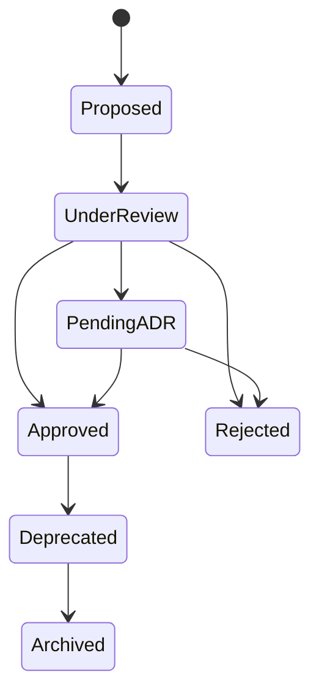
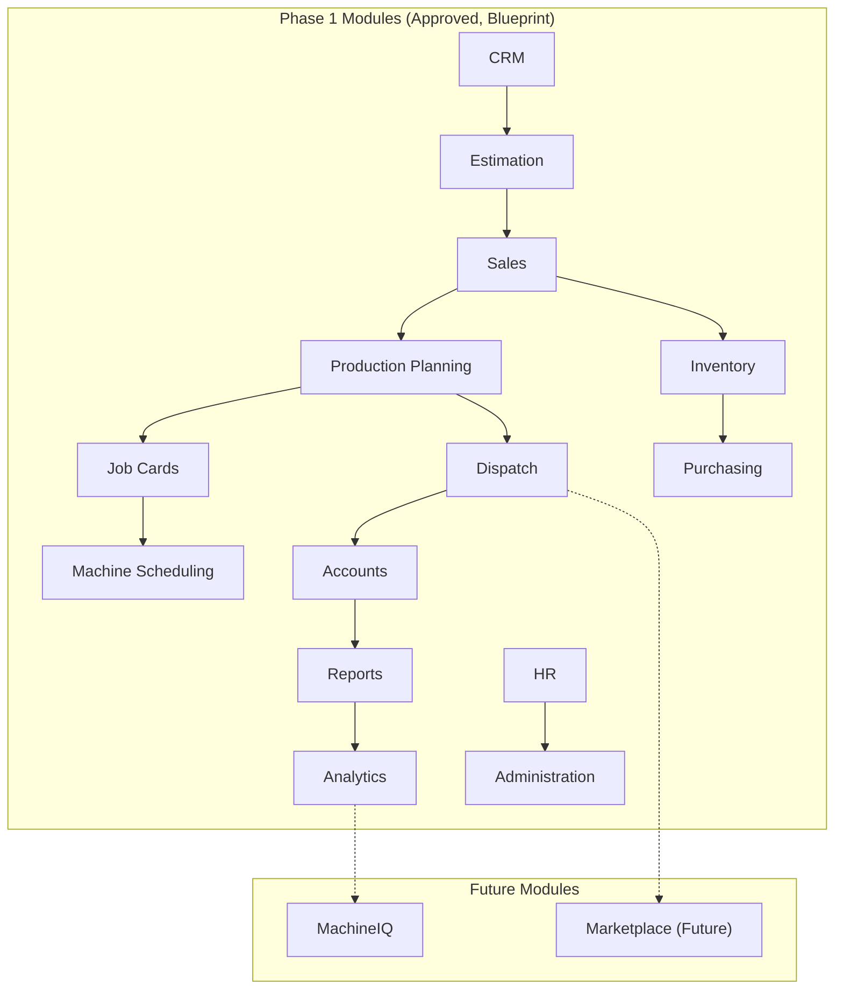
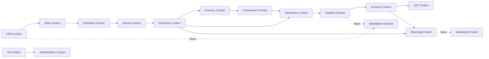
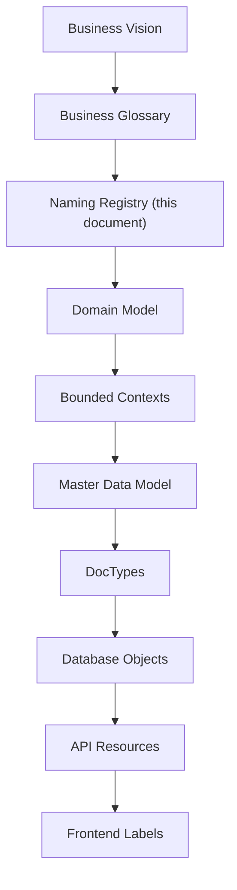
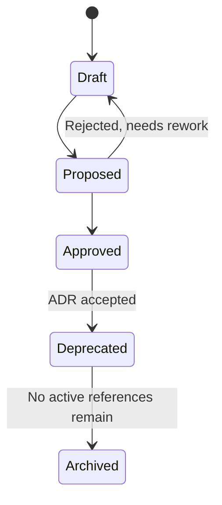
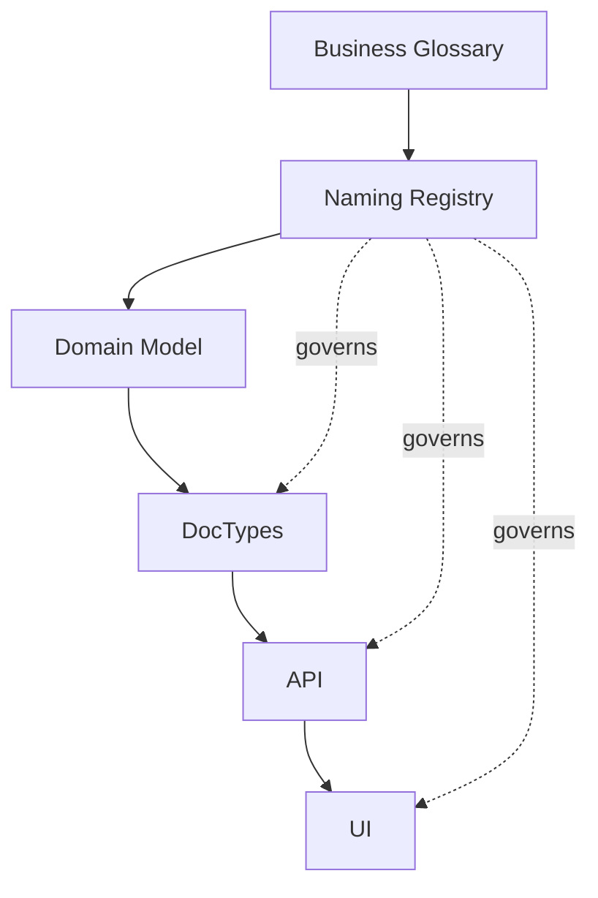

# Naming Registry

Version:
1.0

Status:
Draft

Owner:
PrintHub Architecture Team

Last Updated:
2026-07-22

---

# Purpose

This document is the single source of truth for **which names are officially approved** across PrintHub/PrintOS — business terms, module names, entity names, service names, integration names, abbreviations, and reserved words. It exists to eliminate duplicate terminology, prevent multiple names for the same concept, and give every contributor (human or AI) one place to check "what is this called here?" before introducing a new term.

This is distinct from [Naming_Standards.md](Naming_Standards.md), which defines **how** an approved name is formatted (snake_case, PascalCase, camelCase). Naming Standards answers "how do I write this name?"; the Naming Registry answers "is this the right name, and does it already exist under another name?" A name can be correctly formatted per the Standards and still be wrong per the Registry, if a different, already-approved term exists for the same concept.

---

# Scope

This document covers approved vocabulary across five layers: Business, Technical, Infrastructure, Integration, and User-Facing (UI). It covers naming for terms, modules, bounded contexts, entities, services, APIs, events, database objects, and UI labels.

This document does not define formatting rules (see [Naming_Standards.md](Naming_Standards.md)), does not define database schemas or field-level design (see `docs/blueprint/08_Master_Data_Model.md`), and does not contain application code.

**Explicit constraint on this version:** Where this Registry surfaces a naming inconsistency against existing Blueprint or Standards documents, this document does **not** unilaterally pick a winner or deprecate Blueprint terminology. Such conflicts are recorded as **Pending ADR** items (see Section 27, Naming Decision Matrix) for the Project Owner / Architecture Review to resolve.

---

# Background

PrintHub is built by a mixed team (Project Owner, ChatGPT, Claude) across many sessions and, eventually, many contributors, on top of ERPNext — a framework with its own established vocabulary. Without a controlled vocabulary, the same business concept tends to acquire multiple names over time (e.g., "Client" vs "Customer," "Quote" vs "Quotation" vs "Estimate"), each introduced independently and each locally reasonable. In an ERP system, where the same term appears in code, UI, reports, and customer-facing documents, this drift is expensive: it creates confusion, duplicated logic, and inconsistent reporting.

This Registry is grounded in the domain vocabulary already established in `docs/blueprint/05_Domain_Model.md`, the bounded contexts in `docs/blueprint/06_Bounded_Contexts.md`, and the master data entities in `docs/blueprint/08_Master_Data_Model.md`. `docs/business/Business_Glossary.md` does not yet exist; this Registry uses Blueprint terminology as its authoritative source until a formal Business Glossary is created (see Open Questions).

---

# Main Content

## 1. Purpose of Naming Registry

Enterprise projects require a controlled vocabulary because meaning must remain stable across a large surface area: code, UI, contracts, reports, training material, and customer-facing documents. Without central control, two independently reasonable naming choices (e.g., a developer writing "Client" while the Blueprint says "Customer") silently fork the vocabulary, and every subsequent contributor must guess which is authoritative.

| Aspect | Naming Standards | Naming Registry |
|---|---|---|
| Question answered | How should a name be written? | Which name is approved for this concept? |
| Scope | Casing, formatting, structural conventions | Vocabulary — the actual words/terms in use |
| Example | "DocTypes use PascalCase" | "The approved term is 'Sales Order', not 'Order' or 'Client Order'" |
| Changes when | A formatting convention changes | A new concept is introduced, or terminology is clarified/disambiguated |
| Owning document | `Naming_Standards.md` | `Naming_Registry.md` (this document) |

## 2. Naming Principles

- **Single meaning per term.** Each approved term maps to exactly one concept; a term is never reused for two different things.
- **No synonyms in active use.** Where multiple words could describe the same concept, exactly one is approved for active use; others are tracked in the Synonym Registry (Section 25) rather than used interchangeably.
- **Business first, technology second.** Approved names originate from business meaning (Domain Model, bounded contexts) rather than from implementation convenience.
- **Readable.** Names favor clarity over brevity; abbreviations are only used where explicitly approved (Section 19).
- **Expandable.** The Registry is structured so new terms can be added without restructuring existing entries.
- **Future-proof.** Naming anticipates future phases (Freelancer, Supplier, Service Engineer, Marketplace, MachineIQ) so that Phase 1 terms do not need renaming when later phases arrive.
- **ERPNext-compatible.** Approved names avoid collision with ERPNext's own reserved vocabulary (Section 21) unless intentionally extending an ERPNext concept.

## 3. Naming Decision Levels

Not every naming decision carries the same weight. This Registry distinguishes three decision levels so that trivial naming choices are not blocked waiting for architecture-level sign-off, while significant ones are not decided casually.

| Level | Description | Who Decides | Example |
|---|---|---|---|
| Level 1 — Terminology | A single business or technical term, not yet in conflict with existing vocabulary | Document author, recorded here for visibility | Adding "Workstation" as a new entity term |
| Level 2 — Structural | A module, bounded context, service, or API naming decision that affects multiple documents/modules | Architecture Review | Naming a new module "Quality" vs "Quality Control" |
| Level 3 — Conflicting/Cross-Cutting | A naming decision that conflicts with existing Blueprint or Standards terminology, or affects vocabulary shared across contexts | Project Owner via ADR (see Section 28) | Resolving "Estimating" vs "Estimations" (see [ADR-012](../decisions/ADR-012-Estimating-Terminology.md)), or the still-open event-naming casing conflict (Section 16 / Section 27, item #1) |

## 4. Naming Authority

| Role | Authority |
|---|---|
| Project Owner | Final authority on all Level 3 naming decisions; approves new ADRs arising from naming conflicts |
| Architecture Review (ChatGPT + Project Architecture) | Authority over Level 2 structural naming (modules, bounded contexts, services), subject to Owner ratification |
| Document Author (Claude or other contributor) | Authority to propose Level 1 terminology, recorded in this Registry as Draft/Pending until reviewed |
| Standards Review (per `docs/Documentation_Workflow.md` Section 7) | Confirms new names comply with `Naming_Standards.md` formatting once approved |

No individual contributor — human or AI — may unilaterally deprecate or rename existing Blueprint terminology. Any apparent conflict is routed to the Naming Decision Matrix (Section 27) as Pending ADR, never resolved silently within this document.

## 5. Naming Lifecycle

Names in this Registry pass through the following states, mirroring the document lifecycle in `docs/Documentation_Workflow.md` Section 5:

- **Proposed** — A new term suggested by a contributor, not yet reviewed.
- **Under Review** — Being evaluated against existing Registry entries for conflicts or duplication.
- **Pending ADR** — A conflict was found against existing Blueprint/Standards terminology; routed to Architecture Decision Record process (Section 28) rather than resolved here.
- **Approved** — Accepted into active use; appears in the tables below as an Approved Name.
- **Deprecated** — Superseded by an Owner/Architecture-approved decision; retained in the Deprecated Names table (Section 28) for migration reference.
- **Archived** — No longer referenced anywhere active; retained for historical record only.

## 6. Business Vocabulary Registry

Approved business terms, sourced from `docs/blueprint/05_Domain_Model.md` and `docs/blueprint/08_Master_Data_Model.md`. Since `docs/business/Business_Glossary.md` does not yet exist, this table serves as the interim authoritative business vocabulary.

| Approved Name | Definition | Usage | Deprecated Names |
|---|---|---|---|
| Customer | A party that purchases print/production work; an ERP customer record in Phase 1 | CRM, Sales, Accounts | Client, Party *(see Synonym Registry, Section 25 — not deprecated, tracked as synonym pending ADR)* |
| Supplier | A party that supplies materials or services to the business | Procurement, Warehouse, Accounts | Vendor *(pending ADR — see Section 27)* |
| Sales Order | A confirmed commercial commitment to produce and deliver work for a Customer | Sales, Production, Accounts | Order *(pending ADR)* |
| Quotation | A priced proposal for a defined scope of work, prior to customer approval | Estimation, Sales | Quote, Estimate, Proposal *(Deprecated per [ADR-013](../decisions/ADR-013-Quotation-Terminology.md))* |
| Print Job | A unit of print/production work performed to fulfill a Sales Order | Production | Job |
| Job Card | The production instruction and tracking record for a Print Job | Production | Job Ticket, Work Order *(Deprecated per [ADR-014](../decisions/ADR-014-Production-Terminology.md))* |
| Machine | A production asset capable of executing job operations | Production, Machine Scheduling, MachineIQ | Equipment |
| Operator | An Employee assigned to run or oversee a Machine during production | Production, HR | — |
| Production Order | **Rejected — not adopted.** No distinct entity introduced upstream of Job Card; Job Card remains the sole production-execution record. | Production | Per [ADR-014](../decisions/ADR-014-Production-Terminology.md) |
| Material | A physical input consumed in production | Inventory, Estimation | — |
| Substrate | The specific physical material printed or fabricated upon | Inventory, Production, Estimation | — |
| Inventory | The tracked stock of Materials available for production | Inventory | Stock |
| Warehouse | A physical location where Materials or finished goods are stored | Warehouse, Inventory | — |
| Invoice | The billing record for delivered work | Accounts | — |
| Payment | A record of funds received against an Invoice | Accounts | — |
| Dispatch | The act and record of delivering finished goods to a Customer | Dispatch | Delivery *(tracked in Synonym Registry, Section 25 — Blueprint uses both; see Section 27)* |
| Workstation | Not yet defined in Blueprint — recorded here as Proposed, pending clarification against Machine | Production | — |
| Company | The legal business entity operating PrintOS | Administration | — |
| Branch | A physical operating location of the Company | Administration | — |
| Employee | A person working within the business | HR | — |
| User | An authenticated actor operating the PrintOS system (may or may not be an Employee) | Administration, Security | — |
| Role | A named set of permissions assigned to a User | Administration, Security | — |
| Permission | A specific, grantable capability within the system | Administration, Security | — |
| Asset | Not yet defined in Blueprint distinctly from Machine — recorded here as Proposed | Production, Maintenance | — |
| Maintenance | Activity performed to keep a Machine/Asset in working order | Maintenance (proposed module, see Section 11) | — |
| Service Request | A request for equipment service or maintenance support | Maintenance, Service Engineer workflows (future) | — |
| Machine Event | A discrete, time-stamped occurrence reported by or about a Machine | MachineIQ, Production | — |
| Quality Check | A verification step confirming produced work meets required standards | Production, Quality (proposed module, see Section 11) | — |

Entries marked "Proposed" (Production Order, Workstation, Asset) are not yet present in `docs/blueprint/05_Domain_Model.md` or `08_Master_Data_Model.md`. They are recorded here at your request but require Blueprint update or an ADR before being treated as fully Approved (see Section 27, Open Questions).

## 7. Technical Vocabulary Registry

Approved technical terms used in architecture and implementation discussion, distinct from business vocabulary above.

| Approved Name | Definition | Usage | Deprecated Names |
|---|---|---|---|
| Bounded Context | A DDD boundary within which one business model and vocabulary apply consistently | Architecture | — |
| Domain Layer | The layer containing business rules, free of Frappe/ERPNext dependency | Architecture, Coding Standards | — |
| Application Layer | The layer orchestrating use cases against the Domain Layer | Architecture | — |
| Infrastructure Layer | The layer adapting Domain/Application logic to Frappe/ERPNext | Architecture | — |
| DocType | An ERPNext/Frappe schema-defining construct | DocType Standards, Database Standards | — |
| Custom Field | A field added to an existing ERPNext core DocType via extension mechanism | DocType Standards | — |
| Module | A cohesive unit of `printos_core` functionality mapped to one Bounded Context | Module Registry (Section 11) | — |
| Service | A named unit of application-layer logic performing one cohesive responsibility | Service Naming Registry (Section 14) | — |
| Event | A named, published fact representing a business-significant state change | Event Naming (Section 16) | — |

## 8. Infrastructure Vocabulary Registry

Approved terms describing deployment and platform infrastructure, kept distinct from business/technical vocabulary since infrastructure terms are sourced from `docs/blueprint/07_Technology_Stack.md` rather than the Domain Model.

| Approved Name | Definition | Usage | Deprecated Names |
|---|---|---|---|
| Company (Tenant Scope) | The ERPNext Company record used as the anchor for tenant/data scoping | Administration, future Multi-Tenant Architecture | Tenant *(pending ADR — "Tenant" is a future multi-tenancy term not yet formally mapped to "Company"; see Section 27)* |
| Environment | A named deployment context (Development, Testing, Staging, Production) | Deployment (reserved `docs/blueprint/24_Deployment_Architecture.md` per [ADR-010](../decisions/ADR-010-Blueprint-Numbering-Strategy.md)) | — |
| Instance | A single running deployment of PrintOS for one or more Companies | Deployment, Multi-Tenant Architecture | — |
| Background Job | An asynchronously executed unit of work (Frappe/Redis-backed) | Performance Standards | — |

## 9. Integration Vocabulary Registry

Approved terms for external and cross-system integration, distinct from internal technical vocabulary.

| Approved Name | Definition | Usage | Deprecated Names |
|---|---|---|---|
| Integration | A connection between PrintOS and an external system or service | Integration Architecture (reserved `docs/blueprint/22_Integration_Architecture.md` per [ADR-010](../decisions/ADR-010-Blueprint-Numbering-Strategy.md)) | — |
| Webhook | An inbound or outbound HTTP callback used for event notification to/from an external system | Integration | — |
| Payment Gateway | An external service used to process customer payments | Integration | — |
| WhatsApp Channel | The integration surface used for WhatsApp-based customer/operational communication | Integration | — |
| MachineIQ Service | The future machine-intelligence service consumed via API (see [ADR-008-MachineIQ.md](../decisions/ADR-008-MachineIQ.md)) | MachineIQ Vocabulary (Section 23) | — |
| Marketplace Service | The future public-facing marketplace service (see [ADR-009-Marketplace.md](../decisions/ADR-009-Marketplace.md)) | Marketplace Vocabulary (Section 24) | — |

## 10. User Groups

| Group | Name | Description |
|---|---|---|
| G1 | Public Customer | End buyers of print/production work; in Phase 1, exist only as ERP customer records, not active platform users. Becomes an active platform participant in Phase 5 (Marketplace). |
| G2 | Print Shop | The primary active user group in Phase 1; operates PrintOS ERP directly. |
| G3 | Freelancer | Freelance resources engaged by print shops; introduced in Phase 2 (Freelancer Portal). |
| G4 | Supplier | Suppliers of materials/services to print shops; introduced in Phase 3 (Supplier Portal). |
| G5 | Service Engineer | Field service/maintenance personnel; introduced in Phase 4 (Service Engineers). |

## 11. Module Registry

Modules currently defined in `docs/blueprint/09_PrintOS_Modules.md` are listed here as **Approved (Blueprint)**. Where your requested module list uses a different name for what appears to be the same or an overlapping concept, this is recorded as **Pending ADR**, not resolved.

| Approved Name (Blueprint) | Status | Requested Name (this task) | Note |
|---|---|---|---|
| CRM | Approved | CRM | Match |
| Estimation | Approved | Estimating | **Resolved — [ADR-012](../decisions/ADR-012-Estimating-Terminology.md).** Module renamed from "Quotation" to "Estimation" to match its bounded context; "Quotation" retained as the artifact this module produces, per [ADR-013](../decisions/ADR-013-Quotation-Terminology.md). "Estimating" (gerund) not adopted. |
| Sales | Approved | Sales | Match |
| Production Planning / Job Cards / Machine Scheduling | Approved (three sub-modules, unchanged) | Production Management | **Resolved — [ADR-014](../decisions/ADR-014-Production-Terminology.md).** The three modules remain separate; "Production Management" is approved only as a documentation-umbrella term (e.g., Blueprint chapter title), never as a module/DocType/API/UI name. |
| Inventory | Approved | Inventory | Match |
| Purchasing | Approved | Procurement | **Pending ADR** — same concept, two names; see Section 27 |
| Accounts | Approved | Finance | **Resolved — [ADR-011](../decisions/ADR-011-Business-Finance-Terminology.md).** "Accounts" is canonical at every layer; "Finance" and "Financial Management" are Deprecated aliases. |
| HR | Approved | HR | Match |
| — | Not yet in Blueprint | Quality | **Pending ADR** — new module proposed; no corresponding entry in `09_PrintOS_Modules.md` |
| — | Not yet in Blueprint | Maintenance | **Pending ADR** — new module proposed; no corresponding entry in `09_PrintOS_Modules.md` |
| Dispatch | Approved | Dispatch | Match |
| Reports / Analytics | Approved | Analytics | Partial match — Blueprint separates Reports and Analytics |
| Administration | Approved | Administration | Match |
| MachineIQ (Future) | Approved | MachineIQ | Match |
| Marketplace (Future) | Approved | Marketplace (Future) | Match |

## 12. Bounded Context Names

Official bounded context names, per `docs/blueprint/06_Bounded_Contexts.md`. Names are used exactly as listed; no abbreviated or alternate forms are approved for these context names.

| Context | Brief Description |
|---|---|
| CRM Context | Lead/enquiry capture and customer relationship tracking |
| Sales Context | Confirmed order management |
| Estimation Context | Industry-specific pricing and Quotation generation *(renamed from "Estimations Context" per [ADR-012](../decisions/ADR-012-Estimating-Terminology.md); source document `06_Bounded_Contexts.md` header corrected in the same pass as this Registry update)* |
| Artwork Context | Design asset management and customer approval |
| Production Context | Job Card execution and tracking |
| Inventory Context | Material availability and consumption tracking |
| Procurement Context | Material/service acquisition from Suppliers |
| Warehouse Context | Physical storage and goods movement |
| Dispatch Context | Delivery of finished goods |
| Accounts Context | Financial transaction recording |
| GST Context | Statutory tax compliance |
| HR Context | Employee record management |
| Administration Context | System and organizational configuration |
| Reporting Context | Cross-context reporting and dashboards |
| MachineIQ Context (Future) | Machine intelligence over production/reporting data |
| Marketplace Context (Future) | Public buyer-facing discovery and ordering |

Note: "Estimating Context" and "Finance Context," used in the requested Section 6 list, are **resolved**: the approved names are `Estimation Context` (per [ADR-012](../decisions/ADR-012-Estimating-Terminology.md)) and `Accounts Context` (per [ADR-011](../decisions/ADR-011-Business-Finance-Terminology.md)), respectively.

## 13. Entity Naming Registry

| Approved Entity Name | Definition | Blueprint Source | Note |
|---|---|---|---|
| Customer | See Business Vocabulary (Section 6) | `05_Domain_Model.md` | — |
| Supplier | See Business Vocabulary | `08_Master_Data_Model.md` | — |
| Print Job | See Business Vocabulary | `05_Domain_Model.md` | Requested list also includes "Job Ticket" and "Work Order" — **Deprecated per [ADR-014](../decisions/ADR-014-Production-Terminology.md)**, not merged |
| Artwork | The design/creative asset submitted or approved for production | `05_Domain_Model.md` | — |
| Machine | See Business Vocabulary | `05_Domain_Model.md` | — |
| Production Order | Not adopted | — | **Rejected per [ADR-014](../decisions/ADR-014-Production-Terminology.md)** — Job Card remains the sole production-execution entity |
| Inventory Item | Not yet a distinct Blueprint entity (Blueprint uses "Material" / "Substrate") | — | **Pending ADR** — clarify relationship to Material/Substrate |
| Material | See Business Vocabulary | `08_Master_Data_Model.md` | — |
| Paper | Not a distinct Blueprint entity — treated as a Paper Size (master data) or a Substrate instance | `08_Master_Data_Model.md` | **Pending ADR** — clarify whether "Paper" needs its own entity distinct from Substrate/Paper Sizes |
| Ink | Not yet defined in Blueprint | — | **Proposed** |
| Plate | Not yet defined in Blueprint | — | **Proposed** |
| Job Ticket | Not an approved name — see Job Card | — | **Deprecated per [ADR-014](../decisions/ADR-014-Production-Terminology.md)** |
| Work Order | Not an approved name — see Job Card | — | **Deprecated per [ADR-014](../decisions/ADR-014-Production-Terminology.md)** |
| Quality Record | Corresponds to Blueprint's "Quality Check Record" (`09_PrintOS_Modules.md`, Job Cards) | `09_PrintOS_Modules.md` | **Pending ADR** — confirm exact name |
| Maintenance Log | Not yet defined in Blueprint | — | **Proposed** |

## 14. Service Naming Registry

Illustrative, architecture-level service names for the Application Layer (no implementation). Naming convention: `<Concept>Service`, PascalCase, per `Naming_Standards.md`.

| Service Name | Responsibility | Bounded Context |
|---|---|---|
| EstimateService | Produces priced Quotations from job scope and master data | Estimation |
| ProductionPlanningService | Sequences and schedules Job Cards across capacity | Production |
| InventoryAllocationService | Allocates Material stock to Job Cards | Inventory |
| PricingService | Computes pricing rules shared across Estimation and Sales | Estimation, Sales |
| SchedulingService | Assigns Job Cards to Machines within capability constraints | Production (Machine Scheduling) |
| NotificationService | Dispatches notifications (e.g., approval requests, status changes) across channels | Cross-cutting |
| MachineIntegrationService | Mediates communication with Machines/MachineIQ (future) | MachineIQ (Future) |

These names are illustrative architecture-level placeholders, not a commitment to a specific implementation structure; they are provided here to reserve consistent vocabulary ahead of implementation.

## 15. API Naming

Architecture-level conventions only — no endpoint implementation.

- **REST resource names** use plural nouns matching the approved Entity Naming Registry (Section 13) — e.g., `sales-orders`, `job-cards`, `quotations` — not singular or ad hoc alternatives (`order`, `job`).
- **Plural rules** follow standard English pluralization; irregular business terms retain their approved singular/plural form as registered here rather than being auto-pluralized (e.g., "Inventory" is treated as a mass noun and not pluralized).
- **URI conventions** are namespaced under `printos_core`, consistent with `API_Standards.md` (e.g., `/api/method/printos_core.sales.sales_order.*`).
- **Version naming** follows `MAJOR` version increments only in the URI/namespace (e.g., `v1`, `v2`); MINOR/PATCH changes per `Versioning.md` do not appear in the API path.

## 16. Event Naming

Two conventions currently exist in the repository and are **in direct conflict**:

| Source | Convention | Example |
|---|---|---|
| `docs/standards/Event_Standards.md` | `<entity>.<action>`, snake_case | `job_card.completed`, `artwork.approved` |
| This task's requested Event Naming list | PascalCase, `<Entity><PastTenseAction>` | `JobCompleted`, `OrderConfirmed`, `QuotationCreated` |

**This conflict is not resolved in this document.** Per your instruction, it is recorded here as a **Pending ADR** (see Section 27, Naming Decision Matrix) rather than choosing a winner. Until an ADR is accepted, `Event_Standards.md`'s existing snake_case convention remains the only Approved convention in force, since it predates this Registry and is already Published; the PascalCase form requested in this task is recorded as **Proposed, Pending ADR**.

Illustrative event names (business meaning only, casing pending ADR):

| Business Event | Trigger |
|---|---|
| Quotation Created | A new Quotation is generated (see Business Workflows: Quotation to Sales Order) |
| Order Confirmed | A Sales Order is confirmed from an approved Quotation |
| Job Started | A Job Card transitions to In Progress |
| Job Completed | A Job Card transitions to Complete |
| Inventory Reserved | Material is allocated to a Job Card |
| Machine Stopped | A Machine transitions to an unavailable/stopped state |
| Maintenance Scheduled | A Machine Maintenance activity is scheduled |

## 17. Database Naming

References existing standards rather than restating them, per Cross-Referencing Rules in `docs/Documentation_Workflow.md` Section 9:

- **DocType names** — see `DocType_Standards.md` (PascalCase with spaces, matching business entity names).
- **Table names** — see `Database_Standards.md` (Frappe-managed `tab<DocType>` convention).
- **Field names** — snake_case internally, per `Naming_Standards.md`.
- **Index names** — follow Frappe's default index-naming behavior; no custom index-naming convention is separately approved at this time (see Open Questions).
- **Constraint names** — follow Frappe/MariaDB defaults; no PrintOS-specific constraint-naming convention is separately approved at this time (see Open Questions).

This Registry does not introduce new database naming rules beyond what `Database_Standards.md` and `DocType_Standards.md` already define; it exists here only to confirm those documents remain the single source for database naming, avoiding a duplicate, possibly conflicting rule set.

## 18. UI Naming

| Category | Convention | Example |
|---|---|---|
| Screen names | Match the approved Entity or Module name, title case | "Job Cards", "Sales Orders" |
| Menu names | Match Module Registry names (Section 11) | "Production", "Inventory" |
| Navigation labels | Short form of screen name where space-constrained, never a new synonym | "Jobs" only if explicitly registered as an approved short form (not currently registered) |
| Button labels | Verb-first, action-oriented | "Create Quotation", "Approve Artwork" |
| Status names | Match approved Workflow state names exactly, per `Workflow_Standards.md` | "Scheduled", "In Progress", "Quality Check", "Complete" |

## 19. Abbreviation Registry

Approved abbreviations only. An abbreviation not listed here is not approved for use in code, UI, or documentation.

| Abbreviation | Expansion | Approved For |
|---|---|---|
| ERP | Enterprise Resource Planning | General reference |
| CRM | Customer Relationship Management | Module/Context name |
| API | Application Programming Interface | Technical documentation |
| SKU | Stock Keeping Unit | Inventory (once formally introduced to Master Data Model) |
| BOM | Bill of Materials | Production/Estimation (once formally introduced) |
| UOM | Unit of Measure | Master Data (matches `Units of Measure` in `08_Master_Data_Model.md`) |
| GST | Goods and Services Tax | Accounts/GST Context |
| PO | Purchase Order | Procurement |
| SO | Sales Order | Sales |
| RFQ | Request for Quotation | CRM/Estimation (once formally introduced) |
| OTP | One-Time Password | Security/Authentication |

**Rejected (ambiguous) abbreviations:** "QC" (ambiguous between Quality Check and Quotation/Quote Confirmation — use full "Quality Check"); "MR" (ambiguous — could mean Material Request or Maintenance Request; use full term); "WO" (ambiguous between Work Order and, potentially, Warehouse Operation — not approved while "Job Card" remains the approved term and "Work Order" is an unresolved synonym per Section 25).

## 20. Reserved Words

The following words are reserved due to existing meaning within ERPNext/Frappe or this Registry, and must not be repurposed for a different concept:

| Reserved Word | Reason |
|---|---|
| User | Reserved — ERPNext core concept (authenticated system user) |
| Role | Reserved — ERPNext core concept (permission grouping) |
| Company | Reserved — ERPNext core concept and this Registry's approved tenant-scope anchor (Section 8) |
| Owner | Reserved — ERPNext core concept (document ownership field) and overlaps with "Project Owner" role in `CLAUDE.md`; disambiguate explicitly wherever used |
| Administrator | Reserved — ERPNext core system account name |
| Document | Reserved — ERPNext core concept (any DocType record) |
| Status | Reserved — ERPNext core concept and this Registry's approved term for workflow state (Section 18) |
| System | Reserved — generic term; avoid using as part of a specific entity/module name |

## 21. ERPNext Reserved Terms

Terms owned by the ERPNext/Frappe framework itself, listed separately from PrintOS's own Reserved Words (Section 20) because they originate from the framework, not from this Registry:

| Term | ERPNext Meaning | PrintOS Constraint |
|---|---|---|
| DocType | Frappe's schema-defining construct | Must not be redefined; PrintOS entities are implemented as DocTypes, not renamed at the framework level |
| Naming Series | Frappe's auto-numbering mechanism | Referenced, not renamed |
| Workflow | Frappe's built-in approval-workflow feature | PrintOS's own `Workflow_Standards.md` usage of "workflow" (business process) must be read in context — this is a known terminology overlap, tracked here rather than silently merged |
| Custom Field / Custom DocType | Frappe extension mechanisms | See `DocType_Standards.md`; terms retained exactly as ERPNext defines them |
| Company | ERPNext's multi-company/tenant-scoping DocType | Adopted directly as PrintOS's tenant-scope anchor (Section 8) — not renamed |
| Item | ERPNext's generic stock/product DocType | Overlaps conceptually with PrintOS's "Material"/"Product Template" — **Pending ADR**, see Section 27 |

## 22. Print Industry Vocabulary

Industry-specific terms from `docs/blueprint/05_Domain_Model.md` (Domain Terminology / Industry Vocabulary), reproduced here for Registry completeness rather than restated with new definitions:

| Term | Meaning |
|---|---|
| Substrate | The physical material printed or fabricated upon (paper, vinyl, acrylic, fabric, etc.) |
| Media | Consumable print material; often used interchangeably with Substrate in digital printing contexts |
| Finishing | Post-print processes such as lamination, cutting, binding, or mounting |
| Proof | A representation of artwork provided to the customer for approval before production |
| Machine Profile | The defined capabilities and constraints of a specific production Machine |

## 23. MachineIQ Vocabulary

MachineIQ's detailed vocabulary is not yet defined — its scope is deferred to a future Blueprint document per [ADR-008-MachineIQ.md](../decisions/ADR-008-MachineIQ.md). The following terms are provisionally reserved for MachineIQ usage:

| Term | Provisional Meaning | Status |
|---|---|---|
| Machine Event | A discrete, time-stamped occurrence reported by/about a Machine | Approved (Business Vocabulary, Section 6) |
| Insight | A MachineIQ-generated recommendation or observation | Proposed — pending MachineIQ scoping document |
| Model Output | The result of a MachineIQ analytical process | Proposed — pending MachineIQ scoping document |

## 24. Marketplace Vocabulary

Marketplace's detailed vocabulary is deferred to Phase 5 planning per [ADR-009-Marketplace.md](../decisions/ADR-009-Marketplace.md). Provisional terms:

| Term | Provisional Meaning | Status |
|---|---|---|
| Marketplace Listing | A print shop's advertised capability/catalog entry visible to public buyers | Proposed — pending Marketplace scoping document |
| Marketplace Order | An order originated by a Public Customer (G1) through the Marketplace | Proposed — pending Marketplace scoping document |

## 25. Synonym Registry

Terms that are **not** deprecated but are tracked because more than one form currently appears across Blueprint/Standards documents or this task's requested vocabulary. Per your instruction, none of these are unilaterally resolved here.

| Concept | Forms in Use | Where Found | Status |
|---|---|---|---|
| Customer | Customer, Client, Party | `05_Domain_Model.md` uses Customer; "Client"/"Party" appear only in this task's prompt history, not in Blueprint | Pending ADR |
| Quotation | Quotation, Quote, Estimate | `05_Domain_Model.md`/`09_PrintOS_Modules.md` use Quotation; "Estimate" appears in this task's requested Entity list | **Resolved — [ADR-013](../decisions/ADR-013-Quotation-Terminology.md).** Quotation canonical; Quote/Estimate/Proposal Deprecated. |
| Job Card | Job Card, Job Ticket, Work Order | `05_Domain_Model.md`/`09_PrintOS_Modules.md` use Job Card; "Job Ticket"/"Work Order" appear only in this task's requested Entity list | **Resolved — [ADR-014](../decisions/ADR-014-Production-Terminology.md).** Job Card canonical; Job Ticket/Work Order Deprecated. |
| Dispatch / Delivery | Dispatch, Delivery | `06_Bounded_Contexts.md` uses "Dispatch" as context name but "Delivery Note" as a business concept, and other documents use "Delivery" informally | Pending ADR |
| Procurement / Purchasing | Procurement, Purchasing | `06_Bounded_Contexts.md` uses "Procurement"; `09_PrintOS_Modules.md` module is named "Purchasing" | Pending ADR |
| Accounts / Finance | Accounts, Finance | `06_Bounded_Contexts.md`/`09_PrintOS_Modules.md` use "Accounts"; this task's requested Module list uses "Finance" | **Resolved — [ADR-011](../decisions/ADR-011-Business-Finance-Terminology.md).** Accounts canonical; Finance/Financial Management Deprecated. |
| Estimations / Estimating | Estimations, Estimating | `06_Bounded_Contexts.md` uses "Estimations"; this task's requested list uses "Estimating" | **Resolved — [ADR-012](../decisions/ADR-012-Estimating-Terminology.md).** Estimation (singular) canonical; Estimations/Estimating Deprecated. |
| Vendor / Supplier | Supplier, Vendor | `08_Master_Data_Model.md` uses "Supplier" exclusively; "Vendor" not present in Blueprint but a common ERP synonym | Pending ADR |
| Estimate / Quotation | Quotation, Estimate | Also surfaced in Section 35 (Print Industry Standard Terms) — duplicate reference to the same conflict as row 2 above, not a new one | **Resolved — see [ADR-013](../decisions/ADR-013-Quotation-Terminology.md)** (same resolution as the Quotation row above) |
| Production Batch / Batch | Batch, Production Batch | Surfaced in Section 35 (Print Industry Standard Terms) — both Proposed, relationship not yet defined | Pending ADR |
| Machine Setup / Makeready | Makeready, Machine Setup | Surfaced in Section 35 (Print Industry Standard Terms) — both Proposed, relationship not yet defined | Pending ADR |
| Delivery Partner / Dispatch | Dispatch, Delivery Partner | Surfaced in Section 37 (Marketplace Terminology) — Delivery Partner is a future third-party concept; relationship to internal Dispatch context not yet defined | Pending ADR |
| Production Management / Production Planning | Production Planning, Production Management | Surfaced in Section 27a — Blueprint scaffold `15_Production_Management.md` vs. existing "Production Planning" module | **Resolved — [ADR-014](../decisions/ADR-014-Production-Terminology.md).** Production Planning remains the module name; Production Management approved only as a documentation-umbrella term, not a synonym in active technical use. |

## 26. Naming Review Checklist

Applied whenever a new name is proposed (Section 5, Proposed state) before it can move to Under Review:

- [ ] Term does not already exist under a different name in this Registry
- [ ] Term does not collide with a Reserved Word (Section 20) or ERPNext Reserved Term (Section 21)
- [ ] Term is placed in the correct vocabulary registry (Business / Technical / Infrastructure / Integration)
- [ ] Term follows formatting conventions in `Naming_Standards.md`
- [ ] If the term conflicts with existing Blueprint or Standards terminology, it is recorded as Pending ADR (Section 27), not silently substituted
- [ ] Term's bounded context / module ownership is identified
- [ ] Abbreviation, if any, is checked against the Abbreviation Registry (Section 19) for ambiguity
- [ ] Cross-references to source Blueprint/Standards documents are included

## 27. Naming Decision Matrix

Consolidated list of every conflict surfaced while compiling this Registry, each requiring a Naming Authority (Section 4) decision via ADR before resolution:

| # | Conflict | Options | Decision Level | Status |
|---|---|---|---|---|
| 1 | Event naming casing: `entity.action` (snake_case, `Event_Standards.md`) vs `EntityAction` (PascalCase, requested here) | Keep snake_case / Adopt PascalCase / Support both with defined scope | Level 3 | Pending ADR |
| 2 | Estimations (Blueprint) vs Estimating (requested) | Standardize on Estimations / Standardize on Estimating | Level 2 | **Resolved — [ADR-012](../decisions/ADR-012-Estimating-Terminology.md).** Estimation (singular) is canonical. |
| 3 | Purchasing (Blueprint module) vs Procurement (Blueprint context, also requested) | Standardize module name to match context name | Level 2 | Pending ADR |
| 4 | Accounts (Blueprint) vs Finance (requested) | Standardize on Accounts / Standardize on Finance | Level 2 | **Resolved — [ADR-011](../decisions/ADR-011-Business-Finance-Terminology.md).** Accounts is canonical. |
| 5 | Dispatch vs Delivery used interchangeably | Standardize on Dispatch as context/module name; define Delivery as a specific business object within it, or vice versa | Level 2 | Pending ADR |
| 6 | Customer vs Client vs Party | Confirm Customer as sole approved term; formally deprecate others once confirmed | Level 3 | Pending ADR |
| 7 | Quotation vs Quote vs Estimate | Confirm Quotation as sole approved term | Level 3 | **Resolved — [ADR-013](../decisions/ADR-013-Quotation-Terminology.md).** Quotation is canonical; Quote/Estimate/Proposal Deprecated. |
| 8 | Job Card vs Job Ticket vs Work Order | Confirm Job Card as sole approved term, or define distinct meanings if they are not actually synonyms | Level 3 | **Resolved — [ADR-014](../decisions/ADR-014-Production-Terminology.md).** Job Card is canonical; Job Ticket/Work Order Deprecated. |
| 9 | New modules "Quality" and "Maintenance" not present in `09_PrintOS_Modules.md` | Add as new Blueprint modules / fold into existing Production module | Level 2 | Pending ADR |
| 10 | ERPNext "Item" vs PrintOS "Material"/"Product Template" | Clarify mapping between ERPNext core concept and PrintOS domain terms | Level 2 | Pending ADR |
| 11 | "Tenant" (future multi-tenancy term) vs "Company" (current ERPNext anchor) | Confirm Company remains the tenant-scope anchor, or introduce a distinct Tenant concept | Level 3 | Pending ADR (see [ADR-006-MultiTenant-Strategy.md](../decisions/ADR-006-MultiTenant-Strategy.md)) |
| 12 | "Production Order" not yet distinguished from "Job Card" | Confirm Production Order is a distinct upstream concept from Job Card, or drop it in favor of Job Card alone | Level 3 | **Resolved — [ADR-014](../decisions/ADR-014-Production-Terminology.md).** Production Order rejected; not adopted. |
| 13 | "Vendor" (Marketplace terminology, Section 37) vs "Supplier" (Approved, Section 6) | Confirm Supplier remains the sole approved term across both ERP and Marketplace contexts, or introduce Vendor as a Marketplace-specific term | Level 2 | Pending ADR |
| 14 | "Marketplace Quote" / "Marketplace Payment" (Section 37) vs "Quotation" / "Payment" (Approved, Section 6) | Confirm these are the same concept scoped to Marketplace, or distinct Marketplace-specific entities | Level 2 | Pending ADR (note: "Marketplace Quote" should be read against the "Quotation" resolution in [ADR-013](../decisions/ADR-013-Quotation-Terminology.md) once addressed) |
| 15 | "Delivery Partner" (Section 37) vs "Dispatch" context (Section 12) | Clarify whether Delivery Partner is a role within the Dispatch context or a separate future concept | Level 2 | Pending ADR |
| 16 | "Estimate" used as both a Print Industry term (Section 35) and a rejected synonym for Quotation (Section 25) | Confirm "Estimate" is fully subsumed by Quotation, with no residual distinct meaning | Level 3 | **Resolved — [ADR-013](../decisions/ADR-013-Quotation-Terminology.md).** "Estimate" is Deprecated as a Quotation synonym; "Cost Estimate" survives as a distinct internal artifact. |
| 17 | "Production Batch" vs "Batch"; "Machine Setup" vs "Makeready" (Section 35) | Confirm whether each pair is a true synonym (merge) or represents distinct concepts | Level 2 | Pending ADR |
| 18 | "Production Management" (Section 27a scaffold term) vs "Production Planning" (Approved module) | Confirm whether Production Management replaces, merges with, or coexists alongside Production Planning | Level 2 | **Resolved — [ADR-014](../decisions/ADR-014-Production-Terminology.md).** Production Planning remains the module name; Production Management approved only as a documentation-umbrella term. |

## 27a. Blueprint Scaffold Terminology (Proposed)

The following Blueprint document names (from the 11–20 scaffold, see `docs/blueprint/00_Master_Index.md`) are registered here as **Proposed** terminology, per the Mandatory Registration rule (Section 38) and following the Naming Review Checklist (Section 26/39). None are Approved; none are resolved against existing Registry entries. Numbering for the cross-cutting architecture documents these scaffold files collided with is addressed separately by [ADR-010-Blueprint-Numbering-Strategy.md](../decisions/ADR-010-Blueprint-Numbering-Strategy.md).

| Term | Source | Status | Note |
|---|---|---|---|
| Print Industry Model | `docs/blueprint/11_Print_Industry_Model.md` | Proposed | Relationship to existing Print Industry Vocabulary (Section 22/35) not yet defined |
| PrintOS Product Catalog | `docs/blueprint/12_PrintOS_Product_Catalog.md` | Proposed | Relationship to "Product Template" / "Product Category" (Master Data, Section 6) not yet defined |
| Pricing Engine | `docs/blueprint/13_Pricing_Engine.md` | Proposed | Relationship to "PricingService" (Section 14) not yet defined |
| Quotation Engine | `docs/blueprint/14_Quotation_Engine.md` | Proposed | "Quotation" itself is now Approved/canonical per [ADR-013](../decisions/ADR-013-Quotation-Terminology.md) and the underlying context is "Estimation" per [ADR-012](../decisions/ADR-012-Estimating-Terminology.md); "Quotation Engine" as a document title remains Proposed pending its own content review — not itself a Naming Decision Matrix item |
| Production Management | `docs/blueprint/15_Production_Management.md` | **Approved (documentation-umbrella use only)** | **Resolved — [ADR-014](../decisions/ADR-014-Production-Terminology.md).** Not a synonym of "Production Planning"; approved solely as this Blueprint document's title, never as a module/DocType/API/UI term. |
| Print Machine Model | `docs/blueprint/16_Print_Machine_Model.md` | Proposed | Relationship to "Machine" (Approved, Section 6) not yet defined |
| Inventory Model | `docs/blueprint/17_Inventory_Model.md` | Proposed | Relationship to "Inventory" (Approved, Section 6) not yet defined |
| Artwork Management | `docs/blueprint/18_Artwork_Management.md` | Proposed | Relationship to "Artwork" (Approved, Section 6/13) not yet defined |
| Job Card Model | `docs/blueprint/19_Job_Card_Model.md` | Proposed | Relationship to "Job Card" (Approved, Section 6) not yet defined |
| Dashboard Architecture | `docs/blueprint/20_Dashboard_Architecture.md` | Proposed | Relationship to "Reporting Context" / "Analytics" module (Section 12, 09_PrintOS_Modules.md) not yet defined |

These entries are recorded, not approved: per the Term Change Policy (Section 33) and Governance Rule (Section 38), no existing Approved term (e.g., "Production Planning," "Quotation") is renamed or superseded by these Proposed entries. Each should go through the Naming Review Checklist (Section 39) before its corresponding Blueprint document is written with substantive content.

## 28. Future Naming Governance

- **Who approves new names:** Level 1 (terminology) additions are recorded by the proposing author and surfaced in this Registry as Proposed; Level 2 (structural) additions require Architecture Review; Level 3 (conflicting/cross-cutting) additions require a Project-Owner-approved ADR, following the same process as other architectural decisions (`docs/Documentation_Workflow.md` Section 11).
- **How names are added:** A contributor proposes a term via the Naming Review Checklist (Section 26); if no conflict is found, it is added directly as Approved at Level 1; if a conflict is found, it is added to the Naming Decision Matrix (Section 27) as Pending ADR.
- **How names are deprecated:** A name only moves to the Deprecated Names table below once a Level 3 ADR has been accepted resolving the corresponding Naming Decision Matrix entry — never before.
- **How the Registry evolves:** This document follows the same Version Control rules as all documentation (`docs/Documentation_Workflow.md` Section 8); a new Approved term is a Minor version increment, while resolving a Pending ADR into a Deprecated/Approved pair is a Major version increment given its cross-cutting impact.

### Deprecated Names

The following terms are formally deprecated, each by an accepted ADR. Terms not listed here remain either Approved or Proposed (see Sections 6–9, 13, 27a) — nothing is deprecated pre-emptively without an ADR.

| Deprecated | Approved | Reason | ADR Reference |
|---|---|---|---|
| Finance | Accounts | ERPNext itself names this domain "Accounts"; all Published Blueprint content already used "Accounts" | [ADR-011](../decisions/ADR-011-Business-Finance-Terminology.md) |
| Financial Management | Accounts | Broader in scope than the actual bounded context (invoicing/payment/GST); inconsistent with single-word context-naming pattern | [ADR-011](../decisions/ADR-011-Business-Finance-Terminology.md) |
| Estimations | Estimation | Plural form inconsistent with every sibling bounded context (all singular nouns); also internally inconsistent with `06_Bounded_Contexts.md`'s own prose | [ADR-012](../decisions/ADR-012-Estimating-Terminology.md) |
| Estimating | Estimation | Gerund form describes an activity, not a named business area; inconsistent with noun-based convention | [ADR-012](../decisions/ADR-012-Estimating-Terminology.md) |
| Quote | Quotation | Colloquial short form; not used anywhere in Published Blueprint content | [ADR-013](../decisions/ADR-013-Quotation-Terminology.md) |
| Estimate *(as a Quotation-document synonym)* | Quotation | Creates ambiguity with the distinct internal "Cost Estimate" artifact (`06_Bounded_Contexts.md`) | [ADR-013](../decisions/ADR-013-Quotation-Terminology.md) |
| Proposal | Quotation | Previously unused in the Blueprint; generic term risking ambiguity with non-pricing sales proposals | [ADR-013](../decisions/ADR-013-Quotation-Terminology.md) |
| Job Ticket | Job Card | Synonym of an already-Approved entity; no distinct meaning identified | [ADR-014](../decisions/ADR-014-Production-Terminology.md) |
| Work Order | Job Card | Synonym of an already-Approved entity; also already a Rejected abbreviation source ("WO", Section 19) | [ADR-014](../decisions/ADR-014-Production-Terminology.md) |
| Production Order | Job Card | No documented business need for a distinct upstream entity; rejected as speculative | [ADR-014](../decisions/ADR-014-Production-Terminology.md) |

## 29. Canonical Naming Hierarchy

Naming authority flows in one direction only. Each layer below derives its vocabulary from the layer above it; a lower layer **MUST NOT invent terminology** that does not already exist above it. If a lower layer needs a term that does not yet exist upstream, the term must be proposed upstream first (per Section 3, Naming Decision Levels, and Section 33, Term Change Policy) — it is never coined locally and pushed downward informally.

| Layer | Role | Source of Truth For |
|---|---|---|
| Business Vision | Why PrintHub/PrintOS exists | `docs/blueprint/01_Project_Vision.md` |
| Business Glossary | Business meaning of terms (not yet created — see Open Questions) | `docs/business/Business_Glossary.md` |
| Naming Registry | Which name is approved for a concept (this document) | `docs/standards/Naming_Registry.md` |
| Domain Model | Business entities, relationships, and rules | `docs/blueprint/05_Domain_Model.md` |
| Bounded Contexts | Contextual ownership and boundaries | `docs/blueprint/06_Bounded_Contexts.md` |
| Master Data Model | Reference/master data entities | `docs/blueprint/08_Master_Data_Model.md` |
| DocTypes | ERPNext/Frappe schema constructs | `docs/standards/DocType_Standards.md` |
| Database Objects | Tables, fields, indexes, constraints | `docs/standards/Database_Standards.md` |
| API Resources | REST resource names and contracts | `docs/standards/API_Standards.md`, Section 15 above |
| Frontend Labels | Screen, menu, button, and status labels | Section 18 above |

This hierarchy is a strict precedence order, not a suggestion: a naming decision made at, e.g., the API Resources layer that conflicts with the Domain Model layer is invalid regardless of how convenient it is locally, and must be escalated per Section 33 rather than implemented as-is.

## 30. Term Ownership

Every registered term in this Registry carries ownership metadata so that governance questions ("who do I ask about this term?", "who approved it?") have a documented answer rather than requiring archaeology through chat history.

| Field | Meaning |
|---|---|
| Business Owner | The role accountable for the term's business meaning (typically Project Owner, or a named business stakeholder once the team grows) |
| Architecture Owner | The role accountable for the term's structural placement (Project Architecture Team) |
| Status | Current Term Maturity state (see Section 31) |
| Source Document | The Blueprint/Business/Standards document where the term is first defined |
| Approved By | Who approved the term's current status (Project Owner for Level 3, Architecture Review for Level 2, Author for Level 1 — per Section 4, Naming Authority) |
| ADR Reference | The ADR that approved or resolved the term, where applicable |

**Illustrative ownership entries** (applied retroactively to already-Approved terms from Section 6 as an example of the model; not a re-approval event):

| Term | Business Owner | Architecture Owner | Status | Source Document | Approved By | ADR Reference |
|---|---|---|---|---|---|---|
| Customer | Project Owner | Project Architecture Team | Approved | `05_Domain_Model.md` | Author (Level 1, pre-Registry) | — |
| Sales Order | Project Owner | Project Architecture Team | Approved | `05_Domain_Model.md` | Author (Level 1, pre-Registry) | — |
| Job Card | Project Owner | Project Architecture Team | Approved | `05_Domain_Model.md` | Author (Level 1, pre-Registry) | — |
| Production Order | Project Owner | Project Architecture Team | Proposed | This document (Section 6) | Not yet approved | Pending ADR (Section 27, item 12 below) |

New terms added after this version must populate all six ownership fields at the time they are proposed (see Section 26, Naming Review Checklist, extended in Section 39 below).

## 31. Term Maturity

Every registered term carries exactly one maturity state at any time, aligned with the Naming Lifecycle (Section 5) but expressed here as the field recorded against the term itself:

| State | Meaning |
|---|---|
| Draft | Term is being formulated; not yet proposed for Registry inclusion |
| Proposed | Term has been submitted to the Registry; awaiting review (corresponds to "Proposed" in Section 5) |
| Approved | Term is in active, sanctioned use |
| Deprecated | Term has been superseded by ADR; retained for migration reference (Section 28, Deprecated Names) |
| Archived | Term is no longer referenced anywhere active |

This mirrors the Naming Lifecycle in Section 5, with "Draft" added ahead of "Proposed" to distinguish a term still being formulated by its author from one formally submitted for Registry review. All entries in Sections 6–9 and 13 above are, as of this version, either **Approved** (matching existing Blueprint terminology) or **Proposed** (net-new terms introduced by this task, as already annotated inline).

## 32. Traceability

Business-significant terms must be traceable across every document layer that references them, so that a future reader (or an ADR discussion) can see the term's full footprint before deciding to change it.

**Example — Production Order** (currently Proposed, Section 6):

| Layer | Reference |
|---|---|
| Domain Model | Not yet present — proposed addition to `05_Domain_Model.md` |
| Master Data Model | Not yet present — proposed addition to `08_Master_Data_Model.md` |
| Modules | Referenced implicitly by "Production Planning" module in `09_PrintOS_Modules.md`; no explicit "Production Order" entity named |
| Business Workflows | Referenced implicitly by "Production Workflow (End-to-End)" in `10_Business_Workflows.md`; workflow currently keys off Job Card, not a separate Production Order |
| Future DocType | Not yet designed — contingent on Section 27, item 12 resolution |

**Example — Job Card** (Approved):

| Layer | Reference |
|---|---|
| Domain Model | `05_Domain_Model.md` — Core Business Entities, Entity Relationships |
| Bounded Contexts | `06_Bounded_Contexts.md` — Production context, owned business object |
| Master Data Model | Not a master data entity (transactional, not reference data) — correctly absent from `08_Master_Data_Model.md` |
| Modules | `09_PrintOS_Modules.md` — Job Cards module |
| Business Workflows | `10_Business_Workflows.md` — Job Card Lifecycle, Production Workflow |
| Future DocType | Not yet designed; reserved name confirmed via `DocType_Standards.md` naming convention |

Every future Proposed→Approved transition (Section 31) for a business-significant term should populate a traceability table of this shape as part of its ADR (Section 33), not merely update Section 6's single-row summary.

## 33. Term Change Policy

**No business term may be renamed directly.** A rename — including promoting a Synonym Registry (Section 25) entry to Approved status in place of the current Approved term — always follows this fixed sequence:

1. **Proposal** — A contributor proposes the rename, citing the specific Naming Decision Matrix entry (Section 27) or Synonym Registry entry (Section 25) it resolves.
2. **Architecture Review** — Confirms the rename does not violate the Canonical Naming Hierarchy (Section 29) or create new collisions with Reserved Words (Section 20) / ERPNext Reserved Terms (Section 21).
3. **Business Review** — Confirms the rename accurately reflects business meaning and does not silently narrow or widen the term's scope.
4. **ADR** — A formal Architecture Decision Record is authored and accepted by the Project Owner (per Naming Authority, Section 4, Level 3), recording the decision and its rationale.
5. **Registry Update** — This document is updated: the new term is marked Approved, the old term moves to the Deprecated Names table (Section 28) with an ADR Reference, and the corresponding Naming Decision Matrix row (Section 27) is closed out.
6. **Affected Documents Update** — Every Blueprint, Business, Standards, or other document identified via Traceability (Section 32) is updated to use the new term.
7. **Implementation Update** — Only after Registry and documentation updates are complete does any corresponding code, DocType, or UI label change proceed.

No step may be skipped, and no step may be performed out of order — in particular, Implementation Update never precedes Registry Update, and Registry Update never precedes an accepted ADR.

## 34. Term Dependency Map

This diagram shows how a single piece of terminology propagates downward once approved, distinct from the Canonical Naming Hierarchy (Section 29, which shows precedence/authority) — this shows actual propagation flow for a term as it moves from concept to visible system surface.

The dotted "governs" relationships indicate that the Naming Registry remains the checkpoint at every downstream layer (per Section 26/39 Review Checklists), not merely the origin point — a DocType, API resource, or UI label can be checked directly against this Registry without necessarily re-deriving it from the Domain Model each time.

## 35. Print Industry Standard Terms (Expanded)

Expands Section 22 (Print Industry Vocabulary) with additional foundational print-industry terms. These are recorded as **Proposed** pending formal addition to `docs/blueprint/05_Domain_Model.md`'s Domain Terminology section, consistent with Section 31 (Term Maturity) — they are foundational and expected to be approved, but are not yet reflected in the Blueprint itself.

| Term | Meaning | Status |
|---|---|---|
| Prepress | The preparatory stage between Artwork approval and production (imposition, plate-making, etc.) | Proposed |
| Imposition | Arrangement of pages/artwork on a press sheet for efficient printing and finishing | Proposed |
| Plate | The image-carrying surface used in offset printing (see also Section 13, Entity Naming Registry) | Proposed |
| CTP | Computer-to-Plate — the process of imaging plates directly from digital files | Proposed |
| Proof | See Section 22 (already Approved via Domain Model) | Approved |
| Substrate | See Section 22 (already Approved via Domain Model) | Approved |
| GSM | Grams per Square Meter — a paper/substrate weight measurement | Proposed |
| Bleed | Artwork extended beyond the trim edge to avoid unprinted edges after cutting | Proposed |
| Trim | The final cut edge/size of a finished piece | Proposed |
| Registration | Alignment accuracy of multiple print passes/colors | Proposed |
| Finishing | See Section 22 (already Approved via Domain Model) | Approved |
| Lamination | A Finishing process applying a protective/decorative film | Proposed |
| Binding | A Finishing process joining printed sheets into a bound product | Proposed |
| Die Cutting | A Finishing process cutting custom shapes using a die | Proposed |
| UV Coating | A Finishing process applying a UV-cured protective coating | Proposed |
| Varnish | A Finishing coating applied for protection or effect | Proposed |
| Spot UV | A Finishing process applying UV Coating to specific areas only | Proposed |
| Pantone | A standardized spot-color matching system | Proposed |
| CMYK | The four-color process printing color model | Proposed |
| RGB | The additive color model used for digital display, relevant to proofing/artwork | Proposed |
| Batch | A grouped set of Job Cards or materials processed together | Proposed |
| Run Length | The quantity of units produced in a single production run | Proposed |
| Makeready | Machine setup and adjustment time before production run begins | Proposed |
| Waste Sheet | Substrate consumed during Makeready/setup, not yielding sellable output | Proposed |
| Production Batch | See Batch — tracked as a possible synonym, not merged (see Section 25 note below) | Proposed |
| Machine Setup | See Makeready — tracked as a possible synonym, not merged (see Section 25 note below) | Proposed |
| Ink Consumption | Measured Material usage of ink during a production run | Proposed |
| Color Profile | A defined color-management configuration applied to a Machine or Job | Proposed |
| Job Cost | The computed total cost of producing a Print Job | Proposed |
| Estimate | Not an Approved term — see Section 25, Synonym Registry (tracked against Quotation) | Pending ADR |
| Artwork | See Section 6/13 (already Approved via Domain Model) | Approved |
| Revision | A tracked change to Artwork prior to Approval | Proposed |
| Customer Approval | The recorded act of a Customer approving Artwork or a Proof | Proposed |

**New Synonym Registry candidates surfaced by this expansion:** "Production Batch" vs. "Batch," and "Machine Setup" vs. "Makeready," are added to Section 25 (see below) rather than silently merged.

## 36. MachineIQ Terminology (Expanded)

Expands Section 23 (MachineIQ Vocabulary). Per [ADR-008-MachineIQ.md](../decisions/ADR-008-MachineIQ.md), MachineIQ's full scope remains deferred to a future scoping document; these terms are reserved in advance so implementation does not informally coin conflicting vocabulary once MachineIQ work begins.

| Term | Provisional Meaning | Status |
|---|---|---|
| Machine | See Section 6 (already Approved) | Approved |
| PLC | Programmable Logic Controller — the industrial control unit a Machine may expose for telemetry | Proposed |
| Sensor | A physical device reporting a measurable Machine condition | Proposed |
| Telemetry | Streamed measurement data reported from a Machine or Sensor | Proposed |
| Machine Event | See Section 6/23 (already Approved) | Approved |
| Alert | A MachineIQ-generated notification of a condition requiring attention | Proposed |
| Alarm | A Machine-originated (not MachineIQ-derived) critical condition signal | Proposed |
| Downtime | A period during which a Machine is not producing | Proposed |
| OEE | Overall Equipment Effectiveness — a composite Machine productivity metric | Proposed |
| Cycle Count | The number of production cycles completed by a Machine | Proposed |
| Runtime | The total time a Machine has been actively producing | Proposed |
| Idle Time | Time a Machine is available but not producing, distinct from Downtime (unplanned) and Maintenance Window (planned) | Proposed |
| Maintenance Window | A scheduled period reserved for Machine Maintenance | Proposed |
| Production Counter | A running tally of units produced by a Machine | Proposed |
| Health Score | A MachineIQ-derived composite indicator of Machine condition | Proposed |

## 37. Marketplace Terminology (Expanded)

Expands Section 24 (Marketplace Vocabulary). Per [ADR-009-Marketplace.md](../decisions/ADR-009-Marketplace.md), Marketplace remains postponed to Phase 5; these terms are reserved in advance of formal scoping.

| Term | Provisional Meaning | Status |
|---|---|---|
| Buyer | A Marketplace-active Public Customer (G1) — see Section 10 | Proposed |
| Seller | A Print Shop (G2) acting as a Marketplace-listed provider | Proposed |
| Vendor | Not an Approved term — see Section 25, Synonym Registry (tracked against Supplier) | Pending ADR |
| Supplier | See Section 6 (already Approved) | Approved |
| Marketplace Order | See Section 24 (already Proposed) | Proposed |
| Marketplace Quote | Relationship to Quotation (Section 6) not yet defined — is this the same concept surfaced in a Marketplace context, or distinct? | Pending ADR |
| Marketplace Payment | Relationship to Payment (Section 6) not yet defined | Pending ADR |
| Marketplace Commission | A fee retained by the Marketplace operator on a Marketplace Order | Proposed |
| Escrow | Funds held by the Marketplace pending fulfillment confirmation | Proposed |
| Delivery Partner | A third-party logistics provider fulfilling Marketplace deliveries — relationship to Dispatch (Section 6/25) not yet defined | Pending ADR |
| Review | A Buyer-submitted evaluation of a completed Marketplace Order | Proposed |
| Rating | A quantitative score associated with a Review | Proposed |
| Dispute | A contested Marketplace Order requiring resolution | Proposed |
| Settlement | The financial reconciliation of a Marketplace Order between Buyer, Seller, and Marketplace operator | Proposed |

## 38. Governance Rule — Mandatory Registration

**No new business term may be introduced anywhere in PrintHub without first being registered in `Naming_Registry.md`.**

This applies uniformly to:

- Blueprint documents
- Business documents
- Technical documents
- Architecture Decision Records
- Code (identifiers, comments, docstrings)
- Database objects (DocTypes, tables, fields)
- APIs (resources, payload fields)
- UI (labels, screens, messages)

A document, ADR, or code change that introduces a term not present in this Registry — at minimum as a Proposed entry with ownership metadata (Section 30) — is non-compliant with this governance rule and must be corrected before merge/publication, per the Documentation Quality Checklist (Section 10 of `docs/Documentation_Workflow.md`) and the Naming Review Checklist (Section 26, extended in Section 39 below).

## 39. Terminology Review Checklist (Extended)

Extends Section 26 (Naming Review Checklist) with the specific dimensions required before any new term — business, technical, print-industry, MachineIQ, or Marketplace — may move from Proposed to Approved:

- [ ] Business meaning is clear and singular (no ambiguity between two readings)
- [ ] Architecture consistency confirmed (Canonical Naming Hierarchy, Section 29, is respected — term does not invert precedence)
- [ ] ERPNext compatibility confirmed (no collision with ERPNext Reserved Terms, Section 21, unless intentionally extending)
- [ ] Print industry alignment confirmed against Section 22/35 vocabulary
- [ ] Future scalability considered (term remains meaningful across Phases 2–5, per `docs/blueprint/03_Product_Roadmap.md`)
- [ ] Marketplace compatibility confirmed against Section 24/37 vocabulary
- [ ] MachineIQ compatibility confirmed against Section 23/36 vocabulary
- [ ] No unresolved synonym conflict (Section 25) — or, if one exists, it is explicitly logged rather than the new term being approved alongside it
- [ ] No abbreviation conflict (Section 19) — including no new ambiguous abbreviation introduced
- [ ] Ownership fields (Section 30) are populated: Business Owner, Architecture Owner, Status, Source Document, Approved By, ADR Reference
- [ ] Traceability (Section 32) is documented for business-significant terms before Approval

---

# Architecture Notes

This Registry is deliberately structured to separate **recording a conflict** from **resolving a conflict**. Every apparent inconsistency between this task's requested vocabulary and the existing, Published Blueprint/Standards documents is captured in the Naming Decision Matrix (Section 27) and Synonym Registry (Section 25) rather than being resolved unilaterally, consistent with the Naming Authority model (Section 4): only the Project Owner, via ADR, has authority to deprecate or rename Blueprint terminology. This keeps the Registry itself trustworthy — it reflects what is actually approved today, not what one contributor believes should be approved.

The four-way split into Business, Technical, Infrastructure, and Integration vocabularies mirrors the layering already established in `docs/blueprint/04_System_Architecture.md` (Domain / Application / Infrastructure) and keeps each vocabulary's source of truth traceable to a specific origin (Domain Model for Business; Architecture documents for Technical; Technology Stack for Infrastructure; future Integration Architecture for Integration).

---

# Future Considerations

- Once `docs/business/Business_Glossary.md` is created, this Registry's Business Vocabulary Registry (Section 6) should be reconciled with it, with the Glossary defining business meaning and this Registry continuing to define which name is approved.
- Once the Pending ADR items in Section 27 are resolved, this Registry's version should increment to Major, and the newly-resolved terms should move from their current tables into the Deprecated Names table where applicable.
- `docs/blueprint/22_Integration_Architecture.md`, `23_Security_Architecture.md`, `24_Deployment_Architecture.md`, and `25_MultiTenant_Architecture.md` (numbers reserved per [ADR-010-Blueprint-Numbering-Strategy.md](../decisions/ADR-010-Blueprint-Numbering-Strategy.md), not yet created) will likely introduce additional Infrastructure and Integration vocabulary that should be folded into Sections 8–9 once written.
- MachineIQ and Marketplace vocabularies (Sections 23–24) are placeholders pending their own scoping documents referenced in [ADR-008](../decisions/ADR-008-MachineIQ.md) and [ADR-009](../decisions/ADR-009-Marketplace.md).

---

# Open Questions

- Should `docs/business/Business_Glossary.md` be created as a formal standalone document, given this Registry currently substitutes Blueprint terminology for it?
- All eleven items in the Naming Decision Matrix (Section 27) require ADR resolution — which should be prioritized first, given they block finalizing several module and entity names?
- Should "Production Order," "Workstation," "Asset," "Ink," "Plate," and "Maintenance Log" be formally added to the Domain Model (`05_Domain_Model.md`) and Master Data Model (`08_Master_Data_Model.md`) before being treated as Approved here, since they currently exist only as Proposed entries introduced by this task?
- Should Database index/constraint naming (Section 17) receive its own dedicated convention, or is deferring entirely to Frappe/MariaDB defaults sufficient long-term?

---

# Related Documents

- `docs/standards/Naming_Standards.md`
- `docs/standards/Documentation_Standards.md`
- `docs/standards/Event_Standards.md`
- `docs/standards/DocType_Standards.md`
- `docs/standards/Database_Standards.md`
- `docs/blueprint/00_Master_Index.md`
- `docs/blueprint/05_Domain_Model.md`
- `docs/blueprint/06_Bounded_Contexts.md`
- `docs/blueprint/08_Master_Data_Model.md`
- `docs/blueprint/09_PrintOS_Modules.md`
- `docs/Documentation_Workflow.md`
- `docs/decisions/ADR-006-MultiTenant-Strategy.md`
- `docs/decisions/ADR-008-MachineIQ.md`
- `docs/decisions/ADR-009-Marketplace.md`
- `docs/blueprint/03_Product_Roadmap.md`
- `docs/standards/API_Standards.md`
- `docs/blueprint/00_Master_Index.md`
- `docs/decisions/ADR-010-Blueprint-Numbering-Strategy.md`
- `docs/decisions/ADR-011-Business-Finance-Terminology.md`
- `docs/decisions/ADR-012-Estimating-Terminology.md`
- `docs/decisions/ADR-013-Quotation-Terminology.md`
- `docs/decisions/ADR-014-Production-Terminology.md`

---

# Revision History

| Version | Date | Author | Changes |
|----------|------|--------|---------|
|1.0|2026-07-22|Initial|Initial Version — established Naming Registry with Business/Technical/Infrastructure/Integration vocabularies, Naming Decision Levels/Authority/Lifecycle, Synonym Registry, and Naming Decision Matrix recording all conflicts as Pending ADR|
|1.1|2026-07-22|Extension|Added Canonical Naming Hierarchy (§29), Term Ownership (§30), Term Maturity (§31), Traceability (§32), Term Change Policy (§33), Term Dependency Map (§34), expanded Print Industry (§35), MachineIQ (§36), and Marketplace (§37) vocabularies, Mandatory Registration governance rule (§38), extended Terminology Review Checklist (§39). Added 5 new Synonym Registry entries and 6 new Naming Decision Matrix items (#12–#17), all Pending ADR. No existing content removed or unilaterally renamed.|
|1.2|2026-07-22|Documentation Consistency Fix|Repaired 3 stale cross-references (Section 8, 9, Future Considerations) from `12_Integration_Architecture.md`/`13_Security_Architecture.md`/`15_MultiTenant_Architecture.md` to `22_Integration_Architecture.md`/`23_Security_Architecture.md`/`25_MultiTenant_Architecture.md` per ADR-010. Added Section 27a registering the 11–20 Blueprint scaffold document names as Proposed terminology, per ADR-010 and the Mandatory Registration rule (§38). No existing Approved term changed.|
|1.3|2026-07-22|ADR Synchronization|Closed Naming Decision Matrix items #2, #4, #7, #8, #12, #16, and new item #18 as Resolved, each citing its accepted ADR (ADR-011 through ADR-014). Updated Business Vocabulary (§6), Module Registry (§11, incl. diagram), Bounded Context Names (§12, incl. diagram), Entity Naming Registry (§13), Service Naming Registry (§14), Synonym Registry (§25), and §27a to reflect: "Accounts" (not Finance/Financial Management) canonical; "Estimation" (not Estimations/Estimating) canonical for the context/module; "Quotation" (not Quote/Estimate/Proposal) canonical; "Job Card" (not Job Ticket/Work Order) canonical, "Production Order" rejected; "Production Management" approved as documentation-umbrella term only. Populated the previously-empty Deprecated Names table (§28) with 10 entries. Remaining Pending ADR items (#3, #5, #6, #9, #10, #11, #13, #14, #15, #17) left unchanged.|

---

# Documentation Quality Checklist

- [ ] Technically accurate
- [ ] Business terminology verified against Blueprint (Domain Model, Bounded Contexts, Master Data Model)
- [ ] Cross-references updated
- [ ] Mermaid diagrams validated
- [ ] No implementation code included
- [ ] Future roadmap considered
- [ ] No Blueprint terminology deprecated or renamed unilaterally
- [ ] All naming conflicts recorded as Pending ADR in the Naming Decision Matrix
- [ ] Canonical Naming Hierarchy respected — no lower layer invents terminology
- [ ] Every new term includes Ownership, Maturity, and Traceability metadata
- [ ] Reviewed by Project Owner
